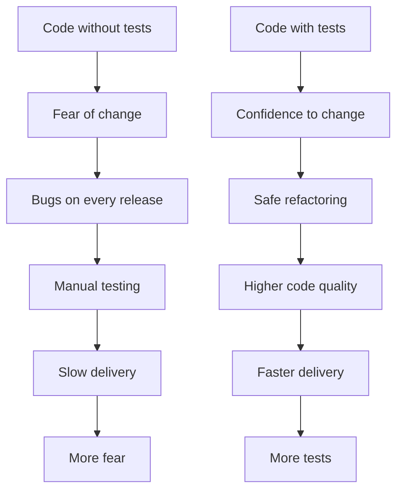
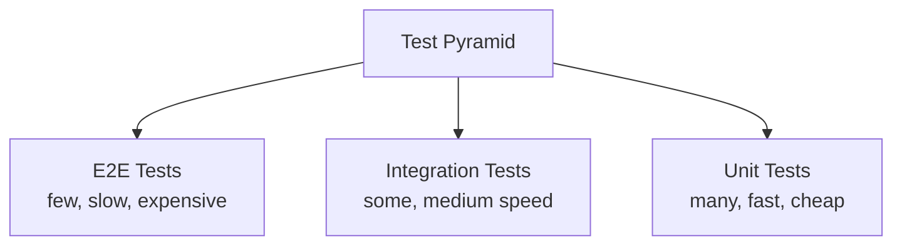
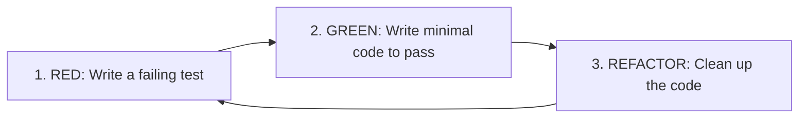
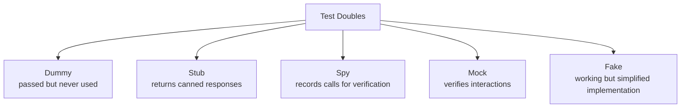

# 1. Introduction to Testing

> **Tags:** #testing #foundations #quality #verification

Testing is the practice of verifying that your code does what it is supposed to do — automatically, repeatably, and without manual effort. A good test suite is the safety net that lets you refactor, add features, and fix bugs with confidence. This note covers the why, what, and how of testing.

---

## 1.1 Why Test?



Without tests, every change is a gamble. You manually verify the happy path, ship, and hope nothing broke. With tests, every change is verified by an automated suite in seconds. You know immediately if you broke something.

The benefits compound:

- **Refactoring safety.** You can restructure code without fear, because tests verify behavior is preserved.
- **Documentation.** Tests show how the code is supposed to be used.
- **Design feedback.** Hard-to-test code is usually poorly designed. Tests force you to write testable (and therefore modular) code.
- **Regression detection.** When a bug is fixed, a test ensures it never comes back.
- **Faster debugging.** A failing test pinpoints the problem in seconds.

---

## 1.2 The Test Pyramid



| Test type | Count | Speed | Cost | What it verifies |
| --- | --- | --- | --- | --- |
| **Unit** | Many (hundreds/thousands) | Milliseconds | Low | Individual functions or classes in isolation. |
| **Integration** | Some (dozens/hundreds) | Seconds | Medium | Multiple components working together (e.g., API + database). |
| **End-to-End (E2E)** | Few (dozens) | Seconds to minutes | High | The entire system from the user's perspective (e.g., browser → server → database). |

The pyramid says: **most tests should be unit tests** because they are fast, cheap, and pinpoint failures. E2E tests are valuable but slow and brittle, so have few of them. Integration tests fill the middle.

An inverted pyramid (many E2E tests, few unit tests) is a common anti-pattern: slow test suites that are hard to maintain.

---

## 1.3 What Is a Unit Test?

A **unit test** verifies the behavior of a single "unit" of code — typically a function or a class — in isolation from its dependencies.

A good unit test has these properties (the FIRST principles):

| Principle | Meaning |
| --- | --- |
| **F**ast | Runs in milliseconds. |
| **I**solated | Does not depend on other tests or external state. |
| **R**epeatable | Gives the same result every time it runs. |
| **S**elf-validating | Passes or fails with no manual inspection. |
| **T**imely | Written around the same time as the code it tests (or before). |

---

## 1.4 The AAA Pattern

Every test follows the **Arrange-Act-Assert** pattern:

```python
def test_discount_calculation():
    # Arrange - set up the test data
    price = 100
    discount = 20
    
    # Act - call the code under test
    result = calculate_discounted_price(price, discount)
    
    # Assert - verify the result
    assert result == 80
```

- **Arrange**: create the inputs and expected state.
- **Act**: call the function or method under test.
- **Assert**: verify the output matches expectations.

Some frameworks also add a fourth **A** — **After** (cleanup) — but most tests do not need explicit cleanup if they are isolated.

---

## 1.5 What to Test

Test **behavior**, not implementation. A test should verify what the code does, not how it does it.

| Good test | Bad test |
| --- | --- |
| `assert(add(2, 3) == 5)` | `assert(add_internal_counter == 1)` |
| Tests the public interface. | Tests private internals. |
| Survives refactoring. | Breaks when implementation changes (even if behavior is unchanged). |

### Test these cases for every function:

- **Happy path**: the normal, expected input.
- **Edge cases**: empty input, zero, negative, maximum, minimum.
- **Error cases**: invalid input, missing input, null/undefined.
- **Boundary conditions**: off-by-one errors, boundary values.

---

## 1.6 Test-Driven Development (TDD)

TDD is a development practice where you write the test **before** the implementation.



1. **Red**: Write a test that describes the behavior you want. It fails because the code does not exist yet.
2. **Green**: Write the minimum code to make the test pass. Do not add extra features.
3. **Refactor**: Clean up the code — rename, extract, simplify — with the test still passing.

TDD benefits:

- You always have a test for every behavior.
- Tests drive the design — if code is hard to test, the design is wrong.
- You never write more code than the tests require.
- You get immediate feedback.

TDD is not the only way to write tests, but it is a powerful discipline that improves both test coverage and code design.

---

## 1.7 Test Doubles: Mocks, Stubs, Fakes, Spies

When a unit depends on external systems (databases, APIs, the filesystem), tests use **test doubles** — stand-ins for the real dependencies.



| Double | What it does | Example |
| --- | --- | --- |
| **Dummy** | Passed around but never actually used. | A null parameter required by a signature. |
| **Stub** | Returns predefined responses to calls. | A stub `getUser()` that always returns `{id: 1}`. |
| **Spy** | Records calls so you can verify them later. | A spy that records how many times `sendEmail()` was called. |
| **Mock** | Pre-programmed with expectations; verifies the right calls were made. | A mock that asserts `save()` was called exactly once. |
| **Fake** | A working but simplified implementation. | An in-memory database instead of PostgreSQL. |

Use fakes when possible (they are the most realistic), stubs for simple return values, mocks when you need to verify interactions. Over-mocking leads to brittle tests that break on every refactor.

---

## 1.8 Test Coverage

**Coverage** measures what percentage of your code is executed by tests. It is a useful metric but a poor goal.

- **High coverage does not mean good tests.** You can have 100% coverage with tests that assert nothing meaningful.
- **Low coverage means untested code.** That is a signal of risk.
- Aim for high coverage on **critical paths** (business logic, security, payment) and lower coverage on **trivial code** (getters, setters, simple config).

Use coverage as a **guide** — "which code is not tested?" — not as a target.

---

## 1.9 Common Testing Anti-Patterns

- **Testing implementation, not behavior.** Tests break on every refactor.
- **Giant tests.** A test that does 10 things is hard to debug when it fails. One assertion per test (or a small group of related assertions).
- **Dependent tests.** Test A must run before Test B. If A fails, B fails for the wrong reason.
- **Testing the framework.** Asserting that `Date.now()` returns a number — you are testing JavaScript, not your code.
- **Mocking everything.** Tests pass but the code is broken in production because the mocks hid the real behavior.
- **Brittle tests.** Tests that break when unrelated code changes. Usually caused by over-specification (asserting on too many details).
- **Slow tests.** A suite that takes 10 minutes to run is not run often. Keep it under 10 seconds for unit tests.

---

## 1.10 Key Takeaways

- Tests give you confidence to change code.
- Follow the test pyramid: many unit tests, some integration, few E2E.
- Unit tests are Fast, Isolated, Repeatable, Self-validating, Timely (FIRST).
- Structure tests with Arrange-Act-Assert.
- Test behavior, not implementation.
- TDD: Red → Green → Refactor.
- Use test doubles (mocks, stubs, fakes) to isolate units.
- Coverage is a guide, not a goal.

---

**Next:** [[2. Unit Testing]]
