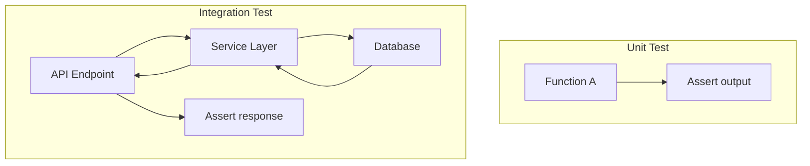
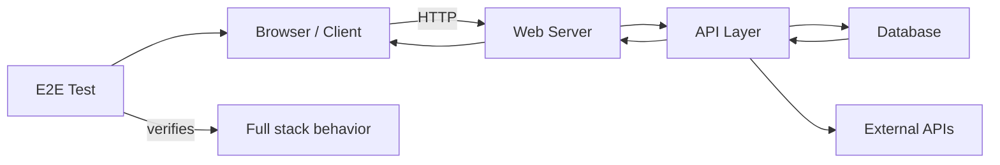
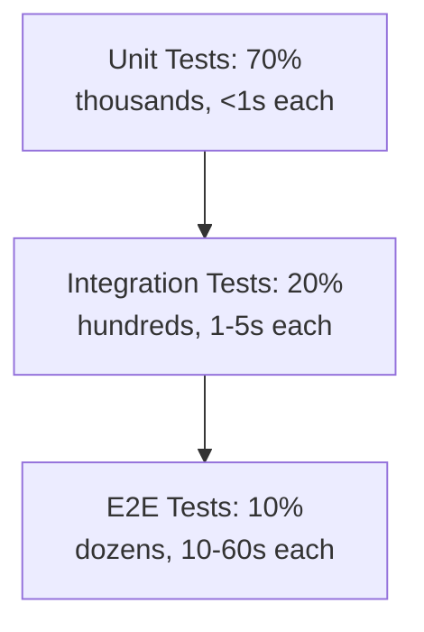

# 3. Integration and End-to-End Testing

> **Tags:** #testing #integration #e2e #testing-pyramid

Unit tests verify individual units in isolation. But units do not work in isolation in production — they interact with databases, APIs, filesystems, and each other. **Integration tests** verify that these interactions work. **End-to-end (E2E) tests** verify the entire system from the user's perspective.

---

## 3.1 Integration Testing

Integration tests verify that multiple components work together correctly.



### What to Integration Test

- **API endpoints**: send an HTTP request, verify the response and the database state.
- **Database queries**: verify the SQL returns the expected results.
- **Service composition**: verify that service A calling service B produces the correct result.
- **External API integration**: verify your code correctly calls a third-party API (use a sandbox or recorded responses).

### Integration Test Example (Node.js + Express + database)

```javascript
// user-api.test.js
const request = require('supertest');
const app = require('../app');
const db = require('../db');

describe('User API', () => {
  beforeAll(async () => {
    await db.connect('postgres://localhost/test_db');
  });

  afterEach(async () => {
    await db.query('DELETE FROM users');
  });

  afterAll(async () => {
    await db.close();
  });

  test('POST /users creates a user', async () => {
    const response = await request(app)
      .post('/users')
      .send({ name: 'Alice', email: 'alice@example.com' })
      .expect(201);

    expect(response.body).toHaveProperty('id');
    expect(response.body.name).toBe('Alice');

    // Verify the user was actually saved to the database
    const dbUser = await db.query('SELECT * FROM users WHERE id = $1', [response.body.id]);
    expect(dbUser.rows[0].email).toBe('alice@example.com');
  });

  test('GET /users/:id returns the user', async () => {
    const create = await request(app)
      .post('/users')
      .send({ name: 'Bob', email: 'bob@example.com' });

    const response = await request(app)
      .get(`/users/${create.body.id}`)
      .expect(200);

    expect(response.body.name).toBe('Bob');
  });
});
```

---

## 3.2 Test Databases

Integration tests that use a database need a database. Options:

### 1. A Real Database (Test Instance)

Run a separate database instance (in Docker, for example) for tests. This is the most realistic but requires setup.

```bash
# Start a test database in Docker
docker run -d --name test-postgres \
  -e POSTGRES_PASSWORD=test \
  -e POSTGRES_DB=test_db \
  -p 5433:5432 \
  postgres:16
```

Connect tests to port 5433 (different from your dev database on 5432).

### 2. In-Memory Database

Use SQLite in-memory for tests, even if production uses PostgreSQL. Faster, but may miss database-specific behavior.

### 3. Testcontainers

Testcontainers (Java, Go, .NET, Node.js) automatically starts and stops Docker containers for each test run:

```python
# Python example with testcontainers
from testcontainers.postgres import PostgresContainer

def test_database_integration():
    with PostgresContainer('postgres:16') as postgres:
        engine = create_engine(postgres.get_connection_url())
        # run tests against the container
        # container is automatically stopped when the with block exits
```

---

## 3.3 End-to-End Testing

E2E tests verify the entire system from the user's perspective — typically through a browser for web applications.



### E2E Frameworks

| Framework | For | Notes |
| --- | --- | --- |
| **Playwright** | Web (Chrome, Firefox, Safari) | Modern, fast, reliable. Microsoft. |
| **Cypress** | Web (Chrome, Electron) | Developer-friendly, popular. |
| **Selenium** | Web (all browsers) | Oldest, most widely supported. |
| **Puppeteer** | Web (Chrome only) | Headless Chrome, fast. |

### Playwright Example

```javascript
// e2e/login.spec.js
const { test, expect } = require('@playwright/test');

test('user can log in', async ({ page }) => {
  await page.goto('http://localhost:3000/login');
  
  await page.fill('[data-testid="email"]', 'alice@example.com');
  await page.fill('[data-testid="password"]', 'password123');
  await page.click('[data-testid="login-button"]');
  
  await expect(page).toHaveURL('http://localhost:3000/dashboard');
  await expect(page.locator('h1')).toHaveText('Welcome, Alice');
});
```

---

## 3.4 E2E Test Best Practices

- **Use data-testid attributes.** `[data-testid="login-button"]` is more stable than `.btn-primary` because it does not change when styles change.
- **Do not test what unit tests already cover.** E2E tests are for the integration, not for re-testing business logic.
- **Keep the test environment clean.** Reset the database between test runs to avoid interference.
- **Run E2E tests in CI, not on every save.** They are slow; run them on pull requests and pre-deploy.
- **Handle async operations.** Use `await page.waitForSelector(...)` rather than `setTimeout`. Explicit waits are more reliable.
- **Record failures.** Playwright and Cypress can record video and screenshots of failed tests, making debugging easier.

---

## 3.5 The Testing Pyramid in Practice



A healthy test suite:

- **70% unit tests**: fast, isolated, cover all business logic.
- **20% integration tests**: verify API endpoints, database queries, service composition.
- **10% E2E tests**: verify critical user journeys (login, checkout, signup).

If your suite is inverted (70% E2E, 10% unit), it will be slow, brittle, and hard to maintain.

---

## 3.6 Common Mistakes

- **Using E2E tests for everything.** They are slow and brittle. Push tests down the pyramid.
- **Not cleaning up test data.** Tests interfere with each other.
- **Testing through the UI when API tests would suffice.** API tests are faster and more stable.
- **Hardcoding URLs and credentials.** Use environment variables.
- **Not running E2E tests in CI.** They only catch regressions if they run on every PR.
- **Flaky tests ignored.** A flaky test (sometimes passes, sometimes fails) destroys trust in the suite. Fix immediately.

---

## 3.7 Key Takeaways

- Integration tests verify multiple components working together.
- E2E tests verify the full system from the user's perspective.
- Use a separate test database (Docker, testcontainers, or in-memory).
- Use Playwright or Cypress for web E2E testing.
- Follow the pyramid: 70% unit, 20% integration, 10% E2E.
- Keep E2E tests fast, stable, and focused on critical journeys.

---

**Previous:** [[2. Unit Testing]]
**Next:** [[4. Test Doubles and Mocking]]
