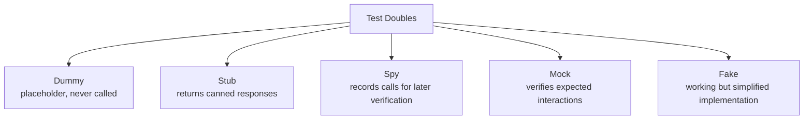

# 4. Test Doubles and Mocking

> **Tags:** #testing #mocking #test-doubles #unit-testing

Test doubles are stand-ins for real dependencies in tests. They let you isolate the unit under test from external systems (databases, APIs, filesystems). This note covers the five types of test doubles, when to use each, and the common pitfalls of over-mocking.

---

## 4.1 The Five Test Doubles



### Dummy

A **dummy** is passed around but never actually used. It exists only to satisfy a parameter list.

```python
def test_process_order():
    # dummy logger — never actually called
    dummy_logger = None
    order = Order(item="book", quantity=1)
    result = process_order(order, dummy_logger)
    assert result.status == "confirmed"
```

### Stub

A **stub** returns predefined responses to calls. It does not verify anything; it just provides data.

```python
from unittest.mock import Mock

def test_user_service():
    # stub: returns a fixed user regardless of input
    db_stub = Mock()
    db_stub.get_user.return_value = {"id": 1, "name": "Alice"}
    
    service = UserService(db_stub)
    user = service.get_user_name(1)
    
    assert user == "Alice"
```

### Spy

A **spy** wraps a real object and records calls made to it, so you can verify them later.

```python
from unittest.mock import patch

def test_email_sending():
    email_spy = Mock()
    notifier = Notifier(email_spy)
    
    notifier.notify_user("alice@example.com", "Hello")
    
    # spy: verify the call was made
    email_spy.send.assert_called_once_with("alice@example.com", "Hello")
```

### Mock

A **mock** is pre-programmed with expectations. It verifies that the right calls were made in the right order.

```python
from unittest.mock import Mock

def test_checkout():
    payment_mock = Mock()
    payment_mock.charge.return_value = {"success": True}
    
    checkout = Checkout(payment_mock)
    checkout.process(order_total=100)
    
    # mock: verify the charge was called with the right amount
    payment_mock.charge.assert_called_once_with(100)
```

### Fake

A **fake** is a working but simplified implementation of a dependency.

```python
class FakeUserDatabase:
    def __init__(self):
        self.users = {}
    
    def save(self, user):
        self.users[user.id] = user
    
    def get(self, user_id):
        return self.users.get(user_id)

def test_user_service_with_fake():
    fake_db = FakeUserDatabase()
    fake_db.save(User(id=1, name="Alice"))
    
    service = UserService(fake_db)
    assert service.get_user_name(1) == "Alice"
```

Fakes are the most realistic test double — they actually work. An in-memory database is a fake for a real database.

---

## 4.2 When to Use Each

| Situation | Use |
| --- | --- |
| You need to provide a parameter but it is never called. | Dummy |
| You need a dependency to return specific data. | Stub |
| You want to verify a method was called with specific arguments. | Spy or Mock |
| You want to verify the number or order of calls. | Mock |
| You want a working, simplified version of a dependency. | Fake |

**Prefer fakes over mocks.** Fakes are more realistic and less brittle. A test that uses a fake in-memory database is more meaningful than one that mocks every database call.

---

## 4.3 Mocking Libraries by Language

### Python: unittest.mock

```python
from unittest.mock import Mock, patch, MagicMock

# Create a mock
mock_db = Mock()
mock_db.get_user.return_value = {"name": "Alice"}

# Patch a module-level import
@patch('myapp.models.requests.get')
def test_fetch_user(mock_get):
    mock_get.return_value.json.return_value = {"name": "Alice"}
    user = fetch_user(1)
    assert user["name"] == "Alice"
    mock_get.assert_called_once_with("https://api.example.com/users/1")
```

### JavaScript: Jest mocks

```javascript
// Mock a module
jest.mock('../db', () => ({
  getUser: jest.fn().mockResolvedValue({ name: 'Alice' })
}));

// Mock a function
const mockSend = jest.fn();
const notifier = new Notifier({ send: mockSend });

notifier.notify('alice@example.com', 'Hello');

expect(mockSend).toHaveBeenCalledWith('alice@example.com', 'Hello');
expect(mockSend).toHaveBeenCalledTimes(1);
```

### Java: Mockito

```java
import static org.mockito.Mockito.*;

@Test
void testUserService() {
    UserRepository repo = mock(UserRepository.class);
    when(repo.findById(1)).thenReturn(new User(1, "Alice"));
    
    UserService service = new UserService(repo);
    String name = service.getUserName(1);
    
    assertEquals("Alice", name);
    verify(repo, times(1)).findById(1);
}
```

---

## 4.4 The Danger of Over-Mocking

Mocking every dependency leads to tests that:

1. **Are brittle.** They break when the implementation changes, even if behavior is unchanged.
2. **Test the implementation, not the behavior.** You are verifying "this method called that method" — that is implementation detail.
3. **Provide false confidence.** Tests pass with mocks, but production fails because the real dependency behaves differently.

```javascript
// BAD: over-mocked test
test('checkout', () => {
  const mockCart = { items: jest.fn(() => []), total: jest.fn(() => 0) };
  const mockDb = { save: jest.fn() };
  const mockEmail = { send: jest.fn() };
  const mockPayment = { charge: jest.fn(() => true) };
  
  const checkout = new Checkout(mockCart, mockDb, mockEmail, mockPayment);
  checkout.process();
  
  expect(mockCart.items).toHaveBeenCalled();
  expect(mockCart.total).toHaveBeenCalled();
  expect(mockDb.save).toHaveBeenCalled();
  expect(mockEmail.send).toHaveBeenCalled();
  expect(mockPayment.charge).toHaveBeenCalled();
});
```

This test passes but verifies nothing meaningful. If any of these mocks are wrong, the test still passes.

```javascript
// BETTER: use fakes, test behavior
test('checkout completes a real order', () => {
  const fakeDb = new InMemoryDatabase();
  const fakeEmail = new FakeEmailService(); // records emails in an array
  const fakePayment = new FakePaymentService(); // always succeeds
  const cart = new Cart();
  cart.add({ name: 'Book', price: 20 });
  
  const checkout = new Checkout(cart, fakeDb, fakeEmail, fakePayment);
  const result = checkout.process();
  
  expect(result.status).toBe('confirmed');
  expect(result.total).toBe(20);
  expect(fakeDb.orders).toHaveLength(1);
  expect(fakeEmail.sentEmails[0].subject).toBe('Order confirmed');
});
```

---

## 4.5 Mocking Best Practices

- **Mock at the boundaries.** Mock external APIs, databases, and the filesystem. Do not mock your own business logic.
- **Verify behavior, not calls.** "The order was saved" not "the save method was called."
- **Use fakes when possible.** An in-memory database fake is better than mocking every database method.
- **Do not mock value objects.** Mocking a `User` class is usually worse than just creating a real `User`.
- **Reset mocks between tests.** Stale mock state causes flaky tests.
- **Prefer dependency injection.** If your code accepts dependencies as parameters, mocking is easy. If dependencies are hardcoded, mocking requires patching (which is fragile).

---

## 4.6 Key Takeaways

- Five test doubles: dummy, stub, spy, mock, fake.
- Prefer fakes (working but simplified implementations) over mocks.
- Mock at the boundaries (external APIs, databases), not at internal logic.
- Over-mocking leads to brittle tests that verify implementation, not behavior.
- Use dependency injection to make mocking easy and natural.

---

**Previous:** [[3. Integration and End-to-End Testing]]
**Next:** [[5. Testing Best Practices]]
