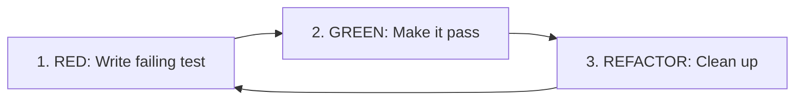
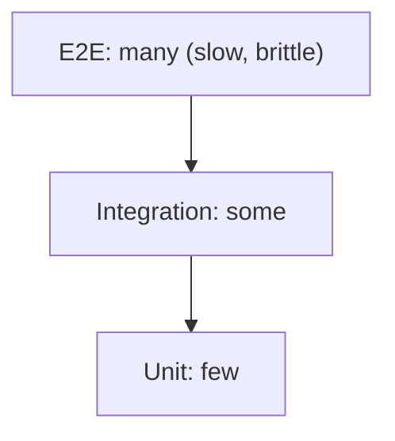

# 5. Testing Best Practices

> **Tags:** #testing #best-practices #quality #tdd

This note consolidates the principles that separate a test suite that helps you from one that holds you back.

---

## 5.1 The Principles of Good Tests

### 1. Test Behavior, Not Implementation

Tests should verify what the code does, not how it does it. If you refactor (change the implementation without changing the behavior), tests should still pass.

```python
# BAD: tests implementation
def test_calculate_total():
    calc = Calculator()
    calc.add(1)
    calc.add(2)
    assert calc._internal_sum == 3  # testing a private field
    assert calc._operations_count == 2  # testing internal state

# GOOD: tests behavior
def test_calculate_total():
    calc = Calculator()
    calc.add(1)
    calc.add(2)
    assert calc.total == 3
```

### 2. One Test, One Behavior

Each test should verify one thing. If it fails, you should know exactly what broke.

```python
# BAD: tests multiple things
def test_user_registration():
    user = register("alice@example.com", "password123")
    assert user.id is not None
    assert user.email == "alice@example.com"
    assert user.is_active == True
    assert send_welcome_email.called
    assert user.created_at is not None
    # ... 10 more assertions

# GOOD: separate tests
def test_registration_creates_user_with_id():
    user = register("alice@example.com", "password123")
    assert user.id is not None

def test_registration_sends_welcome_email():
    register("alice@example.com", "password123")
    assert send_welcome_email.called

def test_registration_rejects_invalid_email():
    with pytest.raises(InvalidEmailError):
        register("not-an-email", "password123")
```

### 3. Tests Should Be Fast

A unit test suite should run in under 10 seconds. If it takes minutes, developers stop running it.

- Do not hit the network in unit tests.
- Do not hit the filesystem (or use a temp directory).
- Do not sleep (use mock clocks instead).
- Run tests in parallel.

### 4. Tests Should Be Deterministic

A test that sometimes passes and sometimes fails is worse than no test. It erodes trust in the entire suite.

Common causes of non-determinism:

- **Time-dependent logic.** Use a mock clock.
- **Random numbers.** Seed the random generator.
- **Shared state.** Each test should set up its own state.
- **Network calls.** Mock them.
- **Database state.** Use transactions that roll back, or clean up between tests.
- **Test order.** Tests should pass in any order.

### 5. Tests Should Be Readable

A test is documentation. It should read like a specification.

```python
# BAD: obscure
def test_1():
    x = f(3, 4)
    assert x == 7

# GOOD: readable
def test_add_returns_sum_of_two_positive_numbers():
    result = add(3, 4)
    assert result == 7
```

---

## 5.2 Test Organization

### Arrange-Act-Assert

Structure every test in three sections, separated by blank lines:

```python
def test_checkout_applies_discount():
    # Arrange
    cart = Cart()
    cart.add_item(Item(name="Book", price=20))
    cart.set_discount(Discount(percent=10))
    
    # Act
    total = cart.checkout()
    
    # Assert
    assert total == 18.0
```

### Group Related Tests

Use describe blocks (Jest) or test classes (pytest, JUnit) to group tests for the same function:

```javascript
describe('Calculator.add', () => {
  describe('with positive numbers', () => {
    test('returns sum', () => { ... });
    test('is commutative', () => { ... });
  });
  describe('with negative numbers', () => { ... });
  describe('with zero', () => { ... });
});
```

---

## 5.3 What Not to Test

- **Getters and setters** that just assign values. They are trivial.
- **Framework code.** You do not need to test that `Array.push` works.
- **Third-party libraries.** Trust them or do not use them.
- **Configuration constants.** `MAX_RETRIES = 3` does not need a test.
- **Private methods.** Test them indirectly through public methods.

---

## 5.4 Test-Driven Development (TDD) in Practice



### TDD Discipline

1. **Write exactly one test** that describes one behavior.
2. **Run it and watch it fail** — confirm the test itself works.
3. **Write the minimum code** to make it pass. No extra features.
4. **Run it and watch it pass.**
5. **Refactor** — clean up the code, with tests still passing.
6. **Repeat.**

### When TDD Is Hard

TDD works well for logic-heavy code. It is harder for:

- **UI components** — hard to test rendering without a lot of setup.
- **Database schemas** — you test the queries, not the schema.
- **Exploratory code** — when you do not yet know what you want.

For these, write the code first, then add tests.

---

## 5.5 Flaky Tests

A **flaky test** is one that passes sometimes and fails other times, without any code change. Flaky tests are toxic — they destroy trust in the suite.

### How to Handle Flaky Tests

1. **Quarantine them.** Move flaky tests to a separate suite so they do not block CI.
2. **Fix them immediately.** Do not let flaky tests accumulate.
3. **If you cannot fix them, delete them.** A missing test is better than a flaky one.

### Common Causes of Flakiness

- **Time-dependent logic.** Use a mock clock: `freezegun` (Python), `jest.useFakeTimers()` (Jest).
- **Async race conditions.** Use proper awaits; do not use `sleep`.
- **Shared state.** Reset state between tests.
- **Test order dependence.** Tests must pass in any order. Run them in random order to detect this: `pytest --random-order`, `jest --randomize`.
- **External dependencies.** Mock the network, filesystem, and clock.

---

## 5.6 Code Coverage

Coverage measures what percentage of code is executed by tests.

```bash
# Python
pytest --cov=myapp --cov-report=html

# JavaScript
jest --coverage

# Java
mvn test jacoco:report
```

### Using Coverage Wisely

- **Coverage is a lower bound, not an upper bound.** 80% coverage means 20% is untested — that 20% could contain critical bugs.
- **100% coverage does not mean 100% tested.** A line being executed is not the same as its behavior being verified.
- **Use coverage to find gaps.** "This file has 30% coverage" is a signal to write more tests.
- **Do not game coverage.** Writing tests just to hit a coverage target produces useless tests.

---

## 5.7 Common Anti-Patterns

### The Ice Cream Cone



The inverse of the pyramid. Many slow E2E tests, few unit tests. The suite is slow and flaky. Fix by pushing tests down: convert E2E tests to integration tests, and integration tests to unit tests.

### The Test After

Writing tests only after the code is "done." The tests tend to verify the implementation rather than the behavior, because you already know how the code works. TDD avoids this by writing the test first.

### The Giant Test

A test that is 100 lines long, sets up 20 objects, and makes 15 assertions. When it fails, you do not know which assertion failed or why. Split it into many small tests.

### The Setup Hell

A test that requires 50 lines of setup. The setup is usually a sign that the code under test has too many dependencies. Refactor the code to be more testable.

---

## 5.8 Key Takeaways

- Test behavior, not implementation.
- One test, one behavior. One assertion (or a small group) per test.
- Tests should be fast, deterministic, and readable.
- Structure tests with Arrange-Act-Assert.
- Do not test trivial code, framework code, or private methods.
- TDD: Red → Green → Refactor.
- Flaky tests must be fixed or quarantined immediately.
- Coverage is a guide to gaps, not a goal.

---

**Previous:** [[4. Test Doubles and Mocking]]
**Next chapter:** [[1. Clean Code]] (Chapter 8)
