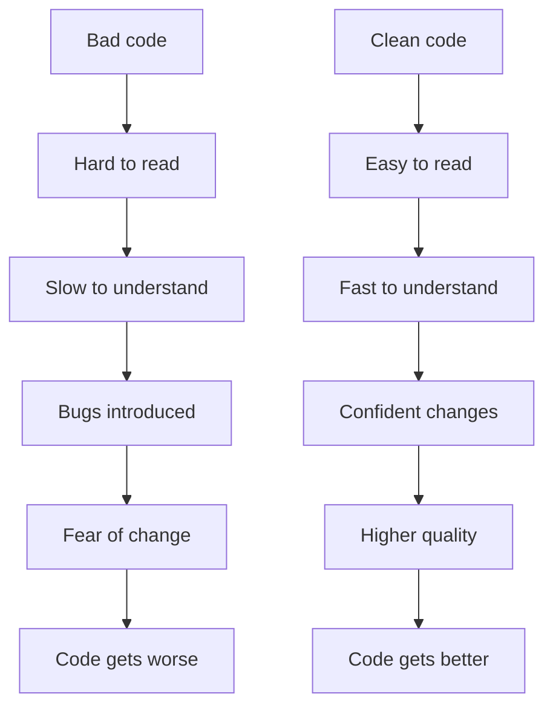

# 1. Clean Code

> **Tags:** #clean-code #quality #readability #maintainability

Clean code is code that is easy to read, easy to understand, and easy to change. It is not about cleverness; it is about clarity. This note covers the principles of clean code, drawn from Robert C. Martin's book *Clean Code* and decades of software engineering practice.

---

## 1.1 Why Clean Code Matters



You write code once, but it is read dozens or hundreds of times — by you, by your teammates, by future maintainers, by code reviewers. Optimizing for the reader, not the writer, is the single most important principle of clean code.

---

## 1.2 Meaningful Names

Names are the most important tool for readable code. A good name answers three questions: **why it exists, what it does, and how it is used.**

### Rules for Good Names

| Rule | Bad | Good |
| --- | --- | --- |
| **Reveal intent** | `d` | `elapsedTimeInDays` |
| **Avoid disinformation** | `accountList` (is it a List?) | `accounts` |
| **Make meaningful distinctions** | `productData` / `productInfo` | `product` / `productMetadata` |
| **Use pronounceable names** | `genymdhms` | `generationTimestamp` |
| **Use searchable names** | `e` (single letter) | `eventCount` |
| **Avoid encodings** | `m_name` / `INameable` | `name` / `Nameable` |
| **Class names are nouns** | `Processor` / `Data` / `Manager` | `Customer` / `Account` |
| **Method names are verbs** | `name()` | `getName()` / `calculateTotal()` |

### Avoid Mental Mapping

Readers should not have to mentally map `a` to "the first argument" and `b` to "the second argument." Single-letter variables are acceptable only in very short scopes (like loop counters):

```python
# BAD
for i in range(len(users)):
    u = users[i]
    p = u.p
    print(u.n, p)

# GOOD
for user in users:
    print(user.name, user.email)
```

---

## 1.3 Small Functions

Functions should be small. How small? "Smaller than that."

- **Do one thing.** A function should do exactly one thing and do it well.
- **No more than 20-30 lines.** If it is longer, extract helper functions.
- **Few arguments.** 0-2 is ideal, 3 is acceptable, 4+ is a code smell.
- **No side effects.** A function that promises to check a password should not also initialize a session.

```python
# BAD: does too many things
def process_user(user):
    # validate
    if not user.email or "@" not in user.email:
        raise ValueError("Invalid email")
    # save to database
    db.users.insert(user)
    # send welcome email
    send_email(user.email, "Welcome!")
    # log
    logger.info(f"User {user.email} registered")
    # update analytics
    analytics.track("user_registered", user.id)

# GOOD: one function, one responsibility
def validate_user(user):
    if not user.email or "@" not in user.email:
        raise ValueError("Invalid email")

def register_user(user):
    validate_user(user)
    db.users.insert(user)
    send_welcome_email(user)
    log_registration(user)
    track_registration(user)
```

---

## 1.4 The Single Level of Abstraction

A function should operate at a single level of abstraction. If a function mixes high-level concepts (like "process order") with low-level details (like "append string to buffer"), it is doing too much.

```python
# BAD: mixed abstractions
def render_page(data):
    page = "<html><head><title>" + data.title + "</title></head>"
    page += "<body>"
    for item in data.items:
        page += "<div class='item'>" + item.name + "</div>"
    page += "</body></html>"
    return page

# GOOD: single level of abstraction
def render_page(data):
    head = render_head(data.title)
    body = render_body(data.items)
    return f"<html>{head}{body}</html>"

def render_head(title):
    return f"<head><title>{title}</title></head>"

def render_body(items):
    item_divs = "".join(render_item(item) for item in items)
    return f"<body>{item_divs}</body>"

def render_item(item):
    return f"<div class='item'>{item.name}</div>"
```

---

## 1.5 Comments

Comments are not inherently good. The best comment is one you did not need to write because the code is self-documenting.

```python
# BAD: comment compensates for bad code
# Check if employee is eligible for full benefits
if (employee.flags & HOURLY_FLAG) and (employee.age > 65):

# GOOD: the code explains itself
if employee.is_eligible_for_full_benefits():
```

### When Comments Are Good

- **Legal comments** (copyright, license).
- **Informative comments** that cannot be expressed in code (e.g., regex explanations).
- **Warnings** about consequences (e.g., "This runs on every keystroke; keep it fast").
- **TODO comments** (with an issue reference, not just "TODO: fix this").
- **Documentation comments** for public APIs.

### When Comments Are Bad

- **Redundant comments** that restate the code.
- **Misleading comments** that contradict the code.
- **Commented-out code** (delete it; Git remembers).
- **Mandated comments** (every function must have a docstring) that add no value.
- **Position markers** like `// END OF FUNCTION`.

---

## 1.6 Error Handling

Error handling is a first-class concern, not an afterthought.

### Use Exceptions, Not Error Codes

```python
# BAD: error codes
def delete_page(page):
    if not page.exists():
        return E_PAGE_NOT_FOUND
    if not page.can_delete():
        return E_PERMISSION_DENIED
    page.delete()
    return E_OK

result = delete_page(my_page)
if result != E_OK:
    handle_error(result)

# GOOD: exceptions
def delete_page(page):
    if not page.exists():
        raise PageNotFoundError(page.id)
    if not page.can_delete():
        raise PermissionDeniedError(page.id)
    page.delete()

try:
    delete_page(my_page)
except PageNotFoundError as e:
    handle_not_found(e)
except PermissionDeniedError as e:
    handle_permission(e)
```

### Do Not Return Null

Returning `null` (or `None`) forces every caller to check for null. If they forget, the program crashes later with a less helpful error.

```python
# BAD: returns None, callers must remember to check
def get_customer(id):
    if id not in customers:
        return None
    return customers[id]

customer = get_customer(123)
if customer is not None:  # easy to forget
    print(customer.name)

# GOOD: returns an object with a safe interface, or raises
def get_customer(id):
    if id not in customers:
        raise CustomerNotFoundError(id)
    return customers[id]

# Or use the Null Object pattern:
class NullCustomer:
    name = ""
    is_null = True

def get_customer(id):
    return customers.get(id, NullCustomer())
```

---

## 1.7 DRY, KISS, YAGNI

Three principles that prevent over-engineering:

| Principle | Meaning |
| --- | --- |
| **DRY** (Don't Repeat Yourself) | Every piece of knowledge has a single, unambiguous representation. |
| **KISS** (Keep It Simple, Stupid) | Simplicity is a key goal. Do not add complexity you do not need. |
| **YAGNI** (You Aren't Gonna Need It) | Do not implement features you do not need yet. |

```python
# BAD: violates all three
class GenericDataProcessor:
    # complex framework to handle "future" data types
    def process(self, data, type_name, format, options):
        # 200 lines handling every conceivable case
        pass

# GOOD: simple, does what is needed now
def calculate_total(items):
    return sum(item.price * item.quantity for item in items)
```

---

## 1.8 The Boy Scout Rule

> "Leave the code better than you found it."

When you work on a piece of code, make a small improvement: rename a confusing variable, extract a method, fix a typo in a comment, remove a dead import. These small improvements compound over time, keeping the codebase healthy.

You do not need to spend hours refactoring — just make one small improvement every time you touch a file.

---

## 1.9 Key Takeaways

- Optimize for the reader, not the writer.
- Names reveal intent; avoid mental mapping and encodings.
- Functions are small, do one thing, and operate at one level of abstraction.
- Comments should add value the code cannot express.
- Use exceptions, not error codes. Do not return null.
- Follow DRY, KISS, YAGNI.
- Leave the code better than you found it (Boy Scout Rule).

---

**Next:** [[2. SOLID Principles]]
