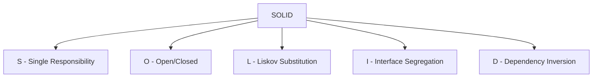
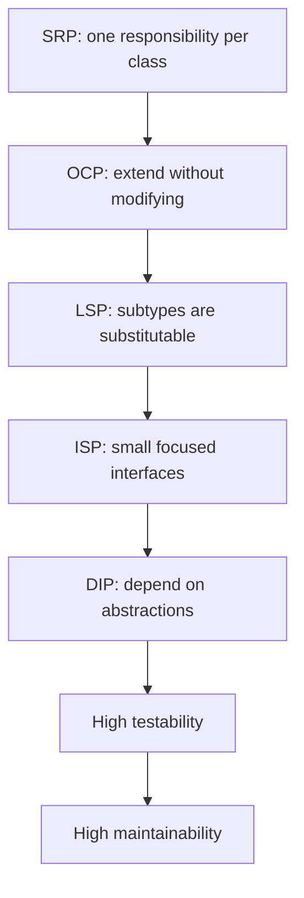

# 2. SOLID Principles

> **Tags:** #solid #oop #design-principles #quality

SOLID is a set of five design principles for object-oriented programming, introduced by Robert C. Martin. Following them leads to code that is maintainable, extensible, and testable.

---

## 2.1 The Five Principles



---

## 2.2 S — Single Responsibility Principle (SRP)

> A class should have one, and only one, reason to change.

A class should do one thing. If a class has multiple responsibilities, changes to one responsibility affect the others, leading to bugs.

```python
# BAD: two responsibilities (data persistence AND email)
class User:
    def save_to_database(self):
        db.users.insert(self)
    
    def send_welcome_email(self):
        email.send(self.email, "Welcome!")

# GOOD: separate classes
class User:
    pass  # just data

class UserRepository:
    def save(self, user):
        db.users.insert(user)

class WelcomeEmailSender:
    def send(self, user):
        email.send(user.email, "Welcome!")
```

**Test:** can you describe what the class does in one sentence without using "and"? If not, it violates SRP.

---

## 2.3 O — Open/Closed Principle (OCP)

> Software entities should be open for extension but closed for modification.

You should be able to add new behavior without changing existing code.

```python
# BAD: must modify the function to add a new shape
def calculate_area(shape):
    if shape.type == "circle":
        return 3.14 * shape.radius ** 2
    elif shape.type == "square":
        return shape.side ** 2
    # must add a new elif for every new shape

# GOOD: add new shapes by creating new classes
from abc import ABC, abstractmethod

class Shape(ABC):
    @abstractmethod
    def area(self) -> float:
        pass

class Circle(Shape):
    def __init__(self, radius):
        self.radius = radius
    def area(self):
        return 3.14 * self.radius ** 2

class Square(Shape):
    def __init__(self, side):
        self.side = side
    def area(self):
        return self.side ** 2

# Adding a Triangle does not require modifying any existing code
class Triangle(Shape):
    def __init__(self, base, height):
        self.base = base
        self.height = height
    def area(self):
        return 0.5 * self.base * self.height
```

---

## 2.4 L — Liskov Substitution Principle (LSP)

> Subtypes must be substitutable for their base types without altering the correctness of the program.

If a function expects a `Bird`, you should be able to pass a `Penguin` or an `Eagle` and the function should still work correctly.

```python
# BAD: violates LSP
class Bird:
    def fly(self):
        pass

class Eagle(Bird):
    def fly(self):
        print("Soaring through the sky")

class Penguin(Bird):
    def fly(self):
        raise Exception("Penguins can't fly!")  # LSP violation

def make_birds_fly(birds):
    for bird in birds:
        bird.fly()  # crashes on Penguin

# GOOD: separate interface for flight
class Bird:
    pass

class FlyingBird(Bird):
    def fly(self):
        pass

class Eagle(FlyingBird):
    def fly(self):
        print("Soaring")

class Penguin(Bird):
    # no fly method — penguins are birds but not flying birds
    pass
```

---

## 2.5 I — Interface Segregation Principle (ISP)

> Clients should not be forced to depend on interfaces they do not use.

Many small, focused interfaces are better than one large, general-purpose interface.

```python
# BAD: fat interface
class Machine:
    def print(self, document): pass
    def scan(self, document): pass
    def fax(self, document): pass

class SimplePrinter(Machine):
    def print(self, document):
        # implement
        pass
    def scan(self, document):
        raise NotImplementedError  # ISP violation
    def fax(self, document):
        raise NotImplementedError  # ISP violation

# GOOD: segregated interfaces
class Printer:
    def print(self, document): pass

class Scanner:
    def scan(self, document): pass

class FaxMachine:
    def fax(self, document): pass

class SimplePrinter(Printer):
    def print(self, document):
        # implement
        pass

class MultiFunctionDevice(Printer, Scanner, FaxMachine):
    def print(self, document): pass
    def scan(self, document): pass
    def fax(self, document): pass
```

---

## 2.6 D — Dependency Inversion Principle (DIP)

> Depend on abstractions, not concretions.

High-level modules should not depend on low-level modules. Both should depend on abstractions.

```python
# BAD: high-level depends on low-level concrete class
class MySQLDatabase:
    def save(self, data):
        pass

class UserService:
    def __init__(self):
        self.db = MySQLDatabase()  # hard dependency on MySQL
    
    def register(self, user):
        self.db.save(user)

# GOOD: depend on abstraction
from abc import ABC, abstractmethod

class Database(ABC):
    @abstractmethod
    def save(self, data): pass

class MySQLDatabase(Database):
    def save(self, data):
        pass

class UserService:
    def __init__(self, db: Database):  # depend on abstraction
        self.db = db
    
    def register(self, user):
        self.db.save(user)

# Now UserService can work with any Database implementation
service = UserService(MySQLDatabase())
# or
service = UserService(PostgreSQLDatabase())
# or in tests:
service = UserService(InMemoryDatabase())
```

This is the foundation of **dependency injection** — the dependencies are injected from outside, not created inside.

---

## 2.7 How SOLID Principles Work Together



Following SOLID leads to code that:

- Is easy to extend (add new classes, not modify old ones).
- Is easy to test (dependencies are abstractions that can be mocked).
- Is easy to understand (each class does one thing).
- Has low coupling (classes depend on interfaces, not concretions).

---

## 2.8 When to Break SOLID

SOLID are principles, not laws. Over-applying them can lead to over-engineering:

- A 3-line script does not need interfaces and dependency injection.
- A prototype can violate SOLID to move fast.
- A small project may not need the abstraction layers SOLID implies.

Apply SOLID when:

- The code is likely to change (multiple variations expected).
- The code is complex enough that abstractions help.
- You are writing a library or framework for others to use.

Do not apply SOLID when:

- The code is simple and unlikely to change.
- The abstraction would be more complex than the code it abstracts.
- You are writing a one-off script.

---

## 2.9 Key Takeaways

- **S**RP: one responsibility per class.
- **O**CP: extend by adding, not modifying.
- **L**SP: subtypes are fully substitutable.
- **I**SP: many small interfaces, not one fat interface.
- **D**IP: depend on abstractions, not concretions.
- SOLID leads to maintainable, extensible, testable code.
- Apply when the complexity warrants it; do not over-engineer simple code.

---

**Previous:** [[1. Clean Code]]
**Next:** [[3. Naming Conventions]]
