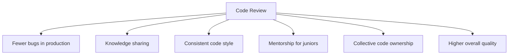
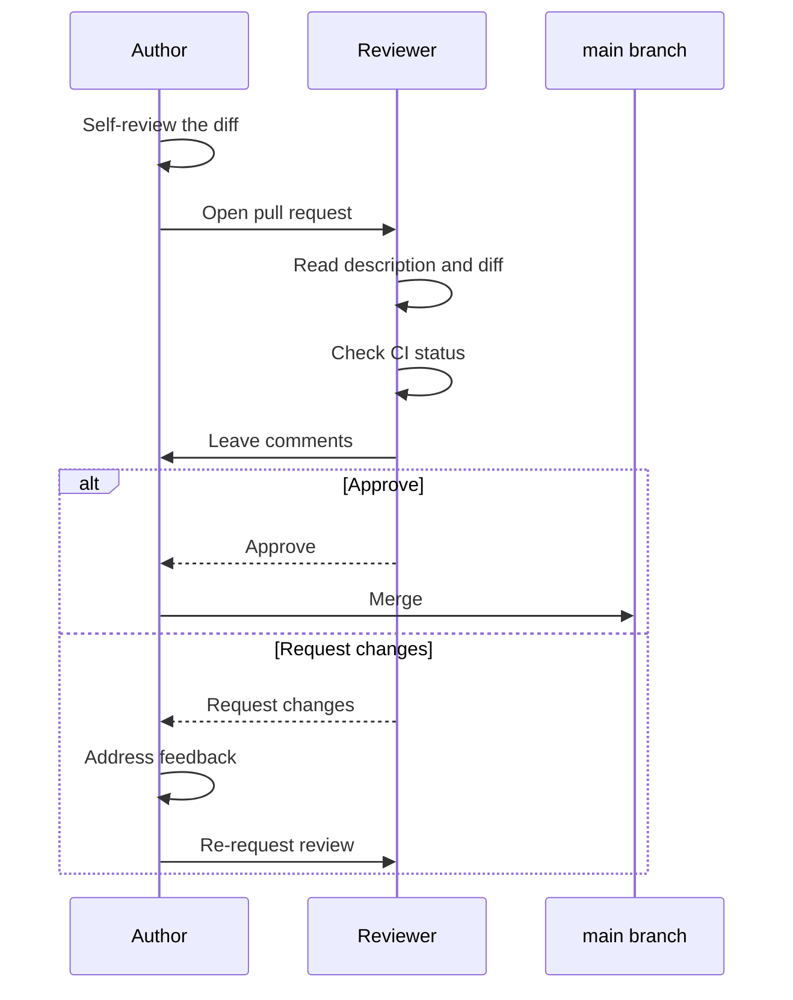

# 4. Code Reviews

> **Tags:** #code-review #quality #collaboration #workflow

Code review is the practice of having another developer read your code before it is merged. It is one of the most effective quality-improvement practices in software development, catching bugs, improving design, and spreading knowledge across the team.

---

## 4.1 Why Code Reviews Matter

Studies consistently show that code review finds 60-90% of defects before testing. The cost of fixing a bug in review is 10-100x cheaper than fixing it in production.

---

## 4.2 The Review Workflow

---

## 4.3 What to Review

### Correctness

- Does the code do what the PR description says?
- Are edge cases handled (null, empty, boundary values)?
- Are error cases handled?
- Are there off-by-one errors?
- Does the code handle concurrent access correctly?

### Design

- Does the code follow SOLID principles?
- Is the abstraction at the right level?
- Are functions small and focused?
- Is there unnecessary complexity?
- Is the code in the right place (the right class, the right module)?

### Readability

- Are names clear and meaningful?
- Is the code easy to understand on first reading?
- Are comments necessary and accurate?
- Is the formatting consistent?

### Testing

- Are there tests for the new behavior?
- Do the tests cover edge cases?
- Are the tests meaningful (not just hitting coverage)?
- Do existing tests still pass?

### Security

- Are inputs validated?
- Is user input sanitized (SQL injection, XSS)?
- Are secrets handled correctly (not hardcoded, not logged)?
- Are permissions checked?

### Performance

- Are there N+1 queries?
- Is there unnecessary work in loops?
- Are expensive operations cached?
- Is the data structure appropriate?

---

## 4.4 Review Comments: Best Practices

### For Reviewers

**Be kind.** Code is personal; critique it respectfully.

| Bad comment | Good comment |
| --- | --- |
| "This is wrong." | "I think this will fail if `user` is null. Consider adding a null check." |
| "Why did you do it this way?" | "I'm curious about the choice to use a loop here — would a list comprehension be clearer?" |
| "Bad naming." | "The name `data` is a bit vague. Would `user_profile` be more descriptive?" |

**Be specific.** Reference line numbers and suggest concrete improvements.

**Distinguish must-fix from nice-to-have.** Use prefixes:
- `[blocking]` — must fix before merge.
- `[nit]` — minor style issue; fix if convenient.
- `[optional]` — suggestion; up to the author.
- `[question]` — genuinely asking; not a request.

**Explain why.** "Extract this into a method because it is duplicated in three places" is more helpful than "extract this."

**Approve when ready.** Do not block on nits. If the code is correct and readable, approve with optional suggestions.

### For Authors

**Self-review first.** Read through your own diff before requesting review. You will catch obvious issues.

**Respond to every comment.** Even if you disagree, acknowledge it. Push a commit that addresses it, or explain why you chose a different approach.

**Do not take it personally.** The review is about the code, not about you. Feedback makes the code better.

**Ask for clarification.** If a comment is unclear, ask. Do not guess.

**Mark resolved threads.** After addressing a comment, resolve the conversation so the reviewer knows it is handled.

---

## 4.5 Reviewing Large PRs

Large PRs (>500 lines) are hard to review effectively. Strategies:

1. **Ask the author to split the PR.** Smaller PRs are reviewed more thoroughly.
2. **Review in passes.** First pass: overall structure and design. Second pass: line-by-line. Third pass: tests.
3. **Use the file tree.** Review files in a logical order, not the order GitHub shows them.
4. **Take breaks.** A 1000-line review cannot be done in one sitting.

The best solution is prevention: keep PRs small (target under 400 lines). See [[23. Pull Requests and Code Reviews]] in Chapter 1 for PR size guidance.

---

## 4.6 Common Anti-Patterns

### The Rubber Stamp

> "LGTM 🚢"

A review with no substantive comments. The reviewer did not actually read the code. This is worse than no review — it provides false confidence.

### The Bikeshedding

Spending 30 minutes debating a variable name while ignoring a critical security bug. Focus on what matters.

### The Drive-By

> "This looks fine, but while you're here, can you also refactor the entire auth module?"

Scope creep. The PR is about one thing; do not expand it. Open a separate issue for the refactor.

### The Nitpick Avalanche

20 comments, all about style (missing Oxford comma, trailing whitespace). Use a linter for style; reserve review for substance.

### The Silent Approval

Approving without comment. The author does not know if the reviewer actually read the code or just clicked approve. Leave at least one substantive comment.

---

## 4.7 Tools for Code Review

| Tool | Feature |
| --- | --- |
| **GitHub PRs** | Inline comments, suggestions, review status |
| **GitLab MRs** | Similar to GitHub, with discussion threads |
| **Gerrit** | Used by Google, Android; line-by-line review |
| **Crucible** | Atlassian's review tool |
| **Reviewable** | Standalone review tool |

Most teams use their platform's built-in review (GitHub PRs, GitLab MRs). The tool matters less than the practice.

---

## 4.8 Key Takeaways

- Code review catches 60-90% of defects before testing.
- Review for correctness, design, readability, testing, security, and performance.
- Reviewers: be kind, specific, and distinguish must-fix from nits.
- Authors: self-review, respond to every comment, do not take it personally.
- Keep PRs small for effective review.
- Avoid rubber stamps, bikeshedding, drive-bys, nitpick avalanches, and silent approvals.

---

**Previous:** [[3. Naming Conventions]]
**Next:** [[5. Static Analysis and Linting]]
