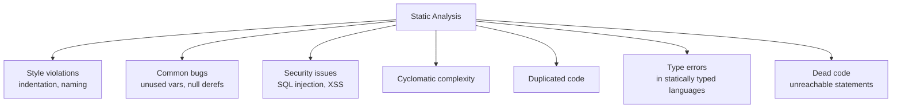

# 5. Static Analysis and Linting

> **Tags:** #static-analysis #linting #quality #tools

Static analysis is the practice of analyzing code without running it. Linters are a subset of static analysis that focus on style and common mistakes. Together, they catch bugs, enforce consistency, and free reviewers from nitpicking.

---

## 5.1 What Static Analysis Catches



---

## 5.2 Linters by Language

### Python

| Tool | What it does |
| --- | --- |
| **flake8** | Style (PEP 8) + basic errors |
| **pylint** | Comprehensive analysis, style, refactoring suggestions |
| **ruff** | Fast (Rust-based) linter that replaces flake8, pylint, isort |
| **mypy** | Static type checking for type-annotated Python |
| **bandit** | Security-focused analysis |

```bash
# Install and run
pip install ruff
ruff check .          # lint
ruff format .         # format

pip install mypy
mypy mypackage/       # type check
```

### JavaScript / TypeScript

| Tool | What it does |
| --- | --- |
| **ESLint** | The standard JS/TS linter |
| **Prettier** | Code formatter (not a linter, but usually paired) |
| **JSHint** | Older, simpler alternative to ESLint |
| **TypeScript** | The compiler itself is a type checker |

```bash
npm install --save-dev eslint prettier
npx eslint .          # lint
npx prettier --write . # format
npx tsc --noEmit       # type check
```

### Java

| Tool | What it does |
| --- | --- |
| **Checkstyle** | Style conventions |
| **PMD** | Common mistakes, copy-paste detection |
| **SpotBugs** | Bug patterns (formerly FindBugs) |
| **SonarQube** | Comprehensive platform: bugs, vulnerabilities, code smells |

### Go

Go has built-in tools:

```bash
go vet ./...          # built-in static analysis
go fmt ./...          # format
golangci-lint run     # aggregator for many linters
```

### Rust

Rust's compiler is the linter — it catches far more than most languages' linters.

```bash
cargo check           # type check without producing binary
cargo clippy          # additional lints (idiom checker)
cargo fmt             # format
```

### C# / .NET

```bash
dotnet format          # format
dotnet build -warnaserror  # treat warnings as errors
# SonarAnalyzer, Roslyn analyzers for deeper analysis
```

---

## 5.3 Configuration

Most linters are configurable. A typical setup:

```json
// .eslintrc.json
{
  "root": true,
  "parser": "@typescript-eslint/parser",
  "extends": [
    "eslint:recommended",
    "plugin:@typescript-eslint/recommended",
    "prettier"
  ],
  "rules": {
    "no-console": ["warn", { "allow": ["warn", "error"] }],
    "no-unused-vars": "off",
    "@typescript-eslint/no-unused-vars": ["error", { "argsIgnorePattern": "^_" }],
    "prefer-const": "error"
  }
}
```

```toml
# pyproject.toml for ruff
[tool.ruff]
line-length = 88
target-version = "py311"

[tool.ruff.lint]
select = [
    "E",   # pycodestyle errors
    "W",   # pycodestyle warnings
    "F",   # pyflakes
    "I",   # isort
    "B",   # bugbear
    "UP",  # pyupgrade
    "SIM", # simplify
]
ignore = ["E501"]  # line length (handled by formatter)
```

---

## 5.4 Running Linters Automatically

### On Save (Editor)

Configure your editor to run the formatter and linter on save:

```json
// VS Code settings.json
{
  "editor.formatOnSave": true,
  "editor.defaultFormatter": "esbenp.prettier-vscode",
  "editor.codeActionsOnSave": {
    "source.fixAll.eslint": "explicit"
  }
}
```

### Pre-commit Hooks

Run linters before code is committed, using **pre-commit** (Python) or **husky** (JavaScript):

```yaml
# .pre-commit-config.yaml
repos:
  - repo: https://github.com/astral-sh/ruff-pre-commit
    rev: v0.4.0
    hooks:
      - id: ruff
        args: [--fix]
      - id: ruff-format
```

```bash
pip install pre-commit
pre-commit install   # install the git hook
pre-commit run --all-files  # run manually
```

### CI

Run linters in CI to enforce standards on every PR:

```yaml
# .github/workflows/lint.yml
name: Lint
on: [push, pull_request]
jobs:
  lint:
    runs-on: ubuntu-latest
    steps:
      - uses: actions/checkout@v4
      - uses: actions/setup-node@v4
        with:
          node-version: '20'
      - run: npm ci
      - run: npx eslint .
      - run: npx prettier --check .
      - run: npx tsc --noEmit
```

---

## 5.5 Type Checking

Static type checking catches a huge class of bugs before runtime. If your language supports types, use them.

### Python Type Hints

```python
from typing import List, Optional

def greet(name: str) -> str:
    return f"Hello, {name}"

def find_user(user_id: int) -> Optional[User]:
    return users.get(user_id)

def process_items(items: List[str]) -> dict[str, int]:
    return {item: len(item) for item in items}
```

Run `mypy` to check:

```bash
mypy --strict mypackage/
```

### TypeScript

```typescript
function greet(name: string): string {
    return `Hello, ${name}`;
}

interface User {
    id: number;
    name: string;
    email?: string;  // optional
}

function findUser(userId: number): User | null {
    return users.find(u => u.id === userId) ?? null;
}
```

---

## 5.6 Common Pitfalls

- **Too many rules.** A linter with 500 rules that nobody understands leads to `// eslint-disable` everywhere. Start with recommended rules and add carefully.
- **Ignoring warnings.** If warnings are not fixed, they accumulate and become noise. Treat warnings as errors, or fix them.
- **Not running in CI.** Linters that only run locally are ignored by developers who disable them. CI enforcement is necessary.
- **Using a linter as a substitute for review.** Linters catch style and common bugs, but they do not evaluate design or readability. You still need human review.
- **Fighting the formatter.** If you disagree with the formatter's output, configure it once and stop arguing. Consistency wins.

---

## 5.7 Key Takeaways

- Static analysis catches style violations, bugs, security issues, and complexity — without running the code.
- Every language has established linters: ruff (Python), ESLint+Prettier (JS/TS), golangci-lint (Go), clippy (Rust).
- Run linters on save, on commit (pre-commit hooks), and in CI.
- Use type checking (mypy, TypeScript, clippy) to catch a huge class of bugs.
- Treat warnings as errors, or fix them. Do not let warnings accumulate.
- Linters do not replace human review — they complement it.

---

**Previous:** [[4. Code Reviews]]
**Next chapter:** [[1. Reading Large Codebases]] (Chapter 9)
