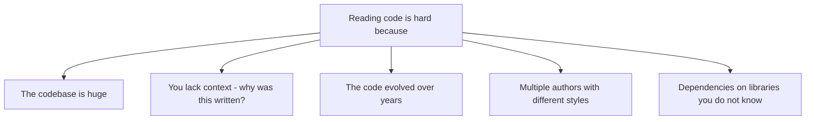
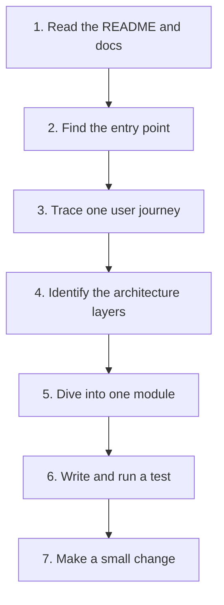
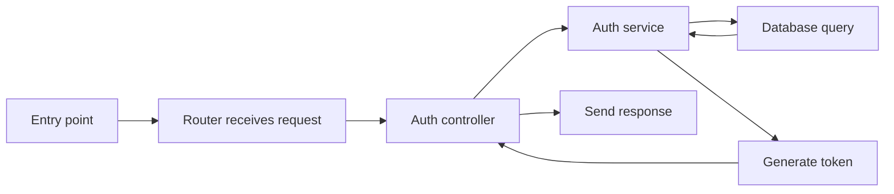

# 1. Reading Large Codebases

> **Tags:** #code-navigation #reading-code #onboarding #legacy

Reading code is the most underrated skill in software development. You spend far more time reading code than writing it. Yet most education focuses on writing. This note covers how to approach a large, unfamiliar codebase systematically.

---

## 9.1 Why Reading Code Is Hard



A 100,000-line codebase is not just "100 times a 1,000-line codebase." It is qualitatively different. You cannot hold it all in your head. You need strategies for navigating without understanding everything at once.

---

## 9.2 The Top-Down Approach



### Step 1 — Read the README and Documentation

Start with the README. It tells you:

- What the project does.
- How to set it up.
- How to run it.
- Where to find more documentation.

If there is an architecture document or `CONTRIBUTING.md`, read those too. They explain the project's conventions and structure.

### Step 2 — Find the Entry Point

Every program has an entry point — where execution starts. For different types of projects:

| Project type | Entry point |
| --- | --- |
| Command-line tool | The `main()` function or the script in `bin/` |
| Web server | The server startup file (e.g., `app.js`, `main.py`, `Program.cs`) |
| Library | The main module or package's `__init__.py` / `index.ts` |
| Mobile app | The `MainActivity` (Android) or `AppDelegate` (iOS) |
| Web app | The router or app component |

For Node.js: look at `"main"` in `package.json`. For Python: look at `__main__.py` or the script in `bin/`. For Java/C#: look at the class with `public static void main`.

### Step 3 — Trace One User Journey

Pick one feature — say, "user logs in" — and trace the code path from the entry point through every function call until the feature is complete.



Do not try to understand every branch — just follow the happy path of one feature. This gives you a mental model of how the code is organized.

### Step 4 — Identify the Architecture Layers

Most codebases have layers:

- **Presentation layer** (controllers, routes, UI components)
- **Business logic layer** (services, domain models)
- **Data access layer** (repositories, DAOs, ORM models)
- **External interfaces** (API clients, third-party services)

Identify which files belong to which layer. This tells you where to look when you need to change something.

### Step 5 — Dive Into One Module

Pick one module that interests you. Read it thoroughly: every function, every test. Understand not just what it does but why it exists.

### Step 6 — Write and Run a Test

The best way to understand code is to interact with it. Write a test that exercises the module you are studying. Set breakpoints, inspect variables, and watch how the data flows.

### Step 7 — Make a Small Change

Fix a typo, add a log statement, or improve a comment. Making a change — any change — forces you to understand the build system, the test suite, and the contribution process.

---

## 9.3 Tools for Code Navigation

### Go to Definition

The most-used navigation feature. Place your cursor on a function or variable, press `F12` (or `Ctrl+Click`), and jump to where it is defined.

### Find All References

`Shift+F12` — find every place a symbol is used. Essential for understanding impact before making a change.

### Go to Symbol

`Ctrl+Shift+O` (current file) or `Ctrl+T` (workspace) — jump to any function or class by name.

### Search

`Ctrl+Shift+F` — search across the entire codebase. Use regex for complex patterns. Use file filters (`*.py`, `*.ts`) to narrow results.

### Call Hierarchy

Right-click a function → "Show Call Hierarchy" — see what calls this function and what it calls. Useful for understanding the call graph.

### Type Hierarchy

In OOP languages, see the inheritance tree of a class. Useful for understanding polymorphism.

### Git Blame

`git blame <file>` or use GitLens (VS Code) — see who wrote each line and when. Useful for understanding why code was written (check the commit message).

### Git Log

`git log --oneline --graph --all` — see the history of the project. Look for patterns: large refactors, recurring bug areas, active vs. abandoned modules.

---

## 9.4 Strategies for Different Codebase Types

### Greenfield (New) Codebase

You are lucky. The code is clean, conventions are consistent, and the authors are available to ask. Read everything, ask questions, and contribute early.

### Legacy Codebase

- **Do not try to understand it all at once.** Focus on the part you need to change.
- **Look for tests.** Tests document expected behavior. If there are no tests, write some before changing anything.
- **Use git blame and log.** Understanding the history of a piece of code often explains its current state.
- **Look for comments and TODOs.** They hint at known issues and intended directions.
- **Accept some mystery.** You will not understand everything. That is okay. Focus on what you need.

### Open Source Codebase

- **Start with the issue tracker.** Look for `good first issue` labels.
- **Read `CONTRIBUTING.md`.** It explains the project's conventions.
- **Join the community.** Discord, Slack, or mailing lists. Ask questions.
- **Read recent PRs.** They show how changes are made and reviewed.

---

## 9.5 The "Five Whys" of Code Reading

When you encounter confusing code, ask "why?" five times:

1. **Why does this function exist?** (What problem does it solve?)
2. **Why was it written this way?** (What constraints led to this design?)
3. **Why is it in this file/class?** (Could it be elsewhere?)
4. **Why does it have this name?** (Does the name reveal intent?)
5. **Why has it not been changed?** (Is there a reason, or just inertia?)

Often, the answer to the fifth "why" is "nobody has had time to refactor it." That is your opportunity.

---

## 9.6 Taking Notes While Reading

Keep a notes file (in Obsidian!) while exploring a codebase:

```markdown
# Project Name — Codebase Notes

## Entry Point
- `src/index.ts` — starts the server on port 3000

## Architecture
- Presentation: `src/routes/` — Express routers
- Business: `src/services/` — domain logic
- Data: `src/models/` — Sequelize models
- Config: `src/config/` — environment-specific settings

## Key Files
- `src/services/auth.ts` — handles login, token generation
- `src/middleware/errorHandler.ts` — global error handler

## Questions
- Why does AuthService depend on EmailService directly (not via interface)?
- What is the difference between User and UserProfile?

## Conventions
- All services are in `src/services/` and end with `Service`
- Tests are in `tests/` and mirror the `src/` structure
- Every PR must have tests (CI enforces this)
```

These notes are invaluable when you onboard others or return to the project after a break.

---

## 9.7 Common Mistakes

- **Trying to understand everything at once.** You cannot. Focus on what you need.
- **Reading code linearly.** Code is not a novel. Jump around using navigation tools.
- **Not running the code.** Reading alone is slow. Run it, set breakpoints, experiment.
- **Ignoring tests.** Tests are the most up-to-date documentation. Read them.
- **Not taking notes.** You will forget what you learned. Write it down.
- **Asking questions before trying to find the answer.** Try for 30 minutes first. Then ask.

---

## 9.8 Key Takeaways

- Reading code is the most important and most underdeveloped skill.
- Use the top-down approach: README → entry point → one user journey → layers → one module → test → change.
- Master navigation tools: Go to Definition, Find References, Go to Symbol, search, blame.
- For legacy code, focus on what you need; use git history to understand why.
- Keep notes while exploring.
- Do not try to understand everything at once.

---

**Next:** [[2. Finding Entry Points]]
