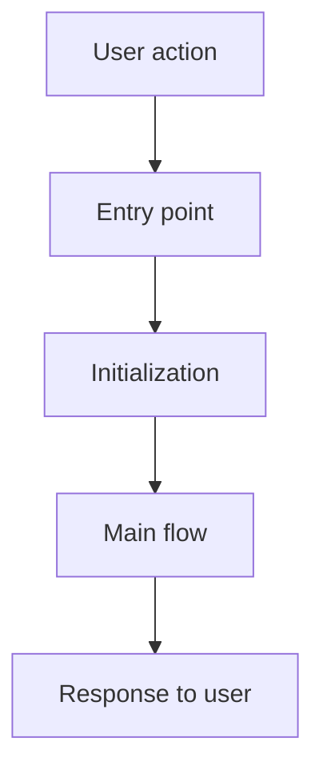
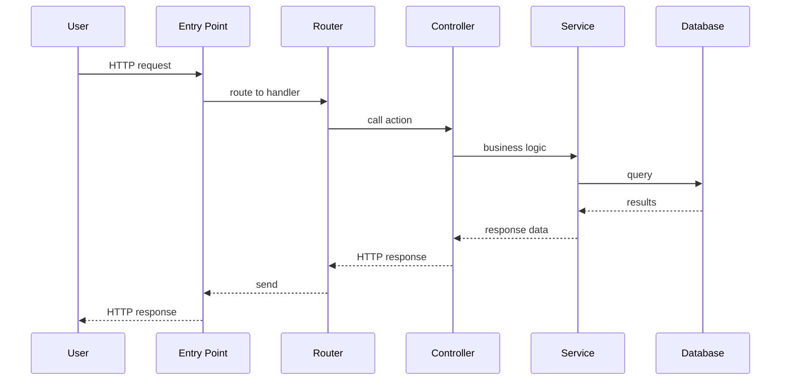

# 2. Finding Entry Points

> **Tags:** #code-navigation #entry-points #onboarding

The **entry point** is where execution begins. Finding it is the first step in understanding any codebase. This note covers how to find entry points across different project types and languages.

---

## 9.2.1 What Is an Entry Point?



An entry point is the first code that runs when:

- A user starts the application.
- A request arrives at a server.
- A test suite runs.
- A build is triggered.
- A library is imported.

Every program has at least one entry point. Large applications may have several (e.g., a web server, a background worker, a CLI tool, all in the same repository).

---

## 9.2.2 Finding Entry Points by Project Type

### Command-Line Tools

Look for:

- A `bin/` directory with executable scripts.
- A `"bin"` field in `package.json` (Node.js).
- A `console_scripts` entry in `setup.py` / `pyproject.toml` (Python).
- A `main()` function in Go (`package main`).
- A class with `public static void main(String[] args)` (Java/C#).

```bash
# Node.js CLI
cat package.json | grep bin
# "bin": { "mycli": "./bin/mycli.js" }

# Python CLI
cat pyproject.toml | grep -A5 scripts
# [project.scripts]
# mycli = "mycli.cli:main"

# Go — any file in package main with func main()
grep -r "func main()" --include="*.go" .
```

### Web Servers

Look for:

- An `app.js`, `server.js`, or `index.js` file (Node.js).
- A `main.py`, `app.py`, or `wsgi.py` file (Python).
- A `Program.cs` or `Startup.cs` file (.NET).
- An `Application.java` class with `@SpringBootApplication` (Java/Spring).
- A `manage.py runserver` command (Django).

### Web Applications (Frontend)

Look for:

- `index.html` — the page that loads first.
- `main.ts` / `main.tsx` / `index.ts` — the JavaScript entry point.
- `App.tsx` / `App.vue` / `App.svelte` — the root component.
- `src/main.js` or `src/index.js`.

Check `package.json`:
```json
{
  "main": "src/index.ts",        // library entry
  "module": "src/index.ts",       // ES module entry
  "browser": "src/browser.ts",    // browser entry
}
```

### Libraries / Packages

Look for:

- `__init__.py` (Python) — the package entry.
- `index.ts` / `index.js` (JavaScript/TypeScript) — the package entry.
- `lib.rs` (Rust) — the crate entry.
- `mod.ts` (Deno).

The entry file typically re-exports the public API:
```typescript
// src/index.ts
export { UserService } from './services/UserService';
export { User } from './models/User';
export type { UserOptions } from './types';
```

### Mobile Apps

- **Android**: `AndroidManifest.xml` declares the launcher activity. Look for `<activity android:name=".MainActivity">` with `<intent-filter>` containing `LAUNCHER`.
- **iOS**: `Info.plist` has `UIApplicationSceneManifest` pointing to the delegate. Look for `@main` attribute (SwiftUI) or `@UIApplicationMain` (UIKit).

### Tests

Test entry points are the test files themselves. Look in:

- `tests/` or `test/` directory (Python, Go, Rust).
- `__tests__/` directory (Jest).
- `*_test.go` files alongside source (Go convention).
- `*_spec.js` / `*.spec.ts` files (Jest, Mocha, Jasmine).

---

## 9.2.3 Tracing From the Entry Point

Once you find the entry point, trace the execution flow:



1. **Read the entry point file.** What does it set up? (Configuration, middleware, database connections, routing.)
2. **Follow the first significant call.** If it starts a server, find the route definitions.
3. **Pick a route.** Follow it to the controller/handler.
4. **Follow the controller to the service.** The controller receives the request; the service contains the business logic.
5. **Follow the service to the data layer.** How does it read/write data?

---

## 9.2.4 Multiple Entry Points

Large applications often have multiple entry points:

```text
my-project/
  apps/
      web/          # web server entry: apps/web/server.ts
      worker/       # background worker entry: apps/worker/index.ts
      cli/          # CLI tool entry: apps/cli/bin/cli.ts
      migration/    # database migration entry: apps/migration/run.ts
  packages/
      shared/       # library: packages/shared/index.ts
  tests/
      e2e/          # E2E tests: tests/e2e/login.spec.ts
```

Each entry point is a different way to start using the code. Understanding which one you are working with is crucial.

---

## 9.2.5 Using Tools to Find Entry Points

### grep / ripgrep

```bash
# Find main functions
rg "func main\(\)" --type go
rg "public static void main" --type java
rg "if __name__ == .__main__." --type py

# Find package entry points
rg "__init__" --type py -l
rg "export.*from" src/index.ts
```

### IDE

Use "Go to Symbol in Workspace" (`Ctrl+T`) and search for `main`, `app`, `server`, `start`.

### Package Manifests

Read the manifest files — they declare the entry points:

- `package.json` — `"main"`, `"module"`, `"bin"`, `"exports"`
- `pyproject.toml` — `[project.scripts]`, `[project.entry-points]`
- `Cargo.toml` — `[[bin]]`, `[lib]`
- `go.mod` — `package main` in any `.go` file

---

## 9.2.6 Key Takeaways

- The entry point is where execution begins.
- Different project types have different entry point conventions.
- Common entry points: `main()`, `index.ts`, `app.js`, `server.py`, `Program.cs`.
- Trace from the entry point through the layers to understand the flow.
- Large apps may have multiple entry points (web, worker, CLI, tests).
- Use `grep`, IDE symbol search, and package manifests to find them.

---

**Previous:** [[1. Reading Large Codebases]]
**Next:** [[3. Finding Callers and References]]
