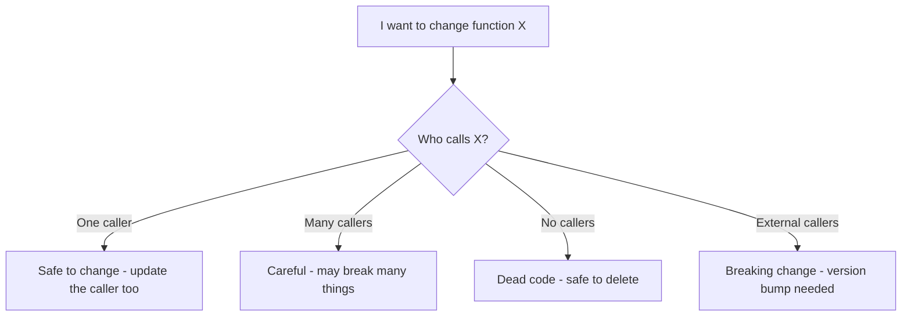
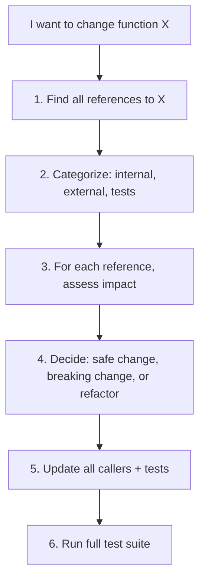

# 3. Finding Callers and References

> **Tags:** #code-navigation #references #callers #impact-analysis

Before changing a function, you need to know who calls it. This is called **impact analysis** — understanding the blast radius of a change. This note covers the tools and techniques for finding callers and references.

---

## 9.3.1 Why Find References?



Finding references answers:

- **How many places call this function?** — the blast radius.
- **Are there external callers?** — is this a public API?
- **Are there tests?** — what behavior is verified?
- **Is this dead code?** — can I delete it?

---

## 9.3.2 Tools for Finding References

### IDE: Find All References

The most accurate tool. Right-click a symbol → "Find All References" (`Shift+F12` in VS Code, `Alt+F7` in JetBrains). The IDE uses semantic analysis to find actual code references, not just text matches.

### IDE: Call Hierarchy

Right-click → "Show Call Hierarchy" — see a tree of what calls this function (callers) and what it calls (callees). Useful for deep call chains.

### Search (grep / ripgrep)

For languages without good IDE support, or when you want to find text matches (including comments and strings):

```bash
# Find all occurrences of "calculateTotal"
rg "calculateTotal"

# Find function calls (not definitions)
rg "calculateTotal\(" 

# Find only in specific file types
rg "calculateTotal" --type py

# Exclude tests
rg "calculateTotal" --type py -g "!*test*"
```

### Git Grep

Search only in tracked files (ignores `node_modules`, build artifacts):

```bash
git grep "calculateTotal"
```

### AST-based Search

For precise, structural search, use AST-based tools:

- **ast-grep** — search and rewrite code by AST pattern.
- **semgrep** — security-focused AST search.
- **jscodeshift** — JavaScript codemods.

```bash
# ast-grep: find all console.log calls
ast-grep --pattern 'console.log($$$)'

# semgrep: find SQL injection patterns
semgrep --config p/javascript
```

---

## 9.3.3 Types of References

### Direct Calls

```python
result = calculate_total(items)  # direct call
```

### Method Calls (Polymorphic)

```python
result = obj.process()  # which class's process() is called?
```

For polymorphic calls, the IDE shows all implementations of the method. You need to check which classes might be the runtime type of `obj`.

### Dynamic Dispatch

```python
method_name = "calculate"
getattr(obj, method_name)()  # cannot be found by static analysis
```

Dynamic dispatch (reflection, `eval`, metaprogramming) cannot be found by IDE tools. You must search for the string `"calculate"` and trace manually.

### String References

```python
# Django URL routing
path('api/users/', 'views.user_list')

# Dependency injection
container.register('UserService', UserService)
```

String-based references are invisible to "Find All References." Search for the string.

### Event Handlers

```javascript
button.addEventListener('click', handleClick);
emitter.on('user:created', handleUserCreated);
```

Event handler references are indirect. Search for the event name to find all subscriptions.

---

## 9.3.4 Impact Analysis Workflow



### Step 1 — Find All References

Use "Find All References" in the IDE. Note the count and locations.

### Step 2 — Categorize

- **Internal callers**: code in the same project. You can update them.
- **External callers**: code in other projects or packages. Changing the function may break them.
- **Tests**: verify the current behavior. Update them if the behavior changes.
- **Documentation**: comments, docs that mention the function.
- **Configuration**: string references in config files.

### Step 3 — Assess Impact

For each reference, ask:

- Will my change break this caller?
- Does this caller rely on the current behavior?
- Is this caller in a critical path?

### Step 4 — Decide

- **Safe change** (no behavior change, just implementation): proceed.
- **Breaking change** (signature or behavior changes): update all callers, or create a new function and deprecate the old.
- **Refactor needed**: if the change is too risky, consider an intermediate step (add the new function, migrate callers, then remove the old).

### Step 5 — Update Callers and Tests

Update every caller. Do not forget tests — they are callers too.

### Step 6 — Run Tests

Run the full test suite. If any test fails, you missed a caller.

---

## 9.3.5 Dealing with External Callers

If the function is part of a public API (a library or a service consumed by other teams), changing it is a **breaking change**.

### Semantic Versioning

- **Major version bump** (1.x → 2.0): breaking change.
- **Minor version bump** (1.4 → 1.5): new feature, backward compatible.
- **Patch version bump** (1.4.2 → 1.4.3): bug fix, backward compatible.

### Deprecation Path

Do not just remove the old function. Deprecate it first:

```python
import warnings

def old_function(x):
    warnings.warn("old_function is deprecated, use new_function instead", DeprecationWarning)
    return new_function(x)

def new_function(x):
    # new implementation
    pass
```

Or in TypeScript:

```typescript
/** @deprecated Use newFunction instead. */
export function oldFunction(x: number): number {
    return newFunction(x);
}

export function newFunction(x: number): number {
    // ...
}
```

IDEs show deprecated functions with a strikethrough, warning callers to migrate.

---

## 9.3.6 Common Mistakes

- **Trusting text search over semantic search.** `grep` finds "calculateTotal" in comments and strings; "Find All References" finds actual code references. Use both.
- **Forgetting dynamic dispatch.** Reflection, `eval`, and string-based calls are invisible to static analysis. Search for strings.
- **Ignoring tests as callers.** Tests are callers too. Update them when you change behavior.
- **Not checking external callers.** If the function is public, other projects depend on it. Check before breaking.
- **Making breaking changes without deprecation.** Always deprecate first, remove later (usually one major version later).

---

## 9.3.7 Key Takeaways

- Finding references is essential for impact analysis before changes.
- Use "Find All References" (IDE) for semantic search, `grep` for text search.
- Be aware of dynamic dispatch, string references, and event handlers — they are invisible to IDE tools.
- Categorize references: internal, external, tests, docs, config.
- For public APIs, use deprecation paths and semantic versioning.
- Always update tests — they are callers too.

---

**Previous:** [[2. Finding Entry Points]]
**Next:** [[4. Understanding Dependencies]]
