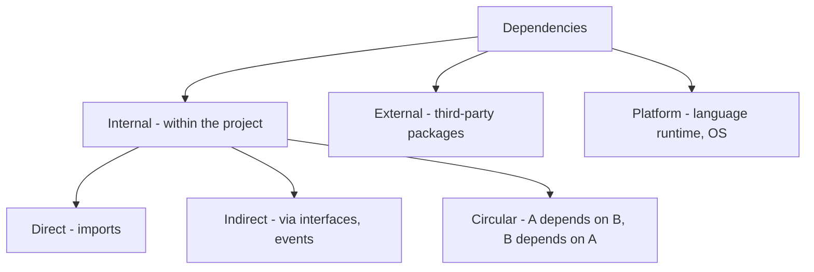
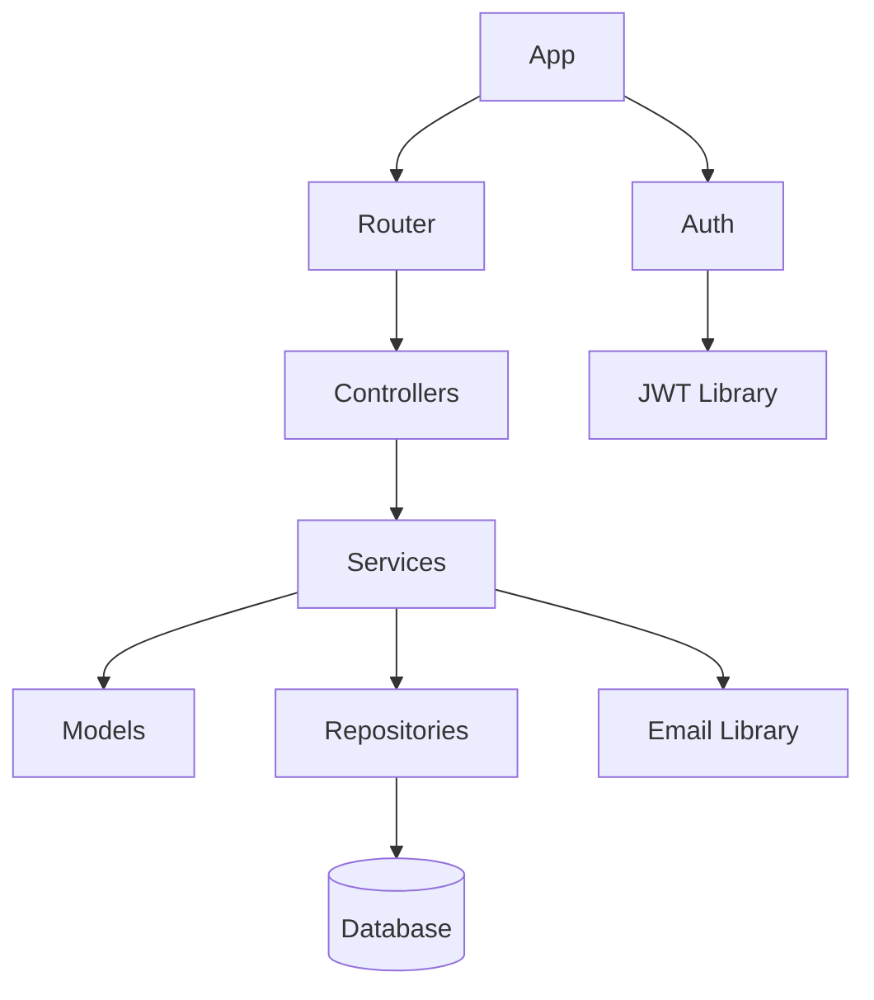
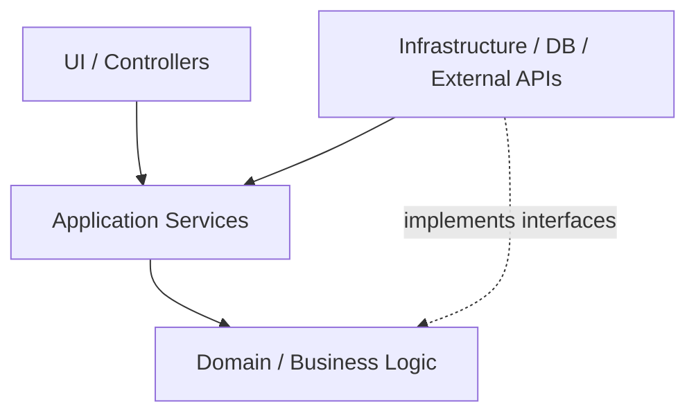
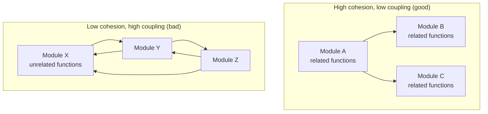

# 4. Understanding Dependencies

> **Tags:** #code-navigation #dependencies #architecture #coupling

Dependencies are the relationships between parts of your code. Understanding them is essential for making changes safely, avoiding circular dependencies, and keeping the codebase maintainable.

---

## 9.4.1 Types of Dependencies



---

## 9.4.2 Internal Dependencies

Internal dependencies are the relationships between modules within your project.

### Direct Dependencies (Imports)

```python
# module_a.py
from module_b import helper_function  # module_a depends on module_b
```

### Indirect Dependencies

```python
# module_a.py
from interface_b import InterfaceB  # depends on interface, not implementation

# module_c.py
class Implementation:
    def do_something(self):
        pass  # module_c does not know about module_a
```

This is **dependency inversion** — depending on an abstraction rather than a concretion. It reduces coupling.

### Event-Based Dependencies

```python
# module_a.py
emitter.on('user_created', handle_user)  # module_a depends on the event, not the emitter

# module_b.py
emitter.emit('user_created', user)  # module_b emits, does not know who listens
```

Event-based dependencies are the loosest form — the emitter and listener do not know about each other.

---

## 9.4.3 External Dependencies

External dependencies are third-party packages (libraries, frameworks).

### Finding External Dependencies

Check the dependency manifest:

| Language | Manifest file |
| --- | --- |
| Python | `requirements.txt`, `pyproject.toml`, `Pipfile` |
| JavaScript | `package.json` |
| Java | `pom.xml` (Maven), `build.gradle` (Gradle) |
| C# | `.csproj` |
| Go | `go.mod` |
| Rust | `Cargo.toml` |

### Dependency Trees

Dependencies have their own dependencies. The full tree can be large:

```bash
# npm
npm ls                    # tree of dependencies
npm ls --depth=0          # only direct dependencies

# pip
pip show <package>        # show dependencies of a package

# Maven
mvn dependency:tree

# Go
go mod graph
```

### Security and Licensing

External dependencies bring security and licensing concerns:

- **Vulnerabilities**: use `npm audit`, `pip-audit`, `safety check`, `govulncheck`.
- **Licenses**: every dependency has a license. Use `license-checker`, `pip-licenses` to audit.
- **Outdated packages**: use `npm outdated`, `pip list --outdated` to find updates.

---

## 9.4.4 Visualizing Dependencies

### Dependency Graphs



Tools to generate dependency graphs:

- **madge** (JavaScript) — `npx madge --circular --extensions js src/`
- **pydeps** (Python) — `pydeps mypackage`
- **dependency-cruiser** (JavaScript) — more configurable than madge
- IDE built-in: IntelliJ's "Analyze Dependencies", VS Code's dependency viewer extensions

### Detecting Circular Dependencies

Circular dependencies (A → B → A) cause issues: import errors, initialization problems, tight coupling.

```bash
# JavaScript
npx madge --circular src/

# Python (using pydeps)
pydeps --show-cycles mypackage

# Go
go mod graph | grep -E "$(go list -m -f '{{.Path}}' all | tr '\n' '|' | sed 's/|$//')"
```

Fix circular dependencies by:

1. **Extracting shared code** into a third module that both A and B depend on.
2. **Using dependency inversion** — introduce an interface that breaks the cycle.
3. **Using events** — A emits an event instead of calling B directly.

---

## 9.4.5 The Dependency Rule (Clean Architecture)

In Clean Architecture, dependencies must point **inward** — toward the domain (business logic):



- The **domain** has no dependencies on outer layers.
- **Application services** depend on the domain, not on infrastructure.
- **Infrastructure** (databases, external APIs) depends on the application, and implements interfaces defined by the domain.

This makes the domain testable without a database, and lets you swap infrastructure (e.g., PostgreSQL to MongoDB) without touching the domain.

---

## 9.4.6 High Cohesion, Low Coupling

The goal of dependency management is **high cohesion, low coupling**:

- **High cohesion**: related code lives together. A module's functions all work toward the same goal.
- **Low coupling**: modules depend on few other modules. Changing one module rarely requires changing others.



---

## 9.4.7 Common Dependency Problems

### God Object

A single module that everything depends on. Change it and everything breaks. Fix by splitting it into focused modules.

### Spaghetti Dependencies

Everything depends on everything. No clear layering. Fix by introducing layers and the dependency rule.

### Vendor Lock-in

Business logic depends directly on a specific library or framework. Changing the library requires rewriting business logic. Fix by wrapping external dependencies behind your own interfaces (anti-corruption layer).

### Dependency Hell

Conflicting version requirements. Package A needs `lodash@4`, Package B needs `lodash@3`. Fix with version pinning, lockfiles, and careful upgrades.

---

## 9.4.8 Key Takeaways

- Dependencies are relationships between code: internal (imports) and external (packages).
- Prefer dependency inversion (depend on abstractions) over direct dependencies.
- Visualize dependencies with graphs; detect cycles with tools.
- Follow the dependency rule: dependencies point inward toward the domain.
- Aim for high cohesion (related code together) and low coupling (few dependencies between modules).
- Watch for God Objects, spaghetti dependencies, vendor lock-in, and dependency hell.

---

**Previous:** [[3. Finding Callers and References]]
**Next:** [[5. Reading Legacy Code]]
