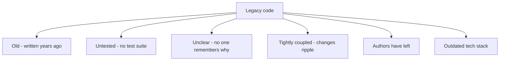
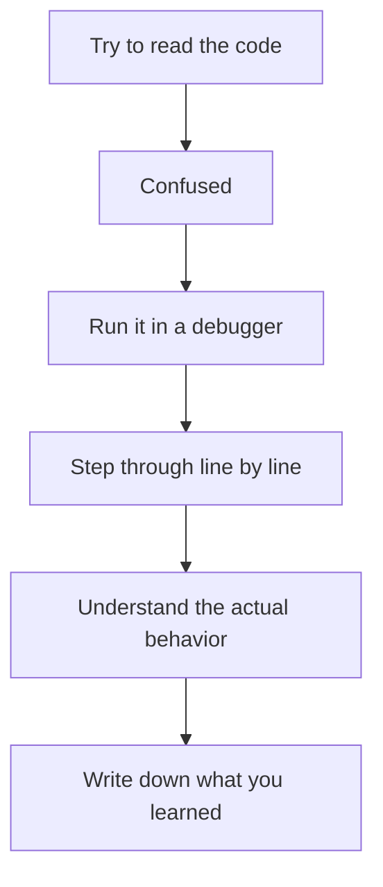
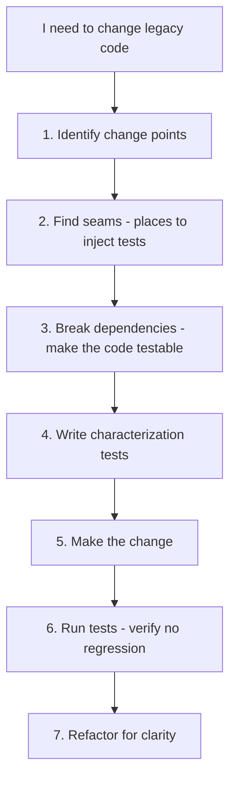

# 5. Reading Legacy Code

> **Tags:** #legacy-code #code-navigation #technical-debt #refactoring

Legacy code is code that works but is hard to understand, hard to change, and poorly tested. Most professional developers spend more time on legacy code than on greenfield code. This note covers strategies for reading, understanding, and eventually improving legacy code.

---

## 9.5.1 What Makes Code "Legacy"?



Michael Feathers defines legacy code as **"code without tests."** This is a useful definition because the absence of tests is what makes legacy code dangerous to change.

---

## 9.5.2 The Challenges of Legacy Code

- **Fear of change.** Every change risks breaking something, and there are no tests to catch regressions.
- **Poor naming.** Variables like `x`, `temp`, `data2` that made sense to the original author.
- **Dead code.** Functions that are never called but nobody dares to delete.
- **Commented-out code.** Years of "just in case" code that clutters the file.
- **Inconsistent style.** Multiple authors, multiple eras, multiple conventions.
- **Magic numbers.** `if (status == 42)` — what does 42 mean?
- **God objects.** Classes with 5000 lines and 200 methods.
- **Copy-paste.** The same logic in 10 places, each slightly different.

---

## 9.5.3 Strategies for Reading Legacy Code

### 1. Understand the Business Purpose

Before reading the code, understand what it is supposed to do. Talk to users, product managers, or the original authors (if available). Read the documentation (if any). You cannot understand the code without understanding the problem it solves.

### 2. Find the Entry Points

See [[2. Finding Entry Points]]. Start where the code starts and trace the flow.

### 3. Use a Debugger

The debugger is your best friend in legacy code. Set breakpoints, step through, and watch variables change. This is far more reliable than trying to read the code statically.



### 4. Add Logging

If you cannot use a debugger (e.g., production-only bug), add temporary log statements:

```python
# Temporary logging to understand the flow
print(f"DEBUG: user={user}, status={status}, data={data}")
logger.debug(f"Processing order {order_id}, items={len(items)}")
```

Remove the logging once you understand the flow.

### 5. Write Characterization Tests

Before changing legacy code, write tests that capture the **current behavior** (even if it is wrong). These are called **characterization tests** or **golden master tests**.

```python
def test_calculate_total_current_behavior():
    # This test does not verify correct behavior.
    # It verifies that the behavior does not change.
    result = legacy_calculate_total([10, 20, 30])
    assert result == 65  # includes a 5 "service fee" — is this correct? Maybe not, but it is the current behavior.
```

Once you have characterization tests, you can refactor with confidence — the tests tell you if you have changed the behavior.

### 6. Use Git History

```bash
# When was this file last changed?
git log --oneline -20 -- path/to/file.py

# Who wrote this line?
git blame path/to/file.py

# What did the commit message say?
git show <commit-hash>

# What did this file look like a year ago?
git show HEAD@{1.year.ago}:path/to/file.py
```

Git history often explains why code is the way it is. The commit message "HACK: workaround for bug #1234" tells you more than the code itself.

### 7. Draw Diagrams

As you understand the code, draw diagrams:

- **Call graph**: which functions call which.
- **Class diagram**: which classes depend on which.
- **State diagram**: what states can the system be in.
- **Sequence diagram**: how a request flows through the system.

These diagrams become documentation for the next person.

---

## 9.5.4 The Legacy Code Change Algorithm

Feathers' algorithm for changing legacy code safely:



### Seams

A **seam** is a place in the code where you can change behavior without editing the code itself — typically by substituting a dependency. Examples:

- A method that can be overridden in a subclass.
- A function parameter that can be replaced with a mock.
- A global variable that can be set for testing.

### Breaking Dependencies

Legacy code often has hardcoded dependencies that make it untestable:

```python
# BAD: hardcoded dependency, untestable
class OrderProcessor:
    def process(self, order):
        db = MySQLDatabase()  # hardcoded — cannot test without a database
        db.save(order)
        send_email(order.user_email)  # hardcoded — sends real emails in tests
```

To break the dependency:

```python
# GOOD: dependency injection, testable
class OrderProcessor:
    def __init__(self, db, email_sender):
        self.db = db
        self.email_sender = email_sender
    
    def process(self, order):
        self.db.save(order)
        self.email_sender.send(order.user_email)
```

Now you can test with a fake database and a fake email sender.

---

## 9.5.5 Refactoring Legacy Code Safely

1. **Write tests first.** Characterization tests for the current behavior.
2. **Make small changes.** One refactor at a time. Run tests after each.
3. **Commit frequently.** Small commits are easy to revert.
4. **Do not mix refactoring with feature changes.** Refactor first, then add the feature. (See the "Two Hats" rule in [[1. Introduction to Refactoring]] in Chapter 5.)
5. **Be patient.** Legacy code did not get bad in a day; it will not get good in a day. Incremental improvement over months and years is the path.

---

## 9.5.6 The Boy Scout Rule for Legacy Code

> "Leave the code better than you found it."

Every time you touch a legacy file, make one small improvement:

- Rename a confusing variable.
- Extract a small method from a long function.
- Add a test for one code path.
- Delete dead code.
- Fix a typo in a comment.

These small improvements compound. Over time, the legacy code becomes maintainable.

---

## 9.5.7 When to Rewrite vs. Refactor

The eternal question: should you rewrite the legacy system from scratch, or refactor incrementally?

**Rewrite when:**
- The technology is fundamentally unsuitable (e.g., a performance ceiling you cannot break).
- The codebase is so tangled that no incremental change is safe.
- You have the resources and time for a multi-month project.

**Refactor when:**
- The system works and delivers value.
- You cannot afford to stop delivering features for a rewrite.
- The team does not have the resources for a parallel implementation.

Joel Spolsky's famous advice: **rewrites are a "single worst strategic mistake" any software company can make.** They take longer than expected, do not capture all the implicit knowledge in the old system, and often fail. Prefer incremental refactoring.

---

## 9.5.8 Key Takeaways

- Legacy code is code without tests (Feathers' definition).
- Strategies: understand the business, find entry points, use a debugger, add logging, write characterization tests, use git history, draw diagrams.
- The change algorithm: identify change points, find seams, break dependencies, write tests, make the change, refactor.
- Follow the Boy Scout Rule: leave the code better than you found it.
- Prefer incremental refactoring over rewriting from scratch.

---

**Previous:** [[4. Understanding Dependencies]]
**Next chapter:** [[1. Feature Development Workflow]] (Chapter 10)
