# Software Craftsmanship Vault — Master Index

> A merged, deduplicated, and expanded Obsidian vault covering the full spectrum of software development craftsmanship: Git, editors, debugging, testing, refactoring, code quality, navigation, workflow, build tools, documentation, productivity, and language-specific practices. Every original note from the source vaults has been preserved, restructured into a coherent chapter order, and supplemented with new expansion notes that fill gaps in the original material.

This vault answers: **"How do professional developers work with code every day?"**

---

## Vault Map

```mermaid
graph TD
    Vault[Software Craftsmanship Vault] --> Ch1[Chapter 1 - Git and GitHub Foundations]
    Vault --> Ch2[Chapter 2 - Git Advanced Workflows and Troubleshooting]
    Vault --> Ch3[Chapter 3 - Vim and Neovim Foundations]
    Vault --> Ch4[Chapter 4 - VS Code Debugging Mastery]
    Vault --> Ch5[Chapter 5 - Refactoring]
    Vault --> Ch6[Chapter 6 - Editors and IDEs]
    Vault --> Ch7[Chapter 7 - Testing]
    Vault --> Ch8[Chapter 8 - Code Quality]
    Vault --> Ch9[Chapter 9 - Code Navigation]
    Vault --> Ch10[Chapter 10 - Developer Workflow]
    Vault --> Ch11[Chapter 11 - Build Tools]
    Vault --> Ch12[Chapter 12 - Documentation]
    Vault --> Ch13[Chapter 13 - Productivity]
    Vault --> Ch14[Chapter 14 - Language-Specific Practices]
```

---

## Chapter 1 — Git and GitHub Foundations

The conceptual and practical foundations of version control with Git. Ordered so each note builds on the previous one.

- [[1. What is Git and Version Control]] — The conceptual model behind Git: snapshots, not diffs.
- [[2. CLI vs Terminal]] — Disambiguating two terms that beginners conflate.
- [[3. What is a Repository]] — The fundamental data structure of version control.
- [[4. Open Source Software]] — The philosophy, licenses, and collaboration model.
- [[5. README Files]] — What a README should contain and why it matters.
- [[6. The gitignore File]] — Selectively excluding files from version control.
- [[7. Git Commands Overview]] — The everyday command vocabulary.
- [[8. Commits and Commit Messages]] — Atomic history, good messages.
- [[9. Staged Changes and the Index]] — The three-area model of Git.
- [[10. Git Status Explained]] — Reading and interpreting `git status`.
- [[11. Clone vs Pull]] — Two ways of obtaining remote content.
- [[12. Origin and Master]] — Default names and conventions.
- [[13. What is a Remote]] — Named pointers to remote repositories.
- [[14. GitHub Lifecycle]] — The full local-to-remote collaboration loop.
- [[15. GitHub SSH Setup]] — Generating keys and testing the connection.
- [[16. Git Internals and the Object Model]] — Blobs, trees, commits, and refs.
- [[17. Branches and Branching Strategies]] — GitHub Flow, Git Flow, Trunk-Based.
- [[18. Merging and Merge Conflicts]] — Fast-forward, three-way, conflict resolution.
- [[19. Rebasing]] — Linear history, interactive rebase, the Golden Rule.
- [[20. Cherry Picking]] — Moving a single commit between branches.
- [[21. Stashing and the Working Directory]] — Saving changes temporarily.
- [[22. Tags and Release Management]] — Semantic versioning and releases.
- [[23. Pull Requests and Code Reviews]] — PR creation, review etiquette, merge strategies.
- [[24. Forks and Open Source Workflows]] — Contributing to projects you do not own.
- [[25. GitHub Actions and CI CD]] — Automating tests, builds, and deployments.
- [[26. Monorepos]] — Multi-package repositories with workspaces.

## Chapter 2 — Git Advanced Workflows and Troubleshooting

Real-world Git problems and their solutions. Each note was originally a troubleshooting file, promoted to a dedicated chapter.

- [[1. Password Authentication Not Supported]] — Fixing the August 2021 GitHub authentication change.
- [[2. Making a Branch the Default and Single Timeline]] — A full postmortem of branch surgery.
- [[3. Origin HEAD Not a Symbolic Ref]] — Repairing the symbolic reference that IDEs rely on.
- [[4. Why a Folder Might Appear Green in Git Tools]] — Interpreting IDE color signals.
- [[5. Common Git Errors and Fixes]] — A consolidated catalog of failure modes.

## Chapter 3 — Vim and Neovim Foundations

Vim is a modal editor with unmatched long-term productivity. This chapter establishes the foundational mental model and includes active-recall tests.

- [[1. Introduction to Vim]] — Starting, exiting, and switching modes.
- [[2. Moving Basics]] — Character, line, and word motion.
- [[3. Word Jumping With B W E]] — The three primary word-motion operators.
- [[4. Active Recall Test 0 Intro]] — Self-test covering the introduction.
- [[5. Active Recall Test 1 Moving Basics]] — Self-test covering basic motion.
- [[6. Active Recall Test 2 Word Jumping]] — Self-test covering word jumping.

## Chapter 4 — VS Code Debugging Mastery

A progressive curriculum for mastering the VS Code debugger.

- [[1. Getting Started with Debugging]] — Breakpoints, the debug sidebar, first sessions.
- [[2. The Debug Toolbar]] — Every button, every shortcut, every use case.
- [[3. Continue vs Step Over]] — The most common source of debugger confusion.
- [[4. Step Into and Step Out]] — Completing the four-button stepping model.
- [[5. Where to Use a Breakpoint]] — Strategic breakpoint placement.
- [[6. Inner Breakpoints and Conditional Breakpoints]] — Pause only when it matters.
- [[7. The Watch Pane]] — Tracking expressions across the session.
- [[8. Step Over Built-in Files]] — Controlling descent into library code.
- [[9. Debugging Workflow Patterns]] — Putting all the pieces together.

## Chapter 5 — Refactoring

The disciplined practice of improving code structure without changing behavior.

- [[1. Introduction to Refactoring]] — Theory, the "two hats" metaphor, golden rules.
- [[2. Catalog of Code Smells]] — A taxonomy of design flaws.
- [[3. Catalog of Refactoring Techniques]] — Step-by-step transformations.
- [[4. Automated IDE Refactoring]] — Leveraging AST-aware tooling safely.

## Chapter 6 — Editors and IDEs

How to use your editor as a software engineering platform, not a text editor.

- [[1. VS Code Mastery]] — Command palette, navigation, multi-cursor, extensions.
- [[2. IntelliJ and JetBrains IDEs]] — Semantic analysis, refactoring, smart completion.
- [[3. Visual Studio]] — .NET and C++ on Windows.
- [[4. Choosing the Right Editor]] — Decision tree and comparison.

## Chapter 7 — Testing

How to verify that your code does what it is supposed to do.

- [[1. Introduction to Testing]] — Why test, the test pyramid, TDD, test doubles.
- [[2. Unit Testing]] — Mechanics, frameworks (pytest, Jest, JUnit, xUnit).
- [[3. Integration and End-to-End Testing]] — Multi-component and full-system tests.
- [[4. Test Doubles and Mocking]] — Dummy, stub, spy, mock, fake.
- [[5. Testing Best Practices]] — FIRST principles, AAA, avoiding anti-patterns.

## Chapter 8 — Code Quality

How to write code that is pleasant to work with.

- [[1. Clean Code]] — Names, small functions, comments, error handling.
- [[2. SOLID Principles]] — SRP, OCP, LSP, ISP, DIP.
- [[3. Naming Conventions]] — By language and by context.
- [[4. Code Reviews]] — Reviewer and author etiquette.
- [[5. Static Analysis and Linting]] — Ruff, ESLint, clippy, and CI integration.

## Chapter 9 — Code Navigation

One of the most underrated skills: reading and understanding code.

- [[1. Reading Large Codebases]] — The top-down approach.
- [[2. Finding Entry Points]] — By project type and language.
- [[3. Finding Callers and References]] — Impact analysis before changes.
- [[4. Understanding Dependencies]] — Coupling, cohesion, dependency rules.
- [[5. Reading Legacy Code]] — Characterization tests, seams, the change algorithm.

## Chapter 10 — Developer Workflow

How professional developers work with code every day.

- [[1. Feature Development Workflow]] — Requirement to deployment.
- [[2. Bug Fixing Workflow]] — Reproduce, isolate, root cause, fix, regression test.
- [[3. Agile and Scrum]] — The manifesto, roles, events, artifacts.
- [[4. Task Breakdown and Estimation]] — Vertical slices, story points, planning poker.

## Chapter 11 — Build Tools

The tooling that transforms source code into runnable artifacts.

- [[1. Introduction to Build Tools]] — What they do and why they matter.
- [[2. Make and CMake]] — C and C++ build tools.
- [[3. npm yarn pnpm]] — JavaScript package managers compared.
- [[4. Gradle and Maven]] — JVM build tools.
- [[5. Vite and Webpack]] — JavaScript bundlers.

## Chapter 12 — Documentation

How to communicate with everyone who touches your code.

- [[1. README Files and Documentation]] — Types of documentation, Diátaxis, ADRs.
- [[2. API Documentation]] — OpenAPI/Swagger, doc comments, doc-first design.

## Chapter 13 — Productivity

Tools and practices that compound into huge time savings.

- [[1. Keyboard Shortcuts and Ergonomics]] — Universal and editor shortcuts, posture.
- [[2. Shell Scripting and Automation]] — Bash fundamentals for automation.
- [[3. Tmux and Terminal Multiplexers]] — Sessions, windows, panes, persistence.
- [[4. Dotfiles and Environment Setup]] — Managing configuration across machines.

## Chapter 14 — Language-Specific Practices

Testing, debugging, refactoring, and tooling patterns by language.

- [[1. Python Best Practices]] — pyproject.toml, type hints, pytest, ruff.
- [[2. JavaScript and TypeScript Best Practices]] — Strict TS, modern JS, Jest/Vitest.
- [[3. Java Best Practices]] — Records, pattern matching, JUnit 5, Mockito.
- [[4. C Plus Plus Best Practices]] — Smart pointers, RAII, GoogleTest, sanitizers.
- [[5. Common Patterns Across Languages]] — Universal principles across all languages.

---

## How to Use This Vault

1. **Read chapters in order.** Each chapter builds on earlier ones.
2. **Use Obsidian's graph view.** The vault uses `[[wikilinks]]` so relationships are visible.
3. **Run the active recall tests** in Chapter 3 — write answers without looking, then compare.
4. **Treat troubleshooting chapters as field manuals.** Reach for them when specific errors appear.
5. **Cross-reference between chapters.** Testing (Ch 7) connects to Code Quality (Ch 8) and Refactoring (Ch 5). Build Tools (Ch 11) connects to Productivity (Ch 13).

---

## Conventions Used Throughout This Vault

- **Filenames** use a number, a period, a space, and a title — never underscores. Example: `1. What is Git.md`.
- **Diagrams** are written in Mermaid fenced code blocks, never in raw ASCII.
- **Code blocks** are always language-tagged for syntax highlighting.
- **Tags** appear at the top of notes that benefit from Obsidian's tag-based search.
- **Cross-references** use `[[wikilinks]]` so the graph view works.

---

## Source Material and Merge Notes

This vault was produced by merging source vaults containing Git/GitHub notes, Vim/Neovim basics, VS Code debugging notes, and a Refactoring chapter, then expanding with new chapters following the Software Craftsmanship roadmap.

Merge operations performed:

- The Git foundations were organized into Chapter 1, with new notes added for branches, merging, rebasing, cherry-picking, stashing, tags, PRs, forks, GitHub Actions, and monorepos.
- Troubleshooting notes were promoted to Chapter 2 (first-class status).
- Vim lessons and active recall tests were filled in and organized into Chapter 3.
- Debugging notes were consolidated into a coherent Chapter 4 curriculum.
- The Refactoring chapter was carried over as Chapter 5.
- New chapters 6-14 were created following the Software Craftsmanship roadmap: Editors and IDEs, Testing, Code Quality, Code Navigation, Developer Workflow, Build Tools, Documentation, Productivity, and Language-Specific Practices.
