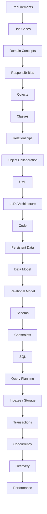

# Map of Content

> The vault's central navigation hub. Every chapter links back here.

## The continuous chain

Each arrow is not a handoff — it is a **refinement**. The same problem (modeling and constraining a domain so it behaves correctly) is solved at progressively more concrete layers.

## Part I — Foundations (the unifying spine)

Read these first. They establish the vocabulary that every later chapter reuses.

- [[01-Unified-Mental-Model]] — the central argument of the vault
- [[02-The-Continuous-Chain]] — the full pipeline, with what each layer adds
- [[03-Dependency-As-Root-Concept]] — the single most reused idea in the vault
- [[04-Abstraction-and-Models]] — what an abstraction *is*, why we build them
- [[05-Identity-State-Lifecycle]] — object identity, primary keys, surrogate keys, lifecycle, all unified
- [[06-Coupling-and-Cohesion]] — the two forces behind every design decision
- [[07-Composition-vs-Inheritance]] — reuse mechanisms, where each fits, persistence consequences
- [[08-Trade-offs-Everywhere]] — there are no solutions, only trade-offs

## Part II — From problem to object model

- [[00-Banking-Case-Study]] — the anchor; reads once, referenced everywhere
- [[01-Requirements]] — what we are told; what we are not told
- [[02-Use-Cases]] — structuring behavior we need to support
- [[03-Domain-Concepts]] — discovering nouns and verbs in the problem
- [[04-Responsibilities]] — CRC cards, responsibility-driven design
- [[05-Information-Holding]] — the responsibility that becomes a class
- [[01-Objects-And-Classes]] — the first concrete artifact
- [[02-Encapsulation]] — protecting invariants
- [[03-Inheritance]] — reuse + substitutability
- [[04-Polymorphism]] — dispatch as decoupling
- [[05-Composition-Over-Inheritance]] — practical rule, with caveats
- [[00-Object-Relationships]] — associations, aggregations, compositions
- [[01-Object-Collaboration]] — messages, sequence, contracts

## Part III — Design discipline

- [[00-SOLID-as-Dependency-Management]] — SOLID reframed as one principle
- [[01-SRP]] — one reason to change
- [[02-OCP]] — open for extension, closed for modification
- [[03-LSP]] — substitutability as a contract
- [[04-ISP]] — interface segregation
- [[05-DIP]] — dependency inversion
- [[00-Patterns-As-Documented-Forces]] — what a pattern really is
- [[01-Creational-Patterns]]
- [[02-Structural-Patterns]]
- [[03-Behavioral-Patterns]]
- [[04-Enterprise-Patterns]] — Repository, Unit of Work, CQRS
- [[05-Anti-Patterns]]

## Part IV — Modeling and architecture

- [[00-UML-As-Modeling-Language]]
- [[01-Class-Diagrams]]
- [[02-Sequence-Diagrams]]
- [[03-Activity-Diagrams]]
- [[04-State-Diagrams]]
- [[05-Component-And-Deployment]]
- [[00-LLD-Method]] — Problem → Naive → Failure → Forces → Better → UML → Code → Trade-offs
- [[01-Design-Forces]]
- [[02-Layered-Architecture]]
- [[03-Hexagonal-Architecture]]
- [[04-Clean-Architecture]]
- [[05-Architecture-Trade-offs]]
- [[00-Domain-Modeling]] — DDD essentials
- [[01-Entities-Value-Objects]]
- [[02-Aggregates]]
- [[03-Bounded-Contexts]]
- [[04-Domain-Events]]
- [[05-Anemic-vs-Rich-Models]]

## Part V — From object model to data model

- [[09-Object-Model-vs-Data-Model]] — where they correspond, where they diverge
- [[00-ORM-Impedance-Mismatch]]
- [[00-ER-Modeling]] — entities, attributes, relationships, cardinalities
- [[01-ER-to-Relational]]
- [[02-Banking-ER]]

## Part VI — Relational theory (taught in full)

- [[00-Relational-Model]]
- [[01-Relations-Tuples-Attributes]]
- [[02-Keys-Superkeys-Candidate-Keys]]
- [[03-Functional-Dependencies]]
- [[04-Relational-Algebra]]
- [[05-Relational-Calculus]]
- [[06-1NF-2NF-3NF]]
- [[07-BCNF]]
- [[08-4NF-5NF]]
- [[09-DKNF]]
- [[10-Normalization-Trade-offs]]
- [[11-Banking-Normalization-Walkthrough]]

## Part VII — Schema, constraints, SQL

- [[00-Schema-Design]]
- [[01-Primary-Foreign-Keys]]
- [[02-Domain-Check-Constraints]]
- [[03-Triggers-As-Constraints]]
- [[04-Banking-Schema]]
- [[00-SQL-From-Relational-Algebra]]
- [[01-DDL]]
- [[02-DML]]
- [[03-Select-Join-Group]]
- [[04-Subqueries-CTEs]]
- [[05-Window-Functions]]
- [[06-Transactions-In-SQL]]
- [[07-Views-Materialized-Views]]
- [[08-Stored-Procedures]]
- [[09-Banking-SQL]]

## Part VIII — ORM deep-dive

- [[00-ORM-Impedance-Mismatch]]
- [[01-Identity-Map]]
- [[02-Lazy-Eager-Loading]]
- [[03-N-plus-1-Problem]]
- [[04-Unit-of-Work]]
- [[05-Repository-Pattern]]
- [[06-Hibernate-JPA]]
- [[07-Banking-ORM-Mapping]]

## Part IX — Database internals

- [[00-Storage-Hierarchy]]
- [[01-Pages-And-Files]]
- [[02-Buffer-Pool]]
- [[03-B-Tree-Indexes]]
- [[04-Hash-Indexes]]
- [[05-Join-Algorithms]]
- [[06-Query-Processing-Pipeline]]
- [[07-Cost-Based-Optimizer]]
- [[08-Reading-EXPLAIN]]
- [[09-Banking-Query-Plans]]

## Part X — Transactions, concurrency, recovery

- [[00-ACID]]
- [[01-Concurrency-Anomalies]]
- [[02-Isolation-Levels]]
- [[03-Two-Phase-Locking]]
- [[04-MVCC]]
- [[05-Serializability]]
- [[06-Deadlocks]]
- [[07-Distributed-Transactions]]
- [[08-Two-Phase-Commit]]
- [[09-Banking-Transaction-Walkthrough]]
- [[00-WAL-Logging]]
- [[01-ARIES]]
- [[02-Checkpoints]]
- [[03-Backup-And-Recovery]]
- [[04-Banking-Recovery-Scenario]]

## Part XI — Performance and scale

- [[00-Query-Optimization-Strategy]]
- [[01-Indexing-Strategy]]
- [[02-Denormalization-For-Reads]]
- [[03-Caching]]
- [[04-Partitioning-And-Sharding]]
- [[05-Banking-Performance-Tuning]]

## Part XII — Beyond relational

- [[00-When-Relational-Strains]]
- [[01-Document-Stores]]
- [[02-Key-Value-Stores]]
- [[03-Wide-Column-Stores]]
- [[04-Graph-Stores]]
- [[05-Banking-NoSQL-Choice]]

## Part XIII — Distributed systems

- [[00-CAP-PACELC]]
- [[01-Consensus-Raft-Paxos]]
- [[02-Replication]]
- [[03-Sharding-Revisited]]
- [[04-Eventual-Consistency]]
- [[05-Banking-Distributed-Design]]

## Part XIV — Exercises and cross-references

- [[00-Exercise-Index]]
- [[01-OOP-LLD-Exercises]]
- [[02-SQL-Normalization-Exercises]]
- [[03-Transactions-Concurrency-Exercises]]
- [[04-End-To-End-Capstone]]
- [[Concept-Index]]
- [[Pattern-Index]]
- [[Cross-Reference-Map]]

## How chapters are structured

Every chapter note follows the same skeleton:

1. **What you already know** — recall of prior layers this builds on
2. **Why this layer exists** — the problem it solves
3. **What is genuinely new** — only the delta
4. **Concepts** — terminology introduced here, named after the idea is understood
5. **Banking application** — the same case study advanced one step
6. **Code / schema / SQL / plan** — concrete artifacts
7. **What can go wrong** — failure modes
8. **Trade-offs** — what you give up
9. **Forward links** — where this concept reappears later

If a section says *“as established in [[X]]”*, do not reread X. It is there only as a pointer.
