# The Continuous Chain

> The entire vault in one diagram. Each layer is a refinement of the layer above, not a separate subject.

## What you already know

From [[01-Unified-Mental-Model]]: software design and database engineering are the same discipline at different layers. This note shows the layers.

## The chain

```mermaid
flowchart TD
    R["Requirements<br/><i>What is the problem?</i>"] --> UC["Use Cases<br/><i>What behavior must exist?</i>"]
    UC --> DC["Domain Concepts<br/><i>What nouns and verbs live here?</i>"]
    DC --> RS["Responsibilities<br/><i>Who does what?</i>"]
    RS --> O["Objects<br/><i>Concrete collaborators</i>"]
    O --> C["Classes<br/><i>Templates for objects</i>"]
    C --> RL["Relationships<br/><i>How objects refer to each other</i>"]
    RL --> CO["Object Collaboration<br/><i>Message sequences</i>"]
    CO --> U["UML<br/><i>Visualize the model</i>"]
    U --> L["LLD / Architecture<br/><i>Forces, trade-offs, structure</i>"]
    L --> CD["Code<br/><i>Executable form</i>"]
    CD --> PD["Persistent Data<br/><i>What must survive</i>"]
    PD --> DM["Data Model<br/><i>Entities and relationships</i>"]
    DM --> RM["Relational Model<br/><i>Relations, tuples, attributes</i>"]
    RM --> SC["Schema<br/><i>Concrete tables, columns</i>"]
    SC --> CN["Constraints<br/><i>Invariants enforced by the DB</i>"]
    CN --> SQ["SQL<br/><i>Operations on the schema</i>"]
    SQ --> QP["Query Planning<br/><i>How the DB executes SQL</i>"]
    QP --> IX["Indexes / Storage<br/><i>Physical structures</i>"]
    IX --> TX["Transactions<br/><i>Atomic units of work</i>"]
    TX --> CC["Concurrency<br/><i>Multiple actors at once</i>"]
    CC --> RC["Recovery<br/><i>Surviving crashes</i>"]
    RC --> PF["Performance<br/><i>Doing it fast and at scale</i>"]
```

## What each layer adds

| Layer | Why it exists | What is genuinely new |
|---|---|---|
| Requirements | We must agree on what problem we are solving | Nothing technical — just a problem statement |
| Use Cases | We need to enumerate behavior, not just data | The notion of an *actor* and an *interaction* |
| Domain Concepts | We need a shared vocabulary before designing | The discovery that the problem has its own nouns and verbs |
| Responsibilities | We need to decide who does what before deciding how | *Responsibility* as a design unit (CRC cards) |
| Objects | We need concrete collaborators we can reason about | Identity, state, behavior bundled together |
| Classes | We need templates so we can create many objects | The notion of a *type* shared by instances |
| Relationships | We need objects to refer to each other | References, multiplicities, ownership |
| Collaboration | We need sequences of messages to fulfill use cases | Time-ordered interaction, contracts |
| UML | We need a visual language to talk about all of the above | A standardized notation (no new concept, just vocabulary) |
| LLD / Architecture | We need to weigh forces and pick a structure | Trade-offs become first-class |
| Code | We need an executable artifact | Syntax, compilers, runtime |
| Persistent Data | We need state that survives process restarts | The notion of *durability* |
| Data Model | We need to describe persistent state independently of code | Entities and relationships decoupled from classes |
| Relational Model | We need a formal, mathematical foundation | Relations as sets, algebra, theory |
| Schema | We need a concrete, implementable form | Tables, columns, types |
| Constraints | We need invariants the database itself will enforce | Declarative correctness |
| SQL | We need a language to operate on the schema | A declarative query language |
| Query Planning | We need to translate SQL into something executable | Algebraic rewriting, cost estimation |
| Indexes / Storage | We need fast access and durable storage | B-trees, hash tables, pages, buffer pool |
| Transactions | We need multiple operations to behave atomically | ACID |
| Concurrency | We need multiple actors to coexist | Isolation, locks, MVCC |
| Recovery | We need to survive crashes | WAL, ARIES |
| Performance | We need it fast, at scale, and cheap | Optimization as an ongoing discipline |

## The single insight

Every layer solves the same problem — *constrain a model so it behaves correctly* — at a different level of abstraction. The vocabulary changes. The forces do not.

- A class invariant and a `CHECK` constraint are the same force (constraint) at two layers.
- An interface and a view are the same force (abstraction) at two layers.
- Object identity and a primary key are the same force (identity) at two layers.
- A dependency in UML and a foreign key are the same force (dependency) at two layers.
- A design trade-off in LLD and an index trade-off in query optimization are the same force (trade-off) at two layers.

When a new chapter introduces vocabulary, ask: *which of the five forces is this?* If you can name the force, you already understand the shape of the problem.

## Where this goes next

- [[03-Dependency-As-Root-Concept]] — the most-reused force, taught once here and applied everywhere.
- [[04-Abstraction-and-Models]] — the second force.
- [[05-Identity-State-Lifecycle]] — the third force.
- [[06-Coupling-and-Cohesion]] — the fourth force.
- [[08-Trade-offs-Everywhere]] — the fifth force.
