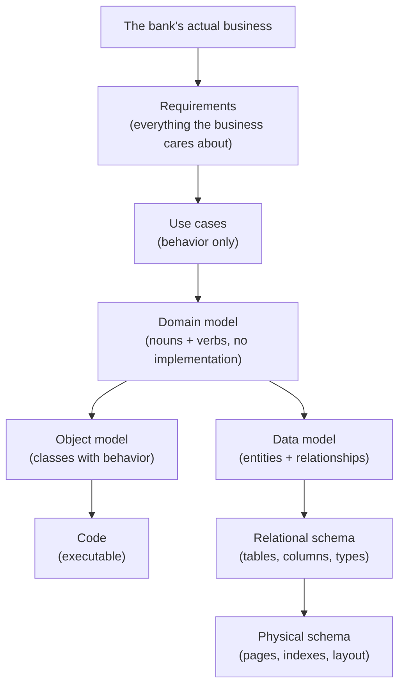

# Abstraction and Models

> The second of the five forces. Abstraction is the act of building a model — choosing what to keep and what to throw away so the result is useful for a specific purpose.

## What you already know

From [[03-Dependency-As-Root-Concept]]: dependencies are about *what changes with what*. Abstraction is about *what we choose to see*.

## The core definition

> **An abstraction is a model that hides details irrelevant to a purpose, while preserving details that matter for that purpose.**

Two parts matter:

1. *Hides* — abstraction is selective forgetting.
2. *For a purpose* — there is no "correct" abstraction in the abstract. There is only an abstraction that is good *for this question*.

A map of a city is an abstraction. So is a class. So is a database view. So is a relational schema. So is a SQL query plan. The question is always: *what did we throw away, and does the question we want to ask still survive the throwing-away?*

## Models, purposes, and the right level

A famous mistake in software is to ask, "Is this abstraction correct?" The right question is:

> *For what purpose is this abstraction useful, and what purposes does it fail?*

A checking account in a banking system might be modeled as:

- A row in `accounts` (relational model — purpose: query, persist, constrain)
- A `CheckingAccount` Java object (object model — purpose: behavior, invariants, polymorphism)
- A `Account` interface (abstract model — purpose: substitution, multiple implementations)
- A column in a `daily_balances` table (denormalized model — purpose: fast reporting)
- A document in a document store (NoSQL model — purpose: schema flexibility, embedded aggregates)

Each is a valid abstraction. None is "the right one." Each answers a different question. The skill of design is choosing the right abstraction for the question being asked — and knowing when to switch abstractions as the question changes.

## The abstraction ladder

Abstractions form a ladder. Moving *up* the ladder means throwing away more detail. Moving *down* means adding detail back.

Each step down is a commitment to a specific implementation strategy. Each step up is a recovery of generality at the cost of executability.

A good design lives at the right level for each decision:

- *What is the rule?* → domain model
- *What does the database enforce?* → schema + constraints
- *What does the code enforce?* → class invariants
- *How is it stored?* → physical schema

These are four different questions; they deserve four different abstractions. The mistake is to collapse them into one ("the schema *is* the domain model") and lose either the domain's expressiveness or the database's guarantees.

## Abstraction at each layer

| Layer | Abstraction | What it hides | What it preserves |
|---|---|---|---|
| Code | Interface | Implementation | Contract (method signatures, semantics) |
| Code | Abstract class | Concrete subclass | Common protocol + partial implementation |
| UML | Class diagram | Method bodies | Structure, relationships |
| Schema | View | Underlying tables | A queryable shape |
| Schema | Logical schema | Physical layout | Tables, columns, constraints |
| SQL | `SELECT` | How rows are stored | What rows satisfy a predicate |
| Query plan | Logical plan | Physical operators | Relational algebra |
| Query plan | Physical plan | Buffer pool, disk | Operator tree + access paths |
| OS | File | Disk blocks | A named byte stream |
| OS | Process | CPU registers, memory layout | An executable program |

Every row is the same act: hide detail, preserve purpose.

## The two failure modes of abstraction

1. **Too much detail** (under-abstraction). The abstraction leaks the things it was supposed to hide. Callers depend on the implementation. Change becomes expensive. Example: a "repository" that exposes SQL fragments to callers; a "view" that joins five tables and forces callers to know which columns are denormalized.

2. **Too little detail** (over-abstraction). The abstraction hides things the caller actually needs. Callers cannot do their job without peeking behind it. Example: an interface so generic it accepts `Object` and returns `Object`; a schema so normalized that every query needs a six-table join.

Both are failures. The skill is matching the abstraction to the *question*.

## Leaky abstractions

Abstractions rarely hold perfectly. The canonical statement: *all non-trivial abstractions, to some degree, are leaky* — Joel Spolsky.

A JDBC driver is an abstraction over a network protocol. When the network drops, the abstraction leaks: you get a `SQLException` that mentions a socket timeout. The database view is an abstraction over tables, but when one underlying table is missing an index, the view's `SELECT` is slow. The class invariant is an abstraction over state, but under concurrent mutation, the invariant can transiently fail.

Leaks are not failures of design — they are *inevitable*. The design question is:

> *When this abstraction leaks, what is the recovery path?*

A good design documents the leaks and gives callers a way to deal with them (e.g., retry on `SQLException`, re-run a query on stale read, take a lock when invariant must hold during a multi-step mutation).

## Abstraction and dependency — together

Abstraction and dependency are paired forces:

- You introduce an abstraction to *reduce* or *invert* a dependency.
- `Repository` interface is an abstraction; depending on it (instead of on `JdbcAccountRepository`) inverts the dependency from "domain depends on JDBC" to "JDBC implementation depends on domain's abstraction."
- A `VIEW` is an abstraction; depending on the view (instead of on the underlying tables) reduces the dependency on physical schema changes.

Every time you see an abstraction, ask: *which dependency is this here to reduce or invert?* If the answer is "none," the abstraction is decoration and should be removed.

## Banking application

The `Account` interface in the banking codebase is an abstraction. It hides whether the account is a checking account, savings account, or a mock used in tests. Callers depend on the abstraction; concrete implementations depend on the same abstraction (DIP, [[05-DIP]]).

In the schema, the `account_balances` view hides whether the balance is computed from `ledger_entries` (correct, slow) or read from a denormalized `account_current_balance` column (fast, eventually consistent). The view is an abstraction; the choice of implementation is a trade-off the caller does not need to know about.

## What is genuinely new here

- Abstraction is *selective forgetting for a purpose*.
- There is no correct abstraction; there is only a useful one for a specific question.
- Abstractions leak. Design for the leak, not against it.
- Every abstraction exists to reduce or invert a dependency. If it does neither, it is decoration.

## Where this goes next

- [[05-Identity-State-Lifecycle]] — the third force.
- [[00-UML-As-Modeling-Language]] — UML is a notation for abstractions; nothing more.
- [[09-Object-Model-vs-Data-Model]] — the two main abstractions for a single domain.
- [[07-Views-Materialized-Views]] — abstraction at the SQL layer.
