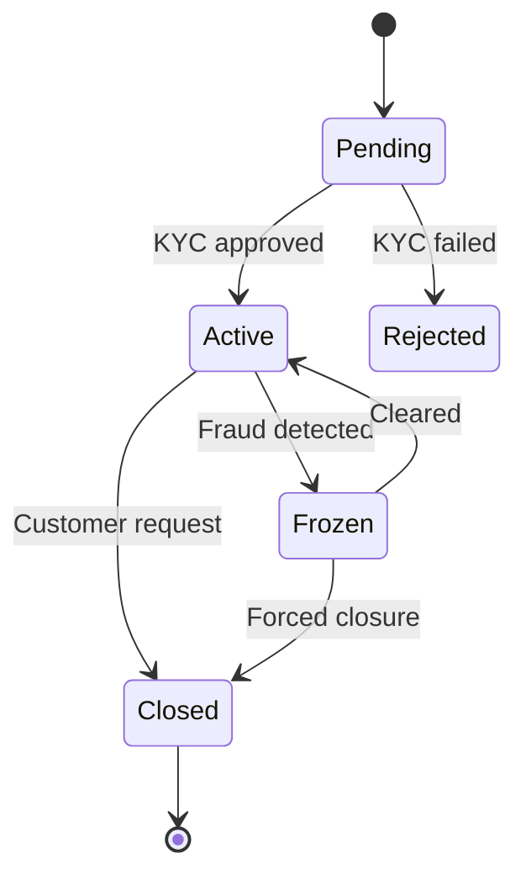

# Identity, State, and Lifecycle

> The third of the five forces. Identity is the answer to "is this the same thing I saw before?" — and the answer differs sharply between object land and database land. This difference generates most of the impedance mismatch later in the vault.

## What you already know

From [[03-Dependency-As-Root-Concept]] and [[04-Abstraction-and-Models]]: we are tracking five forces across layers. Identity is the third.

## The core definition

> **Identity is the property that lets us say "this is the same X" across time and across transformations, even when X's other attributes have changed.**

Identity is independent of state. The same person is the same person after a haircut. The same bank account is the same bank account after a deposit. The same database row is the same row after an `UPDATE`.

This sounds obvious. It is not. It is the single biggest difference between object-oriented programming and relational databases.

## Three flavors of identity

| Flavor | What it is | Where it lives |
|---|---|---|
| **Object identity** | Memory address / reference | JVM, CLR, Python runtime |
| **Logical identity** | A chosen attribute that uniquely identifies the entity within a domain | The domain model (e.g., IBAN, customer number, ISBN) |
| **Surrogate identity** | A generated token with no business meaning | Database primary key (e.g., UUID, auto-increment) |

The conflict: object identity is fast but ephemeral; logical identity is meaningful but mutable; surrogate identity is stable but meaningless.

## Object identity

In Java:

```java
Account a = new Account("iban", 100);
Account b = new Account("iban", 100);
a == b       // false — different references
a.equals(b)  // depends on how equals is implemented
```

Object identity is *cheap*: it is just a pointer comparison. But it is *useless across processes*: if `a` is serialized, sent over the network, and deserialized as `b`, the two are no longer `==`.

So in distributed or persistent systems, we cannot rely on object identity. We need logical or surrogate identity.

## Logical identity

A logical identity is an attribute of the entity that *we agree* uniquely identifies it. Examples:

- IBAN for a bank account
- ISBN for a book
- Email address for a user (until they change it)
- Tax ID for a customer

Logical identity is meaningful. A human can read it and recognize what it refers to. But it has two problems:

1. **It can change.** A user changes their email. A company changes its tax ID after a merger. If logical identity is the primary key, a change cascades to every referencing row — expensive and error-prone.
2. **It can be wrong.** Two users might be assigned the same email due to a bug. If email is the primary key, fixing the duplicate requires re-pointing every reference.

Logical identity is great as a *natural key* but usually poor as a *primary key* for persistence.

## Surrogate identity

A surrogate key is a generated token with no business meaning. It exists only to be a stable identifier. Examples:

- Auto-increment integer (`BIGSERIAL` in PostgreSQL)
- UUID (`UUID` or `UUID` in PostgreSQL)
- Composite of (timestamp, node id, counter) — e.g., ULID, Snowflake

Advantages:

- Never changes. Updates to business attributes do not cascade.
- Cheap to index (small, fixed-size, often monotonic).
- Can be generated client-side (UUID, ULID) — useful for distributed systems and outbox patterns.

Disadvantages:

- Meaningless. Cannot tell anything from `id = 1042`.
- Auto-increment exposes insertion order, which can be a leak (competitors can estimate your rate of customer signup).
- UUID v4 is random; B-tree inserts are scattered, causing fragmentation. UUID v7 / ULID fix this by being time-sortable.

The standard pattern: surrogate key as primary key; logical identity as a `UNIQUE` constraint.

## Identity and `equals` / `hashCode`

In Java, the right pattern for an entity with a surrogate database ID:

```java
public final class Account {
    private Long id;          // null until persisted
    private String iban;      // logical identity

    @Override
    public boolean equals(Object o) {
        if (this == o) return true;
        if (!(o instanceof Account)) return false;
        Account other = (Account) o;
        // Use logical identity if both have one; else fall back to object identity
        return iban != null && other.iban != null
            ? iban.equals(other.iban)
            : this == o;
    }

    @Override
    public int hashCode() {
        return iban != null ? iban.hashCode() : System.identityHashCode(this);
    }
}
```

Pitfalls:

- Using the surrogate `id` in `equals` means an unpersisted entity (id == null) is never equal to anything — including itself across collections.
- Using object identity (`==`) breaks the moment you load the same account twice in different sessions.
- Using mutable logical identity in `hashCode` breaks `HashSet` / `HashMap` if the identity changes while the object is in the set.

There is no perfect answer. The choice is a trade-off — see [[08-Trade-offs-Everywhere]].

## State

State is the set of attribute values of an entity at a moment in time.

- Object state lives in memory; lost on process exit.
- Persistent state lives in the database; survives restarts.

Two views of the same account:

```java
// Object state
class Account {
    private BigDecimal balance;       // current
    private List<LedgerEntry> entries; // history (often lazy-loaded)
}
```

```sql
-- Persistent state
CREATE TABLE accounts (
    id BIGINT PRIMARY KEY,
    iban TEXT UNIQUE NOT NULL,
    current_balance NUMERIC(18,2) NOT NULL
);

CREATE TABLE ledger_entries (
    id BIGINT PRIMARY KEY,
    account_id BIGINT NOT NULL REFERENCES accounts(id),
    amount NUMERIC(18,2) NOT NULL,
    occurred_at TIMESTAMPTZ NOT NULL
);
```

The `current_balance` column is a *denormalized* view of the sum of `ledger_entries`. It is redundant — but it is fast to read. This is a trade-off (between normalization and read speed) we will revisit in [[10-Normalization-Trade-offs]] and [[02-Denormalization-For-Reads]].

## Lifecycle

Lifecycle is the sequence of states an entity passes through, plus the transitions between them.

For a bank account:



Every transition is a state change, but not every state change is a transition. A deposit changes the balance but does not change the lifecycle state. Lifecycle state is a *subset* of state — the subset that drives which operations are legal.

Lifecycle states correspond to invariants:

- `Pending` → no deposits, no withdrawals.
- `Active` → deposits and withdrawals allowed.
- `Frozen` → no withdrawals, deposits allowed.
- `Closed` → no operations at all.

These invariants are enforced in *three* places:

1. **Object model** — `Account.deposit()` checks `state == ACTIVE || state == FROZEN`.
2. **Schema** — `CHECK` constraint on allowed state transitions, or a trigger.
3. **Database** — partial indexes (e.g., unique constraint on `(iban)` only for non-closed accounts).

Layering the same invariant in three places looks redundant. It is not — each layer catches different failure modes (see [[03-Triggers-As-Constraints]]).

## Object identity vs primary key — the canonical mismatch

This is the seed of the entire ORM problem (see [[00-ORM-Impedance-Mismatch]]):

- In memory, two `Account` objects with the same `id` may be different objects (different references).
- In the database, two rows with the same primary key *are the same row*.
- When you load the same account twice in the same Hibernate session, Hibernate's *identity map* returns the same object reference — making object identity coincide with primary key, *within that session*.
- Across sessions, this guarantee disappears. Two sessions loading the same account get two different objects. Equality must be defined by logical identity.

This is not an ORM bug. It is a fundamental difference between in-memory identity and persistent identity. The ORM just makes the difference *visible*.

## Banking application

The `Account` entity has:

- **Surrogate identity**: `id BIGSERIAL` — never exposed to users, used for foreign keys.
- **Logical identity**: `iban TEXT UNIQUE` — what humans and external systems use.
- **Object identity**: irrelevant outside a single JVM session.
- **State**: `balance`, `status`, `frozen_until`.
- **Lifecycle**: `PENDING → ACTIVE → FROZEN → CLOSED`.

The same entity, modeled consistently across code and schema, but with each layer using the appropriate flavor of identity for its purpose.

## What is genuinely new here

- Identity comes in three flavors (object, logical, surrogate); use each where it fits.
- Identity is independent of state; that is the whole point.
- Lifecycle state is a *subset* of state — the subset that gates operations.
- The object/database identity mismatch is not a bug; it is a real difference, and ORM is the seam.

## Where this goes next

- [[06-Coupling-and-Cohesion]] — the fourth force.
- [[01-Entities-Value-Objects]] — entities have identity; value objects do not.
- [[00-ORM-Impedance-Mismatch]] — where identity differences explode into design problems.
- [[01-Identity-Map]] — Hibernate's solution to identity within a session.
