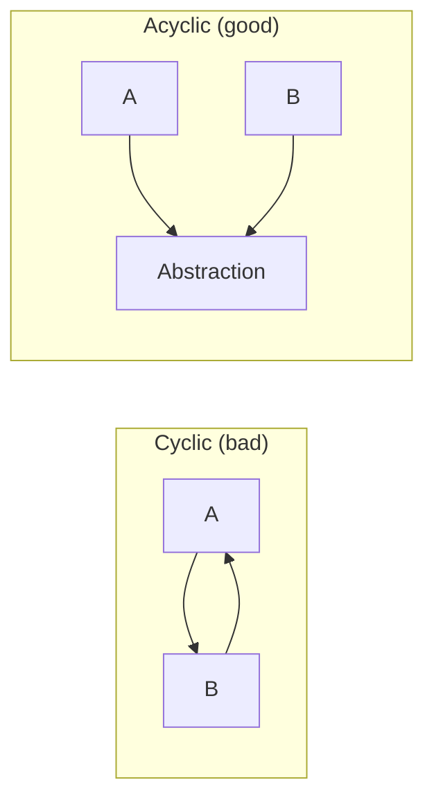

# Coupling and Cohesion

> The fourth of the five forces. Coupling and cohesion are two sides of the same coin — how the parts of a system relate to each other, both between modules and within them.

## What you already know

From [[03-Dependency-As-Root-Concept]]: a dependency exists when a change in one place can force a change elsewhere. Coupling is the *measure* of how much dependency exists between modules. Cohesion is the *measure* of how much the parts within a module belong together.

## The core definitions

> **Coupling** is the degree to which one module depends on another. Lower is better, but rarely zero.

> **Cohesion** is the degree to which the responsibilities of a single module belong together. Higher is better.

The two forces are paired:

- High coupling means changes ripple widely.
- Low cohesion means a single module does unrelated things — changes to one responsibility can break another.
- The combination "high coupling + low cohesion" is the worst of all worlds: changes ripple *and* they break unrelated things.

## The seven levels of coupling (Yourdon & Constantine)

From loosest (best) to tightest (worst):

1. **No coupling** — modules do not know each other exists.
2. **Data coupling** — modules communicate by passing primitive data.
3. **Stamp coupling** — modules share a data structure but only use parts of it.
4. **Control coupling** — one module passes a flag that controls the other's behavior.
5. **External coupling** — modules share an external format or protocol.
6. **Common coupling** — modules share global mutable state.
7. **Content coupling** — one module reaches into another's internals.

Most modern designs live between data and stamp coupling. Common coupling (singletons, global state) is a common smell. Content coupling (reaching into private fields via reflection, friend classes, or "package-private" tricks) is a code smell almost always.

## The seven levels of cohesion

From worst to best:

1. **Coincidental** — parts are grouped for no reason ("utils" package).
2. **Logical** — parts do logically related things but in different ways (e.g., "all I/O").
3. **Temporal** — parts are done at the same time (`init()` does everything).
4. **Procedural** — parts follow a sequence.
5. **Communicational** — parts operate on the same data.
6. **Sequential** — output of one part is input to the next.
7. **Functional** — all parts contribute to a single, well-defined task.

Modern rule of thumb: aim for functional cohesion. If you cannot describe what a module does in one sentence without using "and," it is probably not functionally cohesive.

## Coupling and cohesion in design rules

Almost every named design rule is a coupling or cohesion heuristic in disguise:

| Rule | Coupling or cohesion? |
|---|---|
| Single Responsibility Principle | Cohesion (functional) |
| Interface Segregation | Coupling (avoid stamp) + Cohesion (functional interfaces) |
| Open/Closed Principle | Coupling (depend on stable abstraction) |
| Law of Demeter | Coupling (avoid transitive — "only talk to friends") |
| Tell, Don't Ask | Coupling (avoid control coupling) |
| High-cohesion, low-coupling (general) | Both |
| Bounded Context (DDD) | Cohesion (one model per context) + Coupling (contexts communicate via translation) |
| Aggregate boundaries (DDD) | Coupling (transactional — keep inside one aggregate) + Cohesion (an aggregate is one consistency boundary) |
| Normalization (1NF-BCNF) | Cohesion (each table represents one fact type) + Coupling (foreign keys = controlled coupling) |
| Microservices boundary | Coupling (services should not share databases) |
| Don't share a database between services | Coupling (shared schema = tightest form of integration) |

Notice the last few rows: the *same* forces reappear at the database and distributed layers. Normalization is functional cohesion for tables. A foreign key is data coupling between tables. A bounded context is a high-cohesion module at the domain layer. A microservice boundary is a cohesion boundary at the deployment layer.

The vocabulary changes. The forces do not.

## Coupling has a direction, and direction matters

From [[03-Dependency-As-Root-Concept]]: dependencies point toward stability. Coupling is bidirectional in the sense that *both* modules know about each other's interface, but the dependency direction is usually one-way. Bidirectional coupling (cycles) is the most expensive form.

A cyclic dependency means:

- Neither side can be changed without potentially affecting the other.
- Neither side can be tested in isolation.
- Neither side can be deployed independently.
- Neither side can be replaced independently.

Cycles appear in code (`A` imports `B`, `B` imports `A`), in packages (`com.bank.accounts` depends on `com.bank.transfers` and vice versa), in schemas (mutual foreign keys, often via nullable columns), and in services (service A calls service B synchronously, B calls A back via webhook).

The cure is always the same: introduce an abstraction in the middle, invert one direction, and the cycle becomes a tree.

## Cohesion as the guide for splitting

When a module grows too large, the question is not "where do I cut?" but "what does not belong here?" Cohesion is the answer.

- A `BankingService` with `openAccount`, `transferMoney`, `issueLoan`, `reportFraud` is not cohesive. Cut along responsibility lines.
- A `Customer` class with `name`, `address`, `computeCreditScore`, `formatInvoice` is not cohesive. The first two are data; the third is policy; the fourth is presentation. Move them.
- A `accounts` table with columns `balance`, `last_login`, `marketing_opt_in`, `customer_favorite_color` is not cohesive. The favorite color has nothing to do with the account.

The rule: if you cannot explain why two things live together without saying "they are related to a customer," they probably should not live together. Relatedness is not cohesion — *shared responsibility for a single invariant* is.

## Cohesion and invariants — the real test

A module is cohesive if it owns *one* invariant and everything in the module exists to protect that invariant.

- `Account` owns the invariant `balance == sum(ledger_entries.amount)`. Everything in `Account` exists to protect that invariant. Cohesive.
- `Account` with `last_login_at` is *not* cohesive — `last_login_at` has nothing to do with the balance invariant. Move it to `CustomerActivity` or `AuthLog`.
- `accounts` table owning the balance invariant is cohesive. `accounts` table also storing customer marketing preferences is not.

This is the same test used to identify aggregates in DDD (see [[02-Aggregates]]). An aggregate is *the smallest unit that owns one invariant*. That is the definition of functional cohesion applied to a persistent entity.

## Banking application

Consider the `Account` entity:

- **Cohesive responsibilities**: own the balance invariant, enforce lifecycle rules, accept deposits, allow withdrawals subject to limits.
- **Not cohesive** (do not put here): sending notification emails (belongs to `NotificationService`), computing fraud scores (belongs to `FraudService`), formatting account statements (belongs to `StatementFormatter`).
- **Coupling**: `Account` depends on `LedgerEntry` (necessary — it is the source of truth for balance). `Account` does *not* depend on `TransferService` (the transfer service depends on `Account`, not vice versa).
- **Aggregate boundary**: `Account` + its `LedgerEntry` children form one aggregate. A transfer touches two aggregates (the source and destination accounts) — that is why transfers need a transaction (see [[00-ACID]]).

## Coupling, cohesion, and change frequency

The practical test:

> *When feature X changes, how many modules must change?*

- If the answer is "one, functionally-cohesive module," you have won.
- If the answer is "five modules spread across three layers," you have high coupling somewhere.

This is why coupling and cohesion are not academic — they directly predict the cost of change. High-cohesion/low-coupling code is not "cleaner" in some aesthetic sense; it is *cheaper to evolve*.

## What is genuinely new here

- Coupling and cohesion are paired forces, not separate ones.
- Almost every design rule is a heuristic for one or the other.
- The test for cohesion is *shared invariant*, not "relatedness."
- The test for coupling is *direction + level* — and direction should follow stability.

## Where this goes next

- [[07-Composition-vs-Inheritance]] — inheritance is the tightest form of coupling between classes; composition is looser.
- [[00-SOLID-as-Dependency-Management]] — SOLID is the formalized vocabulary for managing these forces.
- [[02-Aggregates]] — cohesion applied to persistence.
- [[10-Normalization-Trade-offs]] — coupling and cohesion applied to tables.
