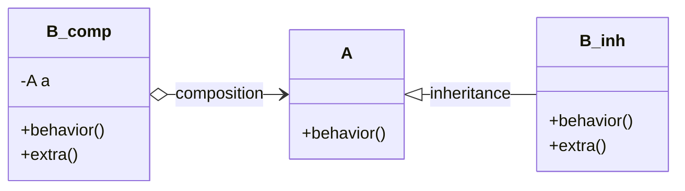

# Composition vs Inheritance

> A cross-cutting topic. It is foundational because the same trade-off reappears at the schema layer (single-table inheritance vs class table inheritance vs typed relationships) and the persistence layer (ORM inheritance strategies). Get the principle once; map it everywhere.

## What you already know

From [[06-Coupling-and-Cohesion]]: inheritance is the *tightest* form of coupling between classes. The child class depends on every implementation detail of the parent. From [[03-Dependency-As-Root-Concept]]: dependencies should point toward stability. A parent class is often less stable than its children would like — children change rarely, parents evolve.

## The two reuse mechanisms

> **Inheritance**: "B is-a A, with differences." B reuses A's implementation by being a subclass.

> **Composition**: "B has-a A, and delegates to it." B reuses A's implementation by holding a reference.

Both are reuse mechanisms. Both let you avoid duplicating code. The difference is in the coupling that results.



## Why inheritance is tight coupling

When `B extends A`:

- B depends on every protected method and field of A.
- A change to A's protected surface can break B.
- A's constructor is part of B's initialization.
- A's invariants become B's invariants.
- B's identity is bound to A's identity — B *is-an* A.
- You cannot change B's parent at runtime.
- You cannot mix-and-match: a class with two parents needs multiple inheritance, which Java forbids (and C++ allows but with much pain).

Inheritance is a *compile-time, permanent, single-dimensional* commitment. If you guess wrong, refactoring is expensive.

## Why composition is looser

When `B` holds a reference to `A`:

- B depends only on A's public interface.
- A change to A's internals does not affect B.
- B can swap its `A` for a different implementation at runtime (Dependency Injection).
- B can hold references to *multiple* objects of different types — composition is multi-dimensional.
- B can be unit-tested by mocking `A`.

Composition is a *runtime, replaceable, multi-dimensional* commitment. Wrong guesses are cheap to fix.

## The GoF rule

The Gang of Four book states the rule plainly:

> **Favor object composition over class inheritance.**

Not "never inherit" — "favor composition." Inheritance has legitimate uses; the default choice should be composition.

## When inheritance is the right answer

Inheritance is correct when *all* of these hold:

1. The relationship is genuinely "is-a," not "is-implemented-in-terms-of."
2. The subclass truly is a substitutable specialization (see [[03-LSP]] — Liskov Substitution Principle).
3. The parent class is stable — its protected surface is unlikely to change.
4. The hierarchy is shallow (≤ 2-3 levels).
5. The hierarchy is closed — new subclasses are not added frequently.

Examples where inheritance is appropriate:

- `ArrayList` extends `AbstractList` — the contract is stable, the hierarchy is shallow, no new subclasses are expected to break the contract.
- `CheckedInputStream` extends `FilterInputStream` — the decorator pattern, where the parent deliberately exposes hooks for subclasses.

Examples where inheritance is wrong:

- `Stack extends ArrayList` — a stack is not an array list; exposing `ArrayList` methods breaks stack semantics. (Java got this wrong.)
- `Manager extends Employee` — what happens when a manager is also a contributor? When the manager role is removed? Use composition: `Employee has-roles: List<Role>`.

## Composition in practice — the strategy pattern

When you find yourself wanting to inherit to vary behavior, you usually want a strategy:

```java
// Bad: inheritance for behavior variation
class Account {
    public BigDecimal computeInterest() { /* default */ }
}
class SavingsAccount extends Account {
    @Override public BigDecimal computeInterest() { /* savings rule */ }
}
class CheckingAccount extends Account {
    @Override public BigDecimal computeInterest() { /* zero */ }
}
// What about a savings account that is also a checking account? Stuck.

// Good: composition with strategy
class Account {
    private InterestPolicy interestPolicy;
    public BigDecimal computeInterest() {
        return interestPolicy.compute(this);
    }
}
class SavingsInterestPolicy implements InterestPolicy { /* ... */ }
class ZeroInterestPolicy implements InterestPolicy { /* ... */ }
// An account can switch policies; an account can have multiple policies; tests are easy.
```

This is the same act: replacing inheritance with composition + polymorphism. The coupling drops dramatically.

## Persistence — when composition and inheritance meet the schema

Here is where the same trade-off reappears at the database layer. Suppose we have:

```java
abstract class Account { ... }
class CheckingAccount extends Account { ... }
class SavingsAccount extends Account { ... }
```

How do we persist this? Three classical strategies (see [[00-ORM-Impedance-Mismatch]] for the full treatment):

### Single Table Inheritance (STI)

```sql
CREATE TABLE accounts (
    id BIGINT PRIMARY KEY,
    account_type TEXT NOT NULL,    -- discriminator: 'CHECKING' or 'SAVINGS'
    iban TEXT UNIQUE NOT NULL,
    balance NUMERIC(18,2) NOT NULL,
    overdraft_limit NUMERIC(18,2),     -- only for CHECKING
    interest_rate NUMERIC(5,4)          -- only for SAVINGS
);
```

- Pros: one table, one query, polymorphic queries trivial.
- Cons: many nullable columns, sparse rows, schema changes affect all subtypes, no `NOT NULL` constraints possible for subtype-specific fields.

### Class Table Inheritance (CTI)

```sql
CREATE TABLE accounts (
    id BIGINT PRIMARY KEY,
    account_type TEXT NOT NULL,
    iban TEXT UNIQUE NOT NULL,
    balance NUMERIC(18,2) NOT NULL
);
CREATE TABLE checking_accounts (
    account_id BIGINT PRIMARY KEY REFERENCES accounts(id),
    overdraft_limit NUMERIC(18,2) NOT NULL
);
CREATE TABLE savings_accounts (
    account_id BIGINT PRIMARY KEY REFERENCES accounts(id),
    interest_rate NUMERIC(5,4) NOT NULL
);
```

- Pros: subtype-specific constraints can be `NOT NULL`, sparse rows avoided, schema per subtype is clean.
- Cons: polymorphic queries need `UNION` or `JOIN`, more tables, more complex inserts.

### Concrete Table Inheritance

```sql
CREATE TABLE checking_accounts (
    id BIGINT PRIMARY KEY,
    iban TEXT UNIQUE NOT NULL,
    balance NUMERIC(18,2) NOT NULL,
    overdraft_limit NUMERIC(18,2) NOT NULL
);
CREATE TABLE savings_accounts (
    id BIGINT PRIMARY KEY,
    iban TEXT UNIQUE NOT NULL,
    balance NUMERIC(18,2) NOT NULL,
    interest_rate NUMERIC(5,4) NOT NULL
);
```

- Pros: each table is self-contained.
- Cons: shared columns duplicated, polymorphic queries hard, shared invariants must be enforced in multiple places, IBAN uniqueness must be enforced across two tables (impossible with a plain `UNIQUE` — needs a trigger or a parent table).

### Mapping back to the principle

The same trade-off appears:

- **STI** is like inheritance — one structure, but the structure must accommodate all variants; sparse fields are the cost.
- **CTI** is like composition with a shared base — clean separation, but assembly requires joins.
- **Concrete** is like duplicating code — simple per variant, but invariants are not shared.

Notice: the database layer does not let you "do inheritance." It lets you choose how to *model* the inheritance that exists in the object layer. The mismatch is fundamental — see [[00-ORM-Impedance-Mismatch]].

## The deeper principle: composition over inheritance *at every layer*

The rule "favor composition over inheritance" is layer-independent:

- **Code**: prefer composition (strategies, decorators, helpers) over deep class hierarchies.
- **Schema**: prefer CTI or normalized schemas with explicit relationships over STI for subtypes with many distinct fields.
- **Services**: prefer composing services via APIs over sharing code via inheritance from a shared library.
- **Modules**: prefer composing modules via interfaces over deep package hierarchies.

When you find yourself reaching for "extends" at any layer, ask:

1. Is this truly "is-a"?
2. Is the parent stable enough to bind every child to it permanently?
3. Is there a composition that achieves the same reuse with looser coupling?

If the answer to (3) is yes, take it.

## What is genuinely new here

- Inheritance and composition are both reuse mechanisms; they differ in coupling.
- Inheritance is the tightest form of coupling; composition is loose and replaceable.
- The GoF rule ("favor composition over inheritance") applies at *every* layer, including schema design.
- The three ORM inheritance strategies (STI, CTI, Concrete) are the database expression of this trade-off.

## Where this goes next

- [[03-LSP]] — when you do inherit, what the contract must guarantee.
- [[00-ORM-Impedance-Mismatch]] — full treatment of inheritance mapping.
- [[10-Normalization-Trade-offs]] — sparse tables are the schema version of inheritance's sparse rows.
- [[04-Enterprise-Patterns]] — Repository, Strategy, and Decorator are composition patterns.
