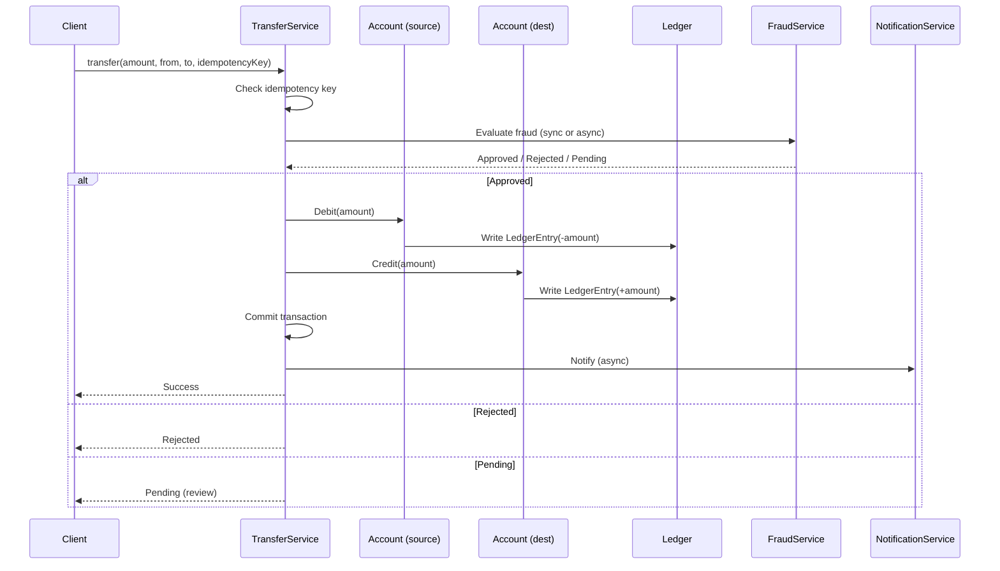

# Banking / Ledger — The Anchor Case Study

> One problem, carried end-to-end through the vault. Every chapter applies its concepts to this same system. Read this once; you will be sent back here repeatedly.

## Why a single anchor

Software concepts are easiest to learn when the example stays constant. If every chapter introduces a new domain, half your attention goes to learning the domain; only the other half goes to the concept being taught. By keeping the domain fixed, the *delta* of each chapter becomes the only new thing.

The banking domain is chosen for three reasons:

1. **It exercises every layer.** Banking has rich domain rules (object model), persistent state (data model), strict invariants (constraints), heavy concurrency (transfers between accounts), correctness requirements (ACID, no lost updates), and scale requirements (millions of accounts, billions of transactions).
2. **It is familiar.** You already know what a bank account is. You do not need a glossary to start.
3. **It is unforgiving.** A bug in a banking system costs real money and triggers regulatory consequences. The trade-offs are sharp because the cost of being wrong is high.

## The system we are building

A simplified but realistic retail banking system with these capabilities:

- **Customer onboarding** — register, KYC verification, open first account.
- **Account management** — open, freeze, close accounts; checking and savings types.
- **Deposits and withdrawals** — money in and out of an account.
- **Transfers** — move money between two accounts (internal or external).
- **Ledger** — every monetary movement recorded as an immutable ledger entry.
- **Statements** — periodic statements of account activity.
- **Interest** — daily interest accrual on savings accounts.
- **Overdraft** — checking accounts may have an overdraft limit.
- **Fraud detection** — flag suspicious transfers for review.
- **Notifications** — email/SMS for significant events.

What we will *not* model in full:

- Multi-currency (we use a single currency, but discuss the modeling)
- Loans, mortgages, credit cards (out of scope)
- Regulatory reporting (out of scope, but the schema would extend)
- Real-time payment networks (mentioned in distributed systems)

## The core domain rules

These invariants must hold at every layer:

1. **Balance invariant**: `account.balance == SUM(ledger_entries.amount) WHERE account_id = account.id`. The balance is the sum of all ledger entries for that account. It is denormalized for read speed but must always equal the sum.
2. **No negative balances (savings)**: a savings account balance cannot go below zero. A checking account can go below zero, down to `-overdraft_limit`.
3. **Double-entry**: every transfer produces two ledger entries — one debit, one credit — that sum to zero. The books always balance.
4. **Immutability of ledger entries**: once written, a ledger entry is never modified or deleted. Corrections are made by *compensating entries*, not by edits.
5. **Atomic transfers**: a transfer either completely succeeds (both sides updated, both ledger entries written, balances updated) or completely fails (no partial state).
6. **Auditability**: every state change has an audit trail — who, when, what, why.
7. **Idempotency of transfers**: a transfer request with the same idempotency key produces the same result, even if retried.
8. **Closed accounts cannot transact**: once an account is `CLOSED`, no deposits, withdrawals, or transfers are allowed.
9. **Frozen accounts cannot withdraw**: a `FROZEN` account can receive deposits but cannot send.
10. **Concurrent transfers are safe**: two transfers out of the same account at the same time must not produce an inconsistent balance.

These ten rules will be enforced in multiple places — class invariants in code, schema constraints in the database, and transactional boundaries at the application layer. The redundancies are deliberate: each layer catches different failure modes.

## The entities we will discover

As we walk through requirements → use cases → domain model, we will discover:

- **Customer** — a person or organization that owns accounts.
- **Account** — a financial container owned by a customer; has a balance and a lifecycle.
- **CheckingAccount / SavingsAccount** — specializations of Account with different rules.
- **LedgerEntry** — an immutable record of a single monetary movement.
- **Transfer** — a request to move money between two accounts; produces two ledger entries.
- **Statement** — a periodic summary of an account's activity.
- **InterestPolicy** — a strategy for computing interest on an account.
- **Notification** — a message to be sent to a customer.
- **FraudRule** — a strategy for flagging suspicious activity.

Each of these will be developed in detail in later chapters. The point of listing them now is to give you a map: you will see how each one is *discovered* (Requirements chapter), *responsibility-assigned* (Domain Modeling), *coded* (OOP), *visualized* (UML), *structured* (LLD), *persisted* (Schema), *constrained* (Constraints), *queried* (SQL), *optimized* (Indexes), *concurrency-controlled* (Transactions), and *scaled* (Distributed).

## The lifecycle of a transfer

The single most important flow in the system. We will return to it in every chapter.

Every layer of the vault is exercised by this flow:

- **Object model**: which classes collaborate?
- **UML**: how do we draw this?
- **LLD**: where are the boundaries, what is sync vs async?
- **Schema**: what tables are touched, what foreign keys, what constraints?
- **SQL**: what queries implement this?
- **Indexes**: which indexes make these queries fast?
- **Transactions**: what isolation level do we need? What locks?
- **Concurrency**: what if two transfers happen on the same account simultaneously?
- **Recovery**: what if the DB crashes after debit but before credit?
- **Distributed**: what if fraud service is in a different region?

If you can answer all of these for the transfer flow, you have mastered the vault.

## How this case study is used

Every chapter has a section titled **"Banking application"** that advances the case study by one step. The pattern:

1. Recall the relevant invariant or entity from this file.
2. Apply the chapter's concept to it.
3. Show concrete code, schema, SQL, or plan.
4. Note the trade-off being made.
5. Forward-link to the next chapter that will build on this.

By the end of the vault, you will have a complete, layered, working design for the banking system — and every concept will have been learned in the context of a real problem.

## The one rule for using this anchor

When a later chapter says "the Banking system" or "the transfer flow," come back here. The invariants and entities listed above are the contract every chapter respects. If a chapter appears to violate one of them, it is either:

- Introducing a deliberate trade-off (which will be called out as such), or
- An error.

## Where this goes next

- [[01-Requirements]] — we start the chain by writing requirements for this system.
- [[02-Use-Cases]] — we enumerate the use cases.
- [[03-Domain-Concepts]] — we discover the nouns and verbs.
- … and so on through every chapter.
