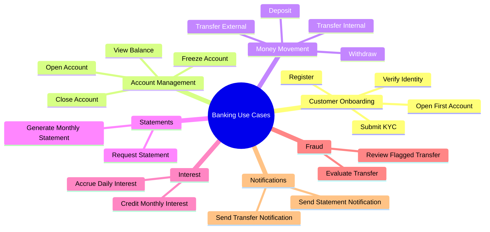

# Use Cases — Structuring Behavior

> Use cases organize behavior into named interactions between actors and the system. They are the bridge between requirements (what) and design (how).

## What you already know

From [[01-Requirements]]: requirements tell us what must be true. Use cases tell us *what interactions must be possible*. They are a structuring of the functional requirements into scenarios that a user can actually perform.

From [[04-Abstraction-and-Models]]: a use case is an abstraction. It hides implementation (which classes, which database, which UI) and preserves the *sequence of intentions* between actor and system.

## Why this layer exists

Functional requirements are a flat list: "customer can transfer money," "customer can open an account." A flat list does not tell us:

- What triggers each behavior?
- What preconditions must hold?
- What can go wrong, and what is the recovery?
- What are the variants of the same behavior?

Use cases exist to answer these questions. They turn a flat list into *structured scenarios* that we can design against, test against, and reason about.

## What is genuinely new here

- The notion of an **actor** — anything that interacts with the system (a user, another system, a timer).
- The notion of a **scenario** — a sequence of steps that achieves a goal.
- The notion of **main success scenario** vs **extensions** — what usually happens vs what can go wrong.

These three concepts generate every later design artifact: classes are derived from the nouns in scenarios; methods are derived from the verbs; exceptions are derived from the extensions.

## The structure of a use case

A well-written use case has these parts (Cockburn's template):

```text
Use Case: Transfer Money
Actor: Customer
Trigger: Customer selects "Transfer" in the UI
Preconditions:
  - Customer is authenticated
  - Source account is ACTIVE
Main Success Scenario:
  1. Customer specifies source account, destination account, amount
  2. System validates that source account has sufficient balance
  3. System validates that destination account can receive funds
  4. System creates a Transfer with status PENDING
  5. System debits source account
  6. System credits destination account
  7. System records two ledger entries
  8. System marks Transfer as COMPLETED
  9. System confirms transfer to customer
Extensions:
  2a. Insufficient balance: System rejects with reason
  3a. Destination account is CLOSED: System rejects
  5a. Fraud check flags transfer: System marks Transfer as FRAUD_REVIEW
  5b. Idempotency key matches existing transfer: System returns prior result
  8a. Database commit fails: System rolls back; no state change visible
Postconditions:
  - On success: balance invariant holds; ledger has two new entries; audit log updated
  - On failure: no state change; no ledger entries; audit log records attempt
```

Each numbered step in the main scenario is a *responsibility waiting to be assigned* (see [[04-Responsibilities]]). Each extension is an *exception path waiting to be designed* (see [[00-LLD-Method]]).

## Use case levels — sea level, fish, kite

Cockburn distinguishes levels of use cases by their scope:

- **Sea level** (user goal): what the user is trying to accomplish. "Transfer money."
- **Fish level** (subfunction): a step within a user goal. "Validate sufficient balance."
- **Kite level** (summary): a higher-level goal that spans multiple user goals. "Manage finances."

Sea-level use cases are the design targets. Fish-level use cases are extracted when a step is complex enough to deserve its own design. Kite-level use cases are for context; they rarely drive design directly.

The mistake: designing at kite level ("we need a financial management system") or at fish level ("we need a balance validator") without anchoring to a sea-level use case. The sea-level use case is what ties the design to a real user goal.

## Banking application — the use case catalog



Each leaf is a sea-level use case. Most have the same structure: trigger, preconditions, main scenario, extensions, postconditions.

## The transfer use case — full treatment

This is the use case we will return to in every chapter.

```text
Use Case: Transfer Money
Actor: Customer (initiator), FraudService (participant), NotificationService (participant)
Trigger: Customer submits a transfer request via API
Preconditions:
  - Customer is authenticated
  - Source account exists, is ACTIVE, and is owned by the customer
  - Destination account exists and can receive funds
  - Amount is positive, ≤ per-transfer limit, ≤ daily limit
  - Idempotency key provided

Main Success Scenario:
  1. System checks idempotency key; if seen, return prior result
  2. System loads source and destination accounts
  3. System checks source account status is ACTIVE
  4. System checks source account has sufficient balance (incl. overdraft for checking)
  5. System asks FraudService to evaluate the transfer
  6. FraudService returns APPROVED
  7. System opens a transaction
  8. System debits source account (decreases balance, writes ledger entry)
  9. System credits destination account (increases balance, writes ledger entry)
  10. System writes Transfer record with status COMPLETED
  11. System commits transaction
  12. System asynchronously sends a notification
  13. System returns success to customer

Extensions:
  1a. Idempotency key matches a COMPLETED transfer: return prior result
  1b. Idempotency key matches a PENDING transfer: return "still processing"
  3a. Source account is FROZEN: reject with "account frozen"
  3b. Source account is CLOSED: reject with "account closed"
  4a. Insufficient balance: reject with "insufficient funds"
  5a. FraudService returns REJECTED: reject with "transfer rejected"
  5b. FraudService returns REVIEW: mark Transfer as FRAUD_REVIEW; return "pending review"
  5c. FraudService times out: mark Transfer as FRAUD_PENDING; return "pending"
  8a. Concurrent debit reduces balance below limit: retry with serializable isolation
  11a. Commit fails (DB crash): rollback; nothing visible; return "service unavailable"

Postconditions:
  - On success: balance invariant holds; two ledger entries written;
    Transfer record COMPLETED; audit log updated; notification queued
  - On failure: no state change; audit log records the attempt and reason
```

This is the contract. Every later chapter designs a piece of this:

- [[01-Objects-And-Classes]]: which classes model the nouns?
- [[01-Object-Collaboration]]: what messages pass between them?
- [[02-Sequence-Diagrams]]: how do we draw this?
- [[00-LLD-Method]]: what are the design forces?
- [[00-ACID]]: what does step 11 actually guarantee?
- [[02-Isolation-Levels]]: what does step 8a actually need?
- [[04-Enterprise-Patterns]]: how do Repository and Unit of Work structure this?

## What can go wrong

- **Use cases that are too implementation-specific** — "the system queries the database" is not a use case; it is an implementation.
- **Use cases that are too vague** — "the customer manages their account" tells you nothing.
- **Missing extensions** — the main scenario is easy; the extensions are where bugs live. If your use case has no extensions, you have not thought hard enough about failure.
- **No postconditions** — without postconditions, you cannot test.
- **Treating use cases as requirements** — they are not. They are a structuring of requirements. The requirements are the source of truth; the use cases are a view.

## Trade-offs

- **How detailed?** Detailed use cases catch more bugs upfront but take longer to write. The right amount: detailed for the riskiest use cases (transfer, withdrawal); lighter for routine ones (view balance).
- **When to write them?** Before design, not after. If you write them after, they describe what you built, not what you should have built.
- **Formal vs narrative?** Formal templates (Cockburn) are more rigorous; narratives are more readable. Use formal for critical use cases; narrative for routine ones.

## Forward links

- [[03-Domain-Concepts]] — extract the nouns and verbs from these scenarios.
- [[04-Responsibilities]] — assign each step to a responsibility.
- [[02-Sequence-Diagrams]] — visualize the scenarios as message sequences.
- [[06-Banking-LLD]] — the design that emerges from these use cases.
