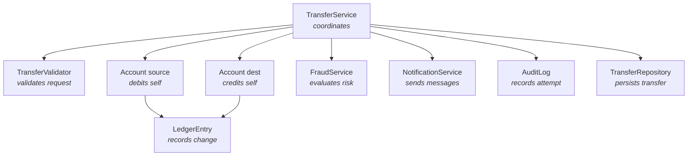

# Responsibilities — Who Does What

> Responsibilities are the bridge between domain concepts (nouns and verbs) and objects (the things that will own those verbs). The technique is responsibility-driven design, often via CRC cards.

## What you already know

From [[03-Domain-Concepts]]: we have a list of nouns (entities) and verbs (actions). From [[06-Coupling-and-Cohesion]]: a module should be cohesive — it should own one invariant. Responsibilities are how we decide *which* module owns *which* invariant.

## Why this layer exists

A common failure mode: a developer writes a `BankingService` class with methods `openAccount`, `transferMoney`, `computeInterest`, `sendNotification`, `generateStatement`, and `detectFraud`. This is a **God Object** — it does everything. It is not cohesive; every change touches it; every test requires it.

Responsibility-driven design exists to prevent this. Before writing code, we ask: *who is responsible for what?* The answer determines the class structure.

## What is genuinely new here

- The notion of **responsibility** as a design unit, separate from "method" or "class."
- The technique of **CRC cards** — Class, Responsibility, Collaborator — as a low-tech way to assign responsibilities before committing to code.

These are not deep concepts. They are disciplines. The novelty is in *doing them before coding*, not after.

## Three kinds of responsibility

Wirfs-Brock and McKean distinguish:

1. **Doing responsibility** — an object does something (compute, initiate action, control).
2. **Knowing responsibility** — an object knows something (its own state, related objects, things it can derive).
3. **Deciding responsibility** — an object makes a choice (approve/reject, route, select strategy).

Most objects have a mix. The mistake is to give one object too many deciding responsibilities — that is the God Object pattern.

## Banking — assigning responsibilities

Take the transfer use case. The responsibilities are:

| Responsibility | Natural owner | Why |
|---|---|---|
| Know the source account's balance | `Account` | It owns the balance invariant |
| Know the source account's status | `Account` | It owns its lifecycle |
| Debit the source account | `Account` | It owns the balance mutation |
| Credit the destination account | `Account` (dest) | Same |
| Validate the transfer request | `TransferRequestValidator` | Pure logic, testable |
| Persist the transfer record | `TransferRepository` | Infrastructure concern |
| Evaluate fraud | `FraudService` | Separate bounded context |
| Send notification | `NotificationService` | Separate concern |
| Coordinate the transaction | `TransferService` | Orchestrates the collaborators |
| Maintain the audit trail | `AuditLog` | Cross-cutting |

Notice the principle: **the responsibility goes to the object that has the information to fulfill it**. `Account` debits itself because it knows its own balance and rules. `TransferService` does not debit; it asks `Account` to debit. This is "Tell, Don't Ask" (see [[04-Tell-Dont-Ask]]).

## CRC cards

A CRC card is a 4x6 index card with three sections:

```text
┌─────────────────────────────────────┐
│ Class: Account                      │
├─────────────────────────────────────┤
│ Responsibilities:                   │
│  - Know my balance                  │
│  - Know my status                   │
│  - Debit myself (with rules)        │
│  - Credit myself (with rules)       │
│  - Enforce balance invariant        │
├─────────────────────────────────────┤
│ Collaborators:                      │
│  - LedgerEntry (records changes)    │
│  - AccountStatus (enum)             │
│  - OverdraftPolicy (for checking)   │
└─────────────────────────────────────┘
```

The card is intentionally small. If you cannot fit the responsibilities on the card, the class is doing too much.

The technique:

1. Write one card per candidate class.
2. Walk through each use case, pointing at cards and saying "this card does X, then asks that card to do Y."
3. When a card accumulates too many responsibilities, split it.
4. When a responsibility has no obvious owner, create a new card.
5. Iterate until every use case plays through cleanly.

CRC cards are not deliverables. They are thinking tools. They are disposable. Their value is in the conversations they force, not in the cards themselves.

## Information holder — the responsibility that becomes a class

A common pattern: a responsibility is "know X." The natural owner of that responsibility is an object whose *purpose* is to know X. This is the **Information Holder** pattern.

Examples in banking:

- `Account` holds balance and status.
- `Customer` holds name, contact info, KYC status.
- `LedgerEntry` holds amount, timestamp, account reference.
- `ExchangeRateTable` holds current rates (if multi-currency).

Information holders are the most common kind of class. They are usually the entities in the domain model. Their responsibilities are mostly "knowing" with a few "doing" (e.g., `Account.debit()` both does and knows).

## Service — the responsibility that crosses objects

Some responsibilities do not belong to any single entity. They coordinate multiple entities, or they wrap an external system.

- `TransferService` coordinates `Account`, `LedgerEntry`, `FraudService`.
- `NotificationService` wraps email/SMS providers.
- `InterestAccrualService` runs daily across all savings accounts.

These are **Services** in DDD terms (see [[00-Domain-Modeling]]). They have no state of their own; they orchestrate stateful objects.

The mistake: making Services do everything. A `BankingService` that does transfers, statements, interest, and fraud is a God Object. Split it: `TransferService`, `StatementService`, `InterestService`, `FraudService`. Each has one responsibility.

## Banking — the responsibility map



Each box has one responsibility. Arrows are collaborations. The picture is small enough to fit on one page — that is the test.

## Responsibility and invariant — the deep connection

A responsibility is "do X." An invariant is "X must always be true." The two are paired:

- `Account` has the invariant "balance == sum(ledger_entries)."
- `Account` has the responsibility "enforce this invariant."
- The responsibility and the invariant live in the same class — by design.

This is why cohesion matters: an invariant and its enforcement must live together. If `Account` owns the invariant but `TransferService` enforces it, you have split what should be one thing. The next time someone changes the enforcement, they will forget the invariant.

The rule:

> **Whoever owns the invariant owns the responsibility for enforcing it.**

This rule generates the entire structure of the banking system:

- `Account` owns the balance invariant → `Account.debit()` and `Account.credit()` enforce it.
- `Transfer` owns the "produces two ledger entries" invariant → `Transfer.execute()` enforces it.
- `LedgerEntry` owns the "immutable" invariant → no setters, only constructor.
- `Account` owns the "lifecycle transitions are valid" invariant → `Account.freeze()` checks the current status before transitioning.

## What can go wrong

- **God Object** — one class accumulates many unrelated responsibilities. Split.
- **Anemic domain model** — entities have no behavior; services do everything. Move behavior to the entity that owns the invariant.
- **Feature envy** — a method on class A is interested only in class B's data. Move the method to B.
- **Shotgun surgery** — one responsibility is spread across many classes. Move them together.
- **Responsibility with no owner** — a use case step that nobody's class is responsible for. Create a class or assign to an existing one.

## Trade-offs

- **Rich vs anemic** — rich models put behavior in entities; anemic models put behavior in services. Rich models are more cohesive but harder to test in isolation. Anemic models are easier to test but less expressive. Banking usually picks rich for entities with strong invariants (Account, LedgerEntry) and services for cross-cutting orchestration (TransferService).
- **Service granularity** — fine-grained services (one per use case) are clean but verbose. Coarse-grained services (one per bounded context) are convenient but tend to bloat. Aim for one service per cohesive responsibility cluster.
- **Where to put validation** — close to the data (entity validates itself) or in a separate validator (separation of concerns). Banking uses both: entity validates invariants; validator validates request shape.

## Forward links

- [[01-Objects-And-Classes]] — turn these responsibility assignments into actual classes.
- [[02-Aggregates]] — a cluster of objects that share an invariant; one of them is the root.
- [[05-Anemic-vs-Rich-Models]] — the trade-off in depth.
- [[00-LLD-Method]] — the design method that uses responsibility assignments as input.
