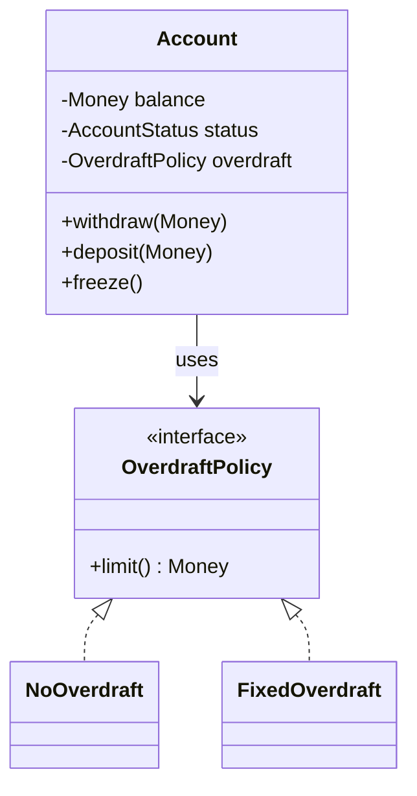

# OOP Foundations — A Paradigm for Bounded State

> Object-Oriented Programming is not a religion. It is one of several modeling paradigms, and it has a specific job: keep mutable state, the rules that govern it, and the operations that change it in the *same* place. This chapter reframes the "four pillars" not as definitions to memorize but as solutions to dependency and coupling problems you already understand.

## What you already know

From [[03-Dependency-As-Root-Concept]]: every layer has dependencies, and our job is to *reduce* or *invert* them. From [[04-Abstraction-and-Models]]: an abstraction hides detail for a purpose, and the purpose is to make change cheaper. From [[06-Coupling-and-Cohesion]]: high cohesion means a module owns *one* invariant and everything inside exists to protect it. From [[04-Responsibilities]]: responsibilities become classes, and the class that owns an invariant should also own the operations that mutate it.

Those four facts are the foundation OOP sits on. Nothing OOP introduces is separate from them.

## Why this layer exists

Consider what a program *is* at the bottom: state, transformations on that state, and rules that say which transformations are legal. A purely procedural program scatters these. The state lives in a struct or a global; the transformations live in functions; the rules live in `if` statements buried inside the functions. When the rules change — and they always change — you have to find every function that touches the state and update it. That is the dependency problem in its rawest form.

OOP exists to *localize* that dependency. It says: take a piece of state, the rules that govern it, and the operations that mutate it, and bind them together behind an interface. Callers depend on the interface. The state, the rules, and the operations all live in one place. When the rules change, you change one class. The ripple stops at the class boundary.

That is the *entire* purpose of OOP. Everything else is technique.

## What is genuinely new here

The claim that OOP is fundamentally about *bundling state with the rules that govern its mutation* — not about "modeling the real world," not about "objects sending messages" (though that is the mechanism), not about "data + functions." The real win is locality of change.

The four pillars — encapsulation, inheritance, polymorphism, abstraction — are not four ideas. They are four techniques for managing dependency:

| Pillar | The dependency problem it solves | Where it is detailed |
|---|---|---|
| Encapsulation | Callers depend on internals → change ripples | [[02-Encapsulation]] |
| Inheritance | Reuse without copy-paste, but tightly bound | [[03-Inheritance]] |
| Polymorphism | Caller depends on a concrete type → cannot substitute | [[04-Polymorphism]] |
| Abstraction | Depend on shape, not implementation | [[06-Abstract-Classes-And-Interfaces]] |

## Concepts

- **Object** — a unit that bundles identity, state, and behavior (see [[01-Objects-And-Classes]]).
- **Class** — a template describing the shape and behavior of objects of one type.
- **Encapsulation** — hiding internal state behind methods so callers cannot break invariants directly.
- **Inheritance** — declaring that one class is a specialization of another, reusing its implementation.
- **Polymorphism** — the ability to treat objects of different concrete types uniformly through a shared contract.
- **Abstraction** — exposing only what callers need, hiding everything else behind an interface or abstract class.
- **Invariant** — a property that always holds for an object's state, enforced by the class itself.

These are named *after* the problem they solve, not before. If you forget the definitions, just remember: each pillar is a way to keep change from rippling.

## Banking application

The Banking case study ([[00-Banking-Case-Study]]) gives us the perfect lens. An `Account` has state (`balance`, `status`, `overdraftLimit`), rules (`balance == sum(ledgerEntries)`, `status != CLOSED` to transact, `balance >= -overdraftLimit`), and operations (`deposit`, `withdraw`, `freeze`, `close`).

If we wrote this procedurally, the balance field would live in some `AccountRow` struct, the withdrawal function would live in a `BankingService`, and the rule "balance >= -overdraftLimit" would be checked inside `BankingService.withdraw()`. Every new rule — say, "withdrawals over 10,000 require a second factor" — would mean editing `BankingService`. Every team that touched transfers, statements, or interest would also be touching the same `BankingService`. This is the God Object anti-pattern (see [[05-Anti-Patterns]]).

OOP says: the rule about the balance belongs *with the balance*. Put the balance, the rule, and the operations in one class called `Account`. Callers (like `TransferService`) ask `Account` to do things; they do not reach into its balance directly. Now when the rule changes, only `Account` changes.

```java
public final class Account {
    private final AccountId id;
    private BigDecimal balance;
    private AccountStatus status;
    private final OverdraftPolicy overdraft;

    public void withdraw(Money amount) {
        if (status != AccountStatus.ACTIVE) {
            throw new AccountNotActiveException(id);
        }
        Money newBalance = balance.subtract(amount);
        if (newBalance.amount().compareTo(overdraft.limit().negated()) < 0) {
            throw new InsufficientFundsException(id, amount);
        }
        this.balance = newBalance;
        // Ledger entry written elsewhere via a domain event
    }
}
```

`TransferService` calls `source.withdraw(amount)` and `dest.deposit(amount)`. It does not know *how* withdrawal is validated. It does not know the overdraft limit. It does not know the lifecycle state. The dependency surface between `TransferService` and `Account` is two methods. Everything else is encapsulated.

## Code

A minimal OOP sketch of the Account and its collaborators:

```java
public final class Money {
    private final BigDecimal amount;
    private final Currency currency;
    public Money(BigDecimal amount, Currency currency) {
        this.amount = Objects.requireNonNull(amount);
        this.currency = Objects.requireNonNull(currency);
    }
    public Money add(Money other) {
        ensureSameCurrency(other);
        return new Money(this.amount.add(other.amount), currency);
    }
    public Money subtract(Money other) {
        ensureSameCurrency(other);
        return new Money(this.amount.subtract(other.amount), currency);
    }
    public BigDecimal amount() { return amount; }
    private void ensureSameCurrency(Money other) {
        if (!currency.equals(other.currency)) {
            throw new IllegalArgumentException("Currency mismatch");
        }
    }
}

public enum AccountStatus { PENDING, ACTIVE, FROZEN, CLOSED }

public interface OverdraftPolicy {
    Money limit();
}

public final class NoOverdraft implements OverdraftPolicy {
    public Money limit() { return Money.ZERO; }
}

public final class FixedOverdraft implements OverdraftPolicy {
    private final Money limit;
    public FixedOverdraft(Money limit) { this.limit = limit; }
    public Money limit() { return limit; }
}
```

Notice three things about that sketch. `Money` is a value object: immutable, no identity, compared by value. `AccountStatus` is a closed set of lifecycle states (see [[05-Identity-State-Lifecycle]]). `OverdraftPolicy` is an interface — a polymorphic seam we will exploit in [[04-Polymorphism]] and again in [[05-Composition-Over-Inheritance]].



The diagram shows composition (`Account` *has-an* `OverdraftPolicy`) rather than inheritance (`CheckingAccount extends Account`). Why? Because the overdraft limit is a *rule that varies independently of the account type*, and binding it via inheritance would couple two unrelated axes. We will return to this in [[05-Composition-Over-Inheritance]] and [[03-LSP]].

## What can go wrong

1. **OOP as worldview, not tool.** Teams that try to model *everything* as objects end up with `IfStatementObject`, `ForLoopStrategy`, and `IntegerWrapper`. Not every concept is an object. Numbers, strings, and pure transformations are often better as value types or static functions. Use OOP where you have *mutable state with rules*; use functions where you have pure transformation; use data where you have none.
2. **Anemic objects disguised as OOP.** A class with private fields and only getters/setters is not encapsulated — it is a struct with ceremony. The whole point of encapsulation is to *prevent* callers from mutating state directly. If `setBalance()` exists, you have given up the benefit and kept the boilerplate.
3. **Inheritance as the default reuse mechanism.** Reaching for `extends` first leads to deep, fragile hierarchies that are impossible to refactor. The GoF rule (favor composition over inheritance) exists because every GoF author had been bitten by this. See [[07-Composition-vs-Inheritance]].
4. **Treating OOP and FP as enemies.** Modern Java blends them: `Stream`, `Optional`, records, sealed interfaces, pattern matching. The skill is not picking a side; it is knowing which tool fits which problem.

## Trade-offs

- **Locality vs visibility.** Bundling state with behavior means callers cannot see the state. This protects invariants but makes debugging harder when something goes wrong — you cannot just print the field; you have to go through the method. The fix is good `toString` and observability hooks, not breaking encapsulation.
- **Encapsulation vs performance.** A method call per field access is slower than direct field access. In hot loops this matters. The fix is usually to expose batched operations rather than per-field getters, not to make fields public.
- **Flexibility vs simplicity.** Polymorphism and abstraction add power but also indirection. A codebase where every class has an interface, three implementations, and a factory is *technically* clean but practically unreadable. Apply abstraction where the dependency direction actually matters (see [[05-DIP]]).
- **When OOP is the wrong choice.** If your problem is *transforming data* (ETL pipelines, image processing, compilers), functional or data-oriented design is often better. If your problem is *managing stateful entities with rules* (banking, ERP, games, operating systems), OOP is the right default. The Banking case study is firmly in the second camp — which is why we use OOP throughout this vault.

## Forward links

- [[01-Objects-And-Classes]] — the first concrete artifact: what an object is, what a class is, when to introduce a new one.
- [[02-Encapsulation]] — the pillar that protects invariants; the one that matters most for change cost.
- [[03-Inheritance]] — the tightest coupling in OOP, and when it is nonetheless the right answer.
- [[04-Polymorphism]] — dispatch as decoupling; how polymorphism inverts dependencies.
- [[05-Composition-Over-Inheritance]] — the practical rule, with the strategy pattern as its natural expression.
- [[06-Abstract-Classes-And-Interfaces]] — Java 21's modern tools for abstraction.
- [[00-SOLID-as-Dependency-Management]] — SOLID is these four pillars formalized into a discipline.
- [[05-Anemic-vs-Rich-Models]] — the choice between rich objects (behavior inside) and anemic objects (behavior in services).
