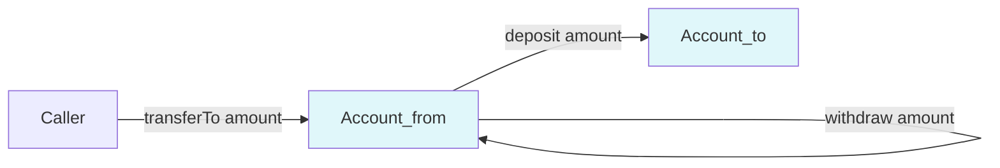

# Encapsulation — Protecting Invariants from Change

> Encapsulation is not about security. It is not even primarily about hiding data. It is about **change cost**: by making an object's state unreachable from outside, you make it possible to change how that state is represented without breaking any caller. This is the single technique in OOP that does the most to keep codebases mutable over time.

## What you already know

From [[00-OOP-Foundations]]: OOP bundles state, rules, and operations. From [[03-Dependency-As-Root-Concept]]: a dependency exists when a change in one place can force a change in another. From [[06-Coupling-and-Cohesion]]: content coupling — one module reaching into another's internals — is the tightest form of coupling. From [[04-Responsibilities]]: whoever owns the invariant owns the responsibility for enforcing it.

Encapsulation is the technique that operationalizes all of these. It is the *mechanism* by which an object owns its invariant.

## Why this layer exists

Suppose `Account` exposes `balance` as a public field. Every caller can read it, and every caller can write it. Now consider what happens when the rule changes: "balances must never go below `-overdraftLimit`."

- `TransferService` writes `from.balance = from.balance.subtract(amount)`. It must now check the overdraft rule.
- `InterestService` writes `account.balance = account.balance.add(interest)`. No overdraft issue, but it must know *when* interest can be applied — only to active savings accounts.
- `StatementService` reads `account.balance` to render the statement. It must know that the balance it reads might be inconsistent mid-transfer.
- `FraudService` reads `account.balance` to detect suspicious patterns. Same problem.

One public field, four services that now each own a piece of the balance invariant. The first time the rule changes, you have to find all four and update them. The second time, you miss one. The third time, you have a bug in production.

Encapsulation exists to make this failure mode impossible. If `balance` is private and only mutated through `deposit` and `withdraw`, the rule lives in *one* place. The four services call methods; they never touch the field. When the rule changes, one class changes.

## What is genuinely new here

Two reframes:

1. **Encapsulation is about change cost, not secrecy.** The state is "hidden" not because it is secret but because exposing it would create a dependency on its representation. Hiding the representation lets you change it. This is Parnas's original argument (1972): modules should hide *design decisions that are likely to change*.
2. **Encapsulation is the boundary of an invariant.** An invariant is only as strong as the narrowest mutation path. If there is one public setter, the invariant is gone. If every mutation goes through a method that enforces the rule, the invariant holds.

## Concepts

- **Information hiding** (Parnas, 1972) — the principle that a module's design decisions that are likely to change should be hidden behind a stable interface. This is the source of the modern notion of encapsulation.
- **Private state** — fields that cannot be read or written from outside the class. In Java: `private`.
- **Public behavior** — methods that constitute the class's contract. In Java: `public`.
- **Invariant** — a property that always holds for an object's state, enforced by the class.
- **Accessor / mutator** — methods that read or write fields. `getX()` / `setX()`. Getters are sometimes acceptable (see below); setters are usually a smell.
- **Tell, Don't Ask** (seed) — the style of calling a method that *does* something rather than asking for state and deciding what to do. See [[04-Tell-Dont-Ask]].
- **Access modifiers** — Java's `private`, package-private (default), `protected`, `public`. They form a ladder of exposure, each step widening the dependency surface.

## Banking application

The Banking case study ([[00-Banking-Case-Study]]) has invariants 1, 2, 8, and 9 that are *state invariants* on `Account`:

1. `balance == SUM(ledger_entries.amount)` — denormalized balance equals the audit trail.
2. Savings balance cannot go negative; checking can go down to `-overdraftLimit`.
8. Closed accounts cannot transact.
9. Frozen accounts cannot withdraw (but can deposit).

These four invariants must hold at every moment observable from outside. The way to make them hold is to make `balance` and `status` unreachable from outside, and route every mutation through methods that check the rules.

```java
public final class Account {
    private final AccountId id;
    private Money balance;
    private AccountStatus status;
    private final OverdraftPolicy overdraft;
    private final List<LedgerEntry> entries = new ArrayList<>();

    public void deposit(Money amount) {
        ensureCanTransact();
        ensurePositive(amount);
        this.balance = balance.add(amount);
        this.entries.add(LedgerEntry.credit(id, amount, Instant.now()));
    }

    public void withdraw(Money amount) {
        ensureCanTransact();
        ensurePositive(amount);
        Money newBalance = balance.subtract(amount);
        if (overdraft.allows(newBalance)) {
            throw new InsufficientFundsException(id, amount);
        }
        this.balance = newBalance;
        this.entries.add(LedgerEntry.debit(id, amount, Instant.now()));
    }

    public void freeze() {
        if (status != AccountStatus.ACTIVE) {
            throw new IllegalStateException("Cannot freeze from " + status);
        }
        this.status = AccountStatus.FROZEN;
    }

    public void close() {
        if (status == AccountStatus.CLOSED) return;
        if (balance.amount().compareTo(BigDecimal.ZERO) != 0) {
            throw new AccountHasBalanceException(id);
        }
        this.status = AccountStatus.CLOSED;
    }

    public Money balance() { return balance; }
    public AccountStatus status() { return status; }
    public List<LedgerEntry> entries() { return List.copyOf(entries); }

    private void ensureCanTransact() {
        if (status == AccountStatus.CLOSED) {
            throw new AccountClosedException(id);
        }
        if (status == AccountStatus.FROZEN) {
            // deposit is allowed in frozen state; withdraw is not.
            // This is called from both deposit and withdraw — the caller's
            // intent is enforced separately. See the more refined version below.
        }
        if (status != AccountStatus.ACTIVE && status != AccountStatus.FROZEN) {
            throw new AccountNotActiveException(id);
        }
    }
    private void ensurePositive(Money amount) {
        if (amount.amount().signum() <= 0) {
            throw new IllegalArgumentException("Amount must be positive");
        }
    }
}
```

A few details matter:

- `balance` and `status` are `private`. No caller can mutate them directly. No caller can even read them in a way that exposes the underlying `BigDecimal` or allows mutation — `balance()` returns the `Money` value object, which is itself immutable.
- The `entries` list is exposed only as `List.copyOf(entries)` — an unmodifiable snapshot. Callers cannot add or remove ledger entries from outside.
- The four invariants are enforced *at the moment of mutation*. There is no path from outside that bypasses the checks.
- `freeze()`, `close()`, `deposit()`, `withdraw()` are all *commands* — they do something, they do not return the new state. This is the seed of Tell, Don't Ask ([[04-Tell-Dont-Ask]]).

### Java access modifiers — the ladder

Java gives you four levels of exposure. Each step widens the dependency surface:

| Modifier | Visible to | Use when |
|---|---|---|
| `private` | the same class only | state and helpers that exist only to enforce invariants |
| package-private (default) | the same package | internal collaborators that should not leak across package boundaries |
| `protected` | subclasses + package | extension points for legitimate subclassing (rarely — see [[03-Inheritance]]) |
| `public` | everyone | the class's contract — the surface callers depend on |

The rule: start at `private` and widen only when you have a reason. Every widening is a dependency you are creating. Every public method is a method you have promised not to break.

A common mistake is to expose fields via getters "just in case." Each getter widens the surface. If callers come to depend on `account.getBalance()`, you can never change how balance is stored. You can never cache it differently, never switch to a derived computation, never make it lazy. The getter has frozen your representation.

The counter-argument: callers do need to read state sometimes (the balance, for a statement). The fix is to expose *only what callers actually need*, and to expose it through value types (`Money`, not `BigDecimal`) so callers cannot mutate it. A read-only accessor on an immutable return type is fine; a setter on a mutable field is the smell.

## Code

A deliberately wrong version, then the fix:

```java
// WRONG — exposes balance, scatters the invariant
public class Account {
    public BigDecimal balance;
    public String status;
}

// Caller code:
Account from = ...;
Account to = ...;
BigDecimal amount = new BigDecimal("100");
if (from.balance.compareTo(amount) >= 0) {     // rule checked in caller
    from.balance = from.balance.subtract(amount); // rule enforced in caller
    to.balance = to.balance.add(amount);          // rule enforced in caller
}
```

Every caller of `Account` now has to know the rule. If the rule changes — say, savings accounts cannot overdraft but checking can — every caller has to be updated. The right version:

```java
// RIGHT — encapsulates the invariant
public final class Account {
    private Money balance;
    private AccountStatus status;
    private final OverdraftPolicy overdraft;

    public void transferTo(Account dest, Money amount) {
        this.withdraw(amount);   // throws if rule violated
        dest.deposit(amount);    // throws if rule violated
    }
}

// Caller code:
Account from = ...;
Account to = ...;
from.transferTo(to, Money.of(100));   // rule enforced inside Account
```

The caller no longer knows the rule exists. The caller cannot accidentally violate the rule. When the rule changes, one class changes.



The arrows never touch the balance field directly. Every path goes through a method. That is what encapsulation looks like.

## What can go wrong

1. **Getters and setters masquerading as encapsulation.** A class with private fields and public getters/setters for every field is *not* encapsulated — it is a struct with ceremony. The invariant is unprotected; any caller can `setBalance(-1000)`. Cure: remove the setter; route mutations through methods that check the rules. If you must expose a field for reading, return it as an immutable value type, not the raw mutable type.
2. **Leaking internal collections.** Returning the internal `List<LedgerEntry>` directly lets callers mutate it. Cure: return `Collections.unmodifiableList(entries)` (Java) or `List.copyOf(entries)` (Java 10+) for a snapshot, or stream over the entries without exposing the list at all.
3. **Leaking `this` references.** Passing `this` to a callback or storing `this` in a static field exposes the object before its constructor has finished — the invariants may not yet hold. Cure: never pass `this` from a constructor; use factory methods if you need to publish a reference at creation time.
4. **Over-encapsulation.** Hiding everything behind a single `execute(Command)` method makes the API impossible to discover. Encapsulation should expose *what callers need*, not nothing. The test is: can a new caller use this class without reading its source? If yes, the encapsulation is right.
5. **Encapsulation across threads is not free.** Private fields are still visible to other threads unless access is properly synchronized. Encapsulation is a *compile-time* boundary, not a *memory* boundary. See [[00-ACID]] and [[01-Concurrency-Anomalies]] for the runtime story.

## Trade-offs

- **Encapsulation vs testability.** If a field is private, tests cannot assert on it directly. The cure is to test through the public API (which is what tests should do anyway), or to extract the tricky logic into a separate testable class. Do not break encapsulation for testability; it is a false economy.
- **Encapsulation vs performance.** Each method call is a small cost; each encapsulated collection that is copied is a larger one. For hot paths, expose batched operations rather than per-field accessors, or use immutable persistent collections. Do not make fields public to save nanoseconds.
- **Encapsulation vs framework integration.** Some frameworks (JPA, Jackson) require field or accessor access. This is a real tension. The cure is to scope the exposure — package-private accessors for the framework, public methods for callers — or to use a separate persistence DTO. See [[06-Hibernate-JPA]].
- **Strict invariants vs eventual consistency.** Strict encapsulation enforces invariants synchronously at the moment of mutation. Some invariants (e.g., "the sum of all transfers in a day does not exceed X") cannot be enforced synchronously without global locks. Those invariants live at a different layer (saga, transactional outbox) — see [[04-Domain-Events]] and [[07-Distributed-Transactions]].

## Forward links

- [[04-Tell-Dont-Ask]] — the calling style that respects encapsulation.
- [[03-Law-of-Demeter]] — encapsulation extended across object graphs: do not reach through friends.
- [[00-SOLID-as-Dependency-Management]] — encapsulation is what makes the Open/Closed Principle possible.
- [[05-Anemic-vs-Rich-Models]] — the cost of giving up encapsulation by moving behavior to services.
- [[03-Triggers-As-Constraints]] — the same idea (invariant as boundary) at the database layer.
