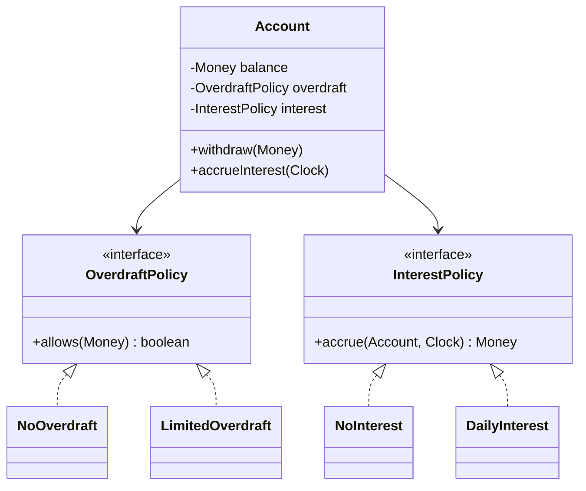

# Inheritance — Reuse and Its Tightest Coupling

> Inheritance is the most powerful reuse mechanism in OOP — and the most dangerous. It is a *permanent, compile-time, single-dimensional* commitment that binds a child class to every implementation detail of its parent. This chapter explains what subclassing actually does, why it is the tightest form of coupling (per [[06-Coupling-and-Cohesion]]), and when "is-a" is real enough to justify the cost.

## What you already know

From [[00-OOP-Foundations]]: OOP bundles state, rules, and operations. From [[03-Dependency-As-Root-Concept]]: dependencies should point toward stability. From [[06-Coupling-and-Cohesion]]: inheritance is the tightest form of coupling between classes — the child depends on every `protected` method and field of the parent. From [[07-Composition-vs-Inheritance]]: the GoF rule is "favor object composition over class inheritance" — *favor*, not "always use."

This chapter explains the mechanism: what `extends` actually does in Java, what coupling it creates, and how to recognize a fake "is-a" before you commit to it.

## Why this layer exists

Two forces pull you toward inheritance:

1. **Reuse.** You have written `Account` with `deposit`, `withdraw`, `freeze`, `close`. Now you need a `SavingsAccount` that does the same things plus `accrueInterest()`. Copy-paste is wrong. Composition means writing delegation code. Inheritance promises the reuse for free — `class SavingsAccount extends Account` and you are done.
2. **Substitutability.** You want code that handles "any kind of account" uniformly. A list of `Account` objects can hold checking, savings, and joint accounts if they all inherit from `Account`. The promise is: write the code once, it works for all subtypes.

Both promises are real. Both come with a tax. Inheritance's tax is that the child class is *permanently* bound to the parent's implementation. The parent's `protected` methods become the child's extension points — and you cannot predict today which methods the child will want to override tomorrow.

## What is genuinely new here

Two things:

1. **`extends` does two things at once, and they should be evaluated separately.** It (a) reuses implementation (the child gets the parent's fields and methods) and (b) declares a subtype relationship (the child is assignable to the parent type). These are *different* commitments. Most inheritance mistakes conflate them.
2. **"Is-a" is a statement about substitutability, not about the world.** A `SavingsAccount extends Account` is correct only if every piece of code that works on an `Account` also works correctly on a `SavingsAccount`. If there is any method on `Account` that does the wrong thing for `SavingsAccount` — even by throwing an `UnsupportedOperationException` — the "is-a" is fake. This is the Liskov Substitution Principle, formalized in [[03-LSP]].

## Concepts

- **Subclass** — a class declared with `extends Parent`. It inherits the parent's fields and methods.
- **Superclass / parent** — the class being extended.
- **Override** — a subclass redefining a method inherited from the parent.
- **`super`** — a reference from the subclass to the parent's implementation, used to call the original method.
- **`protected`** — access modifier visible to subclasses (and the same package). The *extension surface* of a class.
- **Subtype polymorphism** — the ability to treat a subclass instance as if it were the parent type. See [[04-Polymorphism]].
- **`final` class** — a class that cannot be subclassed. A way to opt out of inheritance entirely.
- **`sealed` class** — Java 17+: a class that permits subclassing only by a listed set of classes. A middle ground between `final` and open. See [[06-Abstract-Classes-And-Interfaces]].
- **Liskov Substitution Principle (LSP)** — the rule that a subclass must be substitutable for its parent. The test that determines whether "is-a" is real.

## Banking application

The Banking case study ([[00-Banking-Case-Study]]) introduces `CheckingAccount` and `SavingsAccount` as specializations of `Account`. The naive temptation is:

```java
// NAIVE — looks right, breaks under examination
public class Account {
    protected BigDecimal balance;
    protected AccountStatus status;

    public void withdraw(BigDecimal amount) {
        ensureActive();
        if (balance.compareTo(amount) < 0) {
            throw new InsufficientFundsException();
        }
        balance = balance.subtract(amount);
    }
    public void deposit(BigDecimal amount) { /* ... */ }
    public BigDecimal balance() { return balance; }
}

public class SavingsAccount extends Account {
    // inherits withdraw, deposit, balance — great, no duplication
}

public class CheckingAccount extends Account {
    private BigDecimal overdraftLimit;
    @Override
    public void withdraw(BigDecimal amount) {
        ensureActive();
        if (balance.subtract(amount).compareTo(overdraftLimit.negate()) < 0) {
            throw new InsufficientFundsException();
        }
        balance = balance.subtract(amount);
    }
}
```

What is wrong with this?

1. **`balance` is `protected`.** It is now part of the extension surface. Every subclass depends on the representation `BigDecimal`. If you later switch to `Money` (multi-currency) or to a derived computation from ledger entries, every subclass breaks.
2. **The parent's `withdraw` enforces "no overdraft."** The child overrides it to *allow* overdraft. The child is *weakening* the parent's contract. Callers that depend on "withdrawal fails if balance is insufficient" will break when handed a `CheckingAccount`. This is an LSP violation (see [[03-LSP]]).
3. **The overdraft limit lives on the subclass.** Code that wants to know "what is this account's overdraft limit?" cannot ask `Account` — `Account` has no such method. Either every account has an overdraft limit (with `0` for savings) or you have to downcast, which defeats polymorphism.
4. **What about an account that is *both* checking and savings?** Some real accounts have both features. With inheritance, you are stuck — Java has no multiple inheritance of classes.

The right design uses composition:

```java
public final class Account {
    private final AccountId id;
    private Money balance;
    private AccountStatus status;
    private final OverdraftPolicy overdraft;   // strategy
    private final InterestPolicy interest;     // strategy

    public void withdraw(Money amount) {
        ensureActive();
        Money newBalance = balance.subtract(amount);
        if (!overdraft.allows(newBalance)) {
            throw new InsufficientFundsException(id, amount);
        }
        this.balance = newBalance;
    }

    public Money accrueInterest(Clock clock) {
        Money interestAmount = interest.accrue(this, clock);
        this.balance = balance.add(interestAmount);
        return interestAmount;
    }
    // ...
}

public interface OverdraftPolicy {
    boolean allows(Money balance);
}

public final class NoOverdraft implements OverdraftPolicy {
    public boolean allows(Money balance) {
        return balance.amount().signum() >= 0;
    }
}

public final class LimitedOverdraft implements OverdraftPolicy {
    private final Money limit;
    public LimitedOverdraft(Money limit) { this.limit = limit; }
    public boolean allows(Money balance) {
        return balance.amount().compareTo(limit.amount().negate()) >= 0;
    }
}

public interface InterestPolicy {
    Money accrue(Account account, Clock clock);
}

public final class NoInterest implements InterestPolicy {
    public Money accrue(Account a, Clock c) { return Money.ZERO; }
}

public final class DailyInterest implements InterestPolicy {
    private final BigDecimal annualRate;
    public Money accrue(Account a, Clock c) { /* daily accrual */ }
}
```

Now:

- `Account` is `final`. No subclassing, no LSP risk, no fragile base class.
- An account can be "checking with overdraft and zero interest" or "savings with no overdraft and daily interest" or "premium savings with a small overdraft *and* daily interest." Mixing and matching is trivial — just pass the right policies at construction.
- The policies are independent. Changing the overdraft rule for *one* account does not require a new class. Changing the interest computation does not require touching overdraft code.
- `Account` can be tested in isolation with mock policies. Subclasses cannot.



### When inheritance *is* the right answer

Despite the warnings, inheritance has legitimate uses. The conditions (from [[07-Composition-vs-Inheritance]]):

1. **The relationship is genuinely "is-a," not "is-implemented-in-terms-of."** `SavingsAccount` is an `Account`? Maybe — but only if every operation on `Account` makes sense on `SavingsAccount` with the same semantics. If `SavingsAccount.withdraw()` weakens the parent's contract, it is not really an `Account`.
2. **The parent class is stable.** `AbstractList` has not changed materially in 25 years. Subclassing it is safe. Your `BaseController` changes every sprint. Subclassing it is not.
3. **The hierarchy is shallow.** Two levels (`List` → `ArrayList`) is fine. Five levels (`BaseController` → `AuthController` → `AdminAuthController` → `AdminAuthRestController` → `AdminAuthRestV2Controller`) is a nightmare.
4. **The hierarchy is closed.** New subclasses are not added frequently. A `sealed` hierarchy with a fixed set of variants is fine; an open hierarchy that anyone can extend is a fragile base class waiting to break.
5. **The parent was *designed* for inheritance.** It documents its `protected` methods, its override contracts, its self-use patterns. `AbstractList` does this; most domain classes do not.

In banking, the inheritance relationships that survive scrutiny are rare. `Account` is better as a final class with strategy policies. `LedgerEntry` is a record, not a base class. The `Customer` hierarchy (`IndividualCustomer` / `CorporateCustomer`) is sometimes genuine — but even there, composition (a `Customer` has a `CustomerType` strategy) is usually cleaner.

The exception in banking: **sealed hierarchies for results and events**, where the set of variants is closed and pattern matching is the natural API:

```java
public sealed interface TransferResult permits TransferSucceeded, TransferRejected, TransferPending {}

public record TransferSucceeded(TransferId id, Instant at) implements TransferResult {}
public record TransferRejected(TransferId id, String reason) implements TransferResult {}
public record TransferPending(TransferId id, Instant reviewBy) implements TransferResult {}
```

This is inheritance done right: closed, shallow, stable, designed for pattern matching. See [[06-Abstract-Classes-And-Interfaces]].

## What can go wrong

1. **Fragile base class.** A change to the parent's internal implementation breaks subclasses that depended on it. Example: parent's `withdraw` calls `internalUpdateBalance`; a subclass overrides `internalUpdateBalance` to add logging; the parent refactors to call a different internal method; the subclass's logging silently stops. Cure: mark non-extension methods `private` or `final`; document self-use; prefer composition.
2. **LSP violations.** A subclass that strengthens preconditions, weakens postconditions, or throws new checked exceptions is not substitutable. Callers that handle the parent type will break on the child. See [[03-LSP]].
3. **Deep hierarchies.** Five-level hierarchies are unreadable. To understand a method at the leaf, you must read every ancestor. Cure: flatten with composition; if you must inherit, keep it to two levels.
4. **Multiple inheritance hunger.** Java forbids multiple class inheritance. When a class wants to inherit from two parents, you are forced into awkward workarounds (interfaces with default methods, delegation). Cure: do not try to inherit; compose.
5. **Inheritance for code reuse alone.** "I want to reuse the parent's `deposit` method" is not a reason to inherit. Use composition (a helper class) or extract the shared method to a utility. The subtype relationship is a separate, much stronger commitment.

## Trade-offs

- **Reuse vs flexibility.** Inheritance gives you the parent's behavior for free, but you cannot change the parent at runtime. Composition requires you to write delegation code, but you can swap the delegate at runtime (dependency injection). For most domain classes, flexibility wins.
- **Subtype polymorphism vs explicit dispatch.** Inheritance gives you polymorphism "for free" via virtual dispatch. Composition with interfaces gives you the same polymorphism, but you have to declare the interface. The interface declaration is a feature, not a cost — it makes the contract explicit.
- **Hierarchy depth vs readability.** Each level of inheritance adds a place where a method might be defined or overridden. Two levels is manageable; three is suspicious; four is a code smell.
- **Open vs sealed.** Open hierarchies allow extension by anyone; sealed hierarchies restrict it to a known set. Sealed is almost always the right default in domain code — extension points should be deliberate, not accidental.

## Forward links

- [[04-Polymorphism]] — what virtual dispatch actually does, and how it inverts dependencies.
- [[05-Composition-Over-Inheritance]] — the practical rule, with the strategy pattern as its natural expression.
- [[03-LSP]] — the contract a subclass must honor.
- [[07-Composition-vs-Inheritance]] — the foundational trade-off.
- [[06-Abstract-Classes-And-Interfaces]] — Java 21's modern tools: `sealed`, `permits`, `record`, pattern matching.
- [[00-ORM-Impedance-Mismatch]] — what happens when an inheritance hierarchy meets a relational schema.
