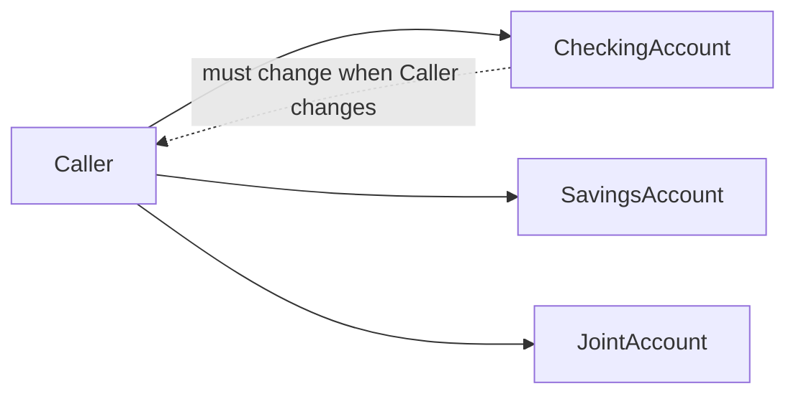
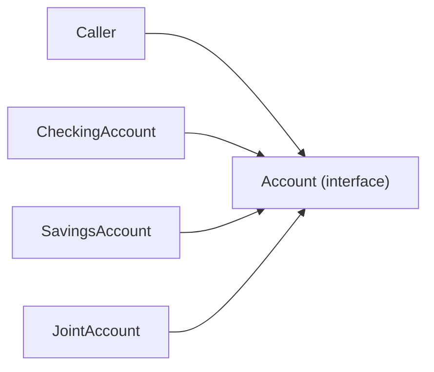

# Polymorphism — Dispatch as Decoupling

> Polymorphism is the technique that lets the same line of code call different methods depending on the runtime type of the receiver. Its purpose is not "code reuse" — it is *decoupling*: callers depend on a shape, not a concrete class, so new implementations can be added without touching existing callers. This is the mechanism that makes the Open/Closed Principle and the Dependency Inversion Principle possible.

## What you already know

From [[00-OOP-Foundations]]: OOP bundles state and behavior. From [[03-Dependency-As-Root-Concept]]: a dependency exists when a change in one place forces a change in another. From [[04-Abstraction-and-Models]]: an abstraction hides detail for a purpose, and the purpose is usually to make change cheaper. From [[02-Encapsulation]]: callers should depend only on the contract, not the internals.

Polymorphism is the runtime mechanism that makes those abstractions *executable*. Without it, an "interface" would just be documentation; with it, callers can invoke a method on an interface and the right implementation runs.

## Why this layer exists

Consider how you would handle "different kinds of accounts have different overdraft rules" without polymorphism. The procedural answer is a switch:

```java
public void withdraw(Account account, Money amount) {
    Money newBalance = account.balance().subtract(amount);
    switch (account.type()) {
        case CHECKING:
            if (newBalance.amount().compareTo(account.overdraftLimit().negate()) < 0) {
                throw new InsufficientFundsException();
            }
            break;
        case SAVINGS:
            if (newBalance.amount().signum() < 0) {
                throw new InsufficientFundsException();
            }
            break;
        case JOINT:
            // joint account rules — different again
            break;
        // ... and every new account type adds another case
    }
    account.setBalance(newBalance);
}
```

Every new account type means editing this method. Every change to one account type's rule means editing this method. Every `switch (account.type())` scattered through the codebase is a place to forget. This is the dependency problem in its purest form: the caller depends on *every concrete type* and on *every rule*.

Polymorphism replaces the switch with a single call:

```java
public void withdraw(Account account, Money amount) {
    account.withdraw(amount);  // the right rule runs, based on the actual account
}
```

The caller no longer knows what kind of account it has. The dependency on concrete types is gone. New account types can be added without touching this method — which is exactly the Open/Closed Principle.

## What is genuinely new here

Two things:

1. **Polymorphism inverts the dependency direction.** Without polymorphism, the *caller* depends on every *implementation*. With polymorphism, both the caller and every implementation depend on a shared *abstraction* (the interface). The implementations no longer know about each other; the caller no longer knows about the implementations. This is the mechanical basis of the Dependency Inversion Principle ([[05-DIP]]).
2. **There are two kinds of polymorphism, with different costs.** Subtype polymorphism (method overriding via interfaces/abstract classes) is the OOP form. Parametric polymorphism (generics) is the statically typed form. They solve different problems and compose well; knowing which to reach for is a design skill.

## Concepts

- **Static dispatch** — the compiler decides which method to call, based on the declared type. Fast, inflexible. Used for `final`, `private`, and `static` methods.
- **Dynamic dispatch** — the JVM decides at runtime, based on the actual receiver type. Slightly slower (a vtable lookup), but enables polymorphism. Used for non-final instance methods.
- **Virtual method table (vtable)** — the JVM's per-class table of method pointers, used to implement dynamic dispatch. Each object has a pointer to its class's vtable; each method call is an indirect load + call.
- **Subtype polymorphism** — a variable of type `T` may hold any object whose class is `T` or a subtype of `T`. The method that runs is determined by the object's actual class.
- **Parametric polymorphism (generics)** — a type parameter `T` that can be any type, with the same code operating on all of them. `List<T>` is parametric; the same `List` code works for `List<Account>`, `List<LedgerEntry>`, etc.
- **Strategy pattern** — the natural expression of subtype polymorphism for "vary a behavior." A field of an interface type, set at construction, whose method is called to vary behavior. See [[03-Behavioral-Patterns]].
- **Open/Closed Principle** — the design rule that polymorphism enables: open for extension (new implementations), closed for modification (existing callers do not change).

## Banking application

The Banking case study ([[00-Banking-Case-Study]]) has several behaviors that vary by account type or by configuration. The polymorphic treatment of each:

### 1. Overdraft policy — strategy pattern

```java
public interface OverdraftPolicy {
    WithdrawalResult check(Account account, Money amount);
    sealed interface WithdrawalResult permits Allowed, Denied {}
    record Allowed() implements WithdrawalResult {}
    record Denied(String reason) implements WithdrawalResult {}
}

public final class NoOverdraft implements OverdraftPolicy {
    public WithdrawalResult check(Account account, Money amount) {
        Money newBalance = account.balance().subtract(amount);
        return newBalance.amount().signum() >= 0
            ? new Allowed()
            : new Denied("Insufficient funds");
    }
}

public final class LimitedOverdraft implements OverdraftPolicy {
    private final Money limit;
    public LimitedOverdraft(Money limit) { this.limit = limit; }
    public WithdrawalResult check(Account account, Money amount) {
        Money newBalance = account.balance().subtract(amount);
        return newBalance.amount().compareTo(limit.amount().negate()) >= 0
            ? new Allowed()
            : new Denied("Exceeds overdraft limit of " + limit);
    }
}

public final class Account {
    private final OverdraftPolicy overdraft;
    // ...
    public void withdraw(Money amount) {
        ensureActive();
        var result = overdraft.check(this, amount);
        switch (result) {
            case OverdraftPolicy.Allowed __ -> applyWithdrawal(amount);
            case OverdraftPolicy.Denied d  -> throw new InsufficientFundsException(id(), d.reason());
        }
    }
}
```

The `Account` class does not know which overdraft policy is in effect. The policy is injected at construction. A savings account gets `NoOverdraft`; a checking account gets `LimitedOverdraft`; a premium account might get a custom policy. New policies can be added without touching `Account`. This is polymorphism inverting the dependency.

### 2. Interest accrual — strategy pattern again

```java
public interface InterestPolicy {
    Money accrue(Account account, Period since, Clock clock);
}

public final class ZeroInterest implements InterestPolicy {
    public Money accrue(Account a, Period p, Clock c) { return Money.ZERO; }
}

public final class DailyCompoundingInterest implements InterestPolicy {
    private final BigDecimal annualRate;
    public DailyCompoundingInterest(BigDecimal annualRate) { this.annualRate = annualRate; }
    public Money accrue(Account a, Period p, Clock c) {
        // ... daily accrual calculation
    }
}
```

Same shape. `Account` holds an `InterestPolicy` reference. The accrual service iterates accounts and calls `accrueInterest(clock)`; the right computation runs based on the policy. No switch, no type check.

### 3. Parametric polymorphism — generic repository

```java
public interface Repository<T, ID> {
    Optional<T> findById(ID id);
    List<T> findAll();
    void save(T entity);
}

public final class JdbcAccountRepository implements Repository<Account, AccountId> {
    public Optional<Account> findById(AccountId id) { /* JDBC code */ }
    public List<Account> findAll() { /* JDBC code */ }
    public void save(Account a) { /* JDBC code */ }
}
```

The same `Repository` interface works for `Account`, `Customer`, `LedgerEntry` — the type parameter `T` lets the interface be reused without duplication, while preserving type safety. This is parametric polymorphism: the algorithm (`findById`, `save`) is generic; the types are concrete at the call site.

### How dispatch actually works on the JVM

When you write:

```java
OverdraftPolicy policy = new LimitedOverdraft(Money.of(1000));
policy.check(account, amount);
```

The compiler emits a virtual method invocation (`invokevirtual` or `invokeinterface`). At runtime, the JVM:

1. Reads the object header to find the class pointer.
2. Looks up the class's vtable.
3. Finds the slot for `check`.
4. Calls the method pointer in that slot.

For `LimitedOverdraft`, the slot points to `LimitedOverdraft.check`. For `NoOverdraft`, the same slot points to `NoOverdraft.check`. The caller's bytecode is identical in both cases — only the vtable lookup differs. That lookup is a few nanoseconds; modern JVMs inline aggressively and devirtualize when only one implementation is possible, often eliminating the cost entirely.

The takeaway: polymorphism's runtime cost is usually negligible. The design cost of *not* using polymorphism — switch statements, type checks, scattered rules — is much higher.

### How polymorphism inverts dependencies

Consider the dependency arrows without polymorphism:



The caller depends on every concrete type. Adding a new account type forces the caller to change.

With polymorphism:



The caller depends on the abstraction. Each concrete implementation depends on the same abstraction. New implementations can be added without touching the caller. This is the Dependency Inversion Principle in action — see [[05-DIP]].

## What can go wrong

1. **Premature abstraction.** Introducing an interface "in case we need a second implementation" when only one exists. The interface adds indirection without benefit. Cure: wait until you have a second implementation, *then* extract the interface. (Or use a sealed interface with one permitted implementation, so the seam is explicit without ceremony.)
2. **Leaky abstractions through interface.** The interface promises uniform behavior, but one implementation throws `UnsupportedOperationException` for some methods. This is an LSP violation (see [[03-LSP]]). Cure: segregate the interface so each implementation only declares what it actually supports ([[04-ISP]]).
3. **Polymorphism without contracts.** The interface declares method signatures but not behavior. Two implementations both have `withdraw(Money)` but with subtly different rules (one allows overdraft, one does not). Callers cannot rely on either. Cure: document the contract in the interface's Javadoc; enforce it with tests.
4. **Excessive interfaces.** Every class gets an interface, every interface gets a factory, every factory gets an injection. The code is "clean" but unreadable. Cure: introduce interfaces where there is a real dependency to invert — where the caller and the implementation should be independently deployable. See [[00-SOLID-as-Dependency-Management]].
5. **Confusing parametric with subtype polymorphism.** `List<T>` is parametric; `List<? extends Number>` is a subtype wildcard. Mixing them up produces code that compiles but does not do what you think. Cure: learn Java generics' variance model — it is the same idea as relational subtyping in SQL.

## Trade-offs

- **Dispatch vs inlining.** A virtual call cannot be inlined by the JVM unless it can prove there is only one possible implementation. The JVM's escape analysis and profile-guided devirtualization usually close the gap, but in hot loops with megamorphic call sites, the cost can be real. Cure: if profile says so, make the method `final` or use a sealed type with pattern matching.
- **Open vs sealed polymorphism.** An open interface permits any implementation; a sealed interface permits a fixed set. Open is more flexible; sealed enables exhaustive pattern matching and lets the compiler check that all cases are handled. Choose sealed when the set of variants is closed and known.
- **Strategy vs inheritance.** Both achieve polymorphism. Strategy (composition with an interface field) is replaceable at runtime and testable in isolation; inheritance is permanent and tightly coupled. Prefer strategy. See [[05-Composition-Over-Inheritance]].
- **Abstraction cost.** Every interface is a thing to read, a thing to maintain, a thing to navigate. The benefit — independent deployability, testability, substitutability — must exceed that cost. For domain cores (Account, Repository, InterestPolicy), it usually does. For one-off helpers, it usually does not.

## Forward links

- [[03-Behavioral-Patterns]] — Strategy, State, Template Method, Command — all polymorphism patterns.
- [[02-Structural-Patterns]] — Decorator and Adapter are polymorphism patterns for interface shaping.
- [[05-DIP]] — the design rule that polymorphism enables.
- [[03-LSP]] — the contract that makes polymorphism safe.
- [[05-Composition-Over-Inheritance]] — the practical rule that ties polymorphism and composition together.
- [[06-Abstract-Classes-And-Interfaces]] — the Java 21 mechanisms (sealed interfaces, default methods) that make polymorphism expressive.
- [[04-Enterprise-Patterns]] — Repository and Unit of Work as polymorphism over persistence.
