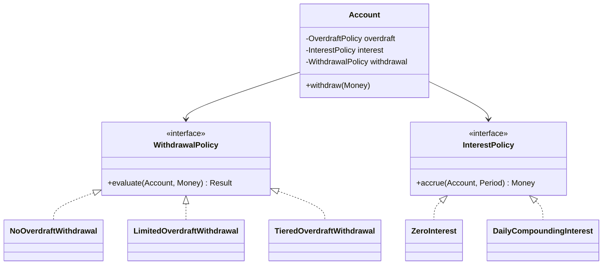

# Composition Over Inheritance — The Practical Rule, With Caveats

> "Favor object composition over class inheritance" is the most-quoted line from the Gang of Four. It is also the most-misunderstood. This chapter explains what the rule actually says, shows the canonical refactor (varying behavior through strategy rather than subclassing), and — importantly — names the cases where inheritance is still the right answer.

## What you already know

From [[03-Inheritance]]: inheritance is a permanent, compile-time, single-dimensional commitment that creates the tightest coupling in OOP. From [[04-Polymorphism]]: subtype polymorphism through interfaces lets you vary behavior without subclassing. From [[07-Composition-vs-Inheritance]]: both are reuse mechanisms; they differ in the coupling they produce. From [[06-Coupling-and-Cohesion]]: looser coupling means cheaper change.

If you have those four in your head, the rule "favor composition" is almost a tautology. The interesting question is *how* to apply it, and *when* to break it.

## Why this layer exists

The rule exists because most OOP codebases that reach a certain size develop a disease: deep class hierarchies where every change to a base class ripples through dozens of subclasses, where features are entangled (a `SavingsAccount` cannot have an overdraft because the overdraft logic lives on `CheckingAccount`), and where testing any single class requires constructing a chain of parent classes.

The disease is not caused by inheritance itself. It is caused by *defaulting* to inheritance. The cure is to default to composition, and reach for inheritance only when its conditions are met.

## What is genuinely new here

Three things:

1. **The strategy pattern is the natural expression of composition over inheritance for behavior variation.** When you find yourself wanting to subclass to vary one method, you almost always want a strategy: a field of an interface type, set at construction, whose method is called.
2. **Composition is not always better.** It is better *by default*. There are real cases — sealed hierarchies, framework extension points, pure data variants — where inheritance is correct. Knowing those cases prevents cargo-cult composition.
3. **The rule extends to every layer.** Schema design, service boundaries, package structure — the same trade-off (composition = looser coupling, inheritance = tighter coupling) reappears everywhere. See [[07-Composition-vs-Inheritance]].

## Concepts

- **Composition** — a class holds references to other objects and delegates behavior to them. "Has-a."
- **Inheritance** — a class extends another and reuses its implementation. "Is-a."
- **Delegation** — the act of forwarding a method call to a collaborator. The mechanism by which composition reuses behavior.
- **Strategy pattern** — a collaborator whose method implements a varying behavior, injected at construction. The natural composition alternative to "subclass to override one method."
- **Decorator pattern** — a composition pattern for adding behavior to an object without changing its type. Wraps the original and delegates. See [[02-Structural-Patterns]].
- **Fragile base class** — the failure mode of inheritance: a parent change breaks subclasses that depended on its internal behavior.
- **Liskov Substitution Principle (LSP)** — the test for whether a subclass is genuinely substitutable for its parent. The gatekeeper on inheritance. See [[03-LSP]].

## Banking application

The Banking case study ([[00-Banking-Case-Study]]) gives us a textbook example. Suppose we start with inheritance:

```java
// NAIVE — inheritance for behavior variation
public abstract class Account {
    protected Money balance;
    protected AccountStatus status;

    public abstract void withdraw(Money amount);
    public void deposit(Money amount) { /* shared */ }
}

public final class SavingsAccount extends Account {
    public void withdraw(Money amount) {
        if (balance.subtract(amount).amount().signum() < 0) {
            throw new InsufficientFundsException();
        }
        balance = balance.subtract(amount);
    }
}

public final class CheckingAccount extends Account {
    private Money overdraftLimit;
    public void withdraw(Money amount) {
        if (balance.subtract(amount).amount().compareTo(overdraftLimit.amount().negate()) < 0) {
            throw new InsufficientFundsException();
        }
        balance = balance.subtract(amount);
    }
}
```

This works for a while. Then the product team asks for:

- A *premium* savings account with a small overdraft for trusted customers.
- A *student* checking account with no overdraft fees.
- A *joint* account that two customers own, with separate overdraft rules per owner.

With inheritance, you are stuck. Premium savings needs behavior from both `SavingsAccount` and `CheckingAccount`. Java forbids multiple inheritance of classes. You could introduce `PremiumSavingsAccount extends CheckingAccount` and override to add interest — but now the type hierarchy lies about the domain. You could push overdraft up to `Account` with a default — but `SavingsAccount` should not have an overdraft limit field.

The composition refactor:

```java
public final class Account {
    private final AccountId id;
    private Money balance;
    private AccountStatus status;
    private final OverdraftPolicy overdraft;
    private final InterestPolicy interest;
    private final WithdrawalPolicy withdrawal;

    public void withdraw(Money amount) {
        ensureActive();
        var result = withdrawal.evaluate(this, amount);
        switch (result) {
            case WithdrawalPolicy.Allowed __ -> applyWithdrawal(amount);
            case WithdrawalPolicy.Denied d  -> throw new InsufficientFundsException(id, d.reason());
        }
    }
    // ...
}

public interface WithdrawalPolicy {
    Result evaluate(Account account, Money amount);
    sealed interface Result permits Allowed, Denied {}
    record Allowed() implements Result {}
    record Denied(String reason) implements Result {}
}

public final class NoOverdraftWithdrawal implements WithdrawalPolicy {
    public Result evaluate(Account account, Money amount) {
        Money newBalance = account.balance().subtract(amount);
        return newBalance.amount().signum() >= 0
            ? new Allowed()
            : new Denied("Insufficient funds");
    }
}

public final class LimitedOverdraftWithdrawal implements WithdrawalPolicy {
    private final Money limit;
    public LimitedOverdraftWithdrawal(Money limit) { this.limit = limit; }
    public Result evaluate(Account account, Money amount) {
        Money newBalance = account.balance().subtract(amount);
        return newBalance.amount().compareTo(limit.amount().negate()) >= 0
            ? new Allowed()
            : new Denied("Exceeds overdraft limit of " + limit);
    }
}

public final class TieredOverdraftWithdrawal implements WithdrawalPolicy {
    private final List<OverdraftTier> tiers;
    public TieredOverdraftWithdrawal(List<OverdraftTier> tiers) { this.tiers = tiers; }
    public Result evaluate(Account account, Money amount) {
        // pick the tier based on account.age() or account.customer.tier()
        // ... more sophisticated rule
    }
}
```

Now:

- A *premium savings* account is just `new Account(id, ..., new LimitedOverdraftWithdrawal(Money.of(500)), new DailyCompoundingInterest(rate), ...)`. No new class. No new inheritance.
- A *student checking* account uses `NoOverdraftWithdrawal` and `ZeroInterest`.
- A *joint* account is just an `Account` with two `OwnerId`s in its aggregate (see [[02-Aggregates]]).
- Adding a new withdrawal rule — say, "no withdrawals over 10,000 without 2FA" — is one new class implementing `WithdrawalPolicy`. `Account` does not change. Every existing account configuration keeps working. This is the Open/Closed Principle ([[02-OCP]]).



Each behavior axis is independent. Each can vary without touching the others. This is composition: the account *has* policies, and the policies are replaceable.

### The decorator — composition for adding behavior

The strategy pattern varies *one* behavior. The decorator pattern *adds* behavior while preserving the type. Classic banking use case: an `Account` wrapped in an `AuditingAccount` that logs every operation, wrapped in turn in a `CachingAccount` that memoizes balance reads.

```java
public interface Account {
    void withdraw(Money amount);
    void deposit(Money amount);
    Money balance();
}

public final class BasicAccount implements Account { /* the real one */ }

public final class AuditingAccount implements Account {
    private final Account delegate;
    private final AuditLog audit;
    public AuditingAccount(Account delegate, AuditLog audit) {
        this.delegate = delegate; this.audit = audit;
    }
    public void withdraw(Money amount) {
        audit.record("withdraw " + amount);
        delegate.withdraw(amount);
    }
    public void deposit(Money amount) {
        audit.record("deposit " + amount);
        delegate.deposit(amount);
    }
    public Money balance() { return delegate.balance(); }
}

Account a = new AuditingAccount(new BasicAccount(...), auditLog);
```

Each decorator *is-an* `Account` (so it is substitutable) and *has-an* `Account` (it delegates). This is composition producing the polymorphism that inheritance would have given us, without the coupling. See [[02-Structural-Patterns]] for the full pattern.

### When to break the rule

Composition is the default, but there are cases where inheritance is right:

1. **Sealed hierarchies for closed sets of variants.** When the set of variants is fixed and known, a sealed interface with record implementations is cleaner than a strategy. Example: `TransferResult` is `Succeeded | Rejected | Pending`. There will not be a fourth variant next sprint.

   ```java
   public sealed interface TransferResult
       permits TransferSucceeded, TransferRejected, TransferPending {}

   public record TransferSucceeded(TransferId id, Instant at) implements TransferResult {}
   public record TransferRejected(TransferId id, String reason) implements TransferResult {}
   public record TransferPending(TransferId id, Instant reviewBy) implements TransferResult {}
   ```

   Pattern matching gives you exhaustive `switch` without runtime risk. See [[06-Abstract-Classes-And-Interfaces]].

2. **Framework extension points designed for inheritance.** `AbstractList`, `AbstractMap`, `FilterInputStream` — these were designed to be subclassed. Their `protected` methods are documented extension points; their self-use patterns are specified. Subclassing them is safe.

3. **Template method pattern.** When the parent defines the algorithm skeleton and the child fills in the steps, inheritance is the natural mechanism. This is one of the few patterns where inheritance is genuinely the right tool. See [[03-Behavioral-Patterns]].

   ```java
   public abstract class AbstractTransferService {
       public final TransferResult transfer(TransferRequest req) {
           validate(req);
           var fraudResult = checkFraud(req);
           if (fraudResult.isDenied()) return new TransferRejected(req.id(), "fraud");
           execute(req);
           return new TransferSucceeded(req.id(), Instant.now());
       }
       protected abstract void validate(TransferRequest req);
       protected abstract FraudResult checkFraud(TransferRequest req);
       protected abstract void execute(TransferRequest req);
   }
   ```

   The skeleton is fixed; the steps vary. The parent is `final` on the skeleton method, `abstract` on the steps. This is inheritance done right: the extension surface is explicit and small.

4. **Adapter to a third-party class.** When you must extend a framework class to integrate with a third-party API, you do what you have to do. Keep the adapter thin; do not pile domain logic on top of it.

5. **Domain entities that genuinely are subtypes.** `IndividualCustomer extends Customer` and `CorporateCustomer extends Customer` may be genuine — if every operation on `Customer` makes sense on both. Even then, a `sealed` hierarchy with composition (`Customer has a CustomerProfile`) is usually cleaner.

## What can go wrong

1. **Composition theater.** "I am using composition" while the wrapping class just calls every method on the delegate and adds nothing. This is delegation, not composition. It adds indirection without behavior. Cure: delete the wrapper, use the delegate directly.
2. **Strategy explosion.** Every varying behavior becomes an interface with one implementation. The code is "composable" but nobody can follow the indirection. Cure: extract a strategy only when there is a second implementation coming, or when the strategy is genuinely pluggable (testable in isolation, configurable at deployment).
3. **Forgetting the LSP on decorators.** A decorator that strengthens preconditions or weakens postconditions breaks substitutability. `CachingAccount` that returns a stale balance after a concurrent write is an LSP violation. Cure: document the contract; test that decorators are substitutable.
4. **Forgetting the GoF rule says "favor," not "always."** Reaching for composition in cases designed for inheritance (sealed hierarchies, template methods) produces worse code, not better. The rule is a default, not a law.
5. **Premature sealing.** Marking a class `final` to enforce composition when you do not yet know whether subclassing is needed. The cost of `final` is low; the cost of removing it later is also low. Prefer `final` by default and remove it when you have a reason.

## Trade-offs

- **Verbosity vs flexibility.** Composition requires writing delegation code. Inheritance reuses automatically. For one or two methods, the verbosity is minor; for ten, it is annoying; for a hundred, you want inheritance. Most domain classes fall in the first two buckets.
- **Runtime cost.** Composition adds an indirection per call (one method dispatch to the delegate). Inheritance's dispatch is direct. The JVM inlines both; in practice the cost is negligible. Do not choose based on this.
- **Testability.** Composition wins: dependencies can be mocked. Inheritance loses: parent class behavior is baked in.
- **Open vs closed extension.** Inheritance is open: anyone can extend (unless `final`). Composition is closed by default: the strategy interface is fixed, but new implementations can be added. For most domain code, closed-extension-with-open-implementations is the right balance.
- **Readability.** A deep inheritance hierarchy is unreadable: to understand a method at the leaf, you must read every ancestor. A composition graph is also unreadable if every method delegates through five layers. Both can be misused. The cure in both cases is the same: keep the structure shallow, name collaborators clearly, document the contract at each boundary.

## Forward links

- [[03-Inheritance]] — the mechanism this rule warns against, in detail.
- [[04-Polymorphism]] — the dispatch mechanism that makes composition work.
- [[07-Composition-vs-Inheritance]] — the foundational trade-off.
- [[02-Structural-Patterns]] — Decorator, Adapter, Proxy — composition patterns.
- [[03-Behavioral-Patterns]] — Strategy, State, Template Method — the patterns that express composition.
- [[03-LSP]] — the contract that makes both inheritance and decorators safe.
- [[00-ORM-Impedance-Mismatch]] — composition vs inheritance reappears when you map a hierarchy to a schema.
