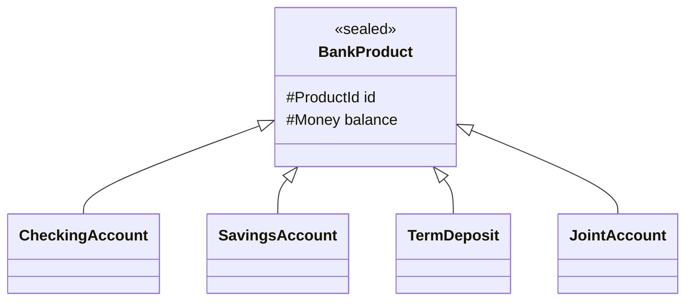

# Abstract Classes and Interfaces — Java 21's Modern Toolkit

> Java has two mechanisms for declaring an abstraction: `abstract class` and `interface`. For most of Java's history, the choice was forced: shared state → abstract class; pure contract → interface. Java 8's default methods and Java 17's sealed types changed the calculus. This chapter explains when each is the right tool, how they map to repository interfaces in banking, and how modern Java blends them.

## What you already know

From [[04-Abstraction-and-Models]]: an abstraction hides detail for a purpose. From [[04-Polymorphism]]: subtype polymorphism needs a shared type that callers depend on. From [[03-Dependency-As-Root-Concept]]: dependencies should point toward stability; abstractions are usually more stable than concretions. From [[05-DIP]] (forward link, but the principle is foreshadowed): callers should depend on abstractions, not on concrete classes.

The question this chapter answers is mechanical: given that you want an abstraction, *which Java construct do you reach for*?

## Why this layer exists

Java gives you two constructs that look similar — both can have abstract methods, both can be the target of a polymorphic call. The differences matter:

- An abstract class can have *state* (instance fields); an interface cannot.
- A class can extend only one abstract class; it can implement any number of interfaces.
- An abstract class can have constructors; an interface cannot.
- An interface can have `default` and `static` methods (since Java 8); an abstract class always could.
- A sealed abstract class or sealed interface can restrict which types may extend or implement it (Java 17+).

These differences make the two constructs suited to different jobs. Choosing wrong means either fighting the language (workarounds for the single-inheritance limit) or losing expressiveness (no shared state in interfaces).

## What is genuinely new here

Three things:

1. **The modern preference: interfaces by default, abstract classes when you need shared state.** In Java 21, an interface with `default` methods can do most of what an abstract class used to do — define a contract, provide shared behavior, even restrict implementations via `sealed`. Reach for an abstract class only when you need instance fields shared across subtypes.
2. **Sealed types change the game.** A sealed interface (or sealed abstract class) lets you declare a closed set of permitted subtypes. This enables exhaustive pattern matching — the compiler checks that all cases are handled. For domain sum types (`TransferResult = Succeeded | Rejected | Pending`), this is the right tool.
3. **Default methods are for interface evolution, not for interface design.** A default method lets you add a method to a published interface without breaking existing implementations. It is *not* a license to put domain logic in interfaces. Default methods that call other interface methods (`default void forEach(Consumer<T> action) { ... }`) are fine; default methods that implement domain rules are usually a smell.

## Concepts

- **Abstract class** — a class declared `abstract`; cannot be instantiated; may have abstract methods (no body) and concrete methods (with body); may have instance fields and constructors.
- **Interface** — a type declaration that contains method signatures; may have `default` methods (with body), `static` methods, and (since Java 9) `private` helper methods; cannot have instance fields (only `public static final` constants).
- **Abstract method** — a method declaration without a body; subclasses must implement it (or be abstract themselves).
- **Default method** — a method on an interface with a body; provides a default implementation that implementing classes inherit but may override.
- **Sealed type** — a class or interface declared `sealed` with a `permits` clause listing the allowed subtypes. Restricts extension; enables exhaustive pattern matching.
- **Record** — a special kind of class (Java 16+) that is a transparent carrier of immutable data. Often the right implementation of a sealed interface's permitted subtypes.
- **Permits clause** — the list of classes/interfaces allowed to extend or implement a sealed type.
- **Pattern matching for switch** — Java 21+: `switch` over a sealed type can be exhaustive; the compiler errors if a case is missing.

## Banking application

The Banking case study ([[00-Banking-Case-Study]]) needs several abstractions. Let's work through each:

### 1. Repository interface — the canonical interface use case

```java
public interface AccountRepository {
    Optional<Account> findById(AccountId id);
    List<Account> findByCustomer(CustomerId customerId);
    void save(Account account);
    void delete(Account account);
}

public final class JdbcAccountRepository implements AccountRepository {
    private final DataSource ds;
    public JdbcAccountRepository(DataSource ds) { this.ds = ds; }

    public Optional<Account> findById(AccountId id) {
        // JDBC code...
    }
    // ...
}

public final class InMemoryAccountRepository implements AccountRepository {
    private final Map<AccountId, Account> store = new ConcurrentHashMap<>();
    public Optional<Account> findById(AccountId id) {
        return Optional.ofNullable(store.get(id));
    }
    // ...
}
```

This is the textbook case for an interface:

- No shared state across implementations (JDBC uses a `DataSource`; in-memory uses a `Map`).
- Multiple implementations (production, test, in-memory, fake).
- Callers (the domain services) should depend on the abstraction, not on JDBC specifically — this is DIP ([[05-DIP]]).

Tests use `InMemoryAccountRepository`. Production uses `JdbcAccountRepository` (or a Hibernate-backed one). The domain code never knows. See [[05-Repository-Pattern]] for the full pattern.

### 2. Strategy interface — also an interface

```java
public interface InterestPolicy {
    Money accrue(Account account, Period since, Clock clock);
}

public final class ZeroInterest implements InterestPolicy {
    public Money accrue(Account a, Period p, Clock c) { return Money.ZERO; }
}

public final class DailyCompoundingInterest implements InterestPolicy {
    private final BigDecimal annualRate;
    public DailyCompoundingInterest(BigDecimal rate) { this.annualRate = rate; }
    public Money accrue(Account a, Period p, Clock c) { /* ... */ }
}
```

Again: no shared state across implementations, multiple implementations, callers depend on the abstraction. Interface is correct.

### 3. Sealed interface for results — the modern Java 21 idiom

```java
public sealed interface TransferResult
    permits TransferSucceeded, TransferRejected, TransferPending {}

public record TransferSucceeded(TransferId id, Money amount, Instant at)
    implements TransferResult {}

public record TransferRejected(TransferId id, String reason)
    implements TransferResult {}

public record TransferPending(TransferId id, Instant reviewBy)
    implements TransferResult {}

// Usage with exhaustive pattern matching (Java 21):
public String describe(TransferResult result) {
    return switch (result) {
        case TransferSucceeded s -> "Transfer " + s.id() + " of " + s.amount() + " completed.";
        case TransferRejected r -> "Transfer " + r.id() + " rejected: " + r.reason();
        case TransferPending p  -> "Transfer " + p.id() + " pending review until " + p.reviewBy();
    };
}
```

The sealed interface declares a closed set of variants. The `switch` is exhaustive — the compiler enforces that all three cases are handled. If a fourth variant is added later, the compiler flags every switch that needs updating. This is the algebraic data type pattern, finally available in Java.

### 4. Abstract class for shared state — the rare case

```java
public abstract class BaseAccount {
    protected final AccountId id;
    protected Money balance;
    protected AccountStatus status;

    protected BaseAccount(AccountId id, Money openingBalance) {
        this.id = id;
        this.balance = openingBalance;
        this.status = AccountStatus.PENDING;
    }

    public final void activate() {
        if (status != AccountStatus.PENDING) {
            throw new IllegalStateException("Cannot activate from " + status);
        }
        this.status = AccountStatus.ACTIVE;
    }
    // ... shared state and behavior
}
```

When is this the right choice? When the subtypes genuinely share *mutable state* and the operations on it. In banking, this is rare — most account variation is in behavior (overdraft rules, interest rules), which is better handled by strategies on a non-abstract `Account` class. The honest answer is: in modern Java, you almost never need an abstract class in domain code. Reach for it when:

- You have shared mutable state across subtypes.
- The shared operations are non-trivial and would otherwise be duplicated.
- The subtype relationship is genuinely "is-a" and substitutable (LSP holds — see [[03-LSP]]).

Even then, consider extracting the shared state into a separate class and composing. The abstract class is one option among several, not the default.

### 5. Interface with default methods — for evolution, not design

```java
public interface AccountRepository {
    Optional<Account> findById(AccountId id);

    // Default method — added later, does not break existing implementations
    default Optional<Account> findByIdOrDefault(AccountId id, Account fallback) {
        return findById(id).or(() -> Optional.of(fallback));
    }
}
```

The default method calls `findById`, which every implementation already provides. New implementations get `findByIdOrDefault` for free; existing implementations can override it if they want a faster path. This is the legitimate use of default methods: evolving an interface without breaking existing code.

The illegitimate use: putting domain logic in default methods. `default void transferTo(Account dest, Money amount)` on `Account` would be a smell — the transfer logic involves multiple objects, transactions, and audit; it does not belong in an interface default method. Put it on the concrete class, or in a service.

### 6. Sealed abstract class — for closed hierarchies with shared state

If you do have a closed hierarchy with shared state, Java 21's sealed abstract class is the right tool:

```java
public sealed abstract class BankProduct
    permits CheckingAccount, SavingsAccount, TermDeposit
    permits JointAccount {
    protected final ProductId id;
    protected Money balance;
    // shared state, shared behavior
}

public final class CheckingAccount extends BankProduct { /* ... */ }
public final class SavingsAccount extends BankProduct { /* ... */ }
public final class TermDeposit extends BankProduct { /* ... */ }
public final class JointAccount extends BankProduct { /* ... */ }
```

The hierarchy is closed (only the four permitted subclasses), state is shared (from `BankProduct`), and pattern matching works across the hierarchy. This combines the strengths of abstract classes (shared state) with the strengths of sealed types (closed extension).



## What can go wrong

1. **Abstract class for pure contract.** Using `abstract class Account` when there is no shared state is a missed opportunity — you have used up your one inheritance slot for nothing. Use an interface instead.
2. **Interface for shared state.** Trying to put instance fields in an interface does not compile. The temptation is to use `static` fields, which are shared constants — but those are not state, they are configuration. If you need shared mutable state, use an abstract class (or composition).
3. **Default methods as mini-base-classes.** A default method that does not call other interface methods is a code smell. It is implementation disguised as contract. Cure: move it to an abstract class or to a concrete helper.
4. **Diamond inheritance of default methods.** If two interfaces both define a default `m()`, and a class implements both, the compiler forces you to override `m()`. This is good — it forces an explicit choice — but it surprises people the first time. Cure: understand which interface's default you want, and override to call it explicitly (`InterfaceA.super.m()`).
5. **Sealed types with leaking permits.** A sealed interface whose permits clause is in a different package forces the implementations to be `public`. This can leak types you wanted to keep internal. Cure: keep sealed types and their permits in the same package.
6. **Forgetting that interfaces can evolve but abstract classes cannot.** Adding a method to an interface with a `default` is safe. Adding an abstract method to a published abstract class breaks every existing subclass. Choose interfaces for published contracts.

## Trade-offs

- **Interface vs abstract class.** Interface: no state, multiple inheritance, default methods, modern preference. Abstract class: shared state, single inheritance, constructors. Choose interface by default; choose abstract class when you need shared mutable state across a closed set of subtypes.
- **Sealed vs open.** Sealed gives exhaustive pattern matching and closed extension; open gives flexibility. For domain sum types, sealed wins. For plugin extension points, open wins.
- **Record vs class.** Records are transparent data carriers; classes can hide state. Use records for value objects and result variants; use classes for entities with invariants.
- **Default methods vs abstract methods.** Default methods let the interface provide behavior; abstract methods force the implementer to provide it. Prefer abstract for the contract; use default only when there is a sensible implementation that calls other interface methods.
- **Single inheritance vs multiple inheritance.** Java's choice (single inheritance of classes, multiple inheritance of interfaces) is a deliberate trade-off. It avoids the diamond problem for state while allowing flexible composition of contracts. The cost: you cannot share state across two unrelated type hierarchies. The cure: composition.

## Forward links

- [[05-DIP]] — the design rule that makes interfaces central to dependency management.
- [[04-ISP]] — splitting fat interfaces into narrow ones.
- [[03-LSP]] — the contract that abstract classes and interfaces both must honor.
- [[05-Repository-Pattern]] — the canonical banking use of an interface.
- [[04-Enterprise-Patterns]] — Repository, Unit of Work, CQRS — all interface-driven.
- [[05-Anemic-vs-Rich-Models]] — the choice between putting behavior in abstract classes (rich) vs in services over data classes (anemic).
- [[06-Hibernate-JPA]] — how repository interfaces meet ORM mappings.
- [[01-Class-Diagrams]] — UML notation for interfaces and abstract classes.
