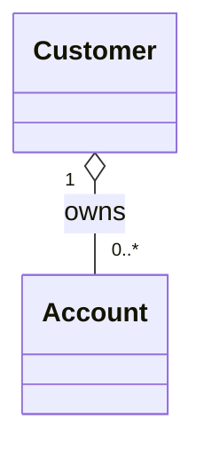
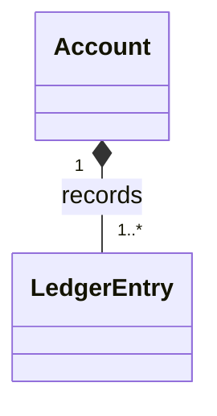
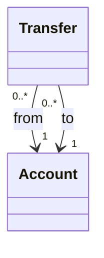
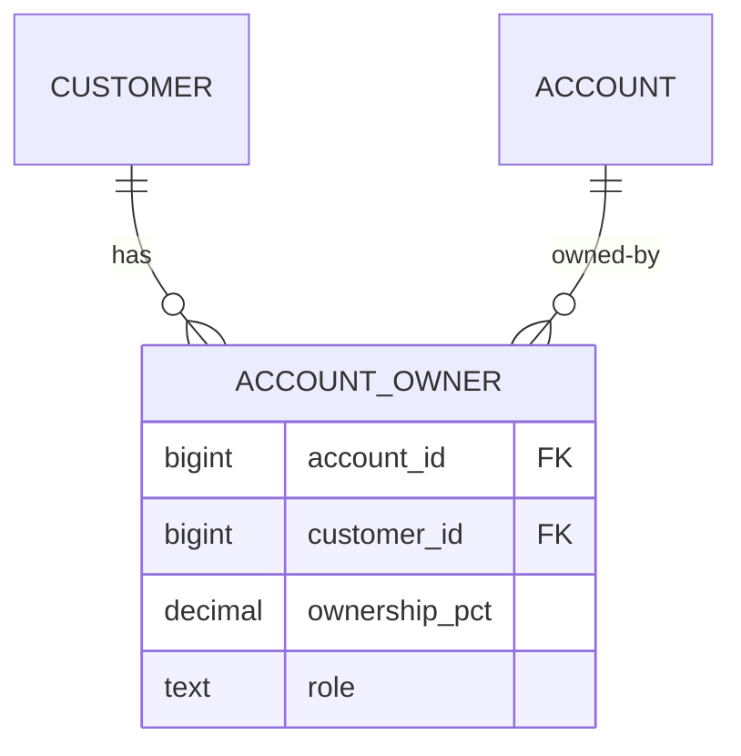
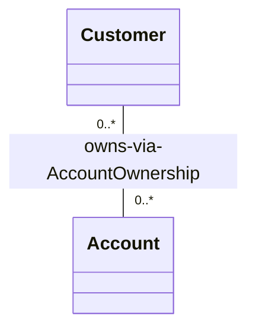
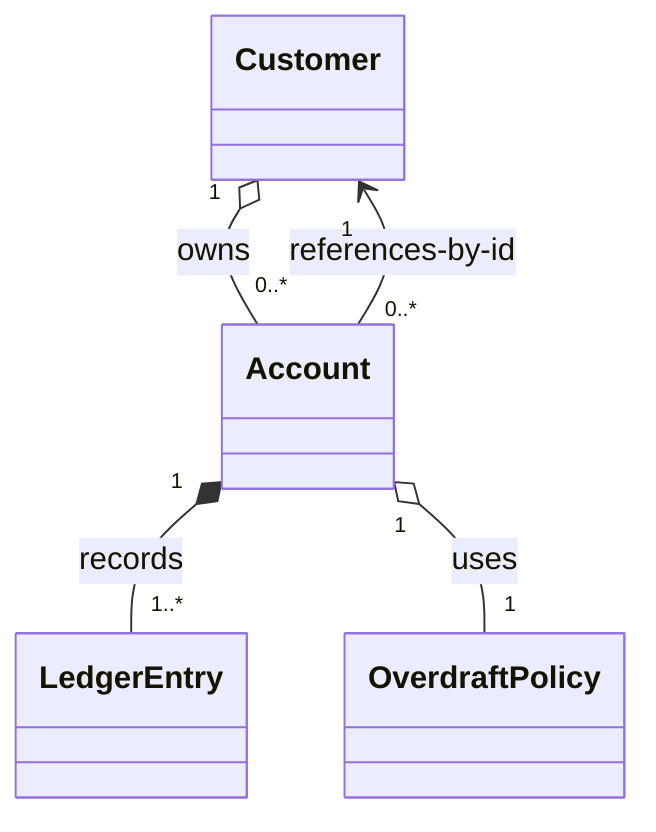

# Object Relationships — Associations, Aggregations, Compositions

> Objects do not exist in isolation. They refer to each other, own each other, and outlive each other. This chapter introduces the three classical relationship kinds (association, aggregation, composition), their UML notation, multiplicities, and the lifecycle consequences that will reappear in schema design as foreign keys and cascade rules.

## What you already know

From [[00-OOP-Foundations]]: OOP bundles state and behavior into objects. From [[03-Dependency-As-Root-Concept]]: an association is one form of dependency — A holds a reference to B, so A's correctness depends on B's existence. From [[06-Coupling-and-Cohesion]]: structural coupling (one object holding another) is bidirectional in the sense that both objects know about each other's interface, even if the dependency direction is one-way. From [[05-Identity-State-Lifecycle]]: objects have lifecycles, and lifecycle questions (who creates, who destroys, who outlives whom) matter for persistence.

This chapter formalizes those intuitions with vocabulary and UML notation. The vocabulary reappears in ER modeling ([[00-ER-Modeling]]) and schema design ([[01-Primary-Foreign-Keys]]) — the same concepts at a different layer.

## Why this layer exists

When you draw or code an object model, you must answer three questions for every pair of objects:

1. **Do they know about each other?** (Is there a reference at all?)
2. **How many?** (One? Many? Optional? Bounded?)
3. **Who owns the lifecycle?** (Does A create B? Does A's destruction imply B's destruction? Are they peers?)

These three questions distinguish the three relationship kinds. The vocabulary exists because the answers have real consequences — for code (who calls `new`?), for the schema (which table holds the foreign key? what does `ON DELETE` do?), and for testing (can you construct A without B?).

## What is genuinely new here

Three things:

1. **The three relationship kinds are distinguished by *lifecycle*, not by syntax.** A field of type `B` on class `A` could be any of the three. The relationship kind is determined by whether A creates B, whether A owns B, and whether B can exist without A. This is a *semantic* distinction, visible in the code only through conventions.
2. **Multiplicity is orthogonal to relationship kind.** `1` vs `0..1` vs `0..*` vs `1..*` vs `n..m` is a separate axis. You can have a one-to-one composition or a one-to-many association; the kind tells you about lifecycle, the multiplicity tells you about cardinality.
3. **Composition and aggregation are largely about who enforces the invariant.** A composition says "the whole owns the parts; the parts cannot exist without the whole; the whole enforces their invariants." An aggregation says "the whole references the parts, but the parts have their own lifecycle and their own invariant-owners." This is the same aggregation-vs-composition question that drives aggregate boundaries in DDD ([[02-Aggregates]]).

## Concepts

- **Association** — the weakest relationship. A holds a reference to B; B has its own lifecycle, independent of A. A does not own B; B can exist before, during, and after A.
- **Aggregation** — a "has-a" relationship where A is conceptually a *whole* and B is a *part*, but B has an independent lifecycle. The part can be shared between wholes.
- **Composition** — a "contains-a" relationship where A is the whole, B is the part, and B's lifecycle is *bound to* A's. If A is destroyed, B is destroyed. The part is not shared.
- **Multiplicity** (cardinality) — how many instances participate. `1` (exactly one), `0..1` (zero or one), `*` or `0..*` (zero or more), `1..*` (one or more), `n..m` (between n and m).
- **Navigability** — which direction the reference goes. `A → B` means A knows B; `A ↔ B` means they know each other (usually a smell).
- **Ownership** — who creates, who destroys, who is responsible for the part's lifecycle.
- **UML notation** — open diamond (aggregation), filled diamond (composition), plain line (association), arrowhead (navigability), numbers on each end (multiplicity). See [[01-Class-Diagrams]].

## Banking application

The Banking case study ([[00-Banking-Case-Study]]) has several relationships with distinct kinds and multiplicities. Let's classify each:

### 1. Customer → Account — aggregation (one-to-many)

A customer owns zero or more accounts. The accounts exist independently of the customer object in memory (they have their own database rows, their own IDs, their own lifecycle states). The customer is the *whole*, the accounts are the *parts*, but the parts can outlive the whole — a customer can be deleted from memory while their accounts persist; an account can be transferred to another customer (in some mergers).

```java
public final class Customer {
    private final CustomerId id;
    private final List<Account> accounts;  // aggregation: accounts exist independently
    // ...
}
```

Multiplicity: `1 Customer → 0..* Account`. (A customer must exist to have an account; an account must belong to exactly one customer — though in joint accounts, this becomes many-to-many, see below.)



The open diamond (`o--`) denotes aggregation. The numbers denote multiplicity.

### 2. Account → LedgerEntry — composition (one-to-many)

Every monetary movement on an account produces a `LedgerEntry`. The ledger entries *belong to* the account: they cannot exist without it, they are created by the account's operations, and they are destroyed (or archived) when the account is destroyed. The account owns the ledger entries' lifecycle.

```java
public final class Account {
    private final AccountId id;
    private final List<LedgerEntry> entries = new ArrayList<>();

    public void deposit(Money amount) {
        // ...
        entries.add(LedgerEntry.credit(id, amount, Instant.now()));
    }
}
```

Multiplicity: `1 Account → 1..* LedgerEntry` (an account with zero entries is freshly opened; once it transacts, it has at least one).



The filled diamond (`*--`) denotes composition. This corresponds in the schema to `ledger_entries.account_id REFERENCES accounts(id) ON DELETE CASCADE` (or `RESTRICT`, depending on policy — see [[01-Primary-Foreign-Keys]]).

### 3. Transfer → Account — association (many-to-one, twice)

A transfer involves two accounts — source and destination. The transfer references the accounts but does not own them; the accounts exist before, during, and after the transfer. This is a plain association.

```java
public final class Transfer {
    private final TransferId id;
    private final AccountId fromAccountId;   // reference by ID, not by object
    private final AccountId toAccountId;
    private final Money amount;
    private final Instant at;
    private TransferStatus status;
}
```

Multiplicity: `1 Account → 0..* Transfer` (as source), `1 Account → 0..* Transfer` (as destination). `* Transfer → 1 Account` (each transfer has exactly one source and one destination).



Plain arrows (`-->`) denote association. Note that we reference the accounts by ID, not by holding the `Account` object directly — this is a common pattern in persistence-aware code (see [[09-Object-Model-vs-Data-Model]] and [[02-Aggregates]]).

### 4. Joint account — many-to-many between Customer and Account

A joint account is owned by two (or more) customers. This is a many-to-many relationship. In the schema, this requires a junction table (`account_owners(account_id, customer_id)`). In the object model, it is usually represented as a list of `OwnerId` references on the `Account`, or as an `AccountOwnership` entity with its own attributes (ownership percentage, role).



This is the ER diagram form (see [[00-ER-Modeling]]). The same relationship in UML:



### 5. Account → OverdraftPolicy — composition (one-to-one, sort of)

An `Account` holds an `OverdraftPolicy`. The policy is created with the account and replaced only by an explicit operation. The policy does not exist independently — it has no identity of its own. This is composition: the account owns the policy's lifecycle.

But note: the policy is a strategy — it might be shared between many accounts (a single `NoOverdraft` instance, or a singleton). In that case, the relationship is more like aggregation: the account references a shared policy object.

The distinguishing test: *if A is destroyed, is B destroyed?* If `Account` is garbage-collected, is the `NoOverdraft` instance? Usually no — it is shared. So this is aggregation, not composition, even though the account "owns" the policy in a conceptual sense. The lifecycle test wins over the conceptual test.

This distinction matters in persistence: a composition would imply the policy is stored *with* the account (e.g., as embedded columns); an aggregation implies the policy is stored *separately* and referenced. In banking, overdraft limits are usually embedded columns on `accounts` (`overdraft_limit NUMERIC`), which is composition-style storage for what is conceptually a strategy. The mismatch is the seed of [[00-ORM-Impedance-Mismatch]].

### Multiplicity cheat sheet

| Notation | Meaning | Banking example |
|---|---|---|
| `1` | exactly one | Account → Customer (each account has exactly one primary customer) |
| `0..1` | zero or one | Customer → DeceasedEstate (set after death) |
| `*` or `0..*` | zero or more | Customer → Account |
| `1..*` | one or more | Account → LedgerEntry (after first transaction) |
| `2..4` | between 2 and 4 | JointAccount → Customer (typically 2-4 owners) |
| `n..m` | bounded range | Account → AuthorizedSigner (corporate accounts) |

## Code

A complete sketch of the Customer-Account-LedgerEntry graph:

```java
public final class Customer {
    private final CustomerId id;
    private final String name;
    private final List<Account> accounts = new ArrayList<>();   // aggregation

    public void openAccount(Account account) {
        if (account.ownerId() != null && !account.ownerId().equals(id)) {
            throw new IllegalStateException("Account already owned by another customer");
        }
        accounts.add(account);
    }

    public List<Account> accounts() { return List.copyOf(accounts); }
}

public final class Account {
    private final AccountId id;
    private final CustomerId ownerId;       // association back to customer
    private Money balance;
    private final List<LedgerEntry> entries = new ArrayList<>();  // composition
    private final OverdraftPolicy overdraft; // aggregation (shared strategy)

    public Account(AccountId id, CustomerId ownerId, OverdraftPolicy overdraft) {
        this.id = id;
        this.ownerId = ownerId;
        this.overdraft = overdraft;
        this.balance = Money.ZERO;
    }

    public void deposit(Money amount) {
        ensureActive();
        this.balance = balance.add(amount);
        this.entries.add(LedgerEntry.credit(id, amount, Instant.now()));  // composition: account creates entries
    }
    // ...
}

public final record LedgerEntry(    // immutable, owned by Account
    AccountId accountId,
    Money amount,
    Instant at,
    LedgerType type
) {
    public static LedgerEntry credit(AccountId id, Money amount, Instant at) {
        return new LedgerEntry(id, amount, at, LedgerType.CREDIT);
    }
    public static LedgerEntry debit(AccountId id, Money amount, Instant at) {
        return new LedgerEntry(id, amount.negate(), at, LedgerType.DEBIT);
    }
}
```

Notice:

- `Customer` does not *create* `Account` — it just holds references to them. The accounts exist independently. (Aggregation.)
- `Account` *creates* `LedgerEntry` instances inside `deposit()`. The entries cannot exist without the account. (Composition.)
- `Account` references `OverdraftPolicy` but does not create it — the policy is passed in. The policy may be shared. (Aggregation.)
- `Account` holds `CustomerId`, not a `Customer` reference. This avoids a bidirectional association and the cycle it would create. (Best practice — see [[06-Coupling-and-Cohesion]] on cyclic dependencies.)



## What can go wrong

1. **Bidirectional associations.** `Customer` holds `List<Account>`, and `Account` holds `Customer`. Now both must be updated together — add an account on the customer side and forget to set the owner on the account, and the model is inconsistent. Cure: prefer unidirectional associations; if bidirectional is necessary, centralize the update in one method on the side that owns the relationship.
2. **Composition when aggregation would do.** Marking a relationship "composition" forces the whole to own the part's lifecycle. If the part is shared (an `OverdraftPolicy` reused across accounts), composition is wrong — it implies the part cannot be shared. Cure: apply the lifecycle test.
3. **Aggregation when composition would do.** Letting `Account` hold a reference to a `LedgerEntry` that was created elsewhere — the entry is now floating with no owner. Cure: enforce that ledger entries are created only by the account that owns them (private constructor, factory method on `Account`).
4. **Forgetting multiplicity.** Modeling a customer with `Account account` (singular) when they can have many. The schema will not let you forget (`accounts.customer_id`), but the object model will. Cure: think in multiplicities from the start; if unsure, assume `0..*`.
5. **Confusing the conceptual relationship with the persistence relationship.** In the object model, `Account` *has-a* `OverdraftPolicy` (composition). In the schema, the overdraft limit is a column on `accounts` (no separate table). These are different concerns — the object model expresses intent; the schema optimizes for queries. See [[09-Object-Model-vs-Data-Model]].

## Trade-offs

- **Reference by object vs reference by ID.** Holding an object reference enables navigation but creates tight coupling and forces loading. Holding an ID loosens coupling and enables lazy loading but requires a lookup to navigate. In persistence-aware code, reference-by-ID is the default; see [[02-Lazy-Eager-Loading]].
- **Bidirectional vs unidirectional.** Bidirectional is convenient (both sides can navigate) but creates a cycle and an invariant (both sides must agree). Unidirectional is simpler but limits navigation. Default to unidirectional; add bidirectional only when both directions are needed.
- **Composition vs aggregation.** Composition gives clear ownership and lifecycle, but prevents sharing. Aggregation allows sharing, but blurs ownership. The choice should match the domain semantics, not the convenience of the moment.
- **Embedding vs referencing.** In the schema: embed (composition, no separate table) for small, owned values; reference (aggregation, separate table) for shared, independent entities. Same trade-off in the object model: inline value object vs reference to an entity.
- **Multiplicity as `0..*` vs `1..*`.** Allowing zero (optional) is more flexible but requires null-checks everywhere. Requiring one (mandatory) simplifies code but forces creation order. Choose based on domain rules — can a customer exist with zero accounts? (Yes, on registration.)

## Forward links

- [[01-Class-Diagrams]] — UML notation for all the relationship kinds discussed here.
- [[00-ER-Modeling]] — the same relationships at the data model layer.
- [[01-Primary-Foreign-Keys]] — how aggregations and compositions map to foreign keys and cascade rules.
- [[02-Aggregates]] — DDD's refinement of composition into the *aggregate* concept: a consistency boundary owned by one root.
- [[09-Object-Model-vs-Data-Model]] — where object relationships and data relationships agree and disagree.
- [[02-Lazy-Eager-Loading]] — the persistence consequence of holding object references vs IDs.
- [[06-Coupling-and-Cohesion]] — the foundational treatment of coupling that these relationships create.
