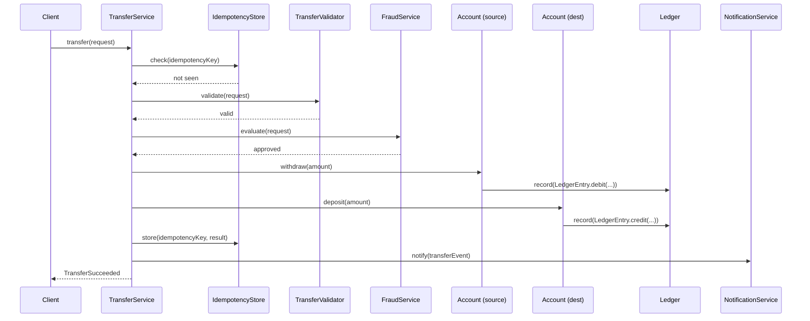

# Object Collaboration — Messages, Sequence, Contracts

> A single object can do almost nothing useful. Real behavior emerges when objects collaborate: one sends a message, another receives it, decides what to do, and possibly sends further messages. This chapter is about that flow: what a message is, what a contract is, and how to design collaborations that respect encapsulation ([[02-Encapsulation]]) and stay clear of the Law of Demeter ([[03-Law-of-Demeter]]).

## What you already know

From [[00-OOP-Foundations]]: objects bundle state and behavior behind an interface. From [[02-Encapsulation]]: callers depend only on the contract, not on internals. From [[00-Object-Relationships]]: objects are connected by associations, aggregations, and compositions. From [[04-Responsibilities]]: each object owns the responsibility for its own invariant, and responsibilities become collaborations when one object needs another to fulfill a use case.

Collaboration is the *runtime* view of those structural relationships. The structure says who knows whom; collaboration says who talks to whom, in what order, about what.

## Why this layer exists

Consider the transfer flow from [[00-Banking-Case-Study]]. To execute a transfer, you need to:

1. Check the idempotency key (was this transfer already attempted?).
2. Validate the request (positive amount, accounts exist, currencies match).
3. Evaluate fraud (synchronously or asynchronously).
4. Debit the source account.
5. Credit the destination account.
6. Write two ledger entries (one debit, one credit, summing to zero).
7. Persist the transfer record.
8. Send a notification.
9. Return a result to the caller.

Each of those is the responsibility of a different object (per [[04-Responsibilities]]). None of them can do the whole thing alone. The collaboration — the sequence of messages between them — *is* the transfer. If the sequence is wrong (debit happens before fraud check), the system is wrong. If the messages are addressed wrong (TransferService reaches into Account's balance directly), the encapsulation is gone.

This chapter exists because getting the sequence right is the difference between a system that works and one that does not.

## What is genuinely new here

Three things:

1. **A method call is a message.** The receiver decides what to do; the sender cannot force a particular implementation. This is the original Smalltalk framing, and it matters because it puts the receiver in charge of its own state. The sender asks; the receiver decides.
2. **A collaboration has a contract.** The contract is not the method signature — it is the *behavioral* promise: preconditions (what must be true before), postconditions (what will be true after), invariants (what stays true throughout), and exceptions (what goes wrong). Contracts are documentation, but they are also testable assertions.
3. **The Law of Demeter is the rule that keeps collaborations from becoming tangled.** "Only talk to your immediate friends" — `a.getB().getC().doSomething()` is a violation because the caller is reaching through B to get to C, coupling itself to C's interface. The fix is to *tell* A what you want done, and let A collaborate with B and C internally. This is the seed of [[03-Law-of-Demeter]] and [[04-Tell-Dont-Ask]].

## Concepts

- **Message** — a method invocation from one object (the sender) to another (the receiver). The receiver is in charge of how to respond.
- **Sender / receiver** — the caller and the callee. The receiver is the object whose method is invoked; the sender is the object whose method is doing the invoking.
- **Sequence** — the time-ordered flow of messages across multiple objects. Visualized in UML sequence diagrams ([[02-Sequence-Diagrams]]).
- **Contract** — the behavioral specification of a method or class: preconditions, postconditions, invariants, and exceptions. Originated by Bertrand Meyer (Design by Contract).
- **Precondition** — what must be true before a method is called; the caller's responsibility.
- **Postcondition** — what will be true after a method returns (assuming preconditions held); the method's responsibility.
- **Invariant** — what is always true for an object, before and after every method call.
- **Law of Demeter (seed)** — the heuristic that a method should only send messages to: itself, its parameters, its own fields, and objects it creates. See [[03-Law-of-Demeter]].
- **Tell, Don't Ask (seed)** — the style of sending a command ("do X") rather than querying state and deciding. See [[04-Tell-Dont-Ask]].

## Banking application

The transfer flow is the canonical collaboration. Here is the sequence, with each message labeled by sender and receiver:



Each arrow is a message. Each receiver decides how to handle it:

- `TransferService` does not reach into `Account`'s balance. It *tells* the account to withdraw. The account decides whether the withdrawal is allowed (active status, sufficient funds, overdraft policy).
- `Account` does not write to a global ledger. It *tells* the `Ledger` to record an entry. The ledger decides whether to accept (e.g., the entry is well-formed, the account exists).
- `TransferService` does not validate the request itself. It *tells* `TransferValidator` to validate. The validator returns a result or throws.
- `TransferService` does not notify customers directly. It *tells* `NotificationService` to notify. The notification service decides the channel (email, SMS), the template, and the timing.

Each object owns its responsibility. The collaboration is the orchestration.

### The contract on each message

Each message in the sequence has a contract. For `Account.withdraw(Money amount)`:

- **Preconditions**: account is `ACTIVE` (not `CLOSED`, not `FROZEN`); amount is positive; amount does not exceed overdraft limit.
- **Postconditions**: balance is reduced by `amount`; a `LedgerEntry` of type `DEBIT` is recorded; the entry is immutable.
- **Invariants**: `balance == SUM(ledger_entries.amount)` still holds; balance never goes below `-overdraftLimit`.
- **Exceptions**: `AccountNotActiveException` if status is wrong; `InsufficientFundsException` if amount exceeds limit; `IllegalArgumentException` if amount is non-positive.

The contract is the *real* interface. The Java method signature is just the type-level projection of it. Two implementations of `withdraw` that satisfy the signature but violate the contract (one allows overdraft, one does not) are not substitutable — this is LSP ([[03-LSP]]).

### Code

A minimal sketch of the collaboration:

```java
public final class TransferService {
    private final IdempotencyStore idempotency;
    private final TransferValidator validator;
    private final FraudService fraud;
    private final AccountRepository accounts;
    private final Ledger ledger;
    private final NotificationService notifications;
    private final Clock clock;

    public TransferResult transfer(TransferRequest request) {
        // 1. Idempotency: was this transfer already attempted?
        var existing = idempotency.lookup(request.idempotencyKey());
        if (existing.isPresent()) return existing.get();

        // 2. Validate the request shape
        validator.validate(request);

        // 3. Evaluate fraud
        var fraudResult = fraud.evaluate(request);
        if (fraudResult.isDenied()) {
            var result = new TransferRejected(request.id(), fraudResult.reason());
            idempotency.store(request.idempotencyKey(), result);
            return result;
        }

        // 4. Load accounts
        Account source = accounts.findById(request.from())
            .orElseThrow(() -> new AccountNotFoundException(request.from()));
        Account dest = accounts.findById(request.to())
            .orElseThrow(() -> new AccountNotFoundException(request.to()));

        // 5. Execute the transfer — tell, don't ask
        source.withdraw(request.amount());     // throws if rule violated
        dest.deposit(request.amount());        // throws if rule violated

        // 6. Record the transfer
        var result = new TransferSucceeded(request.id(), request.amount(), clock.instant());
        idempotency.store(request.idempotencyKey(), result);

        // 7. Notify (asynchronously — decoupled from the transfer)
        notifications.notify(new TransferCompletedEvent(request.id()));

        return result;
    }
}
```

Notice the structure:

- `TransferService` is a *coordinator*. It does not compute balances, validate fraud, or send emails. It tells other objects to do those things.
- Each collaborator is injected (composition + dependency injection — see [[05-DIP]]). Tests can substitute mocks.
- The collaboration is one method long. Each step is a single message to a collaborator. No reaching through graphs (`a.getB().getC()`); the Law of Demeter is respected.
- The collaboration is synchronous up to the notification step. The notification is asynchronous because it is not part of the transfer's correctness — the transfer is complete once the accounts are updated and the result is stored. The notification can fail without affecting the transfer's outcome.

### What "tell, don't ask" looks like in the collaboration

Compare two versions of the debit step:

```java
// WRONG — ask, then decide
if (source.status() == AccountStatus.ACTIVE
        && source.balance().compareTo(request.amount()) >= 0) {
    source.setBalance(source.balance().subtract(request.amount()));
    ledger.record(LedgerEntry.debit(source.id(), request.amount(), clock.instant()));
} else {
    throw new TransferFailedException("Source cannot be debited");
}
```

```java
// RIGHT — tell, don't ask
source.withdraw(request.amount());   // Account decides; throws if rule violated
```

The wrong version reaches into `Account`'s state, makes the decision in the caller, then mutates the state from outside. The right version tells the account to withdraw; the account makes the decision and mutates its own state. The caller is decoupled from the rule. When the rule changes (e.g., "checking accounts can overdraft up to a limit"), only `Account` changes. The `TransferService` is unaffected. See [[04-Tell-Dont-Ask]].

## What can go wrong

1. **God object collaboration.** One service does everything; the other objects are data containers. The collaboration is just the service manipulating data. This is the anemic domain model — see [[05-Anemic-vs-Rich-Models]].
2. **Feature envy collaboration.** A method on `TransferService` is mostly interested in `Account`'s data. The collaboration is one-sided: `TransferService` asks, `Account` answers. Cure: move the method to the object whose data it works on.
3. **Train wreck collaboration.** `transferService.transfer(request).getReceipt().getAccount().getOwner().getEmail()` — a chain of accesses that couples the caller to the entire shape of the result graph. Cure: return a closed result type; do not expose the internal objects. See [[03-Law-of-Demeter]].
4. **Synchronous when asynchronous was needed.** The notification step above is synchronous in the wrong design: the transfer blocks until the email is sent. If the email server is slow, the transfer is slow. If it is down, the transfer fails — even though the money has moved. Cure: separate the synchronous correctness path (transfer) from the asynchronous side effects (notification, audit, analytics). See [[04-Domain-Events]].
5. **Asynchronous when synchronous was needed.** Conversely, the debit step cannot be asynchronous — the transfer is not complete until both accounts are updated atomically. If you push the debit to a queue, you have lost the atomicity guarantee. Cure: keep the correctness path synchronous and transactional; push only side effects to async. See [[00-ACID]].
6. **Contracts that are not documented.** The signature `withdraw(Money)` does not say "throws if account is not active." Callers either assume it (and break) or read the source (and couple to implementation). Cure: document contracts in Javadoc; test them as assertions; consider tools like `@Contract` annotations or assertions (Java `assert`).

## Trade-offs

- **Synchronous vs asynchronous collaboration.** Synchronous is simpler (you can reason locally) but couples availability (caller fails if callee is down). Asynchronous decouples availability but introduces eventual consistency and retry complexity. See [[08-Trade-offs-Everywhere]] and [[04-Domain-Events]].
- **Rich collaboration (many small messages) vs coarse collaboration (one big call).** Rich collaboration is more flexible (each step can be tested, mocked, varied) but adds overhead and indirection. Coarse collaboration is faster but harder to vary. Banking usually picks rich for the domain core (transfers, accounts) and coarse for external integrations (one API call per payment network).
- **Contracts as documentation vs contracts as code.** Documentation is cheap but can drift from reality. Code (assertions, type systems, formal contracts) is reliable but adds ceremony. The middle ground: document contracts in Javadoc, test them with focused unit tests, use the type system where it can express them (e.g., `Optional<Account>` instead of nullable `Account`).
- **Coupling through messages vs coupling through shared state.** Two objects that communicate only through messages are coupled only through the message contract. Two objects that share mutable state (a global, a singleton) are coupled through every mutation. Always prefer message coupling; it is the weaker form. See [[06-Coupling-and-Cohesion]].
- **Coordination in the service vs in the entity.** Some collaborations naturally belong in a service (`TransferService` coordinates `Account`, `Ledger`, `FraudService`). Some belong in an entity (`Account.deposit` coordinates its balance and its ledger entries). The rule: if the collaboration crosses aggregate boundaries, put it in a service; if it stays within one aggregate, put it in the entity. See [[02-Aggregates]].

## Forward links

- [[03-Law-of-Demeter]] — the rule that keeps collaborations from becoming tangled.
- [[04-Tell-Dont-Ask]] — the calling style that makes collaborations respect encapsulation.
- [[02-Sequence-Diagrams]] — UML notation for the sequences we drew here.
- [[02-Aggregates]] — the consistency boundary that determines which collaborations are intra-aggregate (synchronous, transactional) and which are inter-aggregate (often asynchronous, eventual).
- [[04-Domain-Events]] — the mechanism for decoupled asynchronous collaboration.
- [[05-Anemic-vs-Rich-Models]] — the trade-off between putting collaboration in services vs in entities.
- [[00-ACID]] — the transactional guarantee that synchronous collaborations depend on.
