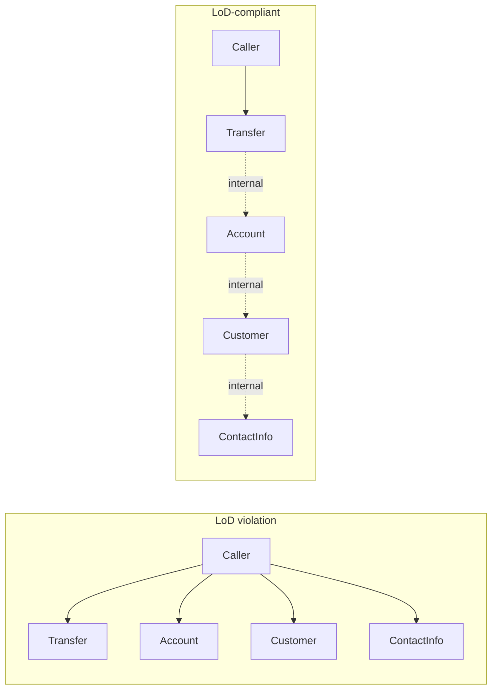

# The Law of Demeter — Only Talk to Your Immediate Friends

> The Law of Demeter is a heuristic that keeps object collaborations from becoming tangled. The rule is simple: a method should send messages only to itself, its parameters, the objects it creates, and its own components. The pattern it warns against is `a.getB().getC().doSomething()` — a "train wreck" that couples the caller to the entire chain.

## What you already know

From [[02-Encapsulation]]: callers should depend only on an object's contract, not on its internals. From [[01-Object-Collaboration]]: a method call is a message; the receiver is in charge. From [[06-Coupling-and-Cohesion]]: stamp and content coupling — depending on a data structure's shape rather than its contract — are tight forms of coupling. From [[03-Dependency-As-Root-Concept]]: every dependency is a place a change can ripple.

The Law of Demeter (LoD) is the rule that extends encapsulation across object graphs. It says: do not just hide *your* internals from callers; do not let callers reach *through* you to your collaborators.

## Why this layer exists

Consider this code:

```java
public void processTransfer(Transfer transfer) {
    String email = transfer.getDestination().getOwner().getContactInfo().getEmail();
    notificationService.sendEmail(email, "Transfer received");
}
```

This code knows about `Transfer`, `Account`, `Customer`, `ContactInfo`, and `NotificationService`. It knows that a transfer has a destination; that the destination has an owner; that the owner has contact info; that the contact info has an email. It depends on the *shape* of the entire object graph.

Now suppose the customer's contact info structure changes — say, emails become a list rather than a single value. Every line of code in the codebase that did `getContactInfo().getEmail()` breaks. The change ripples through callers that, conceptually, had nothing to do with contact info.

The Law of Demeter exists to prevent that ripple. If the caller instead asks the transfer to notify its destination, the chain collapses:

```java
public void processTransfer(Transfer transfer) {
    transfer.notifyDestination(notificationService);   // or similar
}
```

The caller depends only on `Transfer` and `NotificationService`. The internal shape of the graph — destination, owner, contact info — is the transfer's business, not the caller's.

## What is genuinely new here

Two things:

1. **The LoD is about *transitive* dependencies, not just direct ones.** A direct dependency (`a.doSomething()`) is normal and unavoidable. A transitive dependency (`a.getB().doSomething()`) is the smell — it makes the caller depend on B's interface, even though the caller never asked to know about B. The fix is to push the responsibility one level deeper: tell `a` what you want, and let `a` collaborate with `b` internally.
2. **The LoD has legitimate exceptions.** Fluent APIs (builders, streams), DTOs and value objects, and serialization frameworks all violate the LoD by design. The rule is a heuristic for *domain* code, not a syntactic constraint that must never be broken. Knowing when to break it is as important as knowing when to follow it.

## Concepts

- **Law of Demeter (LoD)** — the rule that a method `m` of class `C` should only send messages to: (1) `C` itself, (2) `m`'s parameters, (3) objects created within `m`, (4) `C`'s own components (fields). Originated at Northeastern University (Demeter project); often called the "principle of least knowledge."
- **Train wreck** — a chain of method calls like `a.getB().getC().getD()`. A symptom of LoD violation.
- **Transitive dependency** — a dependency on an object you reach *through* another object, rather than directly.
- **Tell, Don't Ask (seed)** — the LoD's natural companion. Instead of asking an object for its parts and deciding what to do, tell the object what you want done. See [[04-Tell-Dont-Ask]].
- **Fluent API** — an API designed for chaining (`Stream.map().filter().collect()`). Deliberately violates the LoD because the chain is the point.
- **Value object / DTO** — a data carrier whose entire purpose is to expose its fields. LoD does not apply to these.

## Banking application

Let's work through several LoD violations in the Banking case study ([[00-Banking-Case-Study]]) and their fixes.

### Violation 1: reaching through a transfer

```java
// VIOLATION — train wreck
public void sendReceipt(Transfer transfer) {
    Customer owner = transfer.getDestination().getOwner();
    String email = owner.getContactInfo().getEmail();
    String name = owner.getName();
    notificationService.sendEmail(email, "Dear " + name + ", you received " + transfer.getAmount());
}
```

The caller reaches through `Transfer` → `Account` → `Customer` → `ContactInfo` to get an email. It depends on four classes' interfaces. If any of them changes — say, `ContactInfo` is replaced by a list of contact methods — this code breaks.

The fix is to push the responsibility into `Transfer`:

```java
// FIX — tell the transfer to send its own receipt
public void sendReceipt(Transfer transfer, NotificationService notifications) {
    transfer.sendReceiptToDestination(notifications);
}

// Inside Transfer:
public void sendReceiptToDestination(NotificationService notifications) {
    notifications.notify(destination.owner(), receiptMessage());
}
```

Now the caller depends only on `Transfer` and `NotificationService`. The chain is internal to `Transfer`.

### Violation 2: asking an account about its owner's risk profile

```java
// VIOLATION — reaching through Account → Customer → RiskProfile
public boolean shouldBlockWithdrawal(Account account, Money amount) {
    RiskProfile profile = account.getOwner().getRiskProfile();
    return profile.isHighRisk() && amount.isGreaterThan(Money.of(10000));
}
```

The caller asks the account for its owner, then asks the owner for its risk profile. The caller is now coupled to `Customer` and `RiskProfile`. Worse, the rule ("block high-risk customers from withdrawing more than 10,000") is a *policy* that belongs somewhere — but where?

The fix: this is a *withdrawal policy* (a strategy — see [[04-Polymorphism]]). The account should hold one, and the policy should be consulted by the account:

```java
// FIX — make it a withdrawal policy
public interface WithdrawalPolicy {
    boolean allows(Account account, Money amount);
}

public final class RiskAwareWithdrawal implements WithdrawalPolicy {
    private final CustomerRepository customers;
    public boolean allows(Account account, Money amount) {
        Customer owner = customers.findById(account.ownerId());
        return !(owner.riskProfile().isHighRisk() && amount.isGreaterThan(Money.of(10000)));
    }
}

// Inside Account:
public void withdraw(Money amount) {
    if (!withdrawalPolicy.allows(this, amount)) {
        throw new WithdrawalBlockedException(id, amount);
    }
    // ...
}
```

The caller no longer asks about risk profiles. The account's withdrawal policy handles it. The caller just calls `account.withdraw(amount)`.

### Violation 3: traversing the ledger for a balance

```java
// VIOLATION — caller computes the balance from the ledger
public Money getBalance(Account account) {
    return account.getEntries().stream()
        .map(LedgerEntry::amount)
        .reduce(Money.ZERO, Money::add);
}
```

This is a violation in spirit even though it does not look like a train wreck. The caller is reaching into the account's internal ledger to compute a derived value. If the account ever switches to storing a cached balance (the denormalization trade-off from [[08-Trade-offs-Everywhere]] and [[10-Normalization-Trade-offs]]), this caller breaks — or worse, silently disagrees with the cached balance.

The fix: the account should expose its balance as a method. Internally, it can compute from the ledger or read the cached column.

```java
// FIX — account exposes balance; caller does not reach in
public Money getBalance(Account account) {
    return account.balance();
}

// Inside Account:
public Money balance() {
    return cachedBalance;  // or: entries.stream().map(...).reduce(...)
}
```

The caller depends only on `Account.balance()`. The implementation is the account's business.

### When the LoD is too strict

The LoD is a heuristic for *domain* code. There are legitimate cases where it does not apply:

#### Fluent APIs and builders

```java
Stream<Account> active = accounts.stream()
    .filter(a -> a.status() == AccountStatus.ACTIVE)
    .map(Account::balance)
    .filter(b -> b.amount().compareTo(BigDecimal.ZERO) > 0);
```

This is a train wreck syntactically. It is fine semantically — `Stream` is a *fluent* API designed for chaining. The chain is the contract; the intermediate types are documented; the API is stable. Trying to "fix" this by hiding the stream behind a method loses the expressiveness of the fluent style.

#### Value objects and records

```java
Money total = account.balance().add(fee).subtract(discount);
Iban iban = transfer.destination().iban();
LocalDate date = transfer.executedAt().toLocalDate();
```

These are also train wrecks syntactically. They are fine because `Money`, `Iban`, and `LocalDate` are *value objects* — their entire purpose is to expose their values. There is no internal state to hide. The LoD does not apply.

#### Serialization frameworks and DTOs

```java
String json = objectMapper.writeValueAsString(transfer);
```

The framework will reflectively reach into the transfer's fields. That is its job. The LoD is about *your* code, not about the frameworks you use.

#### The test: when is a train wreck acceptable?

A train wreck is acceptable when:

1. The intermediate types are *value objects* (immutable, no behavior to hide, no invariants to protect).
2. The chain is part of a *fluent API* designed for chaining (the chain is the contract).
3. The intermediate types are *stable* (they have not changed and are unlikely to change).

A train wreck is *not* acceptable when:

1. The intermediate types are *entities* with invariants and behavior.
2. The chain is *ad hoc* (the caller discovered the path by reading the source).
3. The intermediate types are *unstable* (they change every sprint).

The banking examples above are all in the "not acceptable" category: `Account`, `Customer`, `ContactInfo` are entities with behavior and invariants. Reaching through them couples callers to their internal shape.

### The cost of LoD violations

The cost is coupling. Specifically:

1. **Ripple of change.** A change to any class in the chain ripples to every caller that traverses the chain. Change `Customer` to have a list of contact methods instead of one, and every `getContactInfo().getEmail()` call breaks.
2. **Brittle tests.** Tests must construct the entire chain to exercise a single method. To test `sendReceipt(transfer)`, you need a transfer with a destination with an owner with contact info with an email. The test setup is larger than the method under test.
3. **Hidden assumptions.** The caller assumes the chain is non-null at every step. If any link is null, you get an NPE far from the cause. The fix (null checks at every step) makes the code worse, not better.
4. **God object temptation.** When every caller reaches through the graph, the graph itself becomes the god object. Refactoring the graph becomes impossible because every caller depends on every shape.

## Code

A summary of the patterns:

```java
// VIOLATION — train wreck through entities
public void sendReceipt(Transfer t) {
    String email = t.getDestination().getOwner().getContactInfo().getEmail();
    notificationService.sendEmail(email, "Transfer received");
}

// FIX — tell, don't ask
public void sendReceipt(Transfer t) {
    t.sendReceiptToDestination(notificationService);
}

// ACCEPTABLE — fluent API
public List<Money> activeAccountBalances(List<Account> accounts) {
    return accounts.stream()
        .filter(a -> a.status() == AccountStatus.ACTIVE)
        .map(Account::balance)
        .toList();
}

// ACCEPTABLE — value object chain
public Money totalAfter(Money balance, Money fee, Money discount) {
    return balance.add(fee).subtract(discount);
}
```



The compliant version has one arrow from the caller. The internal arrows are the transfer's business.

## What can go wrong

1. **Over-applying the LoD.** Pushing every chain behind a method can produce a class with dozens of one-line delegation methods. The class becomes a "forwarder" with no behavior of its own. Cure: apply the LoD when the intermediate types are entities with invariants; leave chains alone when they are value objects or fluent APIs.
2. **Hiding the wrong thing.** Pushing a chain behind a method on the wrong class. Example: `Transfer.sendReceiptToDestination()` is fine; `NotificationService.sendReceiptFor(Transfer)` is also fine. But `Account.sendReceiptForTransfer(Transfer)` is wrong — the account should not know about transfers. The method goes on the class that owns the responsibility (see [[04-Responsibilities]]).
3. **Confusing syntactic chains with semantic violations.** A chain of value-object methods (`balance.add(fee).subtract(discount)`) is syntactically a train wreck but semantically fine. A single method call (`account.getOwner()`) is syntactically clean but semantically a violation if the caller then asks the owner for its risk profile. The LoD is about *semantic* coupling, not syntax.
4. **LoD-compliant code that still smells.** Sometimes pushing a chain behind a method just moves the smell. `transfer.sendReceiptToDestination(notifications)` is LoD-compliant, but if `Transfer` then reaches through `destination.getOwner().getContactInfo()`, the smell is now inside `Transfer`. The cure is to keep pushing — `destination.notifyOwner(notifications, message)` — until each class is talking only to its immediate friends.
5. **LoD violations in tests.** Tests that construct deep object graphs to set up a single scenario are a sign that the production code has LoD violations. If the test setup is enormous, the production caller probably has an enormous chain too. Cure: refactor the production code; the test will simplify.

## Trade-offs

- **Encapsulation vs expressiveness.** Strict LoD compliance pushes behavior into collaborators, which can make the caller less expressive. `transfer.notifyDestination()` is less informative than `emailService.send(transfer.destination().owner().email(), ...)`. The cure is good method names — `notifyDestination` is informative; `doIt` is not.
- **Locality vs distribution.** Pushing behavior into collaborators distributes the logic across more classes. Each class is simpler; the system as a whole is harder to trace. Sequence diagrams ([[02-Sequence-Diagrams]]) help.
- **Method count vs method depth.** LoD compliance tends to produce more, smaller methods. Each is simpler; the call stack is deeper. Debugging is slightly harder; testing is much easier.
- **Strictness vs pragmatism.** The strict LoD forbids any chain. The pragmatic LoD forbids chains through entities. Most teams should aim for the pragmatic version. The strict version is for libraries and frameworks where stability is paramount.
- **LoD vs fluent APIs.** Fluent APIs deliberately chain. Reconciling them: a fluent API is a *contract* that happens to be expressed as a chain. The LoD is about not depending on shapes you should not know about. A fluent API documents its shape; an ad-hoc chain does not.

## Forward links

- [[04-Tell-Dont-Ask]] — the calling style that naturally produces LoD-compliant code.
- [[02-Encapsulation]] — the foundational principle the LoD extends.
- [[06-Coupling-and-Cohesion]] — the coupling cost the LoD prevents.
- [[04-ISP]] — interface segregation as another way to keep dependencies narrow.
- [[05-Anemic-vs-Rich-Models]] — anemic models invite LoD violations because the data is exposed and the behavior is in services.
- [[02-Sequence-Diagrams]] — the visualization that makes LoD violations obvious.
