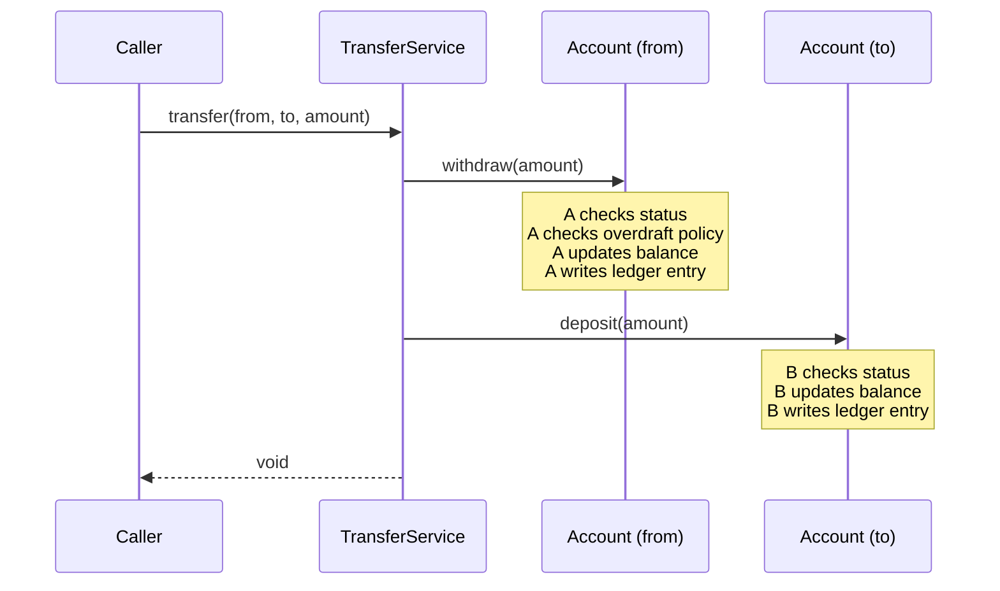

# Tell, Don't Ask — Commands over Interrogation

> "Tell, Don't Ask" is the calling style that respects encapsulation: tell an object what to do, do not interrogate it for its state and then decide. The rule sounds trivial; its consequences are not. Following it localizes invariants, prevents scattered rules, and keeps change from rippling. Violating it produces exactly the God Objects and anemic models that wreck codebases.

## What you already know

From [[02-Encapsulation]]: an object's state should be unreachable from outside; only its methods can mutate it. From [[01-Object-Collaboration]]: a method call is a message; the receiver decides what to do. From [[03-Law-of-Demeter]]: do not reach through an object to its collaborators. From [[04-Responsibilities]]: whoever owns the invariant owns the responsibility for enforcing it.

Tell, Don't Ask is the calling convention that ties those four together. It is the *practice* that makes encapsulation real in everyday code.

## Why this layer exists

Here is the pattern this chapter exists to kill:

```java
// ANTI-PATTERN — ask, decide, mutate
public void withdraw(Account account, Money amount) {
    if (account.getStatus() == AccountStatus.ACTIVE
            && account.getBalance().compareTo(amount) >= 0) {
        account.setBalance(account.getBalance().subtract(amount));
        ledger.record(new LedgerEntry(account.getId(), amount.negate(), Instant.now()));
    } else {
        throw new WithdrawalFailedException();
    }
}
```

This code looks reasonable. It checks the rules, then acts. But notice what has happened:

- The rule ("active accounts with sufficient balance can withdraw") is now in the *caller*, not in the account.
- The mutation (`setBalance`) is in the caller, not in the account.
- The ledger entry creation is in the caller, not in the account.
- Every caller that wants to do a withdrawal must repeat this code — or must remember to call this helper.

If a second caller writes `account.setBalance(account.getBalance().subtract(amount))` without the checks, the invariant is broken. The encapsulation is theoretical; in practice, anyone can mutate the balance however they want, because the balance is exposed.

Tell, Don't Ask fixes this by moving the rule, the mutation, and the side effects into the account:

```java
// FIX — tell the account to withdraw; it decides
public void withdraw(Account account, Money amount) {
    account.withdraw(amount);   // throws if rule violated
}
```

The caller no longer knows the rule. The caller cannot bypass the rule. When the rule changes (e.g., "checking accounts can overdraft up to a limit"), only `Account` changes. Every caller is unaffected.

## What is genuinely new here

Three things:

1. **Tell, Don't Ask is the practice that makes encapsulation non-optional.** If you have private fields but public getters and setters, your encapsulation is decorative. If you have private fields, no setters, and command methods that enforce rules, your encapsulation is real. The difference is the calling style.
2. **The fix is always the same shape: replace a query-then-mutate with a single command.** `if (account.canWithdraw(amount)) account.withdraw(amount)` becomes `account.withdraw(amount)`. The "can" check disappears into the "do" method, which throws if it cannot.
3. **The rule has a known tension with CQRS and query-heavy code.** Reading state (queries) is fundamentally different from changing state (commands). Tell, Don't Ask applies to commands; it does not say "never read state." It says: when you want to *change* state, tell the object to change it; do not read its state and change it from outside.

## Concepts

- **Tell, Don't Ask** — the calling style: send commands ("do X") to objects; do not interrogate them for state and then decide what to do.
- **Command method** — a method that changes state and returns `void` (or a status). `account.withdraw(amount)`. The receiver decides whether and how to execute.
- **Query method** — a method that returns state without changing it. `account.balance()`. Queries are fine; the rule is about commands.
- **CQRS (Command-Query Responsibility Segregation)** — the architectural pattern that separates commands from queries at the system level. The same distinction Tell, Don't Ask makes at the object level. See [[04-Enterprise-Patterns]].
- **Feature envy** — the code smell where a method on class A is mostly interested in class B's data. Usually a Tell, Don't Ask violation — the method should be on B.
- **Anemic domain model** — the anti-pattern where entities have only data and services have all the behavior. The consequence of pervasive Tell-Don't-Ask violations. See [[05-Anemic-vs-Rich-Models]].

## Banking application

The Banking case study ([[00-Banking-Case-Study]]) has ten invariants. Each one is a candidate for Tell, Don't Ask. Let's walk through the major ones.

### Invariant 1: Balance equals the sum of ledger entries

**Violation:**

```java
// ASK — caller computes and sets the balance
public void applyDeposit(Account account, Money amount) {
    account.setBalance(account.getBalance().add(amount));
    ledger.add(new LedgerEntry(account.getId(), amount, Instant.now()));
}
```

The caller is responsible for keeping the balance and the ledger in sync. If the caller forgets the ledger entry, the invariant is silently broken.

**Fix:**

```java
// TELL — account updates its own state atomically
public void applyDeposit(Account account, Money amount) {
    account.deposit(amount);
}

// Inside Account:
public void deposit(Money amount) {
    ensureActive();
    ensurePositive(amount);
    this.balance = balance.add(amount);
    this.entries.add(LedgerEntry.credit(id, amount, Instant.now()));
}
```

The caller tells the account to deposit. The account updates its balance and writes its ledger entry in one method. The invariant is enforced locally; there is no way to update the balance without writing the ledger entry.

### Invariant 2: Savings accounts cannot go negative; checking can overdraft

**Violation:**

```java
// ASK — caller checks the rule based on account type
public void withdraw(Account account, Money amount) {
    Money newBalance = account.getBalance().subtract(amount);
    if (account instanceof SavingsAccount && newBalance.amount().signum() < 0) {
        throw new InsufficientFundsException();
    }
    if (account instanceof CheckingAccount) {
        CheckingAccount c = (CheckingAccount) account;
        if (newBalance.amount().compareTo(c.getOverdraftLimit().negate()) < 0) {
            throw new InsufficientFundsException();
        }
    }
    account.setBalance(newBalance);
}
```

The caller knows the rules for each account type. Every new account type means a new branch. Every change to a rule means editing the caller. This is also a violation of the Open/Closed Principle ([[02-OCP]]) and LSP ([[03-LSP]]).

**Fix:**

```java
// TELL — account enforces its own rules
public void withdraw(Account account, Money amount) {
    account.withdraw(amount);
}

// Inside Account (with strategy):
public void withdraw(Money amount) {
    ensureActive();
    var result = withdrawalPolicy.evaluate(this, amount);
    switch (result) {
        case Allowed __ -> applyWithdrawal(amount);
        case Denied d   -> throw new InsufficientFundsException(id, d.reason());
    }
}

private void applyWithdrawal(Money amount) {
    this.balance = balance.subtract(amount);
    this.entries.add(LedgerEntry.debit(id, amount, Instant.now()));
}
```

The caller tells the account to withdraw. The account consults its own withdrawal policy (a strategy — see [[04-Polymorphism]]). The rule lives with the account, where it belongs.

### Invariant 8: Closed accounts cannot transact

**Violation:**

```java
// ASK — caller checks the status before transacting
public void deposit(Account account, Money amount) {
    if (account.getStatus() != AccountStatus.CLOSED) {
        account.setBalance(account.getBalance().add(amount));
    } else {
        throw new AccountClosedException();
    }
}
```

The caller must remember to check. If a second caller forgets, the closed account receives a deposit.

**Fix:**

```java
// TELL — account checks its own status
public void deposit(Account account, Money amount) {
    account.deposit(amount);   // throws if closed
}
```

The check is inside `deposit`. No caller can bypass it. The invariant holds by construction.

### Invariant 5: Transfers are atomic

**Violation:**

```java
// ASK — caller orchestrates the debit and credit manually
public void transfer(Account from, Account to, Money amount) {
    if (from.getBalance().compareTo(amount) >= 0) {
        from.setBalance(from.getBalance().subtract(amount));
        to.setBalance(to.getBalance().add(amount));
    } else {
        throw new InsufficientFundsException();
    }
}
```

If the process crashes between the debit and the credit, money is lost. The caller is responsible for the atomicity — and callers are bad at that.

**Fix:**

```java
// TELL — tell each account to do its part, inside a transaction
@Transactional
public void transfer(Account from, Account to, Money amount) {
    from.withdraw(amount);   // throws if insufficient
    to.deposit(amount);      // throws if closed
}
```

The transaction (see [[00-ACID]]) wraps the two operations. If the second throws, the transaction rolls back the first. The caller tells; the accounts do; the transaction guarantees atomicity. Each piece has one job.

### Invariant 7: Idempotency of transfers

**Violation:**

```java
// ASK — caller checks whether the transfer was already done
public TransferResult transfer(TransferRequest req) {
    Transfer existing = transferRepo.findByIdempotencyKey(req.idempotencyKey());
    if (existing != null) {
        if (existing.getStatus() == TransferStatus.SUCCEEDED) {
            return TransferResult.succeeded(existing.getId());
        }
        // ... and so on
    }
    // do the transfer
}
```

The caller knows the structure of the stored transfer. If the storage shape changes, the caller breaks.

**Fix:**

```java
// TELL — the idempotency store decides
public TransferResult transfer(TransferRequest req) {
    return idempotency.execute(req.idempotencyKey(), () -> doTransfer(req));
}

// Inside IdempotencyStore:
public <T> T execute(IdempotencyKey key, Supplier<T> action) {
    Optional<T> existing = lookup(key);
    if (existing.isPresent()) return existing.get();
    T result = action.get();
    store(key, result);
    return result;
}
```

The caller tells the store to execute something idempotently. The store decides whether to run the action or return the cached result. The caller does not know how the store works.

### The pattern, summarized

| Anti-pattern (Ask) | Refactor (Tell) |
|---|---|
| `if (a.canX()) a.doX()` | `a.doX()` — let it throw if it cannot |
| `a.setX(a.getX() + 1)` | `a.incrementX()` |
| `if (a.getStatus() == ACTIVE) a.setX(...)` | `a.setX(...)` — let `setX` check status |
| `if (a instanceof T) ((T) a).specificMethod()` | `a.commonMethod()` — let polymorphism dispatch |
| `a.getB().getC().doSomething()` | `a.doSomethingViaCollaborators()` — let `a` orchestrate |

Every refactor moves the rule from the caller into the receiver. Every refactor shrinks the caller's dependency surface. Every refactor makes the invariant local to the object that owns it.

## Code

A complete example showing the contrast:

```java
// WRONG — Tell-Don't-Ask violation
public final class TransferServiceWrong {
    public void transfer(Account from, Account to, Money amount) {
        if (from.getStatus() != AccountStatus.ACTIVE) {
            throw new AccountNotActiveException(from.getId());
        }
        if (to.getStatus() != AccountStatus.ACTIVE) {
            throw new AccountNotActiveException(to.getId());
        }
        Money newFromBalance = from.getBalance().subtract(amount);
        if (newFromBalance.amount().signum() < 0) {
            throw new InsufficientFundsException(from.getId(), amount);
        }
        from.setBalance(newFromBalance);
        to.setBalance(to.getBalance().add(amount));
    }
}

// RIGHT — Tell, Don't Ask
public final class TransferServiceRight {
    @Transactional
    public void transfer(Account from, Account to, Money amount) {
        from.withdraw(amount);
        to.deposit(amount);
    }
}

// Inside Account (rich domain model):
public final class Account {
    private Money balance;
    private AccountStatus status;
    private final WithdrawalPolicy withdrawalPolicy;
    private final List<LedgerEntry> entries = new ArrayList<>();

    public void withdraw(Money amount) {
        ensureActive();
        var result = withdrawalPolicy.evaluate(this, amount);
        if (result instanceof WithdrawalPolicy.Denied d) {
            throw new InsufficientFundsException(id, d.reason());
        }
        this.balance = balance.subtract(amount);
        this.entries.add(LedgerEntry.debit(id, amount, Instant.now()));
    }

    public void deposit(Money amount) {
        ensureCanReceive();
        ensurePositive(amount);
        this.balance = balance.add(amount);
        this.entries.add(LedgerEntry.credit(id, amount, Instant.now()));
    }

    private void ensureActive() {
        if (status != AccountStatus.ACTIVE) {
            throw new AccountNotActiveException(id, status);
        }
    }
    private void ensureCanReceive() {
        if (status == AccountStatus.CLOSED) {
            throw new AccountClosedException(id);
        }
    }
    // ...
}
```

The `TransferServiceRight` is four lines. The `TransferServiceWrong` is fifteen. The difference is where the rules live: in the service (wrong) or in the account (right). The right version's `TransferService` cannot accidentally bypass a rule, because it never sees the rule. The right version's `Account` cannot be misused, because every mutation goes through a method that enforces the rule.



Each account is told what to do. Each account decides whether and how to do it. The transfer service coordinates; the accounts enforce the rules.

## What can go wrong

1. **Over-telling.** Pushing every decision into the receiver can produce a class with hundreds of command methods. `Account.sendPasswordResetEmail()` is wrong — that is not the account's responsibility. Cure: apply Tell, Don't Ask only for state the receiver owns; use services for cross-cutting concerns.
2. **Returning too much.** A command method that returns a large result object forces the caller to know about the result's shape. Cure: return a small, closed result type (often a sealed interface — see [[06-Abstract-Classes-And-Interfaces]]); do not return internal objects.
3. **Confusing queries with commands.** Tell, Don't Ask is about commands. Queries ("what is the balance?") are fine; the caller reads state without changing it. Do not try to eliminate all queries — that produces unusable APIs. The distinction is CQRS at the object level (see [[04-Enterprise-Patterns]]).
4. **Anemic models that look rich.** A class with private fields, getters, and one-line command methods that just call setters is not rich — it is anemic with extra steps. The test: does the command method enforce a rule? If not, it is a setter in disguise.
5. **Tell, Don't Ask across aggregate boundaries.** Within an aggregate (see [[02-Aggregates]]), Tell, Don't Ask is correct. Across aggregate boundaries, the receiver may not be in the same transaction — telling it to do something does not guarantee it does it. Cure: use domain events ([[04-Domain-Events]]) for cross-aggregate communication; reserve Tell, Don't Ask for in-aggregate commands.

## Trade-offs

- **Encapsulation vs introspection.** Tell, Don't Ask hides the rule inside the receiver. That is good for change cost; it is bad for callers that genuinely need to know the rule (e.g., a UI that wants to disable the "withdraw" button when the balance is insufficient). Cure: expose a *query* for the UI hint (`account.canWithdraw(amount)`) while keeping the *command* (`account.withdraw(amount)`) as the source of truth. The query is advisory; the command is authoritative.
- **Rich models vs testability.** Rich models (behavior in entities) are cohesive but harder to test in isolation — testing `Account.withdraw` requires constructing an account with a balance, a status, a policy. Anemic models (behavior in services) are easier to test but spread the rule across the service and the entity. Banking usually picks rich for entities with strong invariants; see [[05-Anemic-vs-Rich-Models]].
- **Synchronous tell vs asynchronous event.** `account.withdraw(amount)` is synchronous — the caller knows when it is done. `events.publish(new WithdrawalRequested(account.id(), amount))` is asynchronous — the caller does not know when (or whether) the withdrawal happens. Synchronous is simpler; asynchronous is more decoupled. Use synchronous for in-aggregate commands; use events for cross-aggregate side effects.
- **Method count vs method depth.** Tell, Don't Ask tends to produce more command methods on entities. Each is small; the entity grows. The alternative (a service with fewer methods that reach into the entity) produces fewer methods but each is larger. The first is easier to test; the second is easier to read top-to-bottom.
- **Returning state vs returning void.** Pure Tell, Don't Ask returns `void`. Sometimes the caller genuinely needs the new state (e.g., the new balance after a deposit). Cure: return a small value type (the new balance, or a result object) without exposing the entity's internals. The line is: return data the caller asked for; do not return handles to internal objects.

## Forward links

- [[02-Encapsulation]] — the principle Tell, Don't Ask enforces.
- [[03-Law-of-Demeter]] — the companion rule that keeps the telling local.
- [[04-Responsibilities]] — the responsibility assignment that makes Tell, Don't Ask natural.
- [[05-Anemic-vs-Rich-Models]] — the trade-off between rich (Tell-friendly) and anemic (Ask-friendly) models.
- [[04-Enterprise-Patterns]] — CQRS as the architectural expression of Tell vs Ask.
- [[02-Aggregates]] — the boundary that determines when Tell, Don't Ask is appropriate (in-aggregate) vs when events are needed (cross-aggregate).
- [[00-SOLID-as-Dependency-Management]] — Tell, Don't Ask as the practice that makes SRP and OCP real.
