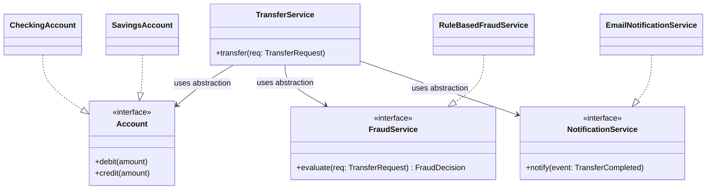

# SOLID as Dependency Management

> The thesis of this chapter: SOLID is not five principles. It is **one principle** — *manage dependencies* — viewed from five angles. Once you see that, the five letters become five heuristics for the same root operation: steering the direction and weight of dependencies inside a codebase.

## What you already know

From [[03-Dependency-As-Root-Concept]]: a dependency exists when a change in one place can force a change in another place. There are exactly two operations you can perform on a dependency: **reduce** it (fewer edges in the graph) or **invert** it (flip the arrow so it points toward stability). From [[06-Coupling-and-Cohesion]]: coupling is the measure of dependency between modules; cohesion is the measure of how much the parts within a module belong together. From [[07-Composition-vs-Inheritance]]: inheritance is the tightest form of coupling between classes; composition is looser and replaceable.

You have also seen, in [[04-Responsibilities]], the rule that *whoever owns the invariant owns the responsibility for enforcing it*. That rule already seeds three of the five SOLID letters.

## Why this layer exists

Beginners learn SOLID as five unrelated mnemonics: "one reason to change," "open for extension," "subtypes substitutable," "no fat interfaces," "depend on abstractions." Memorized in isolation, each feels like a slogan. Worse, they appear to conflict — SRP says *split*; ISP says *split*; OCP says *do not modify*; LSP says *preserve the contract*; DIP says *invert*. Without an organizing frame, engineers apply them mechanically and produce over-abstracted code (every class behind three interfaces) or under-abstracted code (a few God Objects).

The thesis of this chapter removes that confusion. Every SOLID letter is a heuristic for one of the two dependency operations. If you remember the operation, the letter follows.

## What is genuinely new here

The unification:

| Letter | Common phrasing | Reframed as dependency management |
|---|---|---|
| **S** — SRP | One reason to change | Cohesion test: a class with one responsibility has *one axis of change*, so it has *fewer inbound dependency ripples*. SRP is the cohesion heuristic on the dependency graph. |
| **O** — OCP | Open for extension, closed for modification | Add new dependencies (new subclasses, new strategies) without editing existing dependents. OCP is "the dependency graph should be extensible at its leaves, not rewritable at its trunk." |
| **L** — LSP | Subtypes substitutable for base types | A subtype that breaks the base contract *silently rewrites* the assumptions every dependent made about the base. LSP is "polymorphism must not smuggle new dependencies into dependents." |
| **I** — ISP | Clients shouldn't depend on what they don't use | A fat interface forces every consumer to depend on every method, even ones they never call. ISP is "trim the dependency surface to what each consumer actually needs." |
| **D** — DIP | Depend on abstractions, not concretions | Invert the arrow so the high-level policy and the low-level detail both depend on a shared abstraction. DIP is the explicit *invert* operation. |

Five letters, two operations. SRP and ISP *reduce* dependencies (smaller surface). OCP, LSP, and DIP *shape* dependencies (extensible leaves, contract-preserving substitution, inverted arrows). The whole SOLID catalogue is one discipline viewed from five angles.

## Concepts (named once the idea is understood)

- **Axis of change** — the dimension along which a class is likely to evolve. SRP says: one axis per class.
- **Inbound ripple** — when a change inside module X forces changes in modules that depend on X. SOLID aims to minimize inbound ripple.
- **Leaf extensibility** — the property that new variants can be added as new leaves (new classes, new strategies) without editing existing classes. OCP is the goal; polymorphism + DIP are the means.
- **Contract** — the set of obligations a type promises its callers (preconditions, postconditions, invariants). LSP says: subtypes may strengthen the postconditions but must not strengthen the preconditions; they may weaken preconditions but must not weaken postconditions.
- **Role interface** — a narrow interface that exposes only the methods a specific consumer needs. The opposite of a header-style "fat" interface. ISP's deliverable.
- **Abstraction ownership** — who defines the abstraction? DIP says: the high-level policy defines it; low-level details implement it. The arrow of dependency points from detail to policy.

## Banking application

The Banking case study ([[00-Banking-Case-Study]]) gives us a clean canvas. Consider the transfer flow. Before SOLID, a junior engineer writes:

```java
public class BankingService {
    public void transfer(String fromIban, String toIban, BigDecimal amount) {
        // load accounts
        // check fraud
        // debit source
        // credit dest
        // write ledger entries
        // send email
        // send SMS
        // update analytics
    }
}
```

This single method violates all five letters at once:

- **SRP** — the method owns five responsibilities (load, fraud, debit/credit, persist, notify). Five axes of change.
- **OCP** — adding a new notification channel requires editing this method.
- **LSP** — if we later split `Account` into `CheckingAccount` and `SavingsAccount`, the `if (account instanceof SavingsAccount)` branches that creep in violate substitution.
- **ISP** — every caller of `BankingService` depends on `transfer`, `openAccount`, `computeInterest`, `sendStatement`, etc., even if they only need `transfer`.
- **DIP** — the method depends on `EmailGateway`, `SmsGateway`, `FraudClient`, `JdbcAccountStore` as concrete classes. Every detail change ripples in.

SOLID refactors this into a dependency graph that points toward stability: `TransferService` depends on `Account`, `FraudService`, `NotificationService` *as abstractions*. The implementations depend on the same abstractions. Notifications and fraud become pluggable. Adding a new account type does not require touching `TransferService`. Adding a new fraud rule does not require touching `TransferService`. Adding a new notification channel does not require touching `TransferService`. Every change becomes a *leaf addition*, not a *trunk rewrite*.

The chapter [[06-SOLID-in-Banking]] walks the full refactoring end-to-end. The remaining five chapters walk each letter individually.

## Code

A minimal demonstration of the dependency graph SOLID produces. Notice how every arrow points toward an abstraction, and the abstractions live next to the policy that owns them.



In code, the high-level policy defines the abstractions and the low-level details implement them:

```java
// High-level policy owns the abstraction
public interface AccountRepository {
    Account findByIban(String iban);
    void save(Account account);
}

// Low-level detail implements it
public final class JdbcAccountRepository implements AccountRepository {
    private final DataSource dataSource;
    public JdbcAccountRepository(DataSource dataSource) { this.dataSource = dataSource; }
    @Override public Account findByIban(String iban) { /* JDBC */ }
    @Override public void save(Account account)       { /* JDBC */ }
}

// High-level policy depends only on the abstraction
public final class TransferService {
    private final AccountRepository accounts;
    private final FraudService fraud;
    public TransferService(AccountRepository accounts, FraudService fraud) {
        this.accounts = accounts;
        this.fraud    = fraud;
    }
    public void transfer(TransferRequest req) {
        if (fraud.evaluate(req) == FraudDecision.REJECTED) {
            throw new TransferRejectedException(req);
        }
        Account from = accounts.findByIban(req.fromIban());
        Account to   = accounts.findByIban(req.toIban());
        from.debit(req.amount());
        to.credit(req.amount());
        accounts.save(from);
        accounts.save(to);
    }
}
```

Notice what is absent: no `JdbcAccountRepository`, no `EmailGateway`, no `FraudClient`, no `if (account instanceof ...)` branches. Every dependency arrow in this snippet ends at an interface. Swapping the persistence layer (JDBC → JPA → in-memory for tests) is one line of construction code, not a refactor.

## What can go wrong

1. **Mechanical application produces interface soup.** A common failure mode: every concrete class gets an interface, every interface gets a single implementation, and the codebase doubles in size with zero added flexibility. The cure: introduce an abstraction only when there is a second consumer or a second implementation *or a test double*. If only one implementation will ever exist, the interface is decoration. Re-read [[04-Abstraction-and-Models]]: every abstraction exists to reduce or invert a dependency — if it does neither, remove it.
2. **Inverting the wrong arrow.** DIP says high-level policy should not depend on low-level detail. Junior engineers sometimes invert *every* arrow, including ones that should not be inverted. A `String` is a low-level detail; we do not introduce a `StringAbstraction` so that `Account` can depend on it. The inversion is worthwhile only when the detail is unstable relative to the policy.
3. **LSP violations dressed up as OCP extensions.** A new subclass that throws `UnsupportedOperationException` for inherited methods is not OCP-compliant extension — it is an LSP violation. The dependent code did not change, but its *correctness* changed. This is the most common SOLID failure in production code.
4. **Confusing DI with DIP.** Dependency Injection is the *technique* (pass dependencies through constructors); DIP is the *principle* (depend on abstractions). You can have DI without DIP (injecting concrete classes) and DIP without DI (looking up abstractions from a service locator). DI is necessary but not sufficient for DIP. See [[05-DIP]] for the full distinction.
5. **Testing the mock, not the behavior.** Heavy DIP use makes mocking easy — so easy that tests end up asserting "the mock was called with these arguments" instead of "the system produced the correct outcome." This is a test design smell, not a SOLID smell, but it is the most common downstream cost of DIP.

## Trade-offs

- **Indirection vs directness.** SOLID introduces interfaces, polymorphism, and indirection. The code is more flexible but harder to navigate ("go to implementation" instead of "go to definition"). For short-lived code (scripts, prototypes), SOLID is overhead. For code with a long change horizon, SOLID pays back the indirection cost many times over.
- **Flexibility vs simplicity.** A SOLID-compliant design can swap persistence, notification, and fraud implementations. That flexibility is real, but it is paid for in cognitive load: a reader must hold the abstraction in mind while reading the concrete flow. The rule: introduce the abstraction *when the second implementation appears*, not preemptively.
- **Compile-time vs runtime errors.** Direct calls between concrete classes produce compile-time errors when interfaces change. SOLID's indirection turns some of those into runtime errors (a missing implementation, an unresolved dependency). Strong typing and dependency-injection containers mitigate this; they do not eliminate it.
- **Testability vs representativeness.** SOLID makes unit tests easy (mock the abstractions) but integration tests become mandatory (the mocks proved nothing about the real JDBC stack). A SOLID codebase must invest in both layers — see [[06-SOLID-in-Banking]] for the test pyramid that results.

## Forward links

- [[01-SRP]] — the cohesion test, with the `BankingService` God Object dismantled.
- [[02-OCP]] — extension without modification, with the `InterestPolicy` strategy.
- [[03-LSP]] — contract-based reasoning, with the `CheckingAccount extends SavingsAccount` mistake.
- [[04-ISP]] — interface segregation, with role interfaces and the Repository pattern.
- [[05-DIP]] — the explicit inversion, with the canonical diagram and the DI-vs-DIP distinction.
- [[06-SOLID-in-Banking]] — end-to-end application to the transfer flow.
- [[03-Dependency-As-Root-Concept]] — the root idea this chapter unifies.
- [[06-Coupling-and-Cohesion]] — the forces SOLID operates on.
- [[04-Enterprise-Patterns]] — patterns are concrete realizations of SOLID heuristics.
- [[00-LLD-Method]] — SOLID is the design discipline LLD applies to every component.
