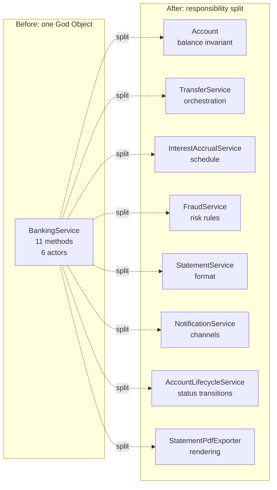

# Single Responsibility Principle (SRP)

> A class should have one, and only one, reason to change. Reframed: a class should own exactly one axis of change, so a change in one business rule ripples to as few classes as possible. SRP is the cohesion test on the dependency graph.

## What you already know

From [[03-Dependency-As-Root-Concept]]: a dependency exists when a change in one place can force a change elsewhere. From [[06-Coupling-and-Cohesion]]: cohesion is the measure of how much the parts of a module belong together; functional cohesion — *all parts contribute to a single, well-defined task* — is the target. From [[04-Responsibilities]]: whoever owns the invariant owns the responsibility for enforcing it. From [[00-SOLID-as-Dependency-Management]]: SRP is the cohesion heuristic on the dependency graph; it is one of the two *reduce* operations in SOLID.

## Why this layer exists

In practice, the most common cause of expensive change is the **God Object**: a single class that has accumulated many unrelated responsibilities. Every feature request touches it. Every bug fix risks breaking unrelated functionality. Every test of one responsibility requires standing up the entire object with all its dependencies. Every developer fights merge conflicts on the same file.

SRP exists to put a sharp, checkable question against this failure mode: *does this class have more than one reason to change?* If the honest answer is yes, the class is doing too much, and the cure is to split it along responsibility boundaries.

## What is genuinely new here

- **"Reason to change" maps to "axis of change."** A reason to change is a *business force* — a stakeholder, a business rule, a regulatory requirement, an operational concern. A class with one reason to change is a class affected by exactly one such force.
- **SRP is about actors, not methods.** The original Uncle Bob formulation: "A class should have only one reason to change *for the same actor*." The relevant question is *who can ask for a change*, not *how many methods* there are. A small class with three methods that all serve the same actor can be SRP-clean; a class with two methods serving two different actors is already a violation.
- **The cohesion test is *shared invariant*** — see [[06-Coupling-and-Cohesion]]. If a class owns two invariants, it has two responsibilities.

## Concepts

- **Responsibility** — an obligation of a class to fulfill one family of related behavior. The unit of SRP reasoning.
- **Reason to change** — the external force (an actor, a business rule, a regulatory change) that would motivate modifying a class. One class, one reason.
- **God Object** — the anti-pattern SRP exists to prevent; see [[05-Anti-Patterns]].
- **Feature envy** — a method on class A that is mostly interested in class B's data; a smell that the method (or its responsibility) belongs on B.
- **Shotgun surgery** — one responsibility spread across many classes; the inverse of God Object but equally a violation — cohesion is broken across files.

## Banking application

The textbook violation: a `BankingService` that "does banking." Over time, every developer adds the next method here because it is the path of least resistance.

```java
public class BankingService {
    public void openAccount(Customer c, AccountType t)            { /* ... */ }
    public void closeAccount(String iban)                          { /* ... */ }
    public void transfer(String from, String to, BigDecimal amt)   { /* ... */ }
    public void deposit(String iban, BigDecimal amt)               { /* ... */ }
    public void withdraw(String iban, BigDecimal amt)              { /* ... */ }
    public void accrueInterestForAllSavingsAccounts()              { /* ... */ }
    public Statement generateStatement(String iban, Period p)      { /* ... */ }
    public FraudScore evaluateFraud(TransferRequest req)           { /* ... */ }
    public void sendNotification(Customer c, String message)       { /* ... */ }
    public void freezeAccount(String iban, String reason)          { /* ... */ }
    public byte[] exportStatementPdf(Statement s)                  { /* ... */ }
}
```

Count the actors who can demand a change:

1. The **operations team** asks for freeze / unfreeze behavior.
2. The **compliance team** asks for fraud rules.
3. The **finance team** asks for interest accrual policy.
4. The **customer support team** asks for statement generation.
5. The **marketing team** asks for notification content.
6. The **infrastructure team** asks for PDF export formatting.

Six actors, six reasons to change, six independent release pressures — all collapsed into one file. The result is merge conflicts, fragile tests, and slow builds. SRP says: split.

The split, applying *whoever owns the invariant owns the responsibility*:

| Responsibility | Owner | Why |
|---|---|---|
| Maintain account balance invariant | `Account` | The balance is its invariant |
| Coordinate transfer (debit one, credit other, persist) | `TransferService` | The orchestration is its invariant |
| Apply daily interest | `InterestAccrualService` + `InterestPolicy` | The schedule and policy are its invariant |
| Generate statement text | `StatementService` | The format is its invariant |
| Detect fraud | `FraudService` | The risk rules are its invariant |
| Send notifications | `NotificationService` | The channel selection is its invariant |
| Freeze accounts | `Account.freeze()` + `AccountLifecycleService` | The lifecycle is its invariant |
| Export PDF | `StatementPdfExporter` | The rendering is its invariant |

Each class has one actor who is the source of change. Each can be tested in isolation. Each can be released independently. The dependency graph is now a tree, not a knot.

## Code

The before-and-after. The "before" snippet above has eleven methods, six actors, and one file. The "after" distributes each responsibility to its natural owner:

```java
// Account owns the balance invariant
public final class Account {
    private final AccountId id;
    private BigDecimal balance;
    private AccountStatus status;
    private final List<LedgerEntry> entries = new ArrayList<>();

    public void debit(BigDecimal amount) {
        if (status != AccountStatus.ACTIVE) {
            throw new AccountNotActiveException(id);
        }
        if (balance.compareTo(amount) < 0) {
            throw new InsufficientFundsException(id, balance, amount);
        }
        balance = balance.subtract(amount);
        entries.add(LedgerEntry.debit(id, amount));
    }

    public void credit(BigDecimal amount) {
        if (status == AccountStatus.CLOSED) {
            throw new AccountClosedException(id);
        }
        balance = balance.add(amount);
        entries.add(LedgerEntry.credit(id, amount));
    }
}

// TransferService owns transfer orchestration
public final class TransferService {
    private final AccountRepository accounts;
    private final FraudService fraud;
    private final UnitOfWork uow;

    public void transfer(TransferRequest req) {
        if (fraud.evaluate(req) == FraudDecision.REJECTED) {
            throw new TransferRejectedException(req);
        }
        Account from = accounts.findByIban(req.fromIban());
        Account to   = accounts.findByIban(req.toIban());
        from.debit(req.amount());
        to.credit(req.amount());
        uow.commit();            // see [[04-Unit-of-Work]]
    }
}

// InterestAccrualService owns the schedule; InterestPolicy owns the rule
public final class InterestAccrualService {
    private final AccountRepository accounts;
    private final InterestPolicy policy;
    public void accrueDaily() {
        for (Account a : accounts.allSavingsAccounts()) {
            BigDecimal interest = policy.compute(a);
            if (interest.signum() > 0) { a.credit(interest); }
        }
    }
}

// StatementPdfExporter owns the PDF rendering
public final class StatementPdfExporter {
    public byte[] export(Statement s) { /* render PDF bytes */ }
}
```

Notice the structure: each class has exactly one actor whose requests drive its evolution. The compliance team can evolve fraud rules in `FraudService` without touching `TransferService`'s orchestration logic; the finance team can change the `InterestPolicy` without touching `Account`; the operations team can extend `AccountStatus` without touching `StatementService`.



## What can go wrong

1. **Over-splitting produces anemic classes.** SRP does not say "split until every class has one method." A class with one method is fine if the method has cohesion; a class with five methods is fine if they share one invariant. The test is *actor* and *invariant*, not method count.
2. **Splitting along the wrong axis.** A common error: splitting `Account` into `AccountBalance`, `AccountLifecycle`, `AccountLedger`. These three are *one* invariant — the balance cannot be reasoned about without the ledger entries and the lifecycle. Splitting them fragments what should be cohesive. The right axis is *actor / responsibility*, not *internal concern*.
3. **"Reason to change" interpreted as "reason to refactor."** Refactoring is a developer concern, not a business force. SRP asks about *business* reasons to change, not about code aesthetics. If two methods always change together because they implement one business rule, they belong together even if they look superficially different.
4. **Hidden responsibility via cross-cutting concerns.** Logging, auditing, and metrics are responsibilities too. A `TransferService` that *also* writes the audit log has two reasons to change: transfer logic and audit format. The cure is to extract the audit concern to a decorator or event handler — see [[03-Behavioral-Patterns]] (Decorator, Observer).
5. **Service classes that are God Objects in disguise.** A `BankingService` is an obvious God Object. A `TransferService` with methods `transfer`, `reverse`, `replay`, `validate`, `serialize`, `deserialize`, `audit`, `notify` is a subtler one. SRP applies to services too.

## Trade-offs

- **Cohesion vs fragmentation.** Aggressive SRP produces many small classes; navigation costs rise ("I followed seven files to understand one transfer"). The cure is good package boundaries and a clear architectural map (see [[02-Layered-Architecture]]). The cost is real but usually smaller than the God Object alternative.
- **Single class vs multiple collaborators.** One God Object method call is one stack frame; the equivalent SRP-compliant flow may cross five classes. Indirection cost is paid in every read and every debug session. For high-churn code, the trade-off is worth it; for stable one-off code, it is not.
- **Test granularity.** SRP produces small focused tests. This is good — but it can produce *too many* small tests that do not catch integration issues. The remedy is a layer of integration tests on top of the unit tests. See [[06-SOLID-in-Banking]] for the resulting test pyramid.
- **Refactor frequency.** SRP-compliant classes change for one reason — so they change less often per class, but more classes change per release. The total churn is similar; the *blast radius* per change is smaller. That is the entire point.

## Forward links

- [[00-SOLID-as-Dependency-Management]] — SRP's place in the unified frame.
- [[02-OCP]] — once responsibilities are split, extension becomes adding new siblings, not editing existing classes.
- [[04-ISP]] — SRP at the interface level: a fat interface has multiple reasons to change.
- [[06-Coupling-and-Cohesion]] — the force SRP operates on.
- [[04-Responsibilities]] — the technique that produces SRP-clean classes.
- [[05-Anemic-vs-Rich-Models]] — the rich-vs-anemic trade-off is, in part, an SRP trade-off.
- [[05-Anti-Patterns]] — God Object as the SRP violation.
- [[00-Banking-Case-Study]] — the anchor for the transfer flow.
