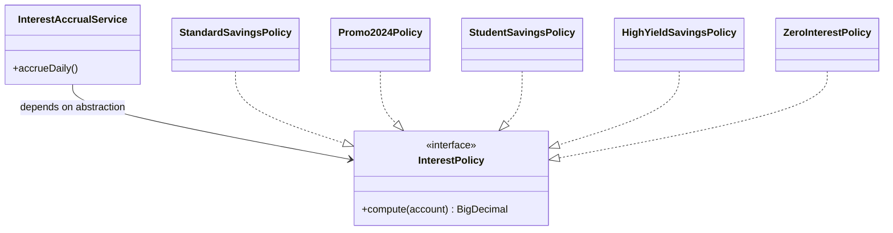

# Open/Closed Principle (OCP)

> Software entities should be open for extension, but closed for modification. Reframed: the dependency graph should be extensible at its leaves (new classes, new strategies) without being rewritable at its trunk (existing classes that consumers depend on).

## What you already know

From [[03-Dependency-As-Root-Concept]]: dependencies point toward stability; the two operations on a dependency are *reduce* and *invert*. From [[04-Abstraction-and-Models]]: an abstraction hides implementation while preserving a contract; every abstraction exists to reduce or invert a dependency. From [[07-Composition-vs-Inheritance]]: polymorphism through composition (strategy, decorator) is the supple mechanism for varying behavior; inheritance is rigid. From [[00-SOLID-as-Dependency-Management]]: OCP is the heuristic that says *the dependency graph should grow at its leaves, not be rewritten at its trunk*.

## Why this layer exists

Without OCP, every new feature forces edits to existing code. Each edit risks breaking existing behavior, existing tests, existing consumers. The cost of adding a feature grows linearly with the size of the codebase, because the surface area you must touch and re-verify grows. After enough years of this, releases become slow and risky; teams grow nervous about change; the system fossilizes.

OCP exists to make the cost of *adding* a feature independent of the size of the existing codebase. The mechanism: design extension points so that new behavior is *added* in new files, not *edited* into existing files. Existing classes — the trunk — stay byte-for-byte identical when a new variant is introduced.

## What is genuinely new here

- **Extension at leaves, modification forbidden at trunk.** OCP is not "never edit any file." It is "the files that *consumers depend on* must not change when a new variant is added." New code goes into new files that plug into existing extension points.
- **Abstraction is the seam.** OCP requires a stable abstraction between consumer and variant. The consumer depends on the abstraction; new variants implement the abstraction. The abstraction itself rarely changes — that is what makes it stable (see [[04-Abstraction-and-Models]]).
- **Polymorphism is the mechanism.** Adding a new variant means adding a new class that implements the interface. The consumer's call site does not change. This is composition-with-polymorphism, exactly the GoF-preferred mechanism — see [[07-Composition-vs-Inheritance]] and [[04-Polymorphism]].
- **OCP is not "no edits."** OCP says: edits to add a new variant should not be required in *consumer* code. Configuration wiring (e.g., registering the new strategy in a DI container) is allowed and expected.

## Concepts

- **Extension point** — a stable abstraction (interface, abstract method, hook) through which new behavior can be added without editing consumers.
- **Variant** — one concrete implementation of an extension point. New variants are added; existing ones are not modified.
- **Strategy** — the canonical OCP pattern: an interface with multiple implementations, one of which is selected at runtime. See [[03-Behavioral-Patterns]].
- **Polymorphic dispatch** — the runtime mechanism that routes a call through the abstraction to the right variant. The consumer writes one call; the runtime picks the variant. See [[04-Polymorphism]].
- **Closed for modification** — the property that an existing, depended-upon class does not need source changes to support a new variant. The class is *closed* in the sense that its source is frozen relative to that variant.
- **Open for extension** — the property that new variants can be added (new classes implementing the abstraction) without touching the closed classes.

## Banking application

The Banking system ([[00-Banking-Case-Study]]) accrues interest daily on savings accounts. The interest rule is a business policy that varies by product, regulatory jurisdiction, and promotional offer. New products appear every quarter; new promotional rates appear every month; jurisdictions change yearly.

A naive design hard-codes the rule:

```java
public BigDecimal computeInterest(Account a) {
    if (a.getType() == AccountType.SAVINGS) {
        if (a.getTag().equals("PROMO_2024")) {
            return a.getBalance().multiply(new BigDecimal("0.05"));
        } else if (a.getTag().equals("STUDENT")) {
            return a.getBalance().multiply(new BigDecimal("0.03"));
        } else {
            return a.getBalance().multiply(new BigDecimal("0.01"));
        }
    } else if (a.getType() == AccountType.CHECKING) {
        return BigDecimal.ZERO;
    }
    throw new IllegalStateException("Unknown account type");
}
```

Every new product, every new promotion, every new jurisdiction requires editing this method. The method is *open for modification* and *closed for extension* — the opposite of OCP. Worse, every existing test for existing products must be re-run when a new product is added, because the method changed.

OCP-compliant redesign: extract `InterestPolicy` as an abstraction. The consumer (e.g., `InterestAccrualService`) depends on the abstraction; each policy is a leaf.

```java
public interface InterestPolicy {
    BigDecimal compute(Account account);
}

public final class StandardSavingsPolicy implements InterestPolicy {
    private static final BigDecimal RATE = new BigDecimal("0.01");
    @Override public BigDecimal compute(Account a) {
        return a.getBalance().multiply(RATE);
    }
}

public final class Promo2024Policy implements InterestPolicy {
    private static final BigDecimal RATE = new BigDecimal("0.05");
    @Override public BigDecimal compute(Account a) {
        return a.getBalance().multiply(RATE);
    }
}

public final class StudentSavingsPolicy implements InterestPolicy {
    private static final BigDecimal RATE = new BigDecimal("0.03");
    @Override public BigDecimal compute(Account a) {
        return a.getBalance().multiply(RATE);
    }
}

public final class ZeroInterestPolicy implements InterestPolicy {
    @Override public BigDecimal compute(Account a) { return BigDecimal.ZERO; }
}
```

Adding a new policy is one new file. Existing files do not change:

```java
public final class HighYieldSavingsPolicy implements InterestPolicy {
    private static final BigDecimal RATE = new BigDecimal("0.045");
    @Override public BigDecimal compute(Account a) {
        return a.getBalance().multiply(RATE);
    }
}
```

The consumer is unchanged:

```java
public final class InterestAccrualService {
    private final AccountRepository accounts;
    public void accrueDaily() {
        for (Account a : accounts.allSavingsAccounts()) {
            BigDecimal interest = a.getInterestPolicy().compute(a);
            if (interest.signum() > 0) { a.credit(interest); }
        }
    }
}
```

The decision of which policy an account uses can be configuration (loaded from the database), a factory (see [[01-Creational-Patterns]]), or a domain rule (`Account.interestPolicy()` returns the right strategy based on its product code). All three keep `InterestAccrualService` closed.

## Code

The pattern is the same everywhere OCP applies. Show the dependency graph once:



In Java, using a registry/factory to wire variants at runtime:

```java
public final class InterestPolicyRegistry {
    private final Map<String, InterestPolicy> byProductCode = new ConcurrentHashMap<>();

    public void register(String productCode, InterestPolicy policy) {
        byProductCode.put(productCode, policy);
    }

    public InterestPolicy forProduct(String productCode) {
        InterestPolicy p = byProductCode.get(productCode);
        if (p == null) {
            return new ZeroInterestPolicy();   // safe default
        }
        return p;
    }
}

// Wiring (composition root)
InterestPolicyRegistry registry = new InterestPolicyRegistry();
registry.register("SAV-STD",   new StandardSavingsPolicy());
registry.register("SAV-PROMO", new Promo2024Policy());
registry.register("SAV-STU",   new StudentSavingsPolicy());
registry.register("SAV-HY",    new HighYieldSavingsPolicy());
registry.register("CHK-STD",   new ZeroInterestPolicy());
```

Adding a new product is: write `NewProductPolicy.java`, register it in the composition root, ship. The existing `InterestAccrualService`, the existing policies, and the existing tests do not change. That is OCP.

## What can go wrong

1. **Premature extension points.** Designing every class with an interface "just in case" produces interface soup. OCP is *not* a license to speculate; it is a discipline to apply when variation is *expected* or *already happening*. If only one variant will ever exist, the abstraction is decoration — see [[04-Abstraction-and-Models]].
2. **Abstractions that leak new requirements.** Sometimes a new variant genuinely needs a method the abstraction did not anticipate. The OCP-compliant response is to add a new abstraction (e.g., `TieredInterestPolicy extends InterestPolicy`), not to bolt the new method onto the existing interface — that would force every existing implementation to change. The wrong response is to widen the interface and break every existing variant.
3. **Configuration drift.** When variants are wired through configuration (registry, factory, DI container), adding a variant requires the configuration to know about it. If the configuration is forgotten, the new variant is silently not used. Mitigation: tests that verify every registered variant; startup assertions that all product codes have a policy.
4. **OCP that breaks LSP.** A new variant that throws `UnsupportedOperationException` for an inherited method is *not* OCP-compliant extension. It is an LSP violation (see [[03-LSP]]) dressed as extension. The dependent code did not change, but its correctness did.
5. **The "closed" myth.** OCP says "closed for modification" — meaning *no source edits required to support a new variant*. It does not mean "the code is immutable forever." Bug fixes, refactors, and contract clarifications are still allowed; the principle protects *against forcing changes when adding variants*.

## Trade-offs

- **Indirection cost.** Every OCP extension point adds one layer of indirection (the interface, the dispatch). The cost is paid every read and every debug step. For high-churn code, it pays back; for stable one-off code, it is overhead.
- **Configuration complexity.** Variants wired through a registry require someone (the composition root, a config file, a database table) to know which variant to use for which case. The mapping is a new responsibility — and a new place for bugs.
- **Test surface.** Each variant needs its own test. The consumer needs an integration test that wires the variants together. The total test count rises. The cost is offset by the fact that adding a new variant no longer requires re-running tests for unrelated variants.
- **Discoverability.** A reader looking at `InterestAccrualService` cannot tell from the call site which policy is in use. They must trace through the wiring. Good naming, good logging, and architecture diagrams (see [[01-Class-Diagrams]]) mitigate this.
- **Predictability vs flexibility.** A hard-coded `if/else` is predictable: a reader knows exactly what runs. A polymorphic dispatch is flexible but opaque. The trade-off is between a system that is easy to read and a system that is easy to extend. OCP chooses flexibility; the cost is paid in readability tooling.

## Forward links

- [[00-SOLID-as-Dependency-Management]] — OCP's place in the unified frame.
- [[03-LSP]] — extension only counts if substitution holds.
- [[04-Abstraction-and-Models]] — the abstraction is the seam OCP depends on.
- [[04-Polymorphism]] — the dispatch mechanism OCP relies on.
- [[07-Composition-vs-Inheritance]] — composition + strategy is the OCP mechanism; inheritance is the rigid alternative.
- [[03-Behavioral-Patterns]] — Strategy, Decorator, and State are OCP workhorses.
- [[01-Creational-Patterns]] — Factory Method and Abstract Factory wire variants at runtime.
- [[06-SOLID-in-Banking]] — the full OCP walk-through on the transfer flow.
- [[00-Banking-Case-Study]] — the anchor for the interest accrual scenario.
