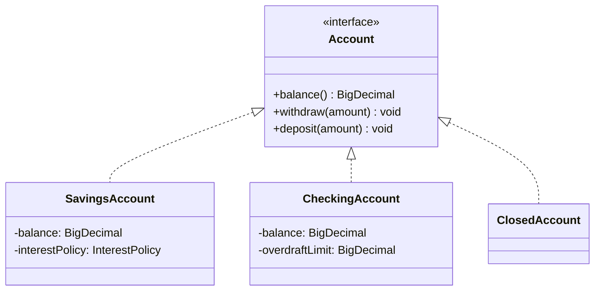

# Liskov Substitution Principle (LSP)

> Subtypes must be substitutable for their base types without altering the correctness of the program. Reframed: polymorphism must not smuggle new dependencies into dependents. A subtype that breaks the base contract silently rewrites the assumptions every dependent made.

## What you already know

From [[03-Dependency-As-Root-Concept]]: a dependency exists when a change in one place can force a change elsewhere. From [[04-Abstraction-and-Models]]: an abstraction preserves a contract; consumers depend on the contract. From [[07-Composition-vs-Inheritance]]: inheritance is the tightest form of coupling — the child binds itself to every detail of the parent. From [[04-Polymorphism]]: polymorphic dispatch lets a consumer call one method and have different variants execute; that mechanism is only safe if every variant honors the contract. From [[00-SOLID-as-Dependency-Management]]: LSP is the heuristic that says *substitution must not change the correctness dependents relied on*.

## Why this layer exists

Polymorphism is the engine behind OCP (see [[02-OCP]]). The promise is: depend on the abstraction, and any variant implementing the abstraction will work. But this promise has a hidden clause: "will work" means *will satisfy the contract the abstraction advertised*. A subtype that throws `UnsupportedOperationException` for an inherited method, that strengthens a precondition, that weakens a postcondition, or that returns `null` where the base promised non-null — that subtype has broken the contract. The consumer, who wrote code against the abstraction, now has hidden bugs.

LSP exists to put a checkable rule on polymorphism: the subtype must be *behaviorally* substitutable, not just *syntactically* substitutable. Java's type system checks the syntactic part (does the method signature match?). LSP is the discipline that checks the behavioral part (does the method honor the contract?).

## What is genuinely new here

- **Substitutability is behavioral, not syntactic.** The compiler checks signatures; LSP checks contracts. A subtype can compile cleanly and still violate LSP.
- **Contracts have three parts** (Meyer's Design by Contract):
  1. **Precondition** — what the method requires of callers (e.g., "amount must be positive").
  2. **Postcondition** — what the method guarantees to return / state it produces (e.g., "balance after = balance before − amount").
  3. **Invariant** — what must hold before and after every method call (e.g., "balance ≥ -overdraft_limit").
- **The LSP rules for subtypes:**
  - Preconditions **cannot be strengthened** (a subtype cannot demand more than the base).
  - Postconditions **cannot be weakened** (a subtype cannot promise less than the base).
  - Invariants **cannot be weakened** (a subtype cannot relax a guarantee the base made).
  - Exception types **cannot be broader** (a subtype cannot throw checked exceptions the base did not declare).
- **History constraint.** A subtype must not allow mutability that the base disallowed. If the base is immutable, the subtype must be immutable.

## Concepts

- **Subtype** — a type that is *behaviorally* substitutable for another (the supertype). In Java, this usually means a subclass or an implementing class, but the LSP rule is behavioral, not syntactic.
- **Behavioral subtyping** — the formal property LSP demands; stronger than the type-system's structural subtyping.
- **Contract** — the trio (precondition, postcondition, invariant) the abstraction advertises.
- **Weakening** — reducing what is guaranteed (a postcondition like "returns non-null" weakened to "may return null").
- **Strengthening** — increasing what is required (a precondition like "amount > 0" strengthened to "amount > 0 AND amount < 1000").
- **Square/Rectangle** — the canonical LSP violation: a `Square` is a `Rectangle` mathematically, but a `Square` cannot be substituted wherever a `Rectangle` is used because the contract of `Rectangle.setWidth(w)` (independently set width) is broken by `Square` (which must keep width = height).

## Banking application

The textbook LSP violation in banking: `CheckingAccount extends SavingsAccount`. The reasoning that traps developers: "both are accounts; both have balances; checking just has overdraft; let's subclass to reuse code." This is *implementation reuse*, not *behavioral subtyping*. It violates LSP in three places.

Set the contract. `SavingsAccount`:

- **Invariant**: `balance >= 0` (savings cannot go negative; see [[00-Banking-Case-Study]] rule 2).
- **Precondition of `withdraw(amount)`**: `amount > 0 AND amount <= balance`.
- **Postcondition of `withdraw(amount)`**: `balance_after == balance_before - amount AND balance_after >= 0`.

`CheckingAccount` (extends `SavingsAccount`):

- **Invariant**: `balance >= -overdraft_limit`.
- **Precondition of `withdraw(amount)`**: `amount > 0 AND amount <= balance + overdraft_limit`.
- **Postcondition of `withdraw(amount)`**: `balance_after == balance_before - amount AND balance_after >= -overdraft_limit`.

Now check LSP:

1. The **invariant is weakened**. `SavingsAccount` guaranteed `balance >= 0`; `CheckingAccount` allows `balance >= -overdraft_limit`. A consumer written against `SavingsAccount` may assert `balance >= 0` after a withdrawal; a `CheckingAccount` substituted in will break that assertion.
2. The **precondition is strengthened**. `SavingsAccount.withdraw` required `amount <= balance`; `CheckingAccount.withdraw` requires `amount <= balance + overdraft_limit`. Actually, wait — this is *weakened* (allows more). But the inverse problem bites: `SavingsAccount.withdraw` *promised* to reject `amount > balance`; `CheckingAccount` *allows* it. A consumer written against `SavingsAccount` may rely on the rejection (e.g., "if withdraw doesn't throw, the balance is still non-negative") and that assumption is now broken.
3. The **postcondition is weakened**. `SavingsAccount` guaranteed `balance_after >= 0`; `CheckingAccount` does not.

Each violation is a hidden bug in a consumer that was written against `SavingsAccount` but receives a `CheckingAccount` at runtime. The compiler sees no problem; the runtime sees no problem; the audit log sees a problem when an account goes negative.

The cure: do not make `CheckingAccount` a subtype of `SavingsAccount`. They are *siblings*, not parent-child. Both implement a common, weaker abstraction `Account` that promises only what both can guarantee:



`Account` advertises only the contract *every* account type can honor: `withdraw` debits the account, may throw `InsufficientFundsException`, and the postcondition is *whatever each subtype guarantees in its own invariant*. The interface is the *intersection* of subtype contracts, not the *union*.

The classic `Square`/`Rectangle` trap appears in banking too: a `JointAccount` that *is-an* `Account` but requires both holders to approve withdrawals. If `Account.withdraw` is supposed to succeed synchronously, `JointAccount` (which may need to pend for approval) violates the postcondition. The cure: model `JointAccount` as a composition (`JointAccount has-roles: List<AccountHolder>`) or as a different interface (`ApprovableAccount extends Account`).

## Code

The LSP-violating version (do not write this):

```java
public class SavingsAccount {
    protected BigDecimal balance;
    public void withdraw(BigDecimal amount) {
        if (amount.signum() <= 0)             throw new IllegalArgumentException();
        if (amount.compareTo(balance) > 0)    throw new InsufficientFundsException();
        balance = balance.subtract(amount);   // postcondition: balance >= 0
    }
}

// LSP VIOLATION: invariant weakened, postcondition weakened
public class CheckingAccount extends SavingsAccount {
    private BigDecimal overdraftLimit;
    @Override public void withdraw(BigDecimal amount) {
        if (amount.signum() <= 0) throw new IllegalArgumentException();
        // allows balance to go negative — violates SavingsAccount's invariant
        if (amount.compareTo(balance.add(overdraftLimit)) > 0) {
            throw new InsufficientFundsException();
        }
        balance = balance.subtract(amount);   // postcondition: balance >= -overdraftLimit
    }
}

// A consumer written against SavingsAccount — silently broken by CheckingAccount
public class AuditService {
    public void assertNonNegative(SavingsAccount a) {
        if (a.balance().signum() < 0) {
            throw new AssertionError("Savings account went negative!");
        }
    }
}
```

The LSP-compliant version:

```java
public interface Account {
    BigDecimal balance();
    void withdraw(BigDecimal amount);
    void deposit(BigDecimal amount);
    // Contract: withdraw may throw InsufficientFundsException.
    // No claim about whether balance stays non-negative — that is each subtype's invariant.
}

public final class SavingsAccount implements Account {
    private BigDecimal balance;
    @Override public BigDecimal balance() { return balance; }
    @Override public void withdraw(BigDecimal amount) {
        if (amount.signum() <= 0)             throw new IllegalArgumentException();
        if (amount.compareTo(balance) > 0)    throw new InsufficientFundsException();
        balance = balance.subtract(amount);
        assert balance.signum() >= 0;         // SavingsAccount's own invariant
    }
    @Override public void deposit(BigDecimal amount) {
        if (amount.signum() <= 0) throw new IllegalArgumentException();
        balance = balance.add(amount);
    }
}

public final class CheckingAccount implements Account {
    private BigDecimal balance;
    private final BigDecimal overdraftLimit;
    public CheckingAccount(BigDecimal opening, BigDecimal overdraft) {
        this.balance = opening;
        this.overdraftLimit = overdraft;
    }
    @Override public BigDecimal balance() { return balance; }
    @Override public void withdraw(BigDecimal amount) {
        if (amount.signum() <= 0) throw new IllegalArgumentException();
        if (amount.compareTo(balance.add(overdraftLimit)) > 0) {
            throw new InsufficientFundsException();
        }
        balance = balance.subtract(amount);
        assert balance.compareTo(overdraftLimit.negate()) >= 0;  // CheckingAccount's invariant
    }
    @Override public void deposit(BigDecimal amount) {
        if (amount.signum() <= 0) throw new IllegalArgumentException();
        balance = balance.add(amount);
    }
}
```

Each subtype honors the `Account` contract: `withdraw` debits, may throw `InsufficientFundsException`. Each subtype's *own* invariant is documented locally. No consumer of `Account` is allowed to assume anything stronger than what `Account` advertises. `AuditService.assertNonNegative` would now take a `SavingsAccount`, not an `Account` — and the type system prevents passing a `CheckingAccount` to it.

## What can go wrong

1. **`UnsupportedOperationException` in inherited methods.** The classic LSP violation: a subtype inherits a method but throws because the operation "doesn't apply" to it. A `ReadOnlyAccount` extending `Account` and throwing on `withdraw` is an LSP violation, not an extension. Cure: do not put `withdraw` on the base; use a narrower interface (`ReadOnlyAccount` has only `balance()`).
2. **Strengthened preconditions in disguise.** A subtype that accepts the same parameters but rejects a subset of inputs (e.g., "amount must be ≥ 1.00, not just > 0") strengthens the precondition. Consumers that passed 0.50 against the base now break. Cure: do not add restrictions in subtypes; if you need them, add a different interface.
3. **Weakened postconditions in disguise.** A subtype that returns `null` where the base promised non-null, or that returns a partially-initialized object, weakens the postcondition. Cure: enforce the postcondition in the subtype (e.g., `Objects.requireNonNull(result)`); if you cannot, the subtype does not belong under this base.
4. **Tighter invariants in subtypes.** A subtype that adds a constraint the base did not have (e.g., "balance must be a multiple of 0.01") is technically allowed by LSP — strengthening invariants is permitted — but it still breaks consumers that relied on the looser invariant of the base. The cure: strengthen invariants only when no consumer could have relied on the looser form, or document loudly.
5. **Exception hierarchy broadening.** A subtype that throws `Exception` where the base threw `InsufficientFundsException` violates LSP. Java's checked-exception rules catch some of this; unchecked exceptions slip through. Cure: use sealed exception hierarchies (Java 21) or explicit `throws` clauses.

## Trade-offs

- **Inheritance reuse vs behavioral substitutability.** The temptation to subclass for implementation reuse is strong; the resulting LSP violations are subtle. The cure — composition + strategy — is more verbose but produces safer abstractions. See [[07-Composition-vs-Inheritance]].
- **Narrow interfaces vs wide abstractions.** A wide abstraction (one `Account` interface with many methods) maximizes code reuse but makes LSP violations likely (some subtype will not be able to honor every method). Narrow interfaces (one per role — `Depositable`, `Withdrawable`, `Freezable`) minimize LSP risk but increase interface count. ISP (see [[04-ISP]]) is the natural companion.
- **Assertions vs runtime checks.** LSP rules are hard to enforce statically. Java's `assert` keyword, JUnit contract tests, and property-based testing all help. The trade-off: more test code in exchange for catching LSP violations at test time instead of production time.
- **Behavioral subtyping cost.** Documenting and enforcing contracts (preconditions, postconditions, invariants) is real work — often more work than the implementation itself. The cost is paid every time a subtype is added. The benefit is paid every time a consumer is reused without modification.

## Forward links

- [[00-SOLID-as-Dependency-Management]] — LSP's place in the unified frame.
- [[02-OCP]] — extension is only valid when substitution holds.
- [[07-Composition-vs-Inheritance]] — composition avoids LSP violations entirely.
- [[04-Polymorphism]] — the dispatch mechanism LSP protects.
- [[06-Abstract-Classes-And-Interfaces]] — where to draw the line between interface and abstract class.
- [[05-Anemic-vs-Rich-Models]] — rich models push invariants onto entities, where LSP matters most.
- [[00-Banking-Case-Study]] — the anchor for the account type hierarchy.
