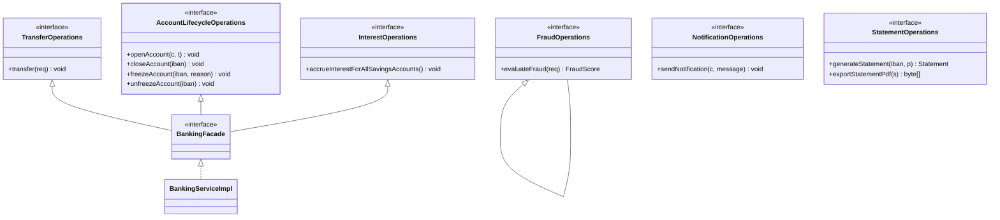

# Interface Segregation Principle (ISP)

> Clients should not be forced to depend on methods they do not use. Reframed: trim the dependency surface so each consumer depends only on the operations it actually invokes. ISP is the *reduce* operation applied at the interface level — and the natural companion to role-based design.

## What you already know

From [[03-Dependency-As-Root-Concept]]: a dependency exists when a change in one place can force a change elsewhere; the two operations are *reduce* and *invert*. From [[06-Coupling-and-Cohesion]]: stamp coupling (modules share a data structure but only use parts of it) is a mid-level coupling smell; the cure is to pass only what is needed. From [[04-Responsibilities]]: responsibilities should be assigned to the object that has the information to fulfill them. From [[00-SOLID-as-Dependency-Management]]: ISP is one of the two *reduce* operations in SOLID; it trims the inbound dependency surface so each consumer has fewer reasons to be recompiled / re-tested / broken.

## Why this layer exists

Without ISP, interfaces accumulate. Every new feature adds a method to the central interface, "because the interface is already there." After a few years, the `BankingService` interface has thirty methods. Every client of the interface — even one that calls only `transfer` — depends on all thirty. A change to any one method (a new parameter on `generateStatement`) forces a recompile, a re-test, and a re-deploy of every client.

ISP exists to put a sharp question against this: *does this client actually use every method on the interface it depends on?* If not, the client is over-coupled. The cure is to split the interface into role-specific ones, each serving the clients that need exactly that role.

## What is genuinely new here

- **Fat interface = stamp coupling at the type level.** A fat interface is the type-system equivalent of a fat data structure: every consumer depends on the whole, even if they use only a slice.
- **Role interface** — a narrow interface that exposes only the methods a specific *role* requires. Multiple role interfaces can be implemented by the same class; consumers depend on the role they need.
- **Clients drive the interface, not implementers.** The right question is *what does the caller need?*, not *what does the implementer offer?* The interface is a contract *from the consumer's perspective*.
- **ISP enables LSP.** Narrow interfaces make LSP (see [[03-LSP]]) easy to satisfy: a small contract is easy to honor across all subtypes. Wide interfaces make LSP violations likely — some subtype will not be able to honor every method.
- **ISP is the OOP expression of single-responsibility at the type boundary.** SRP says a class has one reason to change; ISP says an interface has one client role.

## Concepts

- **Fat interface** — an interface with many methods serving many roles; the smell ISP targets.
- **Role interface** — a narrow interface for one consumer role.
- **Header interface** — an interface that mirrors an entire class's public surface (often generated); usually a fat interface in disguise.
- **Interface segregation** — splitting a fat interface into multiple role interfaces, each consumed by a different audience.
- **Client** — the caller of the interface. ISP reasons from the client's perspective.
- **Composite interface** — an interface that extends multiple role interfaces (e.g., `Account extends Depositable, Withdrawable, Freezable`) for the convenience of implementers, without forcing consumers to depend on the union.

## Banking application

The textbook fat interface — a single `BankingService` that exposes every banking operation:

```java
public interface BankingService {
    void openAccount(Customer c, AccountType t);
    void closeAccount(String iban);
    void freezeAccount(String iban, String reason);
    void unfreezeAccount(String iban);
    void transfer(String from, String to, BigDecimal amount);
    void deposit(String iban, BigDecimal amount);
    void withdraw(String iban, BigDecimal amount);
    BigDecimal getBalance(String iban);
    Statement generateStatement(String iban, Period p);
    byte[] exportStatementPdf(Statement s);
    void accrueInterestForAllSavingsAccounts();
    FraudScore evaluateFraud(TransferRequest req);
    void sendNotification(Customer c, String message);
    List<Account> listAccountsForCustomer(Customer c);
    void updateCustomerContact(Customer c);
}
```

Consider three consumers:

1. **A REST controller for transfers** uses only `transfer`. It depends on fifteen methods. When `exportStatementPdf` changes signature, the controller must recompile and re-deploy, even though it does not call that method.
2. **A nightly batch job** uses only `accrueInterestForAllSavingsAccounts`. It depends on fifteen methods. When `transfer` adds a new parameter, the batch must recompile and re-deploy.
3. **A fraud dashboard** uses only `evaluateFraud`. It depends on fifteen methods.

Each consumer is over-coupled. ISP says: split the fat interface into role interfaces that match what each consumer needs.

The role-interface decomposition:



The REST controller depends only on `TransferOperations`. The nightly batch depends only on `InterestOperations`. The fraud dashboard depends only on `FraudOperations`. A change to `exportStatementPdf` no longer forces the controller or the batch to recompile.

The implementation can still implement the composite `BankingFacade` for convenience:

```java
public final class BankingServiceImpl implements BankingFacade {
    @Override public void transfer(TransferRequest req)                 { /* ... */ }
    @Override public void openAccount(Customer c, AccountType t)         { /* ... */ }
    @Override public void closeAccount(String iban)                      { /* ... */ }
    @Override public void freezeAccount(String iban, String reason)      { /* ... */ }
    @Override public void accrueInterestForAllSavingsAccounts()          { /* ... */ }
    @Override public FraudScore evaluateFraud(TransferRequest req)       { /* ... */ }
    @Override public Statement generateStatement(String iban, Period p)  { /* ... */ }
    @Override public byte[] exportStatementPdf(Statement s)              { /* ... */ }
    @Override public void sendNotification(Customer c, String m)         { /* ... */ }
}
```

But consumers receive the narrow interface they need:

```java
public final class TransferController {
    private final TransferOperations transfers;
    public TransferController(TransferOperations transfers) {
        this.transfers = transfers;
    }
    public ResponseEntity<?> transfer(@RequestBody TransferRequest req) {
        transfers.transfer(req);
        return ResponseEntity.accepted().build();
    }
}
```

The repository pattern (see [[04-Enterprise-Patterns]] and [[05-Repository-Pattern]]) is the canonical ISP application in banking: instead of one `BankingRepository` with methods for accounts, transfers, customers, ledger entries, statements, and notifications, we have `AccountRepository`, `TransferRepository`, `CustomerRepository`, `LedgerEntryRepository`, each consumed only by the service that needs it. A `TransferService` does not depend on `findStatement`; a `StatementService` does not depend on `findLedgerEntriesForAccount`.

## Code

A second example — the `Account` entity itself. Without ISP, an `Account` interface tries to be everything:

```java
// FAT INTERFACE — anti-example
public interface Account {
    BigDecimal balance();
    void withdraw(BigDecimal amount);
    void deposit(BigDecimal amount);
    void freeze(String reason);
    void unfreeze();
    void close();
    Statement generateStatement(Period p);
    byte[] exportPdf();
    void addHolder(Customer c);
    void removeHolder(Customer c);
    List<Customer> holders();
}
```

A read-only reporting job that just reads `balance()` and `generateStatement` is forced to depend on `freeze`, `withdraw`, `addHolder`, and all the others. If `withdraw`'s signature changes, the reporting job recompiles.

ISP-compliant split into roles:

```java
public interface Depositable  { void deposit(BigDecimal amount); }
public interface Withdrawable { void withdraw(BigDecimal amount); }
public interface Freezable    { void freeze(String reason); void unfreeze(); }
public interface Closeable    { void close(); }
public interface AccountInfo  {
    BigDecimal balance();
    List<Customer> holders();
}
public interface StatementSource { Statement generateStatement(Period p); }

// Composite interface for the entity that does it all
public interface Account extends Depositable, Withdrawable, Freezable, Closeable, AccountInfo {
    // No new methods; just the union
}

// Now consumers depend only on the role they need
public final class ReportingService {
    private final AccountInfo info;
    public ReportingService(AccountInfo info) { this.info = info; }
    public BigDecimal currentBalance(String iban) { /* use info only */ }
}

public final class TransferService {
    private final Withdrawable source;
    private final Depositable destination;
    public void transfer(BigDecimal amount) {
        source.withdraw(amount);
        destination.deposit(amount);
    }
}
```

`TransferService` no longer depends on `freeze`, `close`, `holders`, or `generateStatement`. A change to any of those signatures does not ripple into `TransferService`. This is ISP delivering its core value: the smallest possible dependency surface for each consumer.

## What can go wrong

1. **Interface explosion.** Aggressive ISP can produce dozens of single-method interfaces. The cure: keep interfaces cohesive around a role, not around a single method. `Withdrawable` is a role; `WithdrawableAmountGreaterThanZero` is over-engineering.
2. **Header interfaces auto-generated from classes.** IDEs offer "extract interface" that copies every public method. This produces a header interface that mirrors the class — fat by construction. ISP asks the opposite: extract an interface *from the consumer's perspective*, containing only what the consumer needs.
3. **Composite interface that nobody uses.** A composite interface (`Account extends Depositable, Withdrawable, Freezable`) is convenient for implementers but useless if every consumer uses only one of the role interfaces. The composite is decoration. Keep it only if at least one consumer needs the union.
4. **Forcing implementers to implement methods they do not need.** A class implementing a fat interface often has to throw `UnsupportedOperationException` for methods that do not apply to it. This is an LSP violation (see [[03-LSP]]) AND an ISP violation: the interface is too wide for the implementer. Split the interface; the implementer implements only the role it supports.
5. **Confusing role interface with bounded context.** ISP splits within one bounded context. A bounded context (see [[03-Bounded-Contexts]]) is a separate model; it has its own interfaces. Do not use ISP to bridge contexts — use translation (anti-corruption layer) instead.

## Trade-offs

- **Interface count vs cognitive load.** Many small interfaces are individually easy to understand; collectively they are hard to navigate. Good package structure (see [[02-Layered-Architecture]]) and architecture diagrams (see [[01-Class-Diagrams]]) mitigate this.
- **Implementer convenience vs consumer precision.** A composite interface is convenient for the implementer (one class, one `implements`). Role interfaces are precise for consumers (each one takes only what it needs). ISP favors the consumer.
- **Compile-time vs runtime errors.** Splitting interfaces means a wrong wiring (passing a `Depositable` where a `Withdrawable` is required) is a compile error — good. But it also means the runtime type can no longer be cast to whatever the developer expects — sometimes inconvenient. Java's sealed interfaces (Java 21) help by making the set of permitted implementations explicit.
- **Test surface.** Each role interface needs its own contract test. The total test count rises. The benefit: each role can be tested independently, and adding a new role does not require re-testing existing ones.
- **Backward compatibility.** Splitting an existing fat interface is a breaking change for every implementer. The migration path: introduce the role interfaces alongside the fat interface, gradually migrate consumers to the role interfaces, then deprecate the fat interface. The cost is real but bounded.

## Forward links

- [[00-SOLID-as-Dependency-Management]] — ISP's place in the unified frame.
- [[03-LSP]] — narrow interfaces make LSP easy to satisfy.
- [[01-SRP]] — ISP is SRP applied at the type boundary.
- [[06-Coupling-and-Cohesion]] — ISP is the cure for stamp coupling.
- [[06-Abstract-Classes-And-Interfaces]] — the language mechanism ISP relies on.
- [[04-Enterprise-Patterns]] — Repository is the canonical ISP application; each aggregate gets its own repository.
- [[05-Repository-Pattern]] — narrow repository interfaces per aggregate root.
- [[00-Banking-Case-Study]] — the anchor for the banking interface design.
