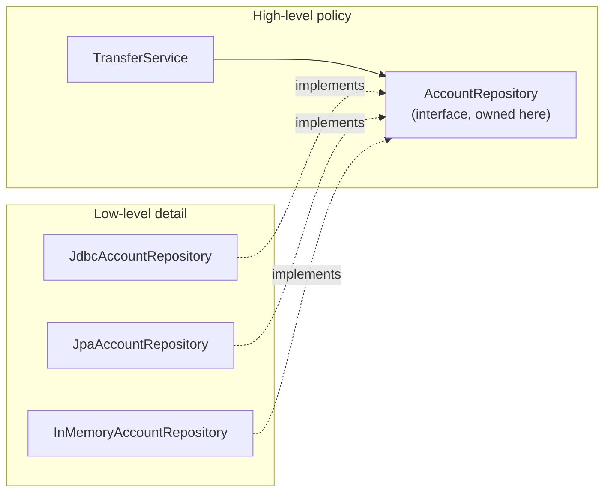

# Dependency Inversion Principle (DIP)

> Depend on abstractions, not on concretions. Reframed: invert the dependency arrow so the high-level policy and the low-level detail both depend on a shared abstraction owned by the policy. DIP is the explicit *invert* operation — the one SOLID letter that directly reverses an arrow.

## What you already know

From [[03-Dependency-As-Root-Concept]]: dependencies point toward stability; the two operations on a dependency are *reduce* and *invert*. From [[04-Abstraction-and-Models]]: an abstraction hides implementation while preserving a contract; every abstraction exists to reduce or invert a dependency. From [[06-Coupling-and-Cohesion]]: content coupling (reaching into another module's internals) is the worst level; depending on a concrete class is content coupling at the type level. From [[00-SOLID-as-Dependency-Management]]: DIP is the explicit *invert* operation, the only SOLID letter that flips an arrow rather than trimming one.

## Why this layer exists

Without DIP, high-level policy depends on low-level detail. The transfer logic (policy) directly constructs and calls `JdbcAccountRepository` (detail). When the database vendor changes, when the persistence strategy changes (JDBC → JPA → NoSQL), when the connection pool changes — the high-level transfer logic must be edited, re-tested, and re-deployed. The detail's instability has become the policy's problem.

This is the opposite of how stability should flow. The transfer logic is the most stable, most valuable, most business-critical code in the system. The persistence mechanism is comparatively unstable (vendors change, ORMs change, infrastructure changes). Dependencies should point toward stability — see [[03-Dependency-As-Root-Concept]]. The default arrow (policy → concrete detail) points the wrong way.

DIP exists to flip that arrow. The policy defines an abstraction (`AccountRepository` interface) that captures what it needs. The detail implements that abstraction. Both depend on the abstraction — but the abstraction lives *next to the policy*, owned by the policy. The arrow from policy to detail is replaced by two arrows: policy → abstraction (owned by policy) and detail → abstraction (the detail implements it). The total number of dependencies is the same; the *direction* now favors the stable side.

## What is genuinely new here

- **DIP is the only SOLID letter that *inverts* an arrow.** SRP, OCP, LSP, ISP all *reduce* dependency surface. DIP *reverses* direction. This makes it the most consequential and the most misunderstood of the five.
- **The abstraction is owned by the policy, not by the detail.** This is the subtle part. A `JdbcAccountRepository` interface owned by the JDBC layer is *not* DIP — the policy still depends on the JDBC layer's abstraction. The abstraction must live in the policy's package, named from the policy's vocabulary.
- **DIP is the principle; Dependency Injection is the technique.** DI (passing dependencies through constructors) is how DIP is wired at runtime. You can have DI without DIP (injecting concrete classes) and DIP without DI (looking up abstractions from a service locator). They are commonly paired but not identical.
- **DIP enables testability.** Once the policy depends on an abstraction, the test can pass a mock implementation. The policy becomes testable without the database, the network, or the file system.
- **DIP enables persistence swapping.** A `JdbcAccountRepository` and an `InMemoryAccountRepository` both implement `AccountRepository`. The policy cannot tell which it is using. Production wires JDBC; tests wire in-memory. Same code, different wiring.

## Concepts

- **High-level policy** — the code that encodes business rules. The most stable, most valuable code.
- **Low-level detail** — the code that interacts with the outside world: databases, networks, file systems, third-party APIs. The most volatile code.
- **Abstraction ownership** — the package and naming convention that places the abstraction in the policy's module, not the detail's.
- **Dependency Inversion** — the act of replacing a direct policy → detail dependency with policy → abstraction ← detail.
- **Dependency Injection (DI)** — the runtime technique of passing dependencies (concrete or abstract) into a class through its constructor, setter, or method. DIP's delivery mechanism.
- **Inversion of Control (IoC)** — the broader principle that a framework calls your code rather than your code calling the framework. DI is one form of IoC; DIP is the design rule that justifies DI.
- **Composition root** — the single place in the application where concrete classes are instantiated and wired together. Outside the composition root, every class depends on abstractions.

## Banking application

The canonical DIP application in banking: the `TransferService` (policy) must not depend on `JdbcAccountRepository` (detail). It must depend on `AccountRepository` (abstraction), and the JDBC implementation must also depend on that abstraction.

Without DIP:

```java
// ANTI-EXAMPLE — policy depends on detail
public final class TransferService {
    private final JdbcAccountRepository accounts = new JdbcAccountRepository(dataSource);
    public void transfer(TransferRequest req) {
        Account from = accounts.findByIban(req.fromIban());
        Account to   = accounts.findByIban(req.toIban());
        from.debit(req.amount());
        to.credit(req.amount());
        accounts.save(from);
        accounts.save(to);
    }
}
```

This compiles. It works. And it is a maintenance nightmare: changing the persistence layer requires editing `TransferService`, the most stable code in the system. Testing `TransferService` requires a real database. Swapping vendors requires editing the policy.

With DIP:



In code:

```java
// Policy module: com.bank.transfers
package com.bank.transfers;

public interface AccountRepository {              // <-- abstraction owned by policy
    Account findByIban(String iban);
    void save(Account account);
}

public final class TransferService {
    private final AccountRepository accounts;
    public TransferService(AccountRepository accounts) {     // DI of the abstraction
        this.accounts = accounts;
    }
    public void transfer(TransferRequest req) {
        Account from = accounts.findByIban(req.fromIban());
        Account to   = accounts.findByIban(req.toIban());
        from.debit(req.amount());
        to.credit(req.amount());
        accounts.save(from);
        accounts.save(to);
    }
}
```

```java
// Detail module: com.bank.persistence.jdbc
package com.bank.persistence.jdbc;

import com.bank.transfers.AccountRepository;       // <-- detail depends on policy's abstraction

public final class JdbcAccountRepository implements AccountRepository {
    private final DataSource dataSource;
    public JdbcAccountRepository(DataSource dataSource) { this.dataSource = dataSource; }
    @Override public Account findByIban(String iban) { /* JDBC code */ }
    @Override public void save(Account account)     { /* JDBC code */ }
}
```

```java
// Test module
public final class InMemoryAccountRepository implements AccountRepository {
    private final Map<String, Account> store = new HashMap<>();
    @Override public Account findByIban(String iban) { return store.get(iban); }
    @Override public void save(Account account)     { store.put(account.iban(), account); }
}

// Test
@Test void transfer_moves_money_between_accounts() {
    Account from = Account.open("DE..1", BigDecimal.TEN);
    Account to   = Account.open("DE..2", BigDecimal.ZERO);
    InMemoryAccountRepository repo = new InMemoryAccountRepository();
    repo.save(from); repo.save(to);

    TransferService service = new TransferService(repo);
    service.transfer(new TransferRequest("DE..1", "DE..2", BigDecimal.ONE));

    assertEquals(new BigDecimal("9.00"), from.balance());
    assertEquals(new BigDecimal("1.00"), to.balance());
}
```

The test runs in milliseconds, with no database, no network, no Docker. The policy is fully testable in isolation. The persistence detail can be swapped without touching the policy. The arrow from policy to detail has been inverted.

## Code

The wiring happens in the composition root — the single place in the application where concrete classes are instantiated:

```java
// Composition root — the only place that knows about concrete classes
public final class BankingApplication {
    public static void main(String[] args) {
        DataSource dataSource = createDataSource(args);
        AccountRepository accounts = new JdbcAccountRepository(dataSource);
        FraudService fraud         = new RuleBasedFraudService();
        NotificationService notify = new EmailNotificationService(smtpClient());

        TransferService transfers  = new TransferService(accounts, fraud);
        // ... wire the rest of the graph
    }
}
```

Notice the rule: outside the composition root, every `new` of a concrete class is a smell. Inside the composition root, `new` is mandatory — somebody has to instantiate the concrete classes. The composition root is the only place where the dependency direction is "compiled" together.

A modern Spring-style DI container replaces the manual composition root with annotations, but the principle is the same: the container is the composition root, and every other class depends on abstractions.

```java
// Spring DI — same DIP principle, different wiring mechanism
@Repository
public final class JdbcAccountRepository implements AccountRepository { /* ... */ }

@Service
public final class TransferService {
    private final AccountRepository accounts;       // abstraction, injected
    public TransferService(AccountRepository accounts) { this.accounts = accounts; }
}
```

The DI container is *not* DIP. DIP is the rule "depend on abstractions." The container is the tool that wires abstractions to concrete implementations at startup. The container is a convenience; the rule would hold even with manual wiring.

## What can go wrong

1. **Abstraction owned by the detail.** A common mistake: define `AccountRepository` in `com.bank.persistence` and have `TransferService` import it. The arrow from policy to abstraction is now a policy → detail dependency. The interface name *and* its package must live in the policy module. This is the most common DIP mistake and the easiest to miss.
2. **Leaky abstractions.** `AccountRepository.findByIban(String)` is clean. `AccountRepository.findByIban(String, Connection)` leaks JDBC into the abstraction. `AccountRepository.find(Criteria)` leaks a query DSL. The abstraction must speak the policy's vocabulary, not the detail's. See [[04-Abstraction-and-Models]].
3. **DI without DIP.** Injecting a concrete class (`TransferService(JdbcAccountRepository accounts)`) is DI but not DIP. The arrow is still policy → detail. The test still cannot run without a database. The cure: take an interface, not a concrete class.
4. **Service locator pattern.** Looking up dependencies from a global registry (`ServiceLocator.get(AccountRepository.class)`) is technically DIP but reintroduces hidden coupling: the policy now depends on the locator, the locator's API, and the registry's contents. Tests become harder; the dependency is invisible in the constructor. Prefer constructor injection.
5. **Over-inversion.** Not every dependency needs to be inverted. Inverting a dependency on a stable, language-level type (`String`, `BigDecimal`, `Instant`) is pointless — those are never going to change. DIP is worthwhile when the detail is unstable relative to the policy. Premature inversion produces interface soup.
6. **Mocking the wrong layer.** Heavy DIP makes mocking easy — so easy that tests end up asserting on mock interactions rather than outcomes. A test that asserts "the repository's `save` was called twice" is testing the wiring, not the behavior. The cure: prefer in-memory fake implementations (real `InMemoryAccountRepository`) over mocks (`mock(AccountRepository.class)`). Fakes exercise real behavior; mocks exercise call expectations.

## Trade-offs

- **Indirection cost.** Every DIP inversion adds one interface and one implementation. The total class count rises; navigation costs rise. The benefit — stability of policy, testability, swappability — usually outweighs this for long-lived code.
- **Compile-time vs runtime errors.** Concrete-class dependencies produce compile-time errors when interfaces change. DIP's indirection pushes some errors to runtime (a missing implementation, a misconfigured container). Strong typing, startup assertions, and integration tests mitigate this.
- **Wiring complexity.** A DIP-compliant application has a non-trivial composition root. The wiring code itself is a responsibility that must be tested (does the graph assemble? do all dependencies resolve?). Spring and similar containers reduce this but add their own learning curve.
- **Test pyramid shift.** DIP makes unit tests cheap and many. But unit tests with mocks prove little about the real database. The integration test layer must grow to compensate. The total test effort is similar; the *distribution* shifts toward integration tests at the bottom and unit tests at the middle.
- **Boundary friction.** DIP introduces a boundary (the interface) between policy and detail. Every change to the policy's needs that requires a new method on the interface is now a two-step change: extend the interface, then implement it in every concrete class. The trade-off: deliberate evolution vs rapid mutation.

## Forward links

- [[00-SOLID-as-Dependency-Management]] — DIP's place in the unified frame.
- [[03-Dependency-As-Root-Concept]] — the *invert* operation DIP formalizes.
- [[04-Abstraction-and-Models]] — the abstraction is the seam DIP depends on.
- [[06-Coupling-and-Cohesion]] — DIP reduces coupling from content to data level.
- [[04-Enterprise-Patterns]] — Repository and Unit of Work are DIP applied to persistence.
- [[05-Repository-Pattern]] — the canonical DIP application.
- [[04-Unit-of-Work]] — DIP applied to transactional boundaries.
- [[01-Identity-Map]] — DIP applied to in-session identity.
- [[03-Hexagonal-Architecture]] and [[04-Clean-Architecture]] — DIP at the architectural level.
- [[00-ORM-Impedance-Mismatch]] — DIP is the cure for the most common impedance issues.
- [[00-Banking-Case-Study]] — the anchor for the transfer flow.
