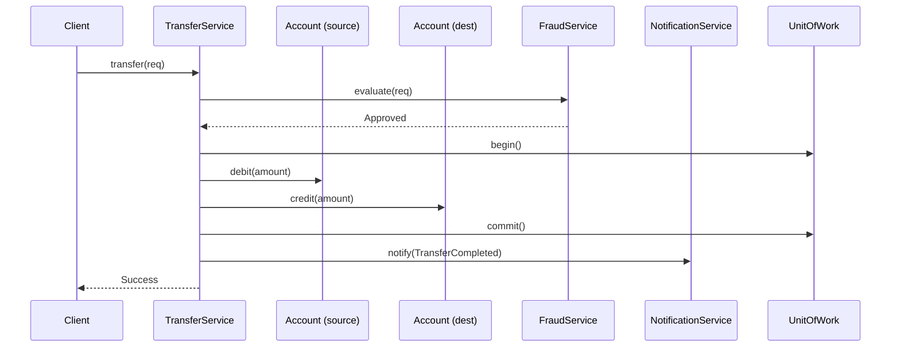

# SOLID in Banking — End-to-End

> The capstone of the SOLID chapter. Walks the transfer flow from the Banking case study ([[00-Banking-Case-Study]]) and shows how all five letters, applied together, produce a design that is cheap to extend, cheap to test, and cheap to reason about.

## What you already know

From [[00-SOLID-as-Dependency-Management]]: SOLID is one principle — *manage dependencies* — viewed from five angles. From [[01-SRP]] through [[05-DIP]]: each letter in detail, with the Banking case study as the running example. From [[04-Responsibilities]]: whoever owns the invariant owns the responsibility for enforcing it. From [[03-Dependency-As-Root-Concept]]: dependencies point toward stability; reduce and invert are the two operations.

This chapter puts the five letters together on one flow — the transfer — and shows the dependency graph that emerges.

## Why this layer exists

Each SOLID letter, learned in isolation, can feel abstract. The transfer flow is the concrete setting where all five interlock: SRP determines the class boundaries; OCP determines the extension points for new account types, fraud rules, and notification channels; LSP determines the substitutability of every account variant; ISP determines the role interfaces each consumer sees; DIP determines the arrow from `TransferService` to its collaborators.

Get all five right and the transfer flow becomes the most stable, most testable, most extensible code in the system. Get any one wrong and the others cannot fully compensate.

## What is genuinely new here

- **The five letters are not independent.** They are five views of one dependency graph. SRP and ISP determine the *nodes* (the classes and interfaces). OCP determines the *extension points* (the abstractions that grow at leaves). LSP determines the *correctness* of substitution at the leaves. DIP determines the *direction* of the arrows between nodes.
- **The dependency graph is the design artifact.** Once you can draw the arrows — direction, weight, abstraction at each end — you have the design. The code is a rendering of the graph.
- **Testability is a side effect.** A SOLID-compliant transfer flow is testable at every layer: unit (mock the abstractions), integration (wire the real implementations), end-to-end (HTTP through the whole stack). The test pyramid emerges from the design; you do not impose it after the fact.

## Concepts (recap, applied)

- **Axis of change** (SRP) — each class has one.
- **Extension point** (OCP) — each variant family has one.
- **Contract** (LSP) — each abstraction advertises one; each subtype honors it.
- **Role interface** (ISP) — each consumer depends on one.
- **Inverted arrow** (DIP) — each policy-to-detail edge is one.

## Banking application — the transfer flow

The transfer flow from [[00-Banking-Case-Study]]:



The SOLID-compliant package structure that emerges:

```mermaid
flowchart TB
    subgraph Policy["com.bank.transfers — policy"]
        TS[TransferService]
        AR[AccountRepository]
        FR[FraudService]
        NS[NotificationService]
        UOW[UnitOfWork]
        TR[TransferRequest]
    end
    subgraph Domain["com.bank.accounts — domain"]
        ACC[Account interface]
        CHK[CheckingAccount]
        SAV[SavingsAccount]
        LED[LedgerEntry]
        AST[AccountStatus]
    end
    subgraph Infra["com.bank.persistence — detail"]
        JAR[JdbcAccountRepository]
        JTR[JdbcTransferRepository]
    end
    subgraph Fraud["com.bank.fraud — detail"]
        RFS[RuleBasedFraudService]
    end
    subgraph Notify["com.bank.notify — detail"]
        ENS[EmailNotificationService]
    end

    TS --> AR
    TS --> FR
    TS --> NS
    TS --> UOW
    AR --> ACC
    CHK ..|> ACC
    SAV ..|> ACC
    JAR ..|> AR
    RFS ..|> FR
    ENS ..|> NS
```

Every arrow ends at an abstraction. Every detail depends on a policy-owned abstraction. The dependency graph points toward the policy module `com.bank.transfers`, which is the most stable code in the system.

The same picture, annotated with which SOLID letter produced each edge:

| Edge | Produced by | Why |
|---|---|---|
| `TransferService → AccountRepository` | DIP | Invert the arrow; policy depends on its own abstraction |
| `AccountRepository → Account` | LSP + ISP | Repository depends on the `Account` role, not on `CheckingAccount` |
| `CheckingAccount ..|> Account` | OCP | New account type added without modifying `TransferService` |
| `JdbcAccountRepository ..|> AccountRepository` | DIP | Detail implements policy's abstraction |
| `RuleBasedFraudService ..|> FraudService` | OCP + DIP | New fraud rule variant; detail implements policy's abstraction |
| `TransferService` has 3 collaborators, not 15 | SRP + ISP | Only the roles transfer needs |
| `Account` is a narrow interface, not a fat one | ISP | Consumers depend only on the role they use |

## Code

The complete `TransferService`:

```java
package com.bank.transfers;

public final class TransferService {
    private final AccountRepository accounts;
    private final FraudService fraud;
    private final NotificationService notifications;
    private final UnitOfWork uow;

    public TransferService(AccountRepository accounts,
                           FraudService fraud,
                           NotificationService notifications,
                           UnitOfWork uow) {
        this.accounts      = accounts;
        this.fraud         = fraud;
        this.notifications = notifications;
        this.uow           = uow;
    }

    public TransferResult transfer(TransferRequest req) {
        if (fraud.evaluate(req) == FraudDecision.REJECTED) {
            throw new TransferRejectedException(req);
        }
        Account from = accounts.findByIban(req.fromIban())
                               .orElseThrow(() -> new AccountNotFoundException(req.fromIban()));
        Account to   = accounts.findByIban(req.toIban())
                               .orElseThrow(() -> new AccountNotFoundException(req.toIban()));

        uow.begin();
        try {
            from.debit(req.amount());
            to.credit(req.amount());
            accounts.save(from);
            accounts.save(to);
            uow.commit();
        } catch (RuntimeException e) {
            uow.rollback();
            throw e;
        }

        notifications.notify(new TransferCompleted(req, Instant.now()));
        return TransferResult.success(req);
    }
}
```

Notice what is absent: no `if (account instanceof ...)`, no `JdbcAccountRepository`, no `EmailGateway`, no `RestFraudClient`, no `DataSource`. The class has four collaborators, all abstractions, all owned by the policy module.

The abstractions:

```java
package com.bank.transfers;

public interface AccountRepository {
    Optional<Account> findByIban(String iban);
    void save(Account account);
}

public interface FraudService {
    FraudDecision evaluate(TransferRequest req);
}

public interface NotificationService {
    void notify(TransferEvent event);
}

public interface UnitOfWork {
    void begin();
    void commit();
    void rollback();
}
```

The `Account` role interface, owned by the domain module:

```java
package com.bank.accounts;

public interface Account {
    String iban();
    BigDecimal balance();
    void debit(BigDecimal amount);
    void credit(BigDecimal amount);
}
```

A concrete implementation:

```java
public final class CheckingAccount implements Account {
    private final String iban;
    private BigDecimal balance;
    private final BigDecimal overdraftLimit;
    private AccountStatus status;

    public CheckingAccount(String iban, BigDecimal opening, BigDecimal overdraft) {
        this.iban = iban;
        this.balance = opening;
        this.overdraftLimit = overdraft;
        this.status = AccountStatus.ACTIVE;
    }

    @Override public String iban()       { return iban; }
    @Override public BigDecimal balance() { return balance; }

    @Override public void debit(BigDecimal amount) {
        if (status != AccountStatus.ACTIVE) throw new AccountNotActiveException(iban);
        if (amount.signum() <= 0)           throw new IllegalArgumentException();
        if (amount.compareTo(balance.add(overdraftLimit)) > 0) {
            throw new InsufficientFundsException(iban, balance, amount);
        }
        balance = balance.subtract(amount);
    }

    @Override public void credit(BigDecimal amount) {
        if (status == AccountStatus.CLOSED) throw new AccountClosedException(iban);
        if (amount.signum() <= 0)           throw new IllegalArgumentException();
        balance = balance.add(amount);
    }
}
```

A concrete implementation of `AccountRepository` (the detail that depends on the policy's abstraction):

```java
package com.bank.persistence.jdbc;

import com.bank.transfers.AccountRepository;
import com.bank.accounts.Account;

public final class JdbcAccountRepository implements AccountRepository {
    private final DataSource dataSource;
    private final AccountMapper mapper;

    public JdbcAccountRepository(DataSource dataSource, AccountMapper mapper) {
        this.dataSource = dataSource;
        this.mapper = mapper;
    }

    @Override public Optional<Account> findByIban(String iban) {
        try (Connection c = dataSource.getConnection()) {
            // SQL omitted; see [[09-Banking-SQL]]
            return Optional.ofNullable(mapper.map(/* result */));
        } catch (SQLException e) {
            throw new PersistenceException(e);
        }
    }

    @Override public void save(Account account) {
        try (Connection c = dataSource.getConnection()) {
            // UPDATE accounts SET balance = ? WHERE iban = ?
        } catch (SQLException e) {
            throw new PersistenceException(e);
        }
    }
}
```

The composition root — the one place that knows about concrete classes:

```java
public final class BankingApplication {
    public static void main(String[] args) {
        DataSource ds = createDataSource(args);
        AccountRepository accounts = new JdbcAccountRepository(ds, new AccountMapper());
        FraudService fraud         = new RuleBasedFraudService();
        NotificationService notify = new EmailNotificationService(smtpClient());
        UnitOfWork uow             = new JdbcUnitOfWork(ds);

        TransferService transfers  = new TransferService(accounts, fraud, notify, uow);
        // ... wire the rest of the graph (controllers, services, etc.)
    }
}
```

## What can go wrong

1. **The five letters applied unevenly.** A team that adopts DIP but not SRP ends up with a `TransferService` that takes six abstractions — half of which it doesn't need. A team that adopts SRP but not LSP ends up with subclasses that compile cleanly but throw at runtime. The five letters reinforce each other; partial adoption produces partial benefits.
2. **The composition root becomes a God Object.** All wiring in one place means one file that knows every concrete class. As the system grows, the composition root becomes unmanageable. The cure: modular composition roots (one per bounded context) with a thin top-level assembler.
3. **Abstractions leak domain concepts into infrastructure.** `AccountRepository.find(Criteria)` looks clean but `Criteria` becomes a query DSL that grows into a parallel of SQL. The cure: keep repository methods named from the domain vocabulary (`findByIban`, `findActiveAccountsForCustomer`), not from query syntax.
4. **Mock-heavy tests give false confidence.** A test that mocks `AccountRepository` and asserts `save` was called twice proves the wiring, not the behavior. The cure: use a real `InMemoryAccountRepository` (a fake, not a mock) that exercises actual `Account` behavior end-to-end. Save mocks for collaborators you do not own (external APIs).
5. **Performance surprises from indirection.** Each abstraction layer adds a method call, a dispatch, sometimes a serialization boundary. For most business code, this is negligible. For hot paths (millions of transfers per second), the layers may need to be flattened. SOLID is a default, not a mandate; performance-critical code may legitimately violate it with documented justification.
6. **The transfer flow is not the only flow.** The same discipline must apply to deposits, withdrawals, statements, interest accrual, fraud review, notifications. The package structure scales; the discipline must scale with it.

## Trade-offs

- **Design effort up front.** A SOLID-compliant transfer flow takes longer to build than a 30-line script. The investment pays back the first time a new account type, a new fraud rule, or a new notification channel is added without touching `TransferService`.
- **Indirection cost on every read.** A new developer reading the transfer flow follows four files: `TransferService`, `AccountRepository`, `Account`, `CheckingAccount`. The same flow in a God Object is one file. The cure: good package boundaries, good naming, and an architecture decision record that maps the flow. See [[00-LLD-Method]].
- **Test pyramid shift.** SOLID makes unit tests cheap and many. Integration tests become mandatory to catch what mocks cannot. End-to-end tests cover the user-facing flows. The total test count is high; the cost per change is low.
- **Flexibility vs simplicity.** A SOLID-compliant design supports swapping the persistence layer, the fraud service, the notification channel. That flexibility is real, but it is paid for in code volume. For a system that will never need the flexibility, the cost is overhead. For a system with a long change horizon, the cost is the cheapest insurance available.
- **Onboarding cost.** A new developer must learn the package structure, the role interfaces, the composition root, the test pyramid. The cure: a clear architecture document (see [[05-Component-And-Deployment]]) and a "read the transfer flow first" guide. Once learned, the structure scales to every other flow in the system.

## Forward links

- [[00-SOLID-as-Dependency-Management]] — the thesis this chapter applies.
- [[01-SRP]] through [[05-DIP]] — the five letters in detail.
- [[00-Patterns-As-Documented-Forces]] — patterns are the concrete realizations of these heuristics.
- [[04-Enterprise-Patterns]] — Repository, Unit of Work, Domain Events as the persistence-level expressions of DIP.
- [[00-LLD-Method]] — the design method that produces SOLID-compliant structures.
- [[03-Hexagonal-Architecture]] and [[04-Clean-Architecture]] — DIP elevated to the architectural level.
- [[00-Banking-Case-Study]] — the anchor for the transfer flow.
