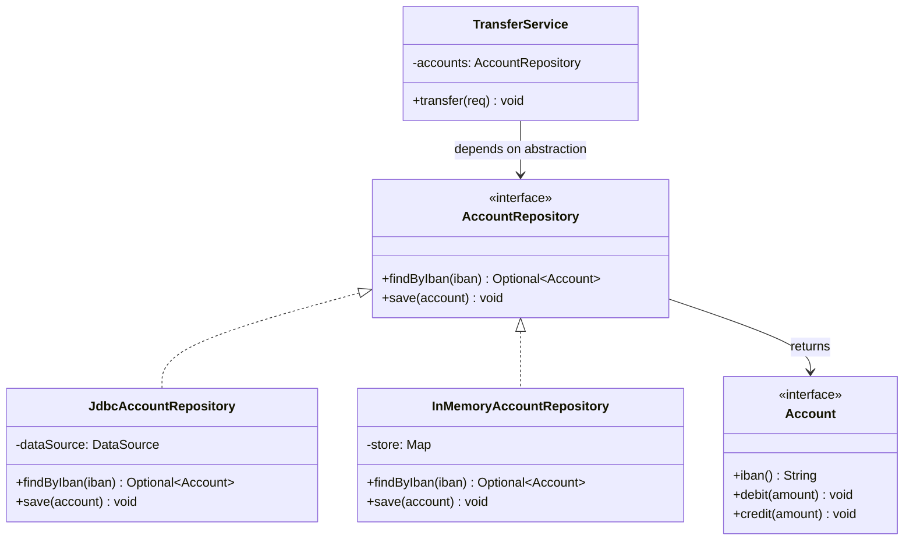

# Patterns as Documented Forces

> A pattern is not a code snippet to copy. A pattern is a *documented solution to a recurring set of forces* in a specific context. The GoF book did not invent patterns; it gave software engineering a vocabulary for naming, capturing, and transmitting design knowledge that previously lived only in the heads of experienced engineers.

## What you already know

From [[03-Dependency-As-Root-Concept]]: dependencies point toward stability; the two operations are *reduce* and *invert*. From [[06-Coupling-and-Cohesion]]: every design rule is a heuristic for coupling or cohesion. From [[08-Trade-offs-Everywhere]]: every design decision is a trade-off; the job is to make trade-offs explicit. From [[00-SOLID-as-Dependency-Management]]: SOLID is dependency management viewed from five angles. Patterns are what those heuristics look like *when applied to a specific recurring problem*.

## Why this layer exists

Without the pattern vocabulary, every design conversation reverts to first principles. Two engineers discussing "how to make `TransferService` testable without a real database" reinvent the Repository pattern from scratch, every time, with different vocabulary. The conversation takes an hour; the resulting code differs from team to team; onboarding is slow.

Patterns exist to short-circuit that reinvention. By giving a *name* to a recurring solution, patterns let engineers say "use a Repository here" and have everyone in the room understand: the interface lives next to the policy, the implementation lives in infrastructure, the consumer depends only on the abstraction, and the trade-off is one extra interface per aggregate. The conversation takes thirty seconds; the resulting code is recognizable across teams.

## What is genuinely new here

- **A pattern is not the code; it is the *forces* and the *solution shape*.** Two repositories with different method signatures are the same pattern. Two repositories with the same signature but different forces (one for a transactional aggregate, one for a read-optimized projection) may be different patterns.
- **Patterns have a canonical format.** Christopher Alexander (the architect who originated the idea) and the Gang of Four (Erich Gamma, Richard Helm, Ralph Johnson, John Vlissides) gave patterns a stable structure: name, intent, motivation, structure, participants, consequences. The format is the *carrier wave* — it lets knowledge travel across teams and decades.
- **Patterns are concrete; principles are abstract.** SOLID is a principle: "manage dependencies." Repository is a pattern: "this specific shape of interface, in this specific context, solves this specific force." Principles guide; patterns instantiate.
- **Patterns have *consequences* — they are not unalloyed wins.** Every pattern adds indirection, complexity, or both. The GoF format makes this explicit: each pattern lists its *consequences*, including the costs. A pattern applied without reading the consequences is a pattern misapplied.
- **Patterns are *documented*; they are not *invented*.** Alexander's original framing: a pattern is *discovered* from good existing designs, not *designed* a priori. If you cannot point to three real systems where the pattern emerged organically, it is not a pattern — it is speculation.

## Concepts

- **Force** — a tension in the design space: a problem pulling in one direction, a constraint pulling in another. Patterns resolve forces; they do not eliminate them.
- **Pattern** — a named, documented solution to a recurring set of forces in a specific context.
- **Pattern language** — a collection of patterns that reference each other, forming a vocabulary for a domain (Alexander's pattern language was architecture; the GoF pattern language is object design; Fowler's *Patterns of Enterprise Application Architecture* is enterprise systems).
- **GoF format** — the canonical structure for documenting a pattern: Name, Intent, Motivation, Applicability, Structure, Participants, Collaborations, Consequences, Implementation, Sample Code, Known Uses, Related Patterns.
- **Consequence** — the cost of applying the pattern. Mandatory in the GoF format. Without consequences, a pattern is a sales pitch.
- **Anti-pattern** — a pattern that *looks* like a solution but is actually a recurring *mistake*. Documented for the same reason: to give a name to the failure mode. See [[05-Anti-Patterns]].
- **Refactoring** — the act of moving from one pattern (or no pattern) to another, in small behavior-preserving steps. Patterns describe *targets*; refactorings describe *paths*.

## Banking application

The Banking case study ([[00-Banking-Case-Study]]) is rich with patterns. A short tour:

- The transfer flow's `TransferService` is a **Service Layer** pattern (see [[04-Enterprise-Patterns]]). The force: orchestrate multiple aggregates (`Account`, `LedgerEntry`) without coupling them to each other. The solution: a stateless service that holds references to repository abstractions and coordinates a single use case. The consequence: an extra layer of indirection.
- `AccountRepository` is a **Repository** pattern. The force: the domain needs to query for accounts without knowing SQL. The solution: an interface that mimics a collection of in-memory objects. The consequence: a class per aggregate, plus the impedance of translating between domain objects and rows.
- `InterestPolicy` is a **Strategy** pattern. The force: interest rules vary by product and change often. The solution: an interface with multiple implementations, selected at runtime. The consequence: an extra indirection on every interest computation.
- `UnitOfWork` is a **Unit of Work** pattern. The force: a transfer must atomically update two accounts and write two ledger entries. The solution: an object that tracks changes and commits them as one transaction. The consequence: a stateful object that must be carefully scoped per request.
- The `Account` interface with `CheckingAccount` and `SavingsAccount` implementations is a **Strategy** / **State** pattern hybrid. The force: account behavior varies by type and lifecycle state. The solution: polymorphic dispatch through the abstraction. The consequence: the type system must be designed carefully to avoid LSP violations (see [[03-LSP]]).
- The notification flow (`TransferCompleted` event → `EmailNotificationService`, `SmsNotificationService`, `AnalyticsService`) is an **Observer** pattern. The force: multiple subsystems need to react to a transfer, without `TransferService` knowing about each one. The solution: an event is published; subscribers react. The consequence: eventual consistency, debugging difficulty, ordering questions.

Each of these is a *pattern application*, not a code snippet. The code differs from team to team; the *shape* of the solution is the same.

## Code

A pattern's documentation typically includes a UML class diagram showing the participants. Here is the Repository pattern documented in the GoF format (condensed):

```text
Pattern: Repository

Intent: Mediate between the domain and data mapping layers using a
collection-like interface for accessing domain objects.

Motivation: A TransferService needs to load and save Accounts. Direct
JDBC calls would couple the domain to a specific persistence technology
and prevent unit testing without a database.

Applicability: Use when:
  - The domain needs to access persistent objects.
  - You want to keep persistence technology out of the domain layer.
  - You want to swap implementations (JDBC, JPA, in-memory) per environment.

Structure:
  AccountRepository (interface, in domain layer)
    + findByIban(iban) : Optional<Account>
    + save(account) : void
        ^
        | implements
  JdbcAccountRepository (in infrastructure layer)
    - dataSource : DataSource
    + findByIban(iban) : Optional<Account>
    + save(account) : void

Participants:
  - AccountRepository: declares the collection-like interface.
  - JdbcAccountRepository: implements the interface using JDBC.
  - Account: the domain object the repository returns.

Consequences:
  + Domain layer has no persistence dependencies.
  + Unit tests can use an in-memory fake.
  + Persistence strategy can be swapped without touching the domain.
  - One repository per aggregate; class count rises.
  - Repository methods can drift into query-DSL leaks if not disciplined.
  - An extra layer of indirection on every persistence call.

Related Patterns: Unit of Work, Identity Map, Query Object, Domain Event.
```

The corresponding Mermaid diagram:



The same documentation shape — name, intent, motivation, structure, participants, consequences, related — applies to every pattern in this chapter. The remaining files in this folder apply it to creational, structural, behavioral, enterprise, and anti-patterns.

## What can go wrong

1. **Pattern cargo-culting.** Applying a pattern because it is in the GoF book, without understanding the forces it solves, produces over-engineered code. A three-class system does not need a Strategy, a Factory, and an Observer. The cure: only apply a pattern when the forces it addresses are *actually present*.
2. **Pattern as goal, not as answer.** "We should use a Repository here" is the wrong framing. The right framing: "We need to invert the dependency from domain to persistence; the Repository pattern is the documented solution to that force." Patterns are answers to specific questions; they are not goals in themselves.
3. **Forgetting the consequences.** Every pattern has costs. A team that adopts Strategy for every variation ends up with code that requires three files to understand one computation. A team that adopts Observer for every cross-cutting concern ends up with a system where cause and effect are separated by an event bus and a debug session. The consequences section of the pattern documentation exists to be read.
4. **Inventing patterns instead of discovering them.** A "pattern" that exists in only one codebase is not a pattern; it is local convention. Real patterns are observed across many systems. If your team has a "BankingRequestHandlerPattern," that is local vocabulary, not a pattern — and that is fine, but do not pretend it is a pattern.
5. **Pattern as excuse for design discipline failure.** "It's the Singleton pattern" is not a justification for global mutable state. "It's the Factory pattern" is not a justification for an unnecessary indirection. Patterns document *good* solutions; they do not bless *bad* ones.
6. **Confusing pattern with implementation.** A Repository is not "a class with `findById` and `save`." A Repository is "an abstraction that mimics a collection, owned by the domain, implemented by infrastructure." The implementation can be anything; the *shape* is the pattern.

## Trade-offs

- **Vocabulary cost vs communication speed.** Learning the pattern vocabulary takes time; the payoff is faster conversations, faster code review, faster onboarding. For a one-person project, the cost may exceed the payoff. For a team, the vocabulary pays back within weeks.
- **Indirection cost vs flexibility.** Most patterns add a layer of indirection. The cost is paid every read and every debug step. The benefit — flexibility, testability, decoupling — is paid over the lifetime of the code. Short-lived code does not need patterns; long-lived code cannot survive without them.
- **Standardization vs local fit.** A pattern imposed where the forces do not match produces worse code than no pattern at all. The cure: train engineers to read the *forces* in the pattern documentation, not just the *structure*. A pattern is right when its forces match the problem's forces.
- **Catalog completeness vs cognitive load.** The GoF catalog has 23 patterns; Fowler's enterprise catalog has ~50; the full pattern literature has hundreds. Memorizing all is impossible; learning the common 20-30 is sufficient. The skill is recognizing which pattern matches which forces, not recalling every pattern.
- **Pattern rigidity vs refactoring.** Patterns describe target states; refactorings describe paths between states. A codebase can be *moving toward* a pattern without being there yet. The pattern vocabulary must be paired with the refactoring vocabulary (Fowler's *Refactoring* book) to be useful in practice.

## Forward links

- [[01-Creational-Patterns]] — Singleton (and its anti-pattern smell), Factory Method, Abstract Factory, Builder, Prototype.
- [[02-Structural-Patterns]] — Adapter, Bridge, Composite, Decorator, Facade, Flyweight, Proxy.
- [[03-Behavioral-Patterns]] — Chain of Responsibility, Command, Iterator, Mediator, Memento, Observer, State, Strategy, Template Method, Visitor.
- [[04-Enterprise-Patterns]] — Repository, Unit of Work, CQRS, Domain Events, Event Sourcing, Identity Map, Service Layer.
- [[05-Anti-Patterns]] — God Object, Spaghetti Code, Golden Hammer, and friends.
- [[06-Patterns-in-Banking]] — the transfer flow as a pattern landscape.
- [[00-SOLID-as-Dependency-Management]] — principles are abstract; patterns are concrete.
- [[00-LLD-Method]] — patterns are the design forces LLD weighs.
- [[01-Class-Diagrams]] — UML is the notation for pattern structure diagrams.
- [[00-Banking-Case-Study]] — the anchor case.
