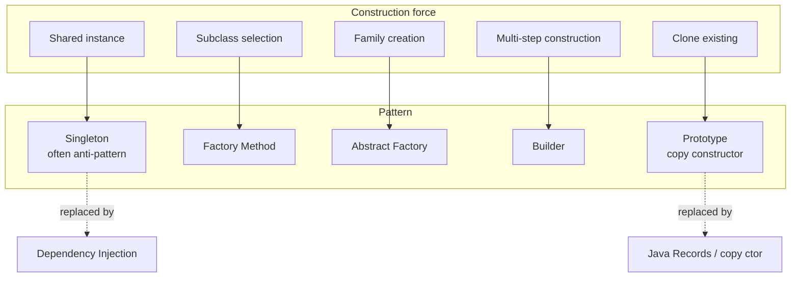

# Creational Patterns

> Patterns that abstract the *construction* of objects. The force they address: a class that needs a particular object should not be coupled to the *concrete class* of that object, nor to the *construction logic* required to build it. Creational patterns move the `new` call out of the consumer and into a dedicated construct.

## What you already know

From [[03-Dependency-As-Root-Concept]]: dependencies point toward stability; `new ConcreteClass()` in a consumer is a direct dependency on the concrete class — the strongest form of coupling. From [[05-DIP]]: depend on abstractions, not concretions; the abstraction owns the contract; the detail implements it. From [[00-Patterns-As-Documented-Forces]]: a pattern is a documented solution to a recurring set of forces, with consequences made explicit.

## Why this layer exists

Without creational patterns, every class that needs an `Account` writes `new CheckingAccount(...)`. The class is now coupled to:
1. The concrete type (`CheckingAccount`, not `SavingsAccount`).
2. The construction logic (which arguments, in what order, what defaults).
3. The lifecycle policy (when to construct, whether to share, whether to pool).

A change to construction logic (e.g., "all accounts now need a `customerId`") forces edits in every consumer. A change to the concrete type (e.g., "use `SavingsAccount` for new customers") forces edits in every consumer. A change to the lifecycle (e.g., "cache accounts by IBAN") forces edits in every consumer.

Creational patterns exist to centralize the construction decision. The consumer says "give me an `Account`"; a creational construct decides which concrete class, with which arguments, under which lifecycle policy. The consumer stays coupled only to the abstraction.

## What is genuinely new here

- **Five creational patterns, each addressing a different construction force.** Singleton centralizes *shared instance*; Factory Method centralizes *subclass selection*; Abstract Factory centralizes *family creation*; Builder centralizes *multi-step construction*; Prototype centralizes *cloning an existing object*.
- **Singleton is usually an anti-pattern.** It introduces global mutable state, hidden dependencies, and testing difficulty. Modern Java gives better alternatives (DI containers, enums for single-instance values). Treat Singleton with suspicion.
- **Builder is the workhorse for value objects with many optional fields.** Records (Java 16+) and sealed classes (Java 17+) reduce the need for classical Builder, but the pattern remains useful for multi-step construction with validation.
- **Factory Method is polymorphism applied to construction.** Each subclass decides which concrete object to return. This is OCP (see [[02-OCP]]) applied to creation.
- **Abstract Factory is Factory Method for families.** When a system must support multiple *families* of related objects (e.g., "Oracle persistence family" vs "PostgreSQL persistence family"), Abstract Factory ensures the family is consistent.
- **Prototype is rare in modern Java.** `Cloneable` is broken; prefer copy constructors or records' `with` methods.

## Concepts

- **Singleton** — a class of which at most one instance can exist. Enforced via private constructor and static accessor.
- **Factory Method** — a method defined in a base class (often abstract) that returns an interface; subclasses override to return specific concrete types.
- **Abstract Factory** — an interface with multiple creation methods, each returning a different object; concrete factories produce a consistent family.
- **Builder** — an object that accumulates construction parameters step by step and produces the final object in a `build()` call.
- **Prototype** — an object that can clone itself, producing a new object with the same state.
- **Composition root** — the single place in the application where concrete classes are instantiated and wired. The modern replacement for most Singleton use cases.

## Banking application

The Banking case study uses creational patterns in several places:

- **`TransferRequest` Builder** — a transfer request has required fields (from IBAN, to IBAN, amount) and many optional ones (idempotency key, currency, scheduled time, fraud override, reference number, customer note). A constructor with fifteen parameters is unreadable; a builder is clean.
- **`NotificationFactory`** — notifications can be delivered via email, SMS, push, or in-app message. The factory selects the right `NotificationChannel` based on customer preferences and the urgency of the message.
- **`AccountFactory`** — opening a new account requires deciding the type (checking vs savings), the interest policy, the overdraft limit, the initial status. A factory method centralizes this decision; subclasses or strategies can vary it.
- **`PersistenceFactory` (Abstract Factory)** — the persistence family (repository implementations, SQL dialect, schema migration strategy) varies by environment (PostgreSQL in production, H2 in tests). An abstract factory ensures the family is consistent.
- **`Account.snapshot()` (Prototype)** — copying an account's state to a snapshot for auditing or rollback is a prototype-like operation, though modern Java favors copy constructors.

## Code

### Singleton (and why to avoid it)

```java
// ANTI-PATTERN — Singleton via static accessor
public class AuditLog {
    private static final AuditLog INSTANCE = new AuditLog();
    private AuditLog() {}
    public static AuditLog getInstance() { return INSTANCE; }
    public void log(String event) { /* ... */ }
}

// Consumer — hidden dependency, untestable
public final class TransferService {
    public void transfer(TransferRequest req) {
        // ... transfer logic ...
        AuditLog.getInstance().log("transfer completed");   // hidden coupling
    }
}
```

The test cannot substitute a fake `AuditLog`. The dependency is invisible in the constructor. The cure: inject the dependency (DIP — see [[05-DIP]]).

```java
// DI-compatible — no Singleton
public final class TransferService {
    private final AuditLog auditLog;
    public TransferService(AuditLog auditLog) { this.auditLog = auditLog; }
    public void transfer(TransferRequest req) {
        // ... transfer logic ...
        auditLog.log("transfer completed");
    }
}

// Composition root wires a single instance (still one instance, but injected)
AuditLog sharedAuditLog = new AuditLog();
TransferService transfers = new TransferService(sharedAuditLog);
```

A legitimate use of Singleton: an enum that represents a fixed set of values (e.g., `enum Currency { USD, EUR, GBP }`). The JVM guarantees one instance per constant. This is the *enum Singleton* pattern — the only Singleton form that is reliably correct.

### Factory Method

```java
public abstract class AccountFactory {
    public abstract Account create(AccountSpecification spec);

    public static AccountFactory forProduct(String productCode) {
        return switch (productCode) {
            case "CHK-STD" -> new CheckingAccountFactory();
            case "SAV-STD" -> new SavingsAccountFactory();
            case "SAV-PROMO" -> new PromoSavingsAccountFactory();
            default -> throw new UnknownProductException(productCode);
        };
    }
}

final class CheckingAccountFactory extends AccountFactory {
    @Override public Account create(AccountSpecification spec) {
        return new CheckingAccount(spec.iban(), spec.openingBalance(),
                                   spec.overdraftLimit().orElse(BigDecimal.ZERO));
    }
}

final class SavingsAccountFactory extends AccountFactory {
    @Override public Account create(AccountSpecification spec) {
        InterestPolicy policy = InterestPolicyRegistry.forProduct(spec.productCode());
        return new SavingsAccount(spec.iban(), spec.openingBalance(), policy);
    }
}
```

`AccountFactory.forProduct(...)` is a *parameterized factory method*. The consumer asks for an account; the factory decides which concrete class. Adding a new product is one new factory class — OCP-compliant.

### Abstract Factory

```java
public interface PersistenceFactory {
    AccountRepository  accountRepository();
    TransferRepository transferRepository();
    LedgerRepository   ledgerRepository();
    SchemaMigrator     schemaMigrator();
}

public final class PostgresPersistenceFactory implements PersistenceFactory {
    private final DataSource ds;
    public PostgresPersistenceFactory(DataSource ds) { this.ds = ds; }
    @Override public AccountRepository  accountRepository()  { return new PostgresAccountRepository(ds); }
    @Override public TransferRepository transferRepository() { return new PostgresTransferRepository(ds); }
    @Override public LedgerRepository   ledgerRepository()   { return new PostgresLedgerRepository(ds); }
    @Override public SchemaMigrator     schemaMigrator()     { return new PostgresSchemaMigrator(ds); }
}

public final class H2TestPersistenceFactory implements PersistenceFactory {
    // ... H2 implementations, schema set up for tests ...
}
```

The system gets a consistent family: either all Postgres or all H2. Mixing is impossible by construction.

### Builder

```java
public final class TransferRequest {
    public final String fromIban;
    public final String toIban;
    public final BigDecimal amount;
    public final String currency;
    public final String idempotencyKey;
    public final Instant scheduledFor;
    public final String reference;
    public final boolean fraudOverride;

    private TransferRequest(Builder b) {
        this.fromIban        = b.fromIban;
        this.toIban          = b.toIban;
        this.amount          = b.amount;
        this.currency        = b.currency;
        this.idempotencyKey  = b.idempotencyKey;
        this.scheduledFor    = b.scheduledFor;
        this.reference       = b.reference;
        this.fraudOverride   = b.fraudOverride;
    }

    public static final class Builder {
        private String fromIban;
        private String toIban;
        private BigDecimal amount;
        private String currency = "EUR";
        private String idempotencyKey = UUID.randomUUID().toString();
        private Instant scheduledFor = Instant.now();
        private String reference = "";
        private boolean fraudOverride = false;

        public Builder from(String iban)            { this.fromIban = iban; return this; }
        public Builder to(String iban)              { this.toIban = iban; return this; }
        public Builder amount(BigDecimal amount)    { this.amount = amount; return this; }
        public Builder currency(String c)           { this.currency = c; return this; }
        public Builder idempotencyKey(String k)     { this.idempotencyKey = k; return this; }
        public Builder scheduledFor(Instant t)      { this.scheduledFor = t; return this; }
        public Builder reference(String r)          { this.reference = r; return this; }
        public Builder fraudOverride(boolean f)     { this.fraudOverride = f; return this; }

        public TransferRequest build() {
            Objects.requireNonNull(fromIban, "from IBAN required");
            Objects.requireNonNull(toIban,   "to IBAN required");
            Objects.requireNonNull(amount,   "amount required");
            if (amount.signum() <= 0) throw new IllegalArgumentException("amount must be positive");
            return new TransferRequest(this);
        }
    }
}

// Usage:
TransferRequest req = new TransferRequest.Builder()
    .from("DE89...")
    .to("FR14...")
    .amount(new BigDecimal("100.00"))
    .reference("invoice 2024-001")
    .build();
```

In Java 21+, a record with validation in a compact constructor and a `with` method for copies is often preferable:

```java
public record TransferRequest(
    String fromIban,
    String toIban,
    BigDecimal amount,
    String currency,
    String idempotencyKey,
    Instant scheduledFor,
    String reference,
    boolean fraudOverride
) {
    public TransferRequest {
        Objects.requireNonNull(fromIban);
        Objects.requireNonNull(toIban);
        Objects.requireNonNull(amount);
        if (amount.signum() <= 0) throw new IllegalArgumentException();
    }
}
```

Records reduce but do not eliminate the Builder pattern — Builder remains useful when construction has *steps* (load defaults, validate, persist a draft, then build the final object).

### Prototype

```java
public final class AccountSnapshot {
    private final String iban;
    private final BigDecimal balance;
    private final AccountStatus status;
    private final Instant capturedAt;

    public AccountSnapshot(Account account) {
        this.iban = account.iban();
        this.balance = account.balance();
        this.status = account.status();
        this.capturedAt = Instant.now();
    }

    // Copy constructor — preferred over Cloneable
    public AccountSnapshot(AccountSnapshot other) {
        this.iban = other.iban;
        this.balance = other.balance;
        this.status = other.status;
        this.capturedAt = other.capturedAt;
    }
}
```

`Cloneable` in Java is broken (no way to enforce `clone()` is implemented; shallow vs deep copy is ambiguous). Copy constructors or records' synthesized copy semantics are the modern alternative.

The five creational patterns, summarized as a relationship map:



## What can go wrong

1. **Singleton as global state.** A Singleton accessible via `getInstance()` is global mutable state. Tests cannot substitute it; dependencies are invisible. Cure: inject the dependency; treat the Singleton instance as a wiring decision in the composition root, not as a global accessor.
2. **Factory Factory Factory.** A factory for a factory for a factory is a code smell. Most construction does not need three layers of indirection. Cure: introduce factories only when the construction logic is non-trivial or the concrete type must vary.
3. **Builder that requires every field.** A builder that demands twenty `withX` calls before `build()` is no improvement over a twenty-argument constructor. Cure: provide sensible defaults; require only the truly mandatory fields.
4. **Abstract Factory for a single-family system.** If the system will only ever use one persistence family, an Abstract Factory is over-engineering. Cure: use a Factory Method or direct construction; promote to Abstract Factory only when the second family appears.
5. **Prototype via `Cloneable`.** Java's `Cloneable` is broken; `clone()` is `protected` on `Object`, the interface has no methods, and shallow-vs-deep is ambiguous. Cure: use copy constructors or records.
6. **Eager singleton initialization.** A Singleton initialized at class-load time delays startup and may fail at load time if its dependencies are not ready. Cure: lazy initialization (with `synchronized` or `Holder` idiom) or, better, DI-container-managed lifecycle.

## Trade-offs

- **Indirection cost vs construction flexibility.** Every factory adds one layer between consumer and constructed object. The cost is paid every read; the benefit is paid every time the construction decision changes.
- **Singleton simplicity vs testability.** A Singleton is the simplest possible API (static accessor); it is also the worst for testing. The trade-off is almost never worth it.
- **Builder verbosity vs readability.** A builder with twenty methods is verbose but each call site is readable. A constructor with twenty parameters is compact but each call site is error-prone (wrong parameter order). The trade-off favors Builder for non-trivial value objects.
- **Factory Method vs Abstract Factory.** Factory Method is simpler (one product, subclass-selected); Abstract Factory is more powerful (a family of products, factory-selected). Use the simpler one until the second product family appears.
- **Prototype vs copy constructor.** Prototype (via `clone()`) is the GoF form; copy constructors are the Java-idiomatic form. The trade-off is between pattern-purity and language fit; Java favors copy constructors.

## Forward links

- [[00-Patterns-As-Documented-Forces]] — the pattern documentation format.
- [[02-Structural-Patterns]] — patterns for composing objects into structures.
- [[03-Behavioral-Patterns]] — patterns for assigning behavior between objects.
- [[04-Enterprise-Patterns]] — Repository, Unit of Work, Service Layer (companion creational concerns).
- [[05-DIP]] — Dependency Inversion is the principle that justifies most creational indirection.
- [[06-SOLID-in-Banking]] — end-to-end view of creational patterns in the transfer flow.
- [[05-Anti-Patterns]] — Singleton's place in the anti-pattern catalogue.
- [[00-Banking-Case-Study]] — the anchor case.
