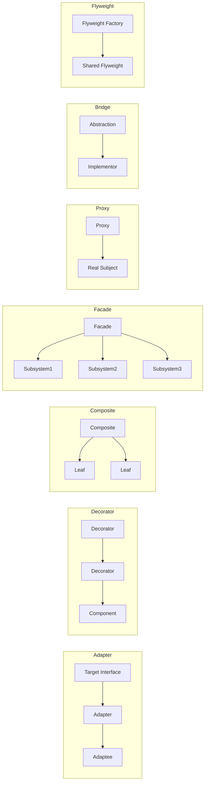

# Structural Patterns

> Patterns that compose objects into larger structures. The force they address: how to combine objects (and classes) so that the resulting structure has the right relationships — adapter, bridge, composite, decorator, facade, flyweight, proxy — without coupling the consumer to the structure's internals.

## What you already know

From [[03-Dependency-As-Root-Concept]]: dependencies point toward stability; reduce or invert are the operations. From [[04-Abstraction-and-Models]]: abstractions hide details and preserve contracts. From [[07-Composition-vs-Inheritance]]: composition is looser than inheritance; the GoF rule is "favor composition over inheritance." From [[00-Patterns-As-Documented-Forces]]: each pattern documents its forces and consequences. From [[05-DIP]]: the consumer depends on an abstraction; the structure is the wiring of implementations behind it.

## Why this layer exists

Structural patterns exist because the *natural* structure of a domain (one object per concept) rarely matches the *required* structure (one object per concern). The domain has an `Account` and a `LedgerEntry`; the system needs an `Account` *that also* logs every mutation, *that also* lazily loads its ledger entries, *that also* is remotely accessible. Building these concerns into the `Account` class itself produces a God Object (see [[05-Anti-Patterns]]) and violates SRP (see [[01-SRP]]).

Structural patterns let you *compose* these concerns from small, single-responsibility objects. The consumer sees one object; the implementation is a graph of cooperating objects, each handling one concern. The composition is invisible to the consumer; the concerns are individually testable; the structure is extensible (add a new decorator, add a new proxy) without editing existing classes.

## What is genuinely new here

- **Seven structural patterns, each composing objects for a different concern.** Adapter makes an existing object fit a new interface. Bridge decouples abstraction from implementation. Composite treats individuals and groups uniformly. Decorator adds behavior without modifying the original. Facade simplifies a complex subsystem. Flyweight shares state across many objects. Proxy controls access.
- **Most structural patterns are composition with a specific purpose.** They differ in *what* they compose and *why*, not in the underlying mechanism (composition + delegation).
- **Decorator is the OCP workhorse for cross-cutting concerns.** Logging, auditing, caching, retry — each becomes a decorator wrapping the original. Adding a new concern is one new class; existing classes do not change.
- **Adapter is the seam for legacy integration.** A legacy payment gateway with a weird API becomes a `PaymentGateway` adapter that the rest of the system talks to. The legacy code does not change; the new code does not know it exists.
- **Facade is the seam for subsystem complexity.** `TransferService` is a facade over `Account`, `LedgerEntry`, `FraudService`, `NotificationService`. The facade orchestrates; the subsystem objects do the work.
- **Proxy is the seam for distribution and lazy loading.** The consumer thinks it has an `Account`; the proxy may be a remote reference, a lazy loader, or an access-control gate. The proxy is transparent to the consumer.

## Concepts

- **Adapter** — converts one interface into another, so an existing class can be used where a different interface is expected.
- **Bridge** — decouples an abstraction from its implementation, so each can vary independently.
- **Composite** — treats individual objects and compositions of objects uniformly through a common interface.
- **Decorator** — wraps an object to add behavior, without modifying the original class or its clients.
- **Facade** — provides a simplified interface to a complex subsystem.
- **Flyweight** — shares fine-grained objects to support large numbers efficiently.
- **Proxy** — provides a surrogate for another object to control access to it.

## Banking application

The Banking case study uses structural patterns heavily:

- **Adapter** — a legacy payment gateway (`LegacyPaymentGateway` with `doPayment(Hashtable)`) is adapted to the modern `PaymentGateway` interface (`send(PaymentRequest): PaymentResponse`). The new code depends on the abstraction; the adapter wraps the legacy code.
- **Decorator** — `TransferService` is wrapped by `LoggingTransferService` (logs every transfer), `AuditingTransferService` (writes audit entries), `RetryingTransferService` (retries transient failures). Each decorator implements the same `TransferService` interface and delegates to the next.
- **Facade** — `TransferService` itself is a facade over the transfer subsystem (`Account`, `LedgerEntry`, `FraudService`, `NotificationService`, `UnitOfWork`).
- **Proxy** — `Account.ledgerEntries()` returns a proxy that lazily loads entries from the database on first access. The consumer thinks it has a `List<LedgerEntry>`; the proxy holds a reference to the loader.
- **Composite** — a `CompositeNotificationChannel` sends a notification through email, SMS, and push, treating each as a `NotificationChannel`. The consumer sends one notification; the composite fans out.
- **Bridge** — `Notification` (abstraction: a message) is bridged from `NotificationChannel` (implementation: email, SMS, push). A `Notification` can be sent through any channel; the channel can carry any notification. They vary independently.
- **Flyweight** — `Currency`, `Country`, and `AccountStatus` are flyweights: one instance per value, shared across the entire system. (In Java, `enum` constants are flyweights by definition.)

## Code

### Adapter

```java
// Modern interface
public interface PaymentGateway {
    PaymentResponse send(PaymentRequest req);
}

// Legacy code we cannot change
public final class LegacyPaymentGateway {
    public Hashtable<String, Object> doPayment(Hashtable<String, Object> request) { /* ... */ }
}

// Adapter
public final class LegacyPaymentGatewayAdapter implements PaymentGateway {
    private final LegacyPaymentGateway legacy;
    public LegacyPaymentGatewayAdapter(LegacyPaymentGateway legacy) { this.legacy = legacy; }

    @Override public PaymentResponse send(PaymentRequest req) {
        Hashtable<String, Object> legacyReq = new Hashtable<>();
        legacyReq.put("acc", req.accountNumber());
        legacyReq.put("amt", req.amount().toString());
        legacyReq.put("cur", req.currency());
        Hashtable<String, Object> legacyResp = legacy.doPayment(legacyReq);
        return new PaymentResponse(
            (String) legacyResp.get("status"),
            (String) legacyResp.get("reference")
        );
    }
}
```

### Decorator

```java
public interface TransferService {
    TransferResult transfer(TransferRequest req);
}

// Core implementation
public final class CoreTransferService implements TransferService {
    private final AccountRepository accounts;
    private final FraudService fraud;
    private final UnitOfWork uow;
    @Override public TransferResult transfer(TransferRequest req) { /* core logic */ }
}

// Decorator: logging
public final class LoggingTransferService implements TransferService {
    private final TransferService delegate;
    private final Logger log;
    public LoggingTransferService(TransferService delegate, Logger log) {
        this.delegate = delegate; this.log = log;
    }
    @Override public TransferResult transfer(TransferRequest req) {
        log.info("transfer start: {}", req);
        TransferResult result = delegate.transfer(req);
        log.info("transfer end: {} -> {}", req, result);
        return result;
    }
}

// Decorator: auditing
public final class AuditingTransferService implements TransferService {
    private final TransferService delegate;
    private final AuditLog audit;
    public AuditingTransferService(TransferService delegate, AuditLog audit) {
        this.delegate = delegate; this.audit = audit;
    }
    @Override public TransferResult transfer(TransferRequest req) {
        TransferResult result = delegate.transfer(req);
        audit.record("transfer", req, result, Instant.now());
        return result;
    }
}

// Wiring: stack the decorators
TransferService transfers = new AuditingTransferService(
    new LoggingTransferService(
        new CoreTransferService(accounts, fraud, uow),
        log),
    audit);
```

### Composite

```java
public interface NotificationChannel {
    void send(Notification notification);
}

public final class EmailChannel implements NotificationChannel { /* ... */ }
public final class SmsChannel   implements NotificationChannel { /* ... */ }
public final class PushChannel  implements NotificationChannel { /* ... */ }

public final class CompositeNotificationChannel implements NotificationChannel {
    private final List<NotificationChannel> channels;
    public CompositeNotificationChannel(NotificationChannel... channels) {
        this.channels = List.of(channels);
    }
    @Override public void send(Notification n) {
        for (NotificationChannel c : channels) {
            try { c.send(n); }
            catch (RuntimeException e) { /* log; do not break the fan-out */ }
        }
    }
}

// Usage: send to all channels
NotificationChannel all = new CompositeNotificationChannel(
    new EmailChannel(), new SmsChannel(), new PushChannel());
all.send(notification);
```

### Proxy (lazy loading)

```java
public interface Account {
    String iban();
    BigDecimal balance();
    List<LedgerEntry> ledgerEntries();
}

public final class LazyAccountProxy implements Account {
    private final String iban;
    private final BigDecimal balance;
    private final LedgerEntryRepository ledgerRepo;
    private volatile List<LedgerEntry> cachedEntries;
    public LazyAccountProxy(String iban, BigDecimal balance, LedgerEntryRepository repo) {
        this.iban = iban; this.balance = balance; this.ledgerRepo = repo;
    }
    @Override public String iban() { return iban; }
    @Override public BigDecimal balance() { return balance; }
    @Override public List<LedgerEntry> ledgerEntries() {
        if (cachedEntries == null) {
            synchronized (this) {
                if (cachedEntries == null) {
                    cachedEntries = ledgerRepo.findByAccount(iban);  // lazy load
                }
            }
        }
        return cachedEntries;
    }
}
```

This is the same mechanism Hibernate uses for lazy loading (see [[02-Lazy-Eager-Loading]]). The consumer thinks it has a fully-loaded `Account`; the proxy holds the database round-trip until the moment entries are needed.

### Facade

```java
public final class TransferService {     // facade
    private final AccountRepository accounts;
    private final FraudService fraud;
    private final NotificationService notifications;
    private final UnitOfWork uow;
    private final AuditLog audit;

    public TransferResult transfer(TransferRequest req) {
        // orchestrates the subsystem: fraud, debit, credit, persist, notify, audit
    }
}
```

The controller calls one method on the facade; the facade coordinates five subsystem objects. The complexity is hidden; the subsystem objects remain individually testable.

### Bridge

```java
public interface NotificationChannel {
    void deliver(String recipient, String body);
}

public abstract class Notification {
    protected final NotificationChannel channel;
    protected Notification(NotificationChannel channel) { this.channel = channel; }
    public abstract void send(String recipient);
}

public final class TransferCompletedNotification extends Notification {
    private final String amount;
    private final String counterparty;
    public TransferCompletedNotification(NotificationChannel channel,
                                         String amount, String counterparty) {
        super(channel); this.amount = amount; this.counterparty = counterparty;
    }
    @Override public void send(String recipient) {
        String body = "Transfer of " + amount + " to " + counterparty + " completed.";
        channel.deliver(recipient, body);
    }
}

// The two dimensions (notification type, channel) vary independently.
NotificationChannel email = new EmailChannel();
Notification n = new TransferCompletedNotification(email, "EUR 100", "FR14...");
n.send("customer@example.com");
```

### Flyweight

```java
// Java enums are flyweights by definition: one instance per constant, JVM-wide.
public enum Currency {
    EUR, USD, GBP, JPY, CHF;
}

public enum AccountStatus {
    PENDING, ACTIVE, FROZEN, CLOSED;
}

// Custom flyweight for a non-enum value
public final class Country {
    private static final Map<String, Country> CACHE = new ConcurrentHashMap<>();
    private final String code;
    private Country(String code) { this.code = code; }
    public static Country of(String code) {
        return CACHE.computeIfAbsent(code, Country::new);
    }
}
```

The structure of all seven patterns, summarized:



## What can go wrong

1. **Decorator stacks that hide the real implementation.** Six decorators deep, a debugger must traverse six layers to find the actual logic. Cure: limit decorator depth; combine concerns into a single decorator when they are always stacked together; document the canonical stack in the composition root.
2. **Adapter that grows into a translator.** When the two interfaces diverge significantly, the adapter becomes a translator with its own domain logic. Cure: split into a pure adapter (mechanical mapping) and a domain translator (semantic mapping). The adapter does no business logic.
3. **Proxy that leaks the laziness.** A lazy proxy that throws `LazyInitializationException` after the session is closed (Hibernate's classic mistake) leaks the proxy-ness to the consumer. Cure: open-session-in-view, or eager-load when the consumer needs the data immediately, or document the lifecycle requirement loudly. See [[02-Lazy-Eager-Loading]].
4. **Facade that becomes a God Object.** A facade that exposes 30 methods of a subsystem is no longer a facade; it is a pass-through that adds nothing. Cure: a facade should expose *use cases*, not *operations*. If the consumer needs raw operations, give it the subsystem directly.
5. **Composite that swallows errors silently.** A composite that catches and logs every child error is convenient but hides failures. Cure: define an error policy (fail-fast, accumulate-and-report, retry-and-continue) explicitly; do not let the composite's default behavior be "swallow."
6. **Flyweight used for mutable state.** A flyweight must be immutable; sharing mutable state produces race conditions. Cure: enforce immutability (final fields, no setters); use a builder for construction but make the flyweight itself immutable.
7. **Bridge over-engineered for a single dimension.** If only one notification type and one channel will ever exist, the bridge is decoration. Cure: introduce the bridge when the second type or the second channel appears.

## Trade-offs

- **Indirection cost vs separation of concerns.** Every structural pattern adds at least one layer of indirection. The cost is paid every read; the benefit is paid every time a concern changes independently.
- **Transparency vs debuggability.** Proxies and decorators are transparent to the consumer — the consumer does not know they exist. This is the design goal. The cost: a debugger must traverse the layers to find the real work. Good logging and good naming mitigate this.
- **Facade simplicity vs subsystem access.** A facade simplifies access by hiding the subsystem. The cost: consumers that need subsystem-level control must bypass the facade. The cure: provide both the facade and direct subsystem access; let the consumer choose.
- **Composite flexibility vs ordering guarantees.** A composite fan-out is order-independent by design. When order matters (e.g., audit before notify), the composite is the wrong pattern; use an explicit sequence (Chain of Responsibility — see [[03-Behavioral-Patterns]]).
- **Flyweight memory savings vs lookup cost.** Sharing instances saves memory but adds a lookup cost (often a `Map.get`). For small numbers of objects, the lookup may exceed the memory savings. Flyweight pays off only for large numbers of similar objects.
- **Adapter as technical debt.** An adapter is sometimes a way to defer rewriting legacy code. The trade-off: the adapter carries the legacy's quirks forward indefinitely. Schedule the rewrite; do not let the adapter become permanent.

## Forward links

- [[00-Patterns-As-Documented-Forces]] — the pattern documentation format.
- [[01-Creational-Patterns]] — patterns for object construction.
- [[03-Behavioral-Patterns]] — patterns for assigning behavior.
- [[04-Enterprise-Patterns]] — Repository (facade over persistence), Unit of Work (facade over transaction).
- [[05-Anti-Patterns]] — God Object is the failure mode Facade prevents.
- [[02-Lazy-Eager-Loading]] — Proxy as the lazy-loading mechanism.
- [[03-N-plus-1-Problem]] — Proxy misuse causing N+1 queries.
- [[00-ORM-Impedance-Mismatch]] — structural patterns as ORM tools.
- [[00-Banking-Case-Study]] — the anchor case.
