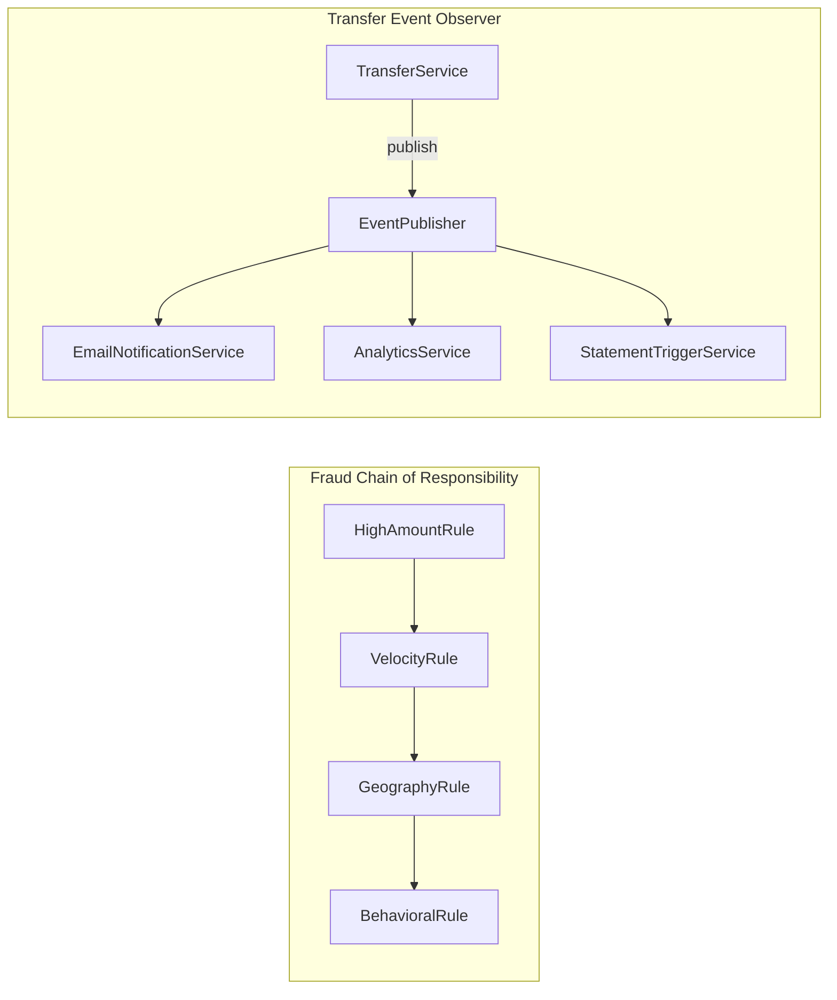

# Behavioral Patterns

> Patterns that assign *behavior* — who does what, when, and how — between objects. The force they address: how to distribute algorithms, decisions, and state changes across collaborating objects without coupling the collaborators to each other's specific implementations.

## What you already know

From [[04-Responsibilities]]: responsibilities are assigned to the object that has the information to fulfill them. From [[03-Dependency-As-Root-Concept]]: dependencies point toward stability; reduce or invert. From [[02-OCP]]: extension at leaves, no modification at trunk. From [[00-Patterns-As-Documented-Forces]]: each pattern documents its forces and consequences. From [[07-Composition-vs-Inheritance]]: polymorphism through composition is the supple mechanism for varying behavior.

## Why this layer exists

Behavioral patterns exist because the *natural* assignment of behavior (every operation on the entity it concerns) does not scale. The `Account` entity cannot itself decide which fraud rules apply, schedule a notification, undo a transaction, or iterate its own entries lazily. Putting all that behavior on `Account` produces a God Object (see [[05-Anti-Patterns]]) and violates SRP (see [[01-SRP]]).

Behavioral patterns let you assign behavior to the *right* object: the rule that varies to a Strategy, the multi-step process to a Template Method, the reversible operation to a Command, the cross-cutting reaction to an Observer, the lifecycle-driven behavior to a State, the chain of validators to a Chain of Responsibility. Each collaborator stays small and cohesive; the orchestration is the pattern.

## What is genuinely new here

- **Ten behavioral patterns, each distributing behavior for a different force.** Chain of Responsibility (multi-step processing), Command (reversible operations), Iterator (sequential access), Mediator (decouple colleagues), Memento (capture/restore state), Observer (publish/subscribe), State (lifecycle-driven behavior), Strategy (interchangeable algorithms), Template Method (algorithm skeleton), Visitor (operations over a structure).
- **Strategy is the OCP workhorse for algorithm variation.** When an algorithm varies by product, jurisdiction, or runtime condition, extract it into a Strategy interface. Adding a new variant is one new class — no existing class changes.
- **State is Strategy for lifecycle.** When an object's behavior changes with its lifecycle state (e.g., `Account` in `PENDING` vs `ACTIVE` vs `FROZEN`), each state becomes a Strategy-like object. The entity delegates to its current state.
- **Observer is the publish/subscribe mechanism.** When multiple subsystems need to react to one event (e.g., transfer completed → notify, audit, analytics), the event is published; subscribers react. The publisher does not know the subscribers.
- **Command makes operations into objects.** An operation as an object can be queued, logged, undone, retried, and serialized. The transfer operation becomes a `TransferCommand` that the system can manipulate.
- **Chain of Responsibility is the fraud-rules pattern.** Each fraud rule is a handler in a chain; the request passes through the chain; each handler decides to approve, reject, or pass to the next.
- **Visitor is rare and controversial.** Visitor lets you add operations over a stable object structure without modifying the structure's classes. The trade-off: adding a new class to the structure requires modifying every visitor. Use only when the structure is stable and operations vary often.

## Concepts

- **Chain of Responsibility** — pass a request along a chain of handlers; each decides to handle or pass on.
- **Command** — encapsulate a request as an object, with parameters, undo logic, and metadata.
- **Iterator** — provide sequential access to a collection's elements without exposing its internal structure.
- **Mediator** — centralize complex communication between colleagues so they do not refer to each other directly.
- **Memento** — capture and externalize an object's internal state so it can be restored later, without violating encapsulation.
- **Observer** — define a one-to-many dependency so that when one object changes state, all its dependents are notified.
- **State** — allow an object to alter its behavior when its internal state changes; the object appears to change class.
- **Strategy** — define a family of algorithms, encapsulate each, and make them interchangeable.
- **Template Method** — define the skeleton of an algorithm in a base class, deferring some steps to subclasses.
- **Visitor** — represent an operation over an object structure; the operation can change without changing the structure's classes.

## Banking application

The Banking case study uses behavioral patterns throughout:

- **Strategy** — `InterestPolicy` (variable interest rules per account type), `FraudRule` (variable fraud rules per risk profile), `OverdraftPolicy` (variable overdraft rules per product). Each is a Strategy interface with multiple implementations.
- **State** — `Account` lifecycle: `PendingState`, `ActiveState`, `FrozenState`, `ClosedState`. The account delegates `debit`, `credit`, `freeze`, `close` to its current state. A `FrozenState.debit()` throws; an `ActiveState.debit()` succeeds.
- **Observer** — `TransferCompleted` event published by `TransferService`; `EmailNotificationService`, `AnalyticsService`, `StatementTriggerService` subscribe. Adding a new subscriber does not require touching `TransferService`.
- **Command** — `TransferCommand`, `DepositCommand`, `WithdrawCommand`, `FreezeCommand`. Each command is an object that can be queued (for batch processing), logged (for audit), and undone (via a compensating command). The undo logic for `TransferCommand` is a reverse transfer.
- **Memento** — `AccountSnapshot` captures an account's state before a transaction; on rollback, the snapshot is restored. This is the unit-of-work pattern's pre-commit state preservation (see [[04-Unit-of-Work]]).
- **Chain of Responsibility** — fraud rules: `HighAmountRule` → `VelocityRule` → `GeographyRule` → `BehavioralRule`. Each rule decides to approve, reject, or pass to the next. A new rule is a new handler; existing handlers do not change.
- **Iterator** — `LedgerEntryIterator` paginates through an account's entries without loading all of them into memory. The consumer sees a `Iterator<LedgerEntry>`; the implementation fetches pages on demand.
- **Template Method** — `StatementGenerator.generate(account, period)` defines the skeleton (gather entries, compute totals, format sections, render); subclasses override individual steps for HTML vs PDF vs CSV rendering.
- **Mediator** — `TransferMediator` coordinates `Account`, `FraudService`, `LedgerService`, `NotificationService` so they do not refer to each other directly. Each collaborator talks to the mediator; the mediator routes messages. (In practice, this is often just called `TransferService` — the boundary between Mediator and Service Layer is blurry.)
- **Visitor** — `ReportVisitor` walks an account tree (accounts, ledger entries, transfers) and produces a regulatory report. Adding a new report type is a new visitor; the account classes do not change. This is rare in banking code; the regulatory reports are typically built with queries (see [[09-Banking-SQL]]) rather than object visitors.

## Code

### Strategy (and State, which is Strategy for lifecycle)

```java
public interface InterestPolicy {
    BigDecimal compute(Account account);
}

public final class StandardSavingsPolicy implements InterestPolicy {
    private static final BigDecimal RATE = new BigDecimal("0.01");
    @Override public BigDecimal compute(Account a) {
        return a.balance().multiply(RATE).setScale(2, RoundingMode.HALF_EVEN);
    }
}

public final class Promo2024Policy implements InterestPolicy {
    private static final BigDecimal RATE = new BigDecimal("0.05");
    @Override public BigDecimal compute(Account a) {
        return a.balance().multiply(RATE).setScale(2, RoundingMode.HALF_EVEN);
    }
}

public final class ZeroInterestPolicy implements InterestPolicy {
    @Override public BigDecimal compute(Account a) { return BigDecimal.ZERO; }
}

// Account holds a Strategy; the strategy can change at runtime
public final class Account {
    private InterestPolicy interestPolicy;
    public void setInterestPolicy(InterestPolicy p) { this.interestPolicy = p; }
    public BigDecimal computeInterest() { return interestPolicy.compute(this); }
}
```

### State (lifecycle-driven behavior)

```java
public interface AccountState {
    void debit(Account account, BigDecimal amount);
    void credit(Account account, BigDecimal amount);
    void freeze(Account account, String reason);
    void close(Account account);
}

public final class ActiveState implements AccountState {
    @Override public void debit(Account a, BigDecimal amount) {
        if (a.balance().compareTo(amount) < 0) throw new InsufficientFundsException(a.iban());
        a.setBalance(a.balance().subtract(amount));
    }
    @Override public void credit(Account a, BigDecimal amount) {
        a.setBalance(a.balance().add(amount));
    }
    @Override public void freeze(Account a, String reason) {
        a.transitionTo(new FrozenState(reason));
    }
    @Override public void close(Account a) {
        a.transitionTo(new ClosedState());
    }
}

public final class FrozenState implements AccountState {
    private final String reason;
    public FrozenState(String reason) { this.reason = reason; }
    @Override public void debit(Account a, BigDecimal amount) {
        throw new AccountFrozenException(a.iban(), reason);
    }
    @Override public void credit(Account a, BigDecimal amount) {
        a.setBalance(a.balance().add(amount));   // deposits allowed
    }
    @Override public void freeze(Account a, String reason) { /* idempotent */ }
    @Override public void close(Account a) { a.transitionTo(new ClosedState()); }
}

public final class ClosedState implements AccountState {
    @Override public void debit(Account a, BigDecimal amount)  { throw new AccountClosedException(a.iban()); }
    @Override public void credit(Account a, BigDecimal amount) { throw new AccountClosedException(a.iban()); }
    @Override public void freeze(Account a, String reason)     { throw new AccountClosedException(a.iban()); }
    @Override public void close(Account a)                     { /* idempotent */ }
}

public final class Account {
    private AccountState state = new PendingState();
    public void debit(BigDecimal amount)  { state.debit(this, amount); }
    public void credit(BigDecimal amount) { state.credit(this, amount); }
    public void freeze(String reason)     { state.freeze(this, reason); }
    public void close()                   { state.close(this); }
    void transitionTo(AccountState s)     { this.state = s; }
    // ... balance, iban, setters ...
}
```

### Observer

```java
public sealed interface TransferEvent permits TransferCompleted, TransferRejected, TransferPending {
    String transferId();
    Instant occurredAt();
}

public record TransferCompleted(String transferId, Instant occurredAt,
                                String fromIban, String toIban, BigDecimal amount)
    implements TransferEvent {}

public interface TransferEventListener {
    void on(TransferEvent event);
}

public final class TransferEventPublisher {
    private final List<TransferEventListener> listeners = new CopyOnWriteArrayList<>();
    public void subscribe(TransferEventListener l) { listeners.add(l); }
    public void publish(TransferEvent event) {
        for (TransferEventListener l : listeners) {
            try { l.on(event); }
            catch (RuntimeException e) { /* log; do not break other subscribers */ }
        }
    }
}

// Subscribers
public final class EmailNotificationService implements TransferEventListener {
    @Override public void on(TransferEvent e) {
        if (e instanceof TransferCompleted tc) { sendEmail(tc); }
    }
}

public final class AnalyticsService implements TransferEventListener {
    @Override public void on(TransferEvent e) { recordMetric(e); }
}
```

### Command + Memento (reversible operations)

```java
public interface Command {
    void execute();
    void undo();
    Memento snapshot();
}

public final class TransferCommand implements Command {
    private final Account from;
    private final Account to;
    private final BigDecimal amount;
    private final TransferEventPublisher events;
    private Memento beforeFrom;
    private Memento beforeTo;

    public TransferCommand(Account from, Account to, BigDecimal amount, TransferEventPublisher events) {
        this.from = from; this.to = to; this.amount = amount; this.events = events;
    }

    @Override public void execute() {
        beforeFrom = from.snapshot();
        beforeTo   = to.snapshot();
        from.debit(amount);
        to.credit(amount);
        events.publish(new TransferCompleted(UUID.randomUUID().toString(),
                                             Instant.now(),
                                             from.iban(), to.iban(), amount));
    }

    @Override public void undo() {
        from.restore(beforeFrom);
        to.restore(beforeTo);
    }

    @Override public Memento snapshot() {
        return new CompositeMemento(beforeFrom, beforeTo);
    }
}

public interface Memento { /* opaque token holding state */ }
public record AccountMemento(String iban, BigDecimal balance, AccountStatus status) implements Memento {}
public record CompositeMemento(Memento a, Memento b) implements Memento {}
```

### Chain of Responsibility (fraud rules)

```java
public abstract class FraudRule {
    private FraudRule next;
    public FraudRule then(FraudRule next) { this.next = next; return next; }
    public FraudDecision evaluate(TransferRequest req) {
        FraudDecision d = check(req);
        if (d != FraudDecision.PASS_TO_NEXT) return d;
        return next == null ? FraudDecision.APPROVED : next.evaluate(req);
    }
    protected abstract FraudDecision check(TransferRequest req);
}

public final class HighAmountRule extends FraudRule {
    private final BigDecimal threshold;
    public HighAmountRule(BigDecimal threshold) { this.threshold = threshold; }
    @Override protected FraudDecision check(TransferRequest req) {
        if (req.amount().compareTo(threshold) > 0) return FraudDecision.REJECTED;
        return FraudDecision.PASS_TO_NEXT;
    }
}

public final class VelocityRule extends FraudRule {
    private final TransferHistory history;
    public VelocityRule(TransferHistory h) { this.history = h; }
    @Override protected FraudDecision check(TransferRequest req) {
        long recentCount = history.countBySenderInLast(req.fromIban(), Duration.ofHours(1));
        if (recentCount > 10) return FraudDecision.PENDING_REVIEW;
        return FraudDecision.PASS_TO_NEXT;
    }
}

// Wiring
FraudRule chain = new HighAmountRule(new BigDecimal("10000"));
chain.then(new VelocityRule(history))
     .then(new GeographyRule(geographyService))
     .then(new BehavioralRule(behavioralService));
```

### Template Method (statement generation)

```java
public abstract class StatementGenerator {
    public final Statement generate(Account account, Period period) {
        List<LedgerEntry> entries = gatherEntries(account, period);
        StatementTotals totals = computeTotals(entries);
        String body = formatBody(account, period, entries, totals);
        return render(account, period, body);
    }
    protected abstract List<LedgerEntry> gatherEntries(Account a, Period p);
    protected StatementTotals computeTotals(List<LedgerEntry> entries) { /* default */ }
    protected abstract String formatBody(Account a, Period p,
                                         List<LedgerEntry> e, StatementTotals t);
    protected abstract Statement render(Account a, Period p, String body);
}

public final class HtmlStatementGenerator extends StatementGenerator { /* ... */ }
public final class PdfStatementGenerator  extends StatementGenerator { /* ... */ }
public final class CsvStatementGenerator  extends StatementGenerator { /* ... */ }
```

### Iterator (paginated ledger)

```java
public final class PaginatedLedgerIterator implements Iterator<LedgerEntry> {
    private final LedgerEntryRepository repo;
    private final String accountIban;
    private final int pageSize;
    private List<LedgerEntry> currentPage;
    private int indexInPage;
    private int offset;
    private boolean exhausted;

    public PaginatedLedgerIterator(LedgerEntryRepository repo, String iban, int pageSize) {
        this.repo = repo; this.accountIban = iban; this.pageSize = pageSize;
        loadNextPage();
    }
    @Override public boolean hasNext() {
        if (indexInPage < currentPage.size()) return true;
        if (exhausted) return false;
        loadNextPage();
        return indexInPage < currentPage.size();
    }
    @Override public LedgerEntry next() {
        if (!hasNext()) throw new NoSuchElementException();
        return currentPage.get(indexInPage++);
    }
    private void loadNextPage() {
        currentPage = repo.findByAccount(accountIban, offset, pageSize);
        if (currentPage.size() < pageSize) exhausted = true;
        offset += currentPage.size();
        indexInPage = 0;
    }
}
```

The fraud chain and the event publisher flow, visualized:



## What can go wrong

1. **Strategy explosion.** A strategy interface with twenty implementations is hard to navigate. Cure: group strategies by purpose; use a registry with names; document the canonical set.
2. **State machine hidden inside a class.** A `switch (status)` inside every method is the smell of a missing State pattern. Cure: extract each branch into a State object; the entity delegates to its current state.
3. **Observer causing event storms.** A poorly-designed observer can cascade: event A triggers subscriber B which publishes event C which triggers subscriber D which publishes event A... The cure: model the event graph explicitly; use a bounded event bus; add cycle detection.
4. **Command without undo.** A Command that cannot be undone is half a pattern. Cure: every reversible command must implement `undo()`; commands that cannot be undone (e.g., sending an email) must be marked `IrreversibleCommand` and handled differently (compensating action, not undo).
5. **Chain of Responsibility with silent passes.** A handler that silently passes the request to the next without logging makes the chain opaque. Cure: each handler logs its decision; the chain's overall verdict is auditable.
6. **Visitor that breaks every time a class is added.** Visitor is right when the *structure* is stable and *operations* vary. If the structure is also varying, Visitor is a maintenance nightmare. Cure: do not use Visitor for evolving structures; use a strategy per node type instead.
7. **Mediator becoming a God Object.** A mediator that knows about every colleague's internals is just a God Object with a fancy name. Cure: the mediator should know only the colleagues' interfaces, not their implementations; colleagues should not know about each other at all.
8. **Template Method with too many hooks.** A Template Method with five abstract hooks is hard to subclass correctly. Cure: keep the skeleton small; prefer composition (Strategy) over inheritance (Template Method) when the variation points multiply.

## Trade-offs

- **Indirection cost vs flexibility.** Every behavioral pattern adds indirection. The cost is paid every read; the benefit is paid every time the behavior varies independently of the entity.
- **Encapsulation vs testability.** Strategy and State make an entity's behavior pluggable, which is great for testing but means the entity no longer fully encapsulates its own behavior. The trade-off: easier testing in exchange for a slightly leakier abstraction.
- **Observer decoupling vs traceability.** Observer decouples publishers from subscribers, which is great for evolution but terrible for debugging ("who reacted to this event?"). The cure: explicit subscription registration; logging at the publisher; an event graph document.
- **Command power vs complexity.** Command enables undo, queueing, retry, and logging — but at the cost of one class per operation. For a system with many operations, the class count rises sharply. The cure: use Command only for operations that genuinely need its capabilities (undo, queue, retry); plain method calls for the rest.
- **Chain of Responsibility flexibility vs verifiability.** The chain can be reconfigured at runtime, which is flexible. The cost: the verdict of a given request is not statically predictable. The cure: log the chain's traversal; test each handler in isolation; test the assembled chain end-to-end.
- **Visitor power vs fragility.** Visitor adds operations without modifying the structure — powerful when the structure is stable. The cost: adding a new structure class requires modifying every visitor. The trade-off favors Visitor only when the structure is genuinely stable.

## Forward links

- [[00-Patterns-As-Documented-Forces]] — the pattern documentation format.
- [[01-Creational-Patterns]] — patterns for object construction.
- [[02-Structural-Patterns]] — patterns for object structure.
- [[04-Enterprise-Patterns]] — Domain Events (Observer for cross-aggregate communication), Service Layer (Mediator/Facade for use cases).
- [[04-Domain-Events]] — Observer as a domain-modeling primitive.
- [[02-OCP]] — Strategy and State are OCP workhorses.
- [[01-SRP]] — behavioral patterns are how SRP is enforced for cross-cutting concerns.
- [[00-Banking-Case-Study]] — the anchor case.
