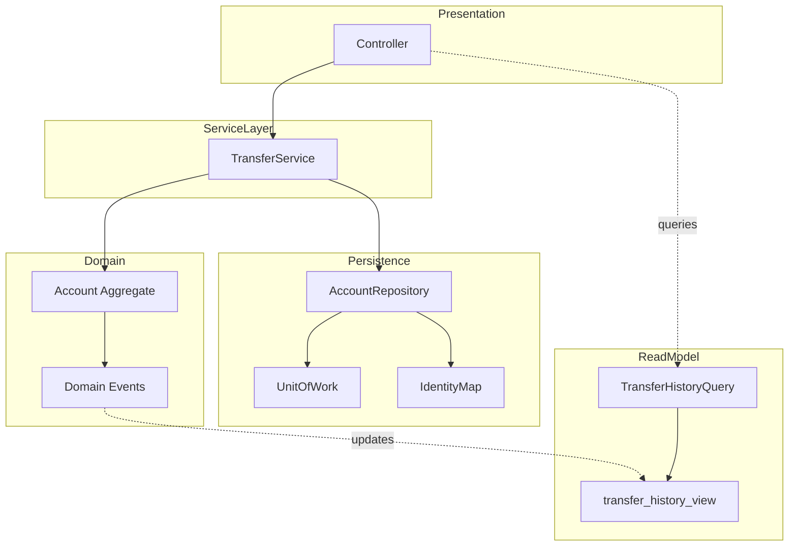

# Enterprise Patterns

> Patterns for the application layer that mediates between the domain model and the infrastructure. Repository, Unit of Work, CQRS, Domain Events, Event Sourcing, Identity Map, Service Layer. The force they address: keep the domain model pure while still persisting, querying, distributing, and auditing it.

## What you already know

From [[05-DIP]]: depend on abstractions, not concretions; the abstraction is owned by the policy. From [[03-Dependency-As-Root-Concept]]: dependencies point toward stability; invert and reduce. From [[02-Aggregates]]: an aggregate is the smallest unit that owns one invariant; it is the consistency boundary. From [[04-Domain-Events]]: events capture facts about state changes; they are how aggregates communicate without coupling. From [[00-ORM-Impedance-Mismatch]]: object graphs and relational schemas do not map one-to-one; the impedance mismatch is real. From [[01-Identity-Map]]: within a session, the same database row should map to the same object reference. From [[00-Patterns-As-Documented-Forces]]: each pattern documents its forces and consequences.

## Why this layer exists

Domain objects (`Account`, `LedgerEntry`, `Transfer`) want to be pure: invariants enforced in code, no SQL, no transaction plumbing, no knowledge of persistence. The infrastructure (database, message bus, cache) wants to be efficient: batch reads, lazy associations, transactional integrity, query optimization. These two wants are in tension. Putting persistence logic in domain objects pollutes them (anemic models become bloated; rich models become tangled with JDBC). Putting domain logic in infrastructure violates DIP — the policy depends on the detail.

Enterprise patterns exist to mediate. They are the *seam* between domain and infrastructure. Each pattern addresses one force: Repository for querying, Unit of Work for transactional consistency, Identity Map for in-session equality, Domain Events for cross-aggregate communication, CQRS for read/write separation, Event Sourcing for audit and temporal queries, Service Layer for use-case orchestration.

## What is genuinely new here

- **Repository** — *mimics an in-memory collection* for accessing domain objects. The domain says `accounts.findByIban(iban)`; the repository translates to SQL, JDBC, mapping. The domain has no persistence dependencies.
- **Unit of Work** — *tracks changes to a set of objects and commits them as one transaction*. The domain mutates objects; the unit of work observes and persists atomically.
- **Identity Map** — *ensures that, within a session, one database row maps to one object reference*. Prevents duplicate loads, detects conflicting updates, makes object identity coincide with primary key within the session.
- **Domain Events** — *facts about state changes*, published by aggregates, consumed by subscribers. Decouples the publisher from the subscribers; enables eventual consistency between bounded contexts.
- **CQRS** — *separate the write model (commands, aggregates) from the read model (queries, projections)*. The write model enforces invariants; the read model is optimized for queries. They are kept in sync via events.
- **Event Sourcing** — *store the events that led to the current state, not the state itself*. The current state is a projection of the event log. Auditability is total; temporal queries ("what was the balance on date X?") are trivial; the event log is the source of truth.
- **Service Layer** — *the entry point for use cases*. Orchestrates aggregates, repositories, unit of work, event publishing. Stateless (or near-stateless); transactional; the boundary between presentation and domain.

## Concepts

- **Aggregate** — a cluster of domain objects treated as one unit for data changes; one object is the root. See [[02-Aggregates]].
- **Repository** — an interface that mimics a collection for an aggregate root.
- **Unit of Work** — an object that tracks changes within a transactional scope and commits atomically.
- **Identity Map** — a map from primary key to object reference, scoped to a session.
- **Domain Event** — a fact about a state change, published by an aggregate.
- **Command** — an intent to change state, processed by an aggregate or service.
- **Query** — a request for data, processed by a read model.
- **CQRS** — Command/Query Responsibility Segregation; separate models for reads and writes.
- **Projection** — a read-optimized view derived from the event log or the write model.
- **Event Sourcing** — storing events as the source of truth; state is a projection.
- **Service Layer** — the orchestration layer for use cases.

## Banking application

The Banking case study uses every enterprise pattern:

- **`AccountRepository`** — the domain says `accounts.findByIban("DE89...")`; the JPA/JDBC implementation translates to SQL. The domain depends only on the abstraction (DIP — see [[05-DIP]]).
- **`TransferUnitOfWork`** — coordinates the debit, the credit, the two ledger entries, and the transfer record into one transactional commit. If any step fails, all roll back.
- **Identity Map** — within a single transfer request, the source account loaded by `AccountRepository.findByIban` and the source account referenced by `FraudService.evaluate` must be the same object reference. The Identity Map (typically managed by Hibernate's session) ensures this.
- **`TransferCompleted` Domain Event** — published by `TransferService` after a successful commit. Subscribers send notifications, update analytics, trigger statement regeneration.
- **CQRS split** — the write model (`TransferService` + `Account` aggregate) enforces the balance invariant. The read model (`TransferHistoryQuery` against a denormalized `transfer_history_view`) serves the dashboard. The view is updated by a projection that consumes `TransferCompleted` events.
- **Event Sourcing via ledger entries** — every monetary movement is recorded as an immutable `LedgerEntry`. The current balance is the sum of ledger entries for the account. This is event sourcing: the ledger entries are the events; the balance is the projection. Audit is total; temporal queries ("what was the balance at end of Q3?") are a `SUM(amount) WHERE occurred_at <= ...`.
- **`TransferService` (Service Layer)** — orchestrates the transfer use case: load accounts, evaluate fraud, debit, credit, persist, publish event. Stateless; transactional; the entry point from the controller.

## Code

### Repository

```java
// Domain layer — interface owned by the domain
package com.bank.accounts;

public interface AccountRepository {
    Optional<Account> findByIban(String iban);
    List<Account> findByCustomer(CustomerId customerId);
    void save(Account account);
}

// Infrastructure layer — implementation
package com.bank.persistence.jpa;

import com.bank.accounts.AccountRepository;

@Repository
public final class JpaAccountRepository implements AccountRepository {
    @PersistenceContext private EntityManager em;

    @Override public Optional<Account> findByIban(String iban) {
        return em.createQuery("SELECT a FROM Account a WHERE a.iban = :iban", Account.class)
                 .setParameter("iban", iban)
                 .getResultStream()
                 .findFirst();
    }
    @Override public List<Account> findByCustomer(CustomerId customerId) {
        return em.createQuery("SELECT a FROM Account a WHERE a.customerId = :cid", Account.class)
                 .setParameter("cid", customerId)
                 .getResultList();
    }
    @Override public void save(Account account) {
        if (account.isNew()) em.persist(account);
        else                 em.merge(account);
    }
}
```

The domain calls `accounts.findByIban(...)`; the implementation is JPA. Swap to JDBC, MongoDB, or an in-memory fake for tests without touching the domain. See [[05-Repository-Pattern]].

### Unit of Work

```java
public interface UnitOfWork extends AutoCloseable {
    void begin();
    void commit();
    void rollback();
    @Override void close();   // rolls back if not committed
}

public final class JpaUnitOfWork implements UnitOfWork {
    private final EntityTransaction tx;
    private boolean committed = false;
    public JpaUnitOfWork(EntityManager em) { this.tx = em.getTransaction(); }
    @Override public void begin()    { tx.begin(); }
    @Override public void commit()   { tx.commit(); committed = true; }
    @Override public void rollback() { if (tx.isActive()) tx.rollback(); }
    @Override public void close()    { if (!committed && tx.isActive()) tx.rollback(); }
}

// Usage in TransferService
public final class TransferService {
    private final AccountRepository accounts;
    private final UnitOfWorkFactory uowFactory;
    public TransferResult transfer(TransferRequest req) {
        try (UnitOfWork uow = uowFactory.create()) {
            uow.begin();
            Account from = accounts.findByIban(req.fromIban()).orElseThrow();
            Account to   = accounts.findByIban(req.toIban()).orElseThrow();
            from.debit(req.amount());
            to.credit(req.amount());
            accounts.save(from);
            accounts.save(to);
            uow.commit();
            return TransferResult.success(req);
        }   // uow.close() called automatically; rolls back if not committed
    }
}
```

The Unit of Work makes the two `save` calls atomic. Without it, a crash between `save(from)` and `save(to)` leaves the system in an inconsistent state. See [[04-Unit-of-Work]].

### Identity Map

The Identity Map is typically managed by the ORM session. In raw JDBC, you must implement it yourself:

```java
public final class IdentityMap<T, ID> {
    private final Map<ID, T> map = new HashMap<>();
    public Optional<T> get(ID id)            { return Optional.ofNullable(map.get(id)); }
    public void put(ID id, T entity)         { map.put(id, entity); }
    public void remove(ID id)                { map.remove(id); }
    public void clear()                      { map.clear(); }
}

public final class IdentityMapAccountRepository implements AccountRepository {
    private final AccountRepository delegate;
    private final IdentityMap<Account, String> byIban = new IdentityMap<>();
    @Override public Optional<Account> findByIban(String iban) {
        Optional<Account> cached = byIban.get(iban);
        if (cached.isPresent()) return cached;
        Optional<Account> loaded = delegate.findByIban(iban);
        loaded.ifPresent(a -> byIban.put(iban, a));
        return loaded;
    }
    @Override public void save(Account account) {
        delegate.save(account);
        byIban.put(account.iban(), account);
    }
}
```

Within one unit of work, `findByIban("DE89...")` always returns the same object reference. The fraud service, the transfer service, and the audit log all see the same `Account` — important for consistency and for performance (no duplicate loads). See [[01-Identity-Map]].

### Domain Events

```java
public sealed interface DomainEvent permits TransferCompleted, AccountFrozen, AccountClosed {
    Instant occurredAt();
}

public record TransferCompleted(String transferId, String fromIban, String toIban,
                                BigDecimal amount, Instant occurredAt) implements DomainEvent {}

public interface DomainEventPublisher {
    void publish(DomainEvent event);
}

// In TransferService, after commit:
events.publish(new TransferCompleted(
    UUID.randomUUID().toString(),
    req.fromIban(), req.toIban(), req.amount(), Instant.now()));

// Subscribers (in a different bounded context)
public final class NotificationEventHandler implements DomainEventHandler<TransferCompleted> {
    @Override public void handle(TransferCompleted e) {
        notificationService.sendTransferConfirmation(e);
    }
}
```

The publisher does not know the subscribers. New subscribers can be added without touching `TransferService`. See [[04-Domain-Events]].

### CQRS

```java
// Write model — commands and aggregates
public final class TransferCommandHandler {
    public void handle(TransferCommand cmd) {
        // load aggregates, mutate, persist via Unit of Work, publish event
    }
}

// Read model — projections, optimized for queries
public final class TransferHistoryQuery {
    public List<TransferHistoryEntry> findByCustomer(CustomerId customerId, Period p) {
        // SELECT * FROM transfer_history_view WHERE customer_id = ? AND occurred_at BETWEEN ? AND ?
        // This view is a denormalized projection, updated by a TransferCompleted event handler.
    }
    public BigDecimal totalSentByCustomer(CustomerId customerId, Year year) {
        // SELECT SUM(amount) FROM transfer_history_view WHERE sender_id = ? AND year = ?
    }
}
```

The write model (`TransferCommandHandler` + `Account` aggregate) is small, transactional, invariant-enforcing. The read model (`TransferHistoryQuery`) is large, denormalized, query-optimized. They are kept in sync via `TransferCompleted` events: a projection updates `transfer_history_view` whenever a transfer completes. See [[04-Domain-Events]].

### Event Sourcing (via ledger entries)

```sql
-- The event log
CREATE TABLE ledger_entries (
    id BIGSERIAL PRIMARY KEY,
    account_id BIGINT NOT NULL REFERENCES accounts(id),
    amount NUMERIC(18,2) NOT NULL,        -- positive = credit, negative = debit
    occurred_at TIMESTAMPTZ NOT NULL,
    correlation_id UUID,                   -- links entries of the same transfer
    description TEXT
);

-- The current state is a projection
CREATE VIEW account_balances AS
SELECT account_id, SUM(amount) AS current_balance
FROM ledger_entries
GROUP BY account_id;

-- Temporal query: what was the balance on date X?
SELECT SUM(amount) FROM ledger_entries
WHERE account_id = ? AND occurred_at <= ?;
```

```java
public final class EventSourcedAccount {
    private final AccountId id;
    private final List<LedgerEntry> events = new ArrayList<>();

    public static EventSourcedAccount fromHistory(List<LedgerEntry> history) {
        EventSourcedAccount a = new EventSourcedAccount(history.get(0).accountId());
        history.forEach(a::apply);
        return a;
    }

    public BigDecimal currentBalance() {
        return events.stream()
                     .map(LedgerEntry::amount)
                     .reduce(BigDecimal.ZERO, BigDecimal::add);
    }

    public BigDecimal balanceAt(Instant when) {
        return events.stream()
                     .filter(e -> e.occurredAt().isBefore(when))
                     .map(LedgerEntry::amount)
                     .reduce(BigDecimal.ZERO, BigDecimal::add);
    }

    public void debit(BigDecimal amount) {
        if (currentBalance().compareTo(amount) < 0) {
            throw new InsufficientFundsException(id);
        }
        apply(new LedgerEntry(id, amount.negate(), Instant.now(), "debit"));
    }

    private void apply(LedgerEntry e) {
        events.add(e);
    }
}
```

The ledger entries *are* the events; the balance is a projection. Replay the events from the beginning and you reconstruct any past state. This is event sourcing at its purest — and the banking case study's rule 4 (immutability of ledger entries) is what makes it possible.

### Service Layer

```java
@Service
@Transactional
public final class TransferService {
    private final AccountRepository accounts;
    private final FraudService fraud;
    private final DomainEventPublisher events;

    public TransferResult transfer(TransferRequest req) {
        if (fraud.evaluate(req) == FraudDecision.REJECTED) {
            throw new TransferRejectedException(req);
        }
        Account from = accounts.findByIban(req.fromIban()).orElseThrow(/* ... */);
        Account to   = accounts.findByIban(req.toIban()).orElseThrow(/* ... */);
        from.debit(req.amount());
        to.credit(req.amount());
        accounts.save(from);
        accounts.save(to);
        events.publish(new TransferCompleted(UUID.randomUUID().toString(),
                                             req.fromIban(), req.toIban(),
                                             req.amount(), Instant.now()));
        return TransferResult.success(req);
    }
}
```

`TransferService` is the service layer entry point. It orchestrates the use case: fraud check, debit, credit, persist, publish. It owns no state; it is the seam between the controller and the domain.

The relationship between these patterns, visualized:



## What can go wrong

1. **Repository that leaks SQL.** `AccountRepository.find(Criteria)` looks clean but `Criteria` becomes a query DSL that drifts toward SQL. The cure: keep repository methods named from the domain vocabulary (`findByIban`, `findActiveAccountsForCustomer`), not from query syntax. See [[04-Abstraction-and-Models]].
2. **Unit of Work that crosses boundaries.** A unit of work that spans multiple HTTP requests, or that holds a database connection across a network call, produces lock contention and connection starvation. The cure: scope the unit of work to one use case; never let it cross an external call.
3. **Identity Map that becomes stale.** The identity map assumes no other process is mutating the database during the session. In a distributed system this is false; another process may have updated the row. The cure: use optimistic concurrency (version column) and refresh the identity map on conflict.
4. **Domain Events that block the transaction.** If event subscribers are synchronous, a slow subscriber blocks the transaction and the user. The cure: publish events after commit; subscribers run asynchronously; the transaction stays fast.
5. **CQRS that drifts out of sync.** If the projection is not updated when an event is published, the read model shows stale data. The cure: idempotent projection updates; replay from the event log on inconsistency; monitor projection lag.
6. **Event Sourcing that grows without compaction.** An event log with billions of entries is slow to replay. The cure: snapshot periodically (every N events, store a snapshot of the aggregate state); replay from the latest snapshot.
7. **Service Layer that becomes a God Object.** A `BankingService` with twenty methods is a God Object wearing a service-layer hat. The cure: one service per use case cluster; small, focused, testable.
8. **Anemic domain model masquerading as rich.** If the entities have only getters and setters and the service layer enforces all invariants, the model is anemic. The cure: move invariant enforcement to the entity; the service layer orchestrates, it does not enforce. See [[05-Anemic-vs-Rich-Models]].

## Trade-offs

- **Indirection cost vs decoupling.** Each enterprise pattern adds a layer. The cost is paid every read; the benefit is paid every time persistence, query, or communication strategy changes.
- **Repository abstraction vs query power.** A repository that mimics a collection cannot express complex queries (joins, aggregations, window functions). The cure: keep repositories for aggregate access; use query objects or read models for reporting queries.
- **Unit of Work simplicity vs distributed transactions.** A unit of work within one database is straightforward. A unit of work across databases or services requires distributed transactions (two-phase commit) or eventual consistency (sagas). The trade-off: pick the simpler model until cross-resource transactions are unavoidable. See [[07-Distributed-Transactions]].
- **CQRS power vs complexity.** CQRS enables read/write optimization but doubles the model (write model + read model) and introduces sync requirements. The trade-off favors CQRS when reads and writes have very different shapes or scales.
- **Event Sourcing auditability vs replay cost.** Event sourcing gives perfect auditability and temporal queries; the cost is replay time, snapshot management, and schema migration (old events must be replayable against new code). The trade-off favors event sourcing when audit is regulatory or when temporal queries are common.
- **Identity Map correctness vs concurrency.** The identity map assumes a single-threaded session. Multi-threaded sessions require careful synchronization or per-thread maps. The trade-off: scope sessions per request, not globally.
- **Service Layer orchestration vs domain richness.** A service layer that orchestrates rich aggregates is the sweet spot. A service layer that orchestrates anemic entities is an anti-pattern. The trade-off: push behavior into aggregates wherever the invariant lives there.

## Forward links

- [[00-Patterns-As-Documented-Forces]] — the pattern documentation format.
- [[00-ORM-Impedance-Mismatch]] — the foundational problem these patterns mediate.
- [[01-Identity-Map]] — Identity Map in depth.
- [[04-Unit-of-Work]] — Unit of Work in depth.
- [[05-Repository-Pattern]] — Repository in depth.
- [[02-Aggregates]] — the consistency boundary repositories serve.
- [[04-Domain-Events]] — Domain Events as a domain-modeling primitive.
- [[05-Anemic-vs-Rich-Models]] — the trade-off the Service Layer mediates.
- [[00-LLD-Method]] — enterprise patterns as the building blocks of LLD.
- [[03-Hexagonal-Architecture]] and [[04-Clean-Architecture]] — enterprise patterns as the architectural seams.
- [[00-Banking-Case-Study]] — the anchor case.
