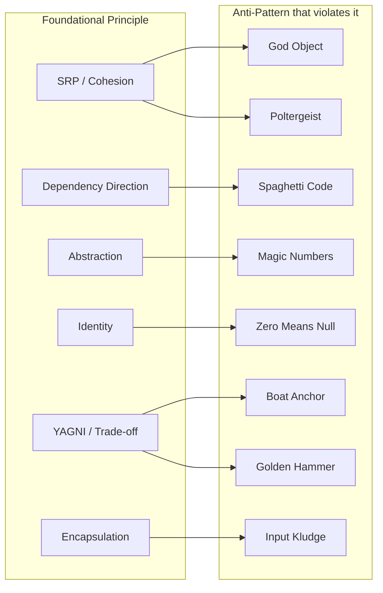

# Anti-Patterns

> Patterns that *look* like solutions but are actually recurring mistakes. Documented for the same reason patterns are: to give a name to the failure mode, so the conversation about it can be short. An anti-pattern is a violation of one or more foundational principles (see [[03-Dependency-As-Root-Concept]] and [[06-Coupling-and-Cohesion]]) that has become common enough to deserve a name.

## What you already know

From [[03-Dependency-As-Root-Concept]]: dependencies point toward stability; reduce and invert are the operations. From [[06-Coupling-and-Cohesion]]: high coupling and low cohesion are the worst combination; the test for cohesion is *shared invariant*, not "relatedness." From [[00-SOLID-as-Dependency-Management]]: SOLID is dependency management; every SOLID violation is, at root, a dependency-management failure. From [[00-Patterns-As-Documented-Forces]]: a pattern documents forces and consequences; an anti-pattern documents the same, but the "solution" is the mistake.

## Why this layer exists

Engineers repeat the same mistakes because the mistakes look like solutions in the moment. A `BankingService` with 30 methods feels like progress ("I am building the system!"). A `null` return value feels like defensive coding ("what if there is no account?"). A magic number `86400` feels like a clever shortcut ("everyone knows that is one day in seconds"). Each choice feels right; each choice is a slow-burning failure that surfaces six months later as a bug, a missed deadline, or an unmaintainable codebase.

Anti-patterns exist to *name* these mistakes so they can be recognized quickly and discussed precisely. "This is a God Object" is a thirty-second conversation; "this class has too many responsibilities and the responsibilities are unrelated" is a thirty-minute conversation that arrives at the same conclusion. Naming accelerates the cure.

## What is genuinely new here

- **Anti-patterns are documented solutions to recurring problems — where the solution is wrong.** The same documentation format applies: name, symptom, cause, cure, consequences.
- **Every anti-pattern is a violation of foundational principles.** God Object violates SRP and cohesion. Spaghetti Code violates dependency direction. Golden Hammer violates trade-off thinking. Magic Numbers violate abstraction. Poltergeist violates SRP. Boat Anchor violates YAGNI. Input Kludge violates encapsulation. Zero Means Null violates identity.
- **Anti-patterns are not the absence of patterns.** They are *patterns* — recurring, recognizable, named. The difference is that they recur because they are *tempting*, not because they are *good*.
- **The cure for an anti-pattern is almost always "introduce an abstraction" or "split along responsibility lines."** The cure is rarely "delete the code"; the code exists because someone needed it. The cure is to refactor it into a shape that respects the principles.

## Concepts

- **God Object** — a class that knows too much or does too much. The single most common anti-pattern; the SRP violation incarnate.
- **Spaghetti Code** — code with no structure; control flows unpredictably through unstructured calls and gotos.
- **Golden Hammer** — "I have a hammer; everything is a nail." The misuse of a familiar technology for problems it does not fit.
- **Magic Numbers / Magic Strings** — literal values embedded in code without explanation or naming.
- **Poltergeist** — a class with a short, feeble life that exists only to pass data to another class.
- **Boat Anchor** — code, a class, or a tool kept in the codebase long after its usefulness has ended.
- **Input Kludge** — fragile, ad-hoc input handling that fails on edge cases.
- **Zero Means Null** — using a sentinel value (often 0, -1, or empty string) to mean "no value," conflating "the value zero" with "no value."

For each: symptom, cause, cure, banking example.

## Banking application

The Banking case study is fertile ground for anti-patterns. Each anti-pattern below is illustrated in the banking context, with the cure that respects the foundational principles.

### God Object

- **Symptom**: A `BankingService` class with 30 methods, 5000 lines, 15 dependencies, modified by every developer on every feature. Tests take minutes because every test wires the entire object.
- **Cause**: Developers add the next method to the path of least resistance — the class that already exists. No one says "this belongs elsewhere."
- **Cure**: Split along responsibility lines — `TransferService`, `StatementService`, `InterestService`, `FraudService`, `NotificationService`, `AccountLifecycleService`. Each has one actor, one invariant. See [[01-SRP]] and [[04-Responsibilities]].
- **Banking example**: The `BankingService` God Object from [[04-Responsibilities]], split into the responsibility map shown there.

### Spaghetti Code

- **Symptom**: A `transfer` method that calls `doFraudCheck` which calls `updateBalance` which calls `sendNotification` which calls `validateRequest` which calls `transfer` (cycle). Control flow is unpredictable; bugs are untraceable.
- **Cause**: No layered architecture; methods call whatever is convenient; no concept of dependency direction.
- **Cure**: Introduce a layered architecture (see [[02-Layered-Architecture]]); enforce dependency direction (controllers → services → repositories → domain); break cycles by introducing abstractions (DIP — see [[05-DIP]]).
- **Banking example**: A controller that calls the JDBC layer directly, the JDBC layer that calls the email service, the email service that calls back into the controller to "report success." Each layer violates the one above it.

### Golden Hammer

- **Symptom**: "We use Kafka for everything." A messaging system used for caching, for configuration, for service discovery, for scheduled jobs. Each use is a stretch; some are wrong.
- **Cause**: One technology is mastered; everything else looks like a learning curve. Familiarity wins over fit.
- **Cure**: For each new problem, ask "what is the force?" and "what pattern fits?" — not "what do we already know?" Apply trade-off thinking explicitly (see [[08-Trade-offs-Everywhere]]).
- **Banking example**: Using the same SQL database for OLTP transfers, OLAP reporting, and time-series fraud detection. The OLAP queries are slow; the fraud detection is slow; the OLTP transfers are slowed by the reporting load. Cure: CQRS (separate write model from read model — see [[04-Enterprise-Patterns]]); separate time-series store for fraud.

### Magic Numbers / Magic Strings

- **Symptom**: `if (transfer.amount().compareTo(new BigDecimal("10000")) > 0) { /* fraud review */ }`. The number 10000 appears in 17 places; when the threshold changes, 16 are updated and one is missed.
- **Cause**: Lack of discipline; the value is "obvious" at write time and opaque at read time.
- **Cure**: Extract to a named constant or a configuration value. `private static final BigDecimal FRAUD_REVIEW_THRESHOLD = new BigDecimal("10000");` or, better, `fraudRulesConfig.reviewThreshold()`.
- **Banking example**: The threshold `10000`, the currency `"EUR"`, the status `"ACTIVE"`, the role `"ADMIN"` — every one of these is a magic value that should be a named constant or an enum.
- **Code**:
  ```java
  // ANTI-PATTERN
  if (account.getStatus().equals("ACTIVE") && amount.compareTo(new BigDecimal("10000")) > 0) {
      flagForFraudReview();
  }

  // CURE
  if (account.status() == AccountStatus.ACTIVE
      && amount.compareTo(fraudConfig.reviewThreshold()) > 0) {
      flagForFraudReview();
  }
  ```

### Poltergeist

- **Symptom**: A `TransferContext` class is created at the start of `transfer`, populated with five fields, passed to three methods, then discarded. The class has no behavior; it is a temporary bag.
- **Cause**: Over-abstracting parameter passing; creating a "context" object instead of passing parameters directly.
- **Cure**: Pass parameters directly, or move the methods that use the context into a single class that owns the data. The context object should be a real domain object, not a temporary bag.
- **Banking example**: A `TransferRequestContext` with `fromIban`, `toIban`, `amount`, `customer`, `idempotencyKey` — created only to pass these to `validate(context)`, `debit(context)`, `credit(context)`. Cure: pass `TransferRequest` directly; the methods take what they need.

### Boat Anchor

- **Symptom**: A `LegacyTransferService` class that has not been called in two years but is still imported, still compiled, still tested. "We might need it someday."
- **Cause**: Fear of deleting code; "what if we need it back?"; git history is treated as inaccessible.
- **Cure**: Delete it. The git history preserves it; if it is needed back, it can be restored. Code that is not called is a liability — it must be read, it must be compiled, it must be updated when interfaces change.
- **Banking example**: A ` CsvStatementExporter` that was used by an old reporting job; the job was replaced by a PDF exporter; the CSV exporter remains. Cure: delete; restore from git if needed.

### Input Kludge

- **Symptom**: A `parseIban(String input)` method that handles `null`, empty string, whitespace, lowercase, hyphens, spaces, and the German "DE89 3704 0044 0532 0130 00" format — each with its own `if` branch. The method works for the cases the developer thought of; it fails for the cases they did not.
- **Cause**: Ad-hoc defensive coding; no formal grammar; no validation at the boundary.
- **Cure**: Define a formal type (`Iban` value object — see [[01-Entities-Value-Objects]]); validate at the boundary (controller, deserializer); reject invalid input early; pass the typed value through the system.
- **Banking example**: A controller that takes `String iban` from the request body, passes it through five services that each handle `null` differently, and arrives at the repository with a `String` that may or may not be a valid IBAN.
- **Code**:
  ```java
  // ANTI-PATTERN
  public void transfer(String fromIban, String toIban, String amount) {
      if (fromIban == null || fromIban.trim().isEmpty()) throw new IllegalArgumentException();
      fromIban = fromIban.toUpperCase().replace(" ", "");
      // ... same for toIban and amount ...
  }

  // CURE
  public record Iban(String value) {
      public Iban {
          Objects.requireNonNull(value);
          if (!value.matches("[A-Z]{2}[0-9]{2}[A-Z0-9]{1,30}")) {
              throw new IllegalArgumentException("Invalid IBAN: " + value);
          }
      }
  }
  public void transfer(Iban from, Iban to, Money amount) {
      // no validation needed — types guarantee validity
  }
  ```

### Zero Means Null

- **Symptom**: `account.getOverdraftLimit() == 0` is used to mean "no overdraft." A checking account with overdraft limit of 0.00 (allowed but useless) is indistinguishable from a savings account with no overdraft at all.
- **Cause**: Using a sentinel value (0, -1, empty string) to represent absence, conflating "the value zero" with "no value."
- **Cure**: Use `Optional<BigDecimal>` or a separate boolean field. `Optional<BigDecimal> overdraftLimit` — empty means "no overdraft," `Optional.of(BigDecimal.ZERO)` means "overdraft limit is zero."
- **Banking example**: A `transfer.amount()` of `BigDecimal.ZERO` that means "no transfer requested." A `customer.taxId()` of empty string that means "no tax id on file." Each conflates a real value with an absence.
- **Code**:
  ```java
  // ANTI-PATTERN
  public class Account {
      private BigDecimal overdraftLimit = BigDecimal.ZERO;  // 0 means "no overdraft"
      public boolean hasOverdraft() { return overdraftLimit.signum() > 0; }
      // Bug: an account with overdraft limit of exactly 0 is "no overdraft"
  }

  // CURE
  public final class Account {
      private final Optional<BigDecimal> overdraftLimit;
      public Account(Optional<BigDecimal> overdraftLimit) {
          this.overdraftLimit = Objects.requireNonNull(overdraftLimit);
      }
      public boolean hasOverdraft() { return overdraftLimit.isPresent(); }
      public BigDecimal overdraftLimit() {
          return overdraftLimit.orElseThrow(() -> new IllegalStateException("no overdraft"));
      }
  }
  ```

## The map: anti-patterns as principle violations



Each anti-pattern is a violation of one or more foundational principles. The cure is to apply the principle the anti-pattern violates.

## What can go wrong (meta-failure modes)

1. **Calling everything an anti-pattern.** "That's a God Object" used loosely to mean "I do not like this class" devalues the vocabulary. The cure: name the specific violation (which responsibility is being conflated? which invariant is being split?).
2. **Curing the symptom, not the cause.** Splitting a God Object into three God Objects does not fix the SRP violation; it spreads it. The cure: identify the responsibilities, assign them to cohesive classes, ensure each class has one actor and one invariant.
3. **Over-correcting.** A `BankingService` with 5 methods is not necessarily a God Object. A class with `Optional<BigDecimal>` for every field is not necessarily correct. The cure: apply the principle where the force is present; do not apply mechanically.
4. **Treating anti-patterns as forbidden.** A magic number in a unit test (`assertEquals(2, result)`) is fine. A magic number in production code is not. Context matters; anti-patterns are heuristics, not commandments.
5. **Refactoring without tests.** Curing an anti-pattern requires refactoring; refactoring without tests is gambling. The cure: write characterization tests first; refactor under their protection.

## Trade-offs

- **Naming cost vs communication speed.** Learning the anti-pattern vocabulary takes time; the payoff is faster code reviews and faster onboarding. A team that shares the vocabulary can say "this is a Poltergeist — let's inline it" and move on.
- **Refactoring cost vs maintenance cost.** Curing an anti-pattern costs refactoring time today; the benefit is reduced maintenance cost over the code's lifetime. For long-lived code, the trade-off almost always favors the cure.
- **Strictness vs pragmatism.** A codebase with zero anti-patterns is rare and possibly over-engineered. A codebase with many anti-patterns is unmaintainable. The trade-off: tolerate anti-patterns where the cost is low; cure them where the cost is high.
- **Pattern purity vs readability.** Sometimes the "cure" (e.g., `Optional<BigDecimal>` everywhere) is harder to read than the anti-pattern (e.g., `BigDecimal` with a sentinel). The trade-off: prefer the cure for new code; tolerate the anti-pattern in legacy code with a comment.
- **Cure timing.** Curing an anti-pattern early (when the code is small) is cheap; curing it late (when it has spawned dependents) is expensive. The trade-off: pay the cure cost early; the deferred cost compounds.

## Forward links

- [[00-Patterns-As-Documented-Forces]] — anti-patterns are patterns whose solution is wrong.
- [[06-Coupling-and-Cohesion]] — the forces anti-patterns violate.
- [[01-SRP]] — God Object is the SRP violation.
- [[05-DIP]] — Spaghetti Code is the DIP violation.
- [[04-Abstraction-and-Models]] — Magic Numbers are the abstraction violation.
- [[05-Identity-State-Lifecycle]] — Zero Means Null is the identity violation.
- [[08-Trade-offs-Everywhere]] — Golden Hammer and Boat Anchor are trade-off failures.
- [[01-Entities-Value-Objects]] — the cure for Input Kludge.
- [[00-Banking-Case-Study]] — the anchor case.
