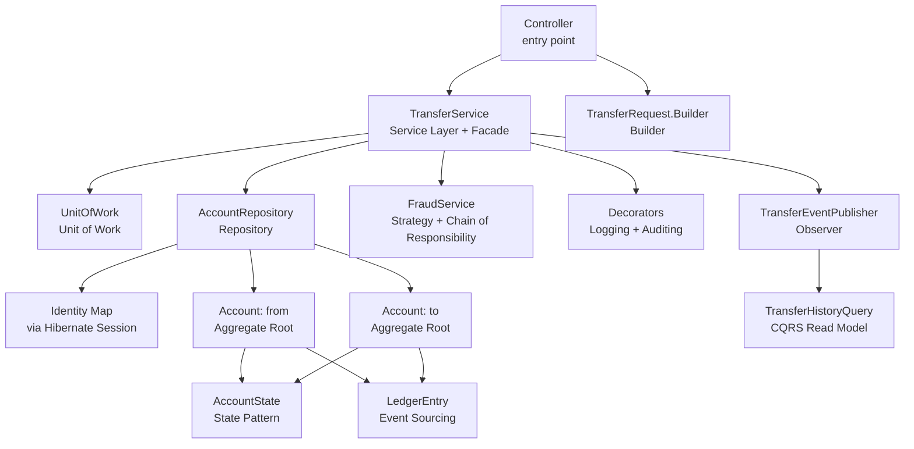
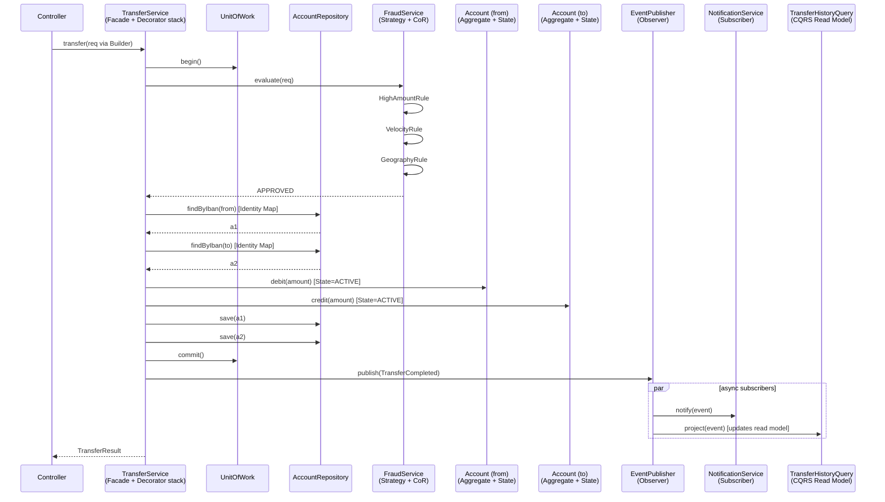

# Patterns in Banking — End-to-End

> The capstone of the patterns chapter. Walks the Banking transfer flow ([[00-Banking-Case-Study]]) and maps every pattern that shapes it. The result is a *pattern landscape* — a single diagram showing which pattern is applied where, and how the patterns interact.

## What you already know

From [[00-Patterns-As-Documented-Forces]] through [[05-Anti-Patterns]]: the pattern catalogue, with each pattern documented as forces, structure, consequences, and a banking example. From [[00-SOLID-as-Dependency-Management]] through [[06-SOLID-in-Banking]]: SOLID as dependency management, applied end-to-end to the transfer flow. From [[04-Enterprise-Patterns]]: Repository, Unit of Work, Domain Events, CQRS, Event Sourcing — the persistence-level expressions of DIP. From [[03-Dependency-As-Root-Concept]]: dependencies point toward stability; reduce and invert are the operations; the dependency graph is the design.

## Why this layer exists

Patterns learned in isolation feel like a checklist: "did we use a Strategy? a Factory? an Observer?" The checklist mindset produces pattern cargo-culting — patterns applied without the forces they address. The result is over-engineered code: three layers of indirection where one method call would do.

This chapter exists to show patterns as they appear *in concert* — a real flow, with real forces, where each pattern addresses one force and the patterns compose into a coherent design. The transfer flow is small enough to fit on one diagram and rich enough to exercise every pattern category.

## What is genuinely new here

- **A real flow uses ~10 patterns simultaneously.** Not because someone applied a checklist, but because each force in the flow has a documented solution, and the solutions compose.
- **Patterns compose; they do not conflict.** The Repository pattern (persistence) sits alongside the Strategy pattern (interest rules) sits alongside the Observer pattern (events). They address different forces; they coexist.
- **The pattern landscape is a design artifact.** Once you can draw which pattern is where, the design is auditable: a reviewer can ask "why is there a Decorator here?" and "why is there no Chain of Responsibility there?" and the answers are concrete.
- **The patterns emerge from the principles.** SOLID is dependency management. Patterns are the concrete shapes dependency management takes. The transfer flow's pattern landscape is what SOLID looks like when applied to a real flow.

## Concepts (recap, applied)

- **Creational** — Builder (`TransferRequest`), Factory Method (`AccountFactory`), Abstract Factory (`PersistenceFactory`).
- **Structural** — Facade (`TransferService`), Adapter (`LegacyPaymentGatewayAdapter`), Decorator (`LoggingTransferService`, `AuditingTransferService`), Proxy (`LazyAccountProxy`), Composite (`CompositeNotificationChannel`).
- **Behavioral** — Strategy (`InterestPolicy`, `FraudRule`), State (`AccountState`), Observer (`TransferEventPublisher`), Command (`TransferCommand`), Chain of Responsibility (fraud rules), Template Method (`StatementGenerator`).
- **Enterprise** — Repository (`AccountRepository`), Unit of Work (`UnitOfWork`), Identity Map (Hibernate session), Domain Events (`TransferCompleted`), CQRS (`TransferHistoryQuery`), Event Sourcing (ledger entries), Service Layer (`TransferService`).
- **Anti-patterns avoided** — God Object (split into services), Magic Numbers (constants and config), Zero Means Null (`Optional<BigDecimal>`).

## Banking application — the pattern landscape

The transfer flow, annotated with patterns. Read the diagram top-to-bottom: the request enters at the top, the patterns applied at each step are noted on the right.



Reading the landscape:

1. **Controller** receives the HTTP request. It uses `TransferRequest.Builder` (**Builder**) to construct a `TransferRequest` from raw parameters, with validation in the `build()` method.
2. **Controller** calls `TransferService.transfer(req)`. `TransferService` is a **Service Layer** and a **Facade** — it orchestrates the subsystem and exposes one use case.
3. **Decorators** wrap `TransferService`. `LoggingTransferService` logs entry and exit; `AuditingTransferService` records the audit entry. The controller does not know the decorators exist (**Decorator** pattern, transparent).
4. **`TransferService`** begins a **Unit of Work** (transactional scope). All subsequent persistence happens within this unit; commit at the end, rollback on exception.
5. **`TransferService`** calls `AccountRepository.findByIban` (**Repository**). The repository returns the same object reference for the same IBAN within this unit of work, thanks to the **Identity Map** maintained by the Hibernate session.
6. **`Account`** is an aggregate root. Its `debit` and `credit` methods delegate to the current **`AccountState`** (**State** pattern). An `ActiveState` allows the debit; a `FrozenState` throws.
7. **`FraudService`** is a **Strategy** with multiple implementations (`RuleBasedFraudService`, `MlBasedFraudService`). Internally, the rule-based service is a **Chain of Responsibility** (`HighAmountRule` → `VelocityRule` → `GeographyRule` → `BehavioralRule`).
8. After the debit and credit, **`TransferService`** publishes a `TransferCompleted` **Domain Event** via the **`TransferEventPublisher`** (**Observer** pattern). Subscribers (`EmailNotificationService`, `AnalyticsService`, `StatementTriggerService`) react asynchronously.
9. **`Account.ledgerEntries()`** returns a lazy-loaded `List<LedgerEntry>` via a **Proxy**. The ledger entries are not loaded until accessed. The ledger entries themselves are the **Event Sourcing** event log — the current balance is a projection (`SUM(amount) WHERE account_id = ?`).
10. A separate **read model** — `TransferHistoryQuery` against `transfer_history_view` — serves dashboard queries (**CQRS**). The view is updated by a projection that consumes `TransferCompleted` events.
11. The persistence family is selected at startup via a **`PersistenceFactory`** (**Abstract Factory**): `PostgresPersistenceFactory` in production, `H2TestPersistenceFactory` in tests.

The patterns *compose* because they address *different forces*:

- Builder addresses construction complexity.
- Service Layer addresses use-case orchestration.
- Facade addresses subsystem complexity.
- Decorator addresses cross-cutting concerns (logging, auditing).
- Unit of Work addresses transactional consistency.
- Repository addresses persistence abstraction.
- Identity Map addresses in-session equality.
- State addresses lifecycle-driven behavior.
- Strategy addresses algorithm variation.
- Chain of Responsibility addresses multi-step rule evaluation.
- Observer addresses publisher/subscriber decoupling.
- Proxy addresses lazy loading.
- Event Sourcing addresses auditability and temporal queries.
- CQRS addresses read/write optimization.
- Abstract Factory addresses persistence family consistency.

No two patterns address the same force; no force is unaddressed. This is what a coherent design looks like.

## Code — the wired composition root

The composition root wires all the patterns together. Outside the composition root, every class depends on abstractions (DIP — see [[05-DIP]]).

```java
public final class BankingApplication {
    public static void main(String[] args) {
        // Abstract Factory: persistence family
        PersistenceFactory pf = persistenceFactoryFor(args);
        AccountRepository  accounts  = pf.accountRepository();
        TransferRepository transfers = pf.transferRepository();
        LedgerRepository   ledger    = pf.ledgerRepository();
        UnitOfWorkFactory  uowFactory = pf.uowFactory();

        // Strategy + Chain of Responsibility: fraud
        FraudService fraud = new RuleBasedFraudService(List.of(
            new HighAmountRule(config.fraudHighAmountThreshold()),
            new VelocityRule(transferHistory),
            new GeographyRule(geographyService),
            new BehavioralRule(behavioralService)
        ));

        // Observer: event publisher + subscribers
        TransferEventPublisher events = new TransferEventPublisher();
        events.subscribe(new EmailNotificationService(emailClient));
        events.subscribe(new AnalyticsService(analyticsClient));
        events.subscribe(new StatementTriggerService(statementService));

        // Core TransferService (Service Layer + Facade)
        TransferService core = new CoreTransferService(
            accounts, transfers, fraud, events, uowFactory);

        // Decorators stacked (cross-cutting concerns)
        TransferService decorated = new AuditingTransferService(
            new LoggingTransferService(core, logger),
            auditLog);

        // Expose to controllers
        TransferController controller = new TransferController(decorated);
        // ... start HTTP server ...
    }

    private static PersistenceFactory persistenceFactoryFor(String[] args) {
        return switch (configFrom(args).persistence()) {
            case POSTGRES -> new PostgresPersistenceFactory(dataSource(args));
            case H2_TEST  -> new H2TestPersistenceFactory(testDataSource());
        };
    }
}
```

The composition root is the only place that knows about concrete classes. Every other class in the system depends on an interface. Adding a new fraud rule, a new notification channel, a new persistence family, or a new decorator is one new class plus one new line in the composition root. Existing classes do not change. That is OCP (see [[02-OCP]]) delivered through patterns.

## The transfer flow as a sequence, with pattern annotations



Every arrow in this sequence is mediated by a pattern. The controller does not know about fraud; the fraud service does not know about accounts; the account does not know about notifications; the notification service does not know about the read model. Each pattern adds one seam of decoupling; the seams compose into a system where every concern can change independently.

## What can go wrong

1. **Pattern over-application.** A team that reads this chapter and applies all 15 patterns to a simple CRUD service produces over-engineered code. The cure: apply a pattern only when the force it addresses is present. A simple CRUD service needs Repository and Service Layer; it does not need Decorator, Observer, or CQRS.
2. **Pattern under-application.** A team that ignores patterns and writes a 5000-line `BankingService` ends up with a God Object. The cure: learn to recognize the forces (cross-cutting concern → Decorator; multi-step rule → Chain of Responsibility; lifecycle variation → State; algorithm variation → Strategy) and apply the matching pattern when the force appears.
3. **Pattern mismatch.** Applying Chain of Responsibility where the rules are not actually chain-shaped (e.g., the rules must all run, not short-circuit) produces an awkward design. The cure: read the pattern's "Applicability" section; if the force does not match, do not apply.
4. **Pattern rigidity.** Once a pattern is applied, refactoring away from it is expensive. The cure: introduce patterns incrementally; start with the simplest solution; introduce the pattern when the force becomes clear. "Rule of three" — apply a pattern the third time you find yourself writing the same ad-hoc solution.
5. **Patterns without principles.** Patterns applied without understanding the underlying SOLID principles become cargo-cult. The cure: learn SOLID first; patterns are concrete realizations of SOLID heuristics. A team that understands SOLID will rediscover most patterns naturally.
6. **Patterns that fight the language.** Some patterns are workarounds for missing language features. Prototype via `Cloneable` in Java is a workaround; records with `with` methods are the modern alternative. Builder is partly replaced by records and compact constructors. The cure: prefer language features where they exist; use patterns where the language lacks the feature.

## Trade-offs

- **Indirection cost vs composability.** Every pattern adds indirection. The transfer flow with 15 patterns is harder to read than a 50-line script. The benefit: each concern can change independently; the system evolves without rewrite. For long-lived code, the trade-off favors patterns.
- **Flexibility vs simplicity.** A pattern-rich design supports many variations (new fraud rules, new notification channels, new persistence families). The cost: the variations must be documented, tested, and wired. For systems with stable requirements, the trade-off favors simplicity.
- **Pattern vocabulary cost vs communication speed.** A team that shares the pattern vocabulary communicates fast. A team that does not share it spends every meeting re-explaining the shape of the design. The trade-off: invest in the vocabulary once; reap the communication speed forever.
- **Test pyramid shift.** A pattern-rich design is unit-testable at every layer (mock the abstractions); integration tests become mandatory (the patterns must compose correctly); end-to-end tests cover the user-facing flows. The total test count is high; the cost per change is low.
- **Onboarding cost.** A new developer must learn the pattern landscape. The cure: an architecture decision record (see [[00-LLD-Method]]) that maps the patterns; a "read the transfer flow first" guide; pair programming for the first week. Once learned, the landscape scales to every other flow.
- **Reversibility.** Most pattern applications are reversible (refactor away). Some are not (event sourcing, once adopted, is expensive to abandon). The trade-off: apply reversible patterns aggressively; apply irreversible patterns deliberately. See [[08-Trade-offs-Everywhere]] on two-way vs one-way doors.

## Forward links

- [[00-Patterns-As-Documented-Forces]] — the pattern documentation format this chapter applies.
- [[01-Creational-Patterns]] through [[05-Anti-Patterns]] — the catalogue this chapter composes.
- [[00-SOLID-as-Dependency-Management]] and [[06-SOLID-in-Banking]] — the principles the patterns instantiate.
- [[04-Enterprise-Patterns]] — the persistence-level patterns that dominate the transfer flow.
- [[00-LLD-Method]] — the design method that produces pattern landscapes.
- [[03-Hexagonal-Architecture]] and [[04-Clean-Architecture]] — the architectural expression of the same composition.
- [[09-Banking-SQL]] — the SQL expressions of the patterns (Repository queries, CQRS views, Event Sourcing queries).
- [[09-Banking-Transaction-Walkthrough]] — the transactional behavior of the Unit of Work pattern in the transfer flow.
- [[00-Banking-Case-Study]] — the anchor case this chapter advances.
