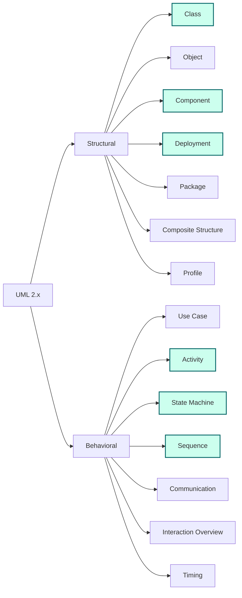

# UML as a Modeling Language

> UML is a notation, not a methodology. It is a vocabulary for drawings, not a design process. This chapter reframes UML through the lens of [[04-Abstraction-and-Models]] — every UML diagram is an abstraction that hides detail for a specific purpose.

## What you already know

From [[04-Abstraction-and-Models]]: an abstraction is *selective forgetting for a purpose*. From [[03-Dependency-As-Root-Concept]]: a diagram is a model of dependencies; the arrows on a UML diagram are the same dependencies you manage in code, schema, and distributed systems. From [[06-Coupling-and-Cohesion]]: coupling and cohesion have *levels*, and almost every UML arrow type encodes one of those levels.

You also know, from [[02-The-Continuous-Chain]], that UML sits between *Object Collaboration* and *LLD/Architecture*. UML is the seam where the object model becomes a communicable artifact, and LLD picks up where the diagram stops and the trade-offs begin.

## Why this layer exists

Code is precise but dense. A reader of code can answer "what does this class do?" but struggles to answer "what is the overall shape of the system?" without weeks of reading. Architecture decks are evocative but ungrounded — boxes and arrows that mean whatever the presenter wants them to mean.

UML exists to fill the middle ground: a **standardized notation** for the structure and behavior of object-oriented systems, precise enough that two engineers will agree on what a diagram says, expressive enough to cover the most common design questions.

The crucial point: UML is a *language*, not a *process*. It does not tell you how to design. It tells you how to *draw* the design you already have. The thinking happens before the diagram; the diagram captures the thinking so others can review it, challenge it, and inherit it.

## What is genuinely new here

- UML is a notation with 14 diagram types, organized into **structure** and **behavior**.
- Modern teams draw very few of the 14 in full. The high-leverage subset is: class, sequence, state, activity, component/deployment.
- UML is mostly **read, rarely drawn in full**. The diagram is a communication artifact, not a daily working surface. The code is the daily working surface.
- The notation is older than most of the technology we use, but the *forces* it captures (dependency, abstraction, identity, lifecycle) are exactly the five forces from [[01-Unified-Mental-Model]].

## Concepts

### The 14 diagram types

UML 2.x defines 14 diagram types, divided into two broad families.

**Structural diagrams** (what the system *is*):

1. **Class diagram** — classes, attributes, operations, relationships.
2. **Object diagram** — a snapshot of instances at a moment in time.
3. **Component diagram** — components, their provided/required interfaces, dependencies.
4. **Deployment diagram** — physical nodes, artifacts, communication paths.
5. **Package diagram** — packages and their dependencies.
6. **Composite structure diagram** — internal structure of a collaborating group (rarely used).
7. **Profile diagram** — UML extension mechanism (almost never seen outside tooling).

**Behavioral diagrams** (what the system *does*):

8. **Use case diagram** — actors and use cases (often drawn once, then forgotten).
9. **Activity diagram** — flowcharts with object flow, decisions, parallelism, swimlanes.
10. **State machine diagram** — states, transitions, guards, composite states.
11. **Sequence diagram** — messages between lifelines over time.
12. **Communication diagram** — messages between instances without strict time ordering (sequence's cousin).
13. **Interaction overview diagram** — activity diagram whose nodes are sequence fragments (rarely used).
14. **Timing diagram** — state changes against a time axis (used in real-time systems).

That is a lot of diagrams. In practice, a working engineer reaches for about five of them:

| Diagram | Question it answers | Frequency |
|---|---|---|
| Class | What types exist and how do they relate? | Weekly |
| Sequence | How do these objects collaborate over time? | Weekly |
| State | What lifecycle does this entity have? | Monthly |
| Activity | What is the workflow, and who owns each step? | Monthly |
| Component / Deployment | What are the deployable units and where do they run? | Quarterly |

The other nine exist because the OMG committee had to specify the whole space. They are useful in narrow niches — timing diagrams for embedded systems, interaction overview for orchestrating long-running workflows — but they are not part of the daily vocabulary of an application engineer.

### Structure vs behavior — and why both matter

A structural diagram without a behavioral diagram is a corpse: it shows the body but not the motion. A behavioral diagram without a structural diagram is a ghost: it shows motion but no body. Real systems need both. The Banking case study in [[06-UML-For-Banking]] shows how the same system looks through each lens.

### The five forces inside the notation

Every UML construct maps back to one of the five forces from [[01-Unified-Mental-Model]]:

| UML construct | Force it expresses |
|---|---|
| Association, dependency arrow | Dependency |
| Interface, abstract class | Abstraction |
| Object identity, qualifier | Identity |
| State machine, guard, transition | Constraint / Lifecycle |
| Composition vs aggregation vs association | Trade-off in ownership strength |

When you draw a UML diagram, you are not "doing UML." You are *making the five forces visible*.

## Banking application

For the Banking system, the diagrams we will actually use are:

- **Class diagram** of the `Account`, `LedgerEntry`, `Transfer`, `Customer`, `InterestPolicy` family — covered in [[01-Class-Diagrams]].
- **Sequence diagram** of the `Transfer Money` use case — covered in [[02-Sequence-Diagrams]], anchored on [[02-Use-Cases]].
- **Activity diagram** of the account opening workflow with KYC swimlanes — covered in [[03-Activity-Diagrams]].
- **State diagram** of the `Account` lifecycle (`PENDING → ACTIVE → FROZEN → CLOSED`) — covered in [[04-State-Diagrams]], linked to [[05-Identity-State-Lifecycle]].
- **Component and deployment diagram** of the runtime topology (TransferService, AccountService, FraudService, NotificationService, DB, broker) — covered in [[05-Component-And-Deployment]].

That is five diagram types for a system that exercises every layer of the vault. The other nine UML diagrams would add little for this problem.

## Code / diagrams

Below is a small map of the diagram family. We will populate each branch in the next chapters.

The highlighted nodes are the high-leverage subset. Treat the others as available-but-not-required.

## What can go wrong

- **Drawing UML as ceremony.** Teams that require class diagrams for every story burn out. The diagram is a tool for *moments of design*, not a documentation tax.
- **Diagram-code drift.** If the diagram is not updated when the code changes, it becomes a lie. The cure is to keep diagrams small (one screen) and to regenerate them from code where possible (PlantUML from Java, Intellij's diagramming).
- **Overloaded class diagrams.** A class diagram with fifty classes is unreadable. Break it by package or by aggregate boundary (see [[02-Aggregates]]).
- **Confusing aggregation and composition.** Most UML tools draw diamonds for both and engineers guess. In the Banking system, `Account` *composes* its `LedgerEntry` list (entries cannot exist without the account); `Customer` *aggregates* its `Account` references (accounts can outlive a customer after death or transfer-of-ownership). The distinction is real and matters for persistence, as we will see in [[01-Class-Diagrams]].
- **Treating UML as a design methodology.** UML tells you how to *draw*; it does not tell you how to *think*. The thinking method is LLD — see [[00-LLD-Method]].
- **Sequence diagrams that drown in fragments.** `alt`, `opt`, `loop`, `par` are powerful; overused, they make the diagram unreadable. Split a complex sequence into two simpler ones.

## Trade-offs

- **Detail vs readability.** Every diagram trades detail for clarity. A class diagram with all attributes, all operations, all multiplicities is unreadable. The right move: keep the diagram at the level of the question. If the question is "what are the types," omit attributes. If the question is "what is the contract," show operations only.
- **Diagram vs code as source of truth.** Code is always right; diagrams are an interpretation. If the diagram disagrees with the code, the code wins. The trade-off: code is harder to skim; diagrams are easier to skim but lie more often. Treat diagrams as *maps* — useful for navigation, not authoritative.
- **Formal vs informal notation.** Strict UML is precise but intimidating. Boxes-and-arrows "UML-ish" drawings are approachable but ambiguous. The vault uses Mermaid, which is a subset of UML — formal enough to render, informal enough to read.
- **Drawing upfront vs drawing after.** Drawing before coding forces design thinking. Drawing after captures what you built. Both have value. The mistake is drawing *only* after — then the diagram is documentation, not design.

## Forward links

- [[01-Class-Diagrams]] — the most-used structural diagram, applied to the Banking `Account` hierarchy.
- [[02-Sequence-Diagrams]] — the canonical behavior diagram for the Transfer use case.
- [[03-Activity-Diagrams]] — workflow diagrams with swimlanes for KYC.
- [[04-State-Diagrams]] — the `Account` lifecycle, with missing transitions exposed.
- [[05-Component-And-Deployment]] — runtime topology of the Banking system.
- [[06-UML-For-Banking]] — end-to-end UML model, one diagram per chapter.
- [[00-LLD-Method]] — where UML stops and LLD picks up.
- [[04-Abstraction-and-Models]] — the force UML implements at the visualization layer.
- [[02-Use-Cases]] — the source of every behavioral diagram in this folder.
