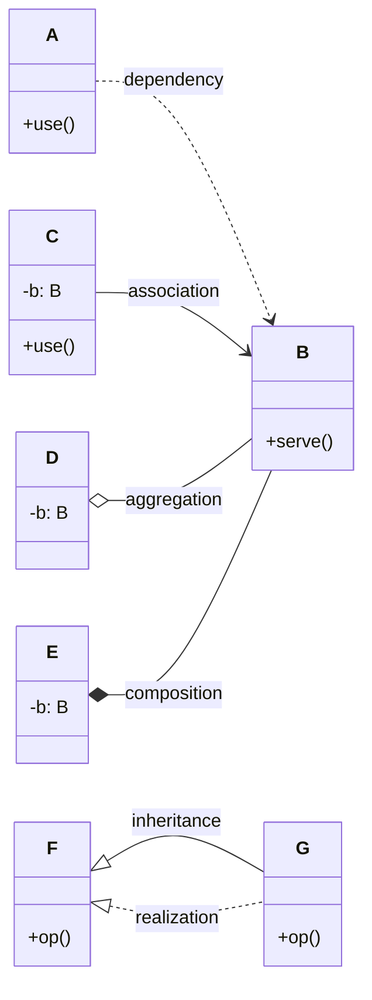
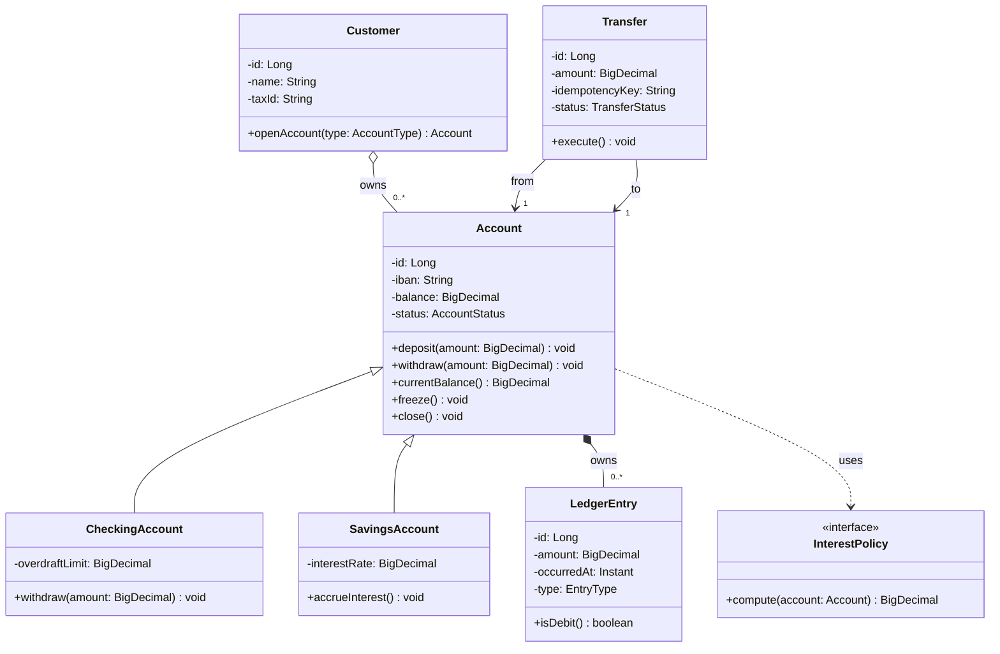

# Class Diagrams

> The most-used UML diagram. A class diagram captures the *types* in a system, their *features* (attributes and operations), and their *relationships*. It is the structural counterpart to a sequence diagram's behavior.

## What you already know

From [[03-Dependency-As-Root-Concept]]: a dependency exists when a change in one place can force a change elsewhere. Every arrow on a class diagram is a dependency — and the arrow's *type* tells you how strong the dependency is.

From [[06-Coupling-and-Cohesion]]: coupling has levels (data, stamp, control, common, content). UML's relationship vocabulary is essentially the same ladder: association < aggregation < composition, with dependency and realization as orthogonal dimensions.

From [[07-Composition-vs-Inheritance]]: composition and inheritance are two reuse mechanisms with very different coupling profiles. Class diagrams draw both, and the choice of arrow is the visible expression of that trade-off.

From [[05-Identity-State-Lifecycle]]: an entity has surrogate identity (PK), logical identity (IBAN), and state. Class diagrams show attributes but rarely distinguish these flavors — the engineer must read the diagram with that lens.

## Why this layer exists

A codebase of fifty classes is a graph. Reading the code top-to-bottom shows you the inside of each node; it does not show you the graph. A class diagram is a *projection* of that graph onto a 2D surface, optimized for answering two questions:

1. **What types exist, and what do they look like?** (attributes, operations, visibility)
2. **How are they related?** (association, aggregation, composition, inheritance, realization, dependency)

These are the structural questions. Behavioral questions (which message goes to whom, in what order) belong to sequence diagrams (see [[02-Sequence-Diagrams]]).

## What is genuinely new here

- The vocabulary of class diagram relationships, and the strength each arrow implies.
- Multiplicities (`1`, `0..1`, `*`, `1..*`) — the same cardinalities you will see in ER modeling (see [[00-ER-Modeling]]) and in foreign key constraints (see [[01-Primary-Foreign-Keys]]).
- Visibility markers (`+` public, `-` private, `#` protected, `~` package-private).
- The distinction between **class-level** relationships (associations drawn between classes) and **instance-level** references (a particular object holds a reference to another). The diagram shows the former; the runtime is the latter.

## Concepts

### Anatomy of a class

A class box has three compartments:

```text
+-----------------------------+
| Account                     |   <- name
+-----------------------------+
| - id: Long                  |   <- attributes
| - iban: String              |
| - balance: BigDecimal       |
| - status: AccountStatus     |
+-----------------------------+
| + deposit(amount): void     |   <- operations
| + withdraw(amount): void    |
| + balance(): BigDecimal     |
+-----------------------------+
```

- **Visibility** — `+` public, `-` private, `#` protected, `~` package-private.
- **Attributes** — typed slots. In Java terms: fields. Often shown without types in concept-level diagrams.
- **Operations** — methods. The signature (parameters, return type) is part of the contract.

### Relationships — the heart of the diagram

There are six relationship types in UML. From weakest to strongest coupling:



| Arrow | Name | Meaning | Coupling strength |
|---|---|---|---|
| `..>` | Dependency | A uses B transiently (parameter, local var) | Weakest |
| `-->` | Association | A holds a reference to B | Weak |
| `o--` | Aggregation | A holds B; B can outlive A | Medium |
| `*--` | Composition | A owns B; B cannot exist without A | Strong |
| `<\|--` | Inheritance | B is-a A; B depends on every detail of A | Strongest (compile-time, permanent) |
| `<\|..` | Realization | B implements interface A; B depends on A's contract | Strong contract, weak implementation |

The crucial distinction:

- **Dependency** is the weakest — A might use B only inside one method.
- **Association** is structural — A holds a field of type B.
- **Aggregation vs composition** is about *lifetime*: in composition, destroying the parent destroys the children; in aggregation, children survive. In Banking terms: `Account` *composes* `LedgerEntry` (entries belong to exactly one account and are deleted if the account is — actually we never delete accounts, but conceptually the entries have no life without the account); `Customer` *aggregates* `Account` references (an account may be transferred to another customer or survive a customer death).
- **Inheritance** is the tightest — see [[07-Composition-vs-Inheritance]] for why this is a trade-off, not a default.

### Multiplicities

Each end of a relationship has a multiplicity:

| Notation | Meaning |
|---|---|
| `1` | Exactly one |
| `0..1` | Zero or one (optional) |
| `*` | Zero or more |
| `1..*` | One or more |
| `2..5` | Between 2 and 5 |

A `Customer` `1` `*` `Account` association means: one customer owns zero or more accounts; each account belongs to exactly one customer. In schema terms: `accounts.customer_id NOT NULL REFERENCES customers(id)` — see [[01-Primary-Foreign-Keys]].

### Navigability

An open arrow `-->` indicates navigability: A can navigate to B (A holds a reference to B). A bidirectional association `A <---> B` means both sides hold references. Bidirectional associations are the most common source of accidental cycles in code — prefer unidirectional until forced otherwise.

## Banking application — the `Account` hierarchy

The Banking domain has a small but rich class structure. Here is the canonical class diagram:



Reading the diagram:

- `Account` is the abstract base. `CheckingAccount` and `SavingsAccount` inherit from it. As discussed in [[07-Composition-vs-Inheritance]], this inheritance is justified because the relationship is genuinely *is-a* and the hierarchy is shallow — but you could replace it with composition + `InterestPolicy` strategy, and the diagram would change accordingly.
- `Account *-- LedgerEntry`: composition. The ledger entries are owned by the account. The multiplicity is `0..*` because a brand-new account has none yet.
- `Customer o-- Account`: aggregation. The customer references accounts; the account outlives the customer (or can be transferred).
- `Transfer --> Account`: association, twice — `from` and `to`. A transfer touches exactly two accounts.
- `Account ..> InterestPolicy`: dependency. The account uses the policy transiently (passed into a method or injected). No field is held.

This is the same picture you will see in the ER model (see [[02-Banking-ER]]) and in the schema (see [[04-Banking-Schema]]). The vocabulary differs; the structure is the same.

## Code / diagrams — translating to Java

The class diagram above maps to Java like this:

```java
public abstract class Account {
    private final Long id;
    private final String iban;
    private BigDecimal balance;
    private AccountStatus status;

    protected Account(Long id, String iban, BigDecimal balance, AccountStatus status) {
        this.id = id;
        this.iban = iban;
        this.balance = balance;
        this.status = status;
    }

    public void deposit(BigDecimal amount) {
        if (status != AccountStatus.ACTIVE && status != AccountStatus.FROZEN) {
            throw new IllegalStateException("Account " + status + " cannot accept deposits");
        }
        this.balance = this.balance.add(amount);
    }

    public void withdraw(BigDecimal amount) {
        if (status != AccountStatus.ACTIVE) {
            throw new IllegalStateException("Account " + status + " cannot withdraw");
        }
        if (!canWithdraw(amount)) {
            throw new IllegalArgumentException("Insufficient funds");
        }
        this.balance = this.balance.subtract(amount);
    }

    protected abstract boolean canWithdraw(BigDecimal amount);

    public BigDecimal currentBalance() { return balance; }
    public void freeze() { this.status = AccountStatus.FROZEN; }
    public void close() { this.status = AccountStatus.CLOSED; }
}

public final class CheckingAccount extends Account {
    private final BigDecimal overdraftLimit;

    public CheckingAccount(Long id, String iban, BigDecimal balance,
                           AccountStatus status, BigDecimal overdraftLimit) {
        super(id, iban, balance, status);
        this.overdraftLimit = overdraftLimit;
    }

    @Override
    protected boolean canWithdraw(BigDecimal amount) {
        return currentBalance().subtract(amount).compareTo(overdraftLimit.negate()) >= 0;
    }
}

public final class SavingsAccount extends Account {
    private final BigDecimal interestRate;

    public SavingsAccount(Long id, String iban, BigDecimal balance,
                          AccountStatus status, BigDecimal interestRate) {
        super(id, iban, balance, status);
        this.interestRate = interestRate;
    }

    @Override
    protected boolean canWithdraw(BigDecimal amount) {
        return currentBalance().subtract(amount).compareTo(BigDecimal.ZERO) >= 0;
    }

    public BigDecimal accrueInterest() {
        BigDecimal interest = currentBalance().multiply(interestRate);
        deposit(interest);
        return interest;
    }
}
```

Every line of this Java corresponds to something in the diagram. The diagram is not a substitute for the code; it is a map of the code.

## What can go wrong

- **Diamond confusion.** Engineers draw hollow diamonds where they mean filled and vice versa. The fix: ask "can the child outlive the parent?" If yes, aggregation. If no, composition.
- **Inheritance as the default.** Drawing `<|--` between two classes because they share a method is wrong. Shared behavior is composition + strategy, not inheritance. See [[07-Composition-vs-Inheritance]].
- **Missing multiplicities.** A diagram with no multiplicities is ambiguous. Does a `Customer` have one account or many? The arrow doesn't say.
- **Bidirectional arrows everywhere.** Bidirectional associations create cycles. Most should be unidirectional; the reverse navigation can be added when actually needed (e.g., via a query, not a field).
- **Drawing the whole codebase.** A class diagram with 100 classes is unreadable. Break it by aggregate (see [[02-Aggregates]]) or by package.
- **Confusing instance-level with class-level.** An association between `Customer` and `Account` does not mean *every* customer has *every* account. It means *a* customer may have *some* accounts. The diagram is a schema, not a snapshot.

## Trade-offs

- **Detail vs readability.** Showing every attribute and operation is precise but unreadable. The right amount: show what answers the question. For "what are the types?" show names only. For "what is the contract?" show operations. For "what is the data?" show attributes.
- **Abstract class vs interface.** Both can appear as parents. Abstract classes share implementation; interfaces share only contracts. Java's single-inheritance rule makes interfaces the default for polymorphism — see [[05-DIP]].
- **Generics vs raw types.** Showing `List<LedgerEntry>` is more precise than `List`. Always show generics when the type parameter matters.
- **Annotations vs stereotypes.** `«entity»`, `«service»`, `«repository»` stereotypes (Mermaid: `<<entity>>`) communicate role without taking a Java keyword. Use them to mark architectural roles (see [[04-Enterprise-Patterns]]).

## Forward links

- [[02-Sequence-Diagrams]] — the behavior counterpart: how instances of these classes exchange messages.
- [[07-Composition-vs-Inheritance]] — the deeper treatment of the inheritance-vs-composition trade-off that this diagram's arrows encode.
- [[00-Object-Relationships]] — the same relationships, viewed from the object collaboration side.
- [[02-Banking-ER]] — the same structure, redrawn as an ER model.
- [[04-Banking-Schema]] — the same structure, implemented as SQL tables and foreign keys.
- [[06-Banking-LLD]] — this class diagram, embedded in a full LLD of the transfer flow.
