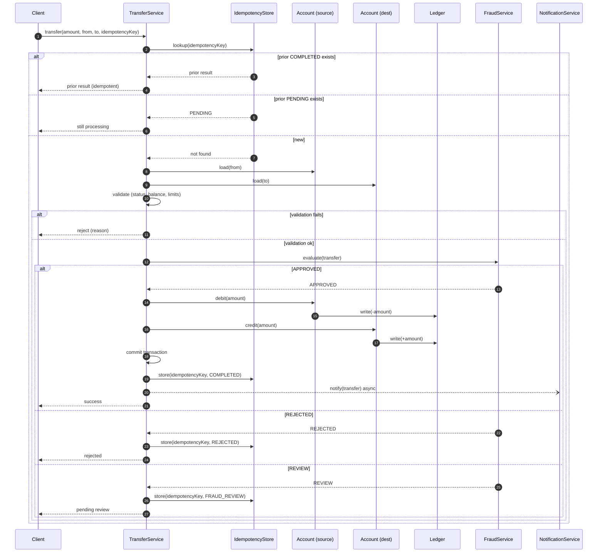
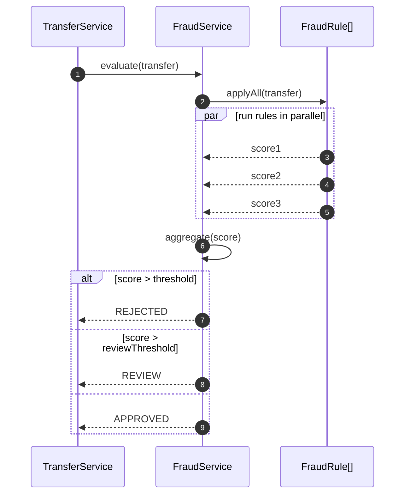

# Sequence Diagrams

> The behavior counterpart to class diagrams. A sequence diagram shows how instances collaborate over time to fulfill a use case. It is the single most-drawn diagram in modern development, and the natural visualization of the `Transfer Money` use case from [[02-Use-Cases]].

## What you already know

From [[02-Use-Cases]]: a use case is a sequence of steps between actors and the system. Each step is a *responsibility* waiting to be assigned. A sequence diagram is the visualization of those steps once the responsibilities have been assigned to objects.

From [[01-Object-Collaboration]] (and [[01-Object-Collaboration]] in this vault's OOP folder): objects collaborate by sending messages. A message has a sender, a receiver, a name, arguments, and a return. Sequence diagrams make all five visible on a single timeline.

From [[03-Dependency-As-Root-Concept]]: every arrow on a sequence diagram is a dependency. `TransferService` sends a message to `Account`; therefore `TransferService` depends on `Account`'s contract. The diagram makes the dependency graph at runtime visible.

From [[00-Banking-Case-Study]]: the transfer flow is the anchor of the whole vault. We already saw a simplified sequence diagram there. This chapter gives it the full treatment with fragments.

## Why this layer exists

A class diagram answers *what types exist and how are they connected*. It does not answer *how do they collaborate to accomplish a specific use case*. The same set of classes can collaborate in many different patterns; the class diagram cannot distinguish them. The sequence diagram can.

Use cases list steps; sequence diagrams assign each step to an object. The act of drawing a sequence diagram forces the designer to answer:

- Who *receives* the initial message?
- Who *delegates* to whom?
- Where are the *transactional boundaries*?
- What happens in the *extensions* (insufficient balance, fraud rejection, idempotency hit)?

If you cannot draw the sequence diagram, you have not finished the design. The diagram is the design's stress test.

## What is genuinely new here

- **Lifelines** — vertical dashed lines representing an instance over time.
- **Messages** — solid arrows for synchronous calls, dashed arrows for returns, open arrows for asynchronous sends.
- **Activation bars** — the thin rectangles on a lifeline showing when that object is *actively executing*.
- **Combined fragments** — `alt` (alternative), `opt` (optional), `loop` (iteration), `par` (parallel), `break` (exception path). These are the conditional logic of the diagram.
- The crucial discipline: **one diagram per use case scenario**, not one diagram for the whole system. A sequence diagram that covers every scenario is unreadable.

## Concepts

### Anatomy of a sequence diagram

```text
participant         Client           (top-left, named boxes)
participant         TransferService
participant         Account
                    |
   Client           |   TransferService  |   Account
       |----transfer()---->|                   |
       |                    |----debit()---->  |
       |                    |<-------OK--------|
       |<-----success-------|                   |
       |                    |                   |
```

- **Participants** (lifelines) — instances, not classes. Conventionally named `aAccount: Account` (instance `aAccount` of class `Account`) or just `: Account` (anonymous instance of class `Account`).
- **Messages**:
  - `->>` solid arrow with open head: synchronous call.
  - `-->>` dashed arrow: return value.
  - `--)` open arrowhead, no fill: asynchronous send (e.g., publish to a message broker).
- **Activation bar** — the thin rectangle on the lifeline during which the object is *executing*. Tells you what is on the call stack at any moment.
- **Self-message** — a participant sends a message to itself (e.g., `TS->>TS: validate()`). Often indicates an internal step that could be extracted to a collaborator.

### Combined fragments

Fragments are the control flow of the diagram. They are drawn as rectangles overlapping the lifelines, with a label in the corner.

| Fragment | Meaning | Use case |
|---|---|---|
| `alt` | Alternative — one of several branches | Fraud approved vs rejected |
| `opt` | Optional — execute if guard is true | Send notification if amount > threshold |
| `loop` | Iterate — repeat N times or while guard | Retry on transient failure |
| `par` | Parallel — concurrent branches | Notify email and SMS in parallel |
| `break` | Break — abort the rest of the enclosing fragment | Abort on validation failure |
| `critical` | Critical region — atomic | Database commit |
| `ref` | Reference — call out to another sequence diagram | "See fraud-check diagram" |

Overuse of fragments is the most common sequence diagram smell. If your diagram has five nested `alt` fragments, you have one diagram trying to be three. Split it.

## Banking application — the `Transfer Money` sequence

This is the canonical diagram for the vault. It implements the use case from [[02-Use-Cases]] and the lifecycle from [[05-Identity-State-Lifecycle]].



Reading the diagram:

- The **outer `alt`** captures the idempotency check (extensions `1a` and `1b` from the use case).
- The **first inner `alt`** captures the validation step (extensions `3a`, `3b`, `4a`).
- The **innermost `alt`** captures the fraud service response (extensions `5a`, `5b`, `5c`).
- The async notification is drawn with `--)` (open arrowhead) to indicate the call does not block — see [[08-Trade-offs-Everywhere]] for why the notification is async.
- The commit is a self-message to `TS` — it is an internal transactional boundary, not a message to a participant. In LLD, this is where the transaction manager lives (see [[00-ACID]] and [[06-Banking-LLD]]).

### Extracting a fragment

The fraud-evaluation portion is complex enough to warrant its own diagram:



This is the `ref` pattern: a sub-diagram referenced from the main one. Keep the main diagram readable; push detail into referenced fragments.

## Code / diagrams — translating to Java

The main sequence maps to this skeleton:

```java
public final class TransferService {
    private final AccountRepository accounts;
    private final Ledger ledger;
    private final FraudService fraud;
    private final NotificationService notifications;
    private final IdempotencyStore idempotency;
    private final TransactionManager tx;

    public TransferResult transfer(TransferRequest req) {
        // Step 1: idempotency check
        Optional<TransferResult> prior = idempotency.lookup(req.idempotencyKey());
        if (prior.isPresent()) {
            return prior.get();  // alt branch 1a, 1b
        }

        // Step 2-3: load and validate
        Account from = accounts.require(req.from());
        Account to   = accounts.require(req.to());
        validate(from, to, req.amount());

        // Step 5: fraud evaluation (ref fragment)
        FraudDecision decision = fraud.evaluate(req);
        TransferResult result = switch (decision) {
            case APPROVED -> execute(from, to, req);
            case REJECTED -> TransferResult.rejected();
            case REVIEW   -> TransferResult.pendingReview();
        };

        idempotency.store(req.idempotencyKey(), result);
        if (result.isCompleted()) {
            notifications.notifyAsync(req);  // --) async arrow
        }
        return result;
    }

    private TransferResult execute(Account from, Account to, TransferRequest req) {
        return tx.inTransaction(() -> {  // self-message: commit
            from.debit(req.amount());
            to.credit(req.amount());
            ledger.write(from, req.amount().negate());
            ledger.write(to,   req.amount());
            return TransferResult.completed();
        });
    }
}
```

Every arrow in the diagram has a Java line. Every `alt` is a branch. Every `--)` async arrow is an async call. The diagram and the code are two views of the same design.

## What can go wrong

- **Drawing every scenario in one diagram.** A sequence diagram with seven nested `alt` fragments is unreadable. Split into the main scenario and one diagram per extension, or use the `ref` fragment to extract.
- **Forgetting the return arrows.** Many engineers draw the calls but not the returns. Returns are part of the contract. If you omit them, the reader cannot tell whether the call is fire-and-forget or returns a value.
- **Mixing synchronous and asynchronous without distinction.** A synchronous call and an async publish look different. Use `->>` for sync, `--)` for async. If everything looks the same, the diagram lies.
- **Overusing `par`.** Parallel fragments are real in some systems (e.g., the fraud rules example), but most business logic is sequential. Adding `par` where there is no real concurrency misleads the reader.
- **Treating the diagram as a step-by-step spec.** The diagram is a *visualization*, not an algorithm. Step ordering in the diagram does not always map to code ordering — fragments may be inlined or refactored.
- **Missing the transactional boundary.** If you draw a sequence with debit and credit as separate calls but do not show the enclosing transaction, the diagram implies atomicity that the code may not have. Always show the `commit` self-message or a transaction-boundary fragment.

## Trade-offs

- **Detail vs readability.** Show all messages and you cannot see the shape; show only the high-level calls and you lose the detail. The right level depends on the audience:架构 review = high level; new engineer onboarding = medium; debugging = detailed.
- **Synchronous vs asynchronous messaging** — the diagram forces you to choose. This is the same trade-off as in [[08-Trade-offs-Everywhere]]: sync is simpler but couples availability; async is decoupled but introduces eventual consistency. The diagram makes the choice visible.
- **One diagram per scenario vs one diagram per use case.** The use case has a main scenario and many extensions. One diagram per scenario is clearer but more numerous; one diagram with `alt` fragments is compact but harder to read. We use one-with-`alt` for the transfer flow because the extensions are short.
- **Formal UML vs informal sequence.** Strict UML has more notations (found messages, gates, continuations). Mermaid supports a useful subset. Most engineers will not miss the rest.

## Forward links

- [[03-Activity-Diagrams]] — a different visualization of the same workflows, optimized for parallelism and swimlanes.
- [[00-LLD-Method]] — how this sequence diagram becomes the basis for the LLD trade-off analysis.
- [[06-Banking-LLD]] — the full LLD that this diagram anchors.
- [[02-Use-Cases]] — the source of the diagram's structure.
- [[00-ACID]] — what the `commit` self-message actually guarantees.
- [[04-Enterprise-Patterns]] — Repository, Unit of Work, and how they shape the diagram.
